↑↑↑关注后"星标"Datawhale

每日干货 & [每月组队学习](https://mp.weixin.qq.com/mp/appmsgalbum?__biz=MzIyNjM2MzQyNg%3D%3D&action=getalbum&album_id=1338040906536108033#wechat_redirect)，不错过

 Datawhale干货 

**作者：姚童，Datawhale优秀学习者，华北电力大学**

严格的说，梯度计算需要求导数。但是图像梯度的计算，是通过计算像素值的差得到梯度的近似值。图像梯度表示的是图像变化的速度，反映了图像的边缘信息。

边缘是像素值快速变化的地方。所以对于图像的边缘部分，其灰度值变化较大，梯度值也较大；对于图像中较平滑的部分，其灰度值变化较小，梯度值也较小。

为了检测边缘，我们需要检测图像中的不连续性，可以使用图像梯度来检测不连续性。但是，图像梯度也会受到噪声的影响，因此建议先对图像进行平滑处理。

本文目录：   

    1\. 图像梯度与几种算子

*   *   Sobel算子

    *   Scharr算子

    *   Roberts算子

    *   Laplacian算子

    2\. Canny边缘检测

*   *   高斯滤波

    *   计算梯度强度和方向

    *   非极大值抑制（NMS）

    *   用双阈值算法检测和连接边缘

    3\. 基于OpenCV的实现

*   *   Sobel算子函数

    *   Scharr算子

    *   Laplacian算子

# **一、****图像梯度与几种算子**

“滤波器”也可以称为“卷积核”，“掩膜”，“算子”等。

#### **1.1 Sobel算子**

Sobel算子是一个3×3的卷积核，利用局部差分寻找边缘，计算得到梯度的近似值。x和y方向的Sobel算子分别为： 

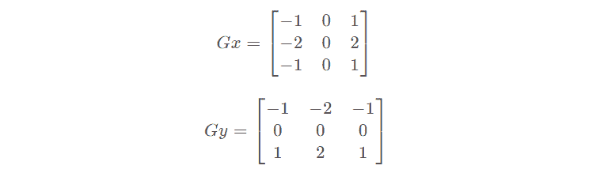

梯度有方向，对于一个图像，可以通过Sobel算子分别计算水平方向和垂直方向的偏导数的近似值。

##### **计算水平方向偏导数的近似值**

##### 设原图像大小为 ，水平方向偏导数 为：

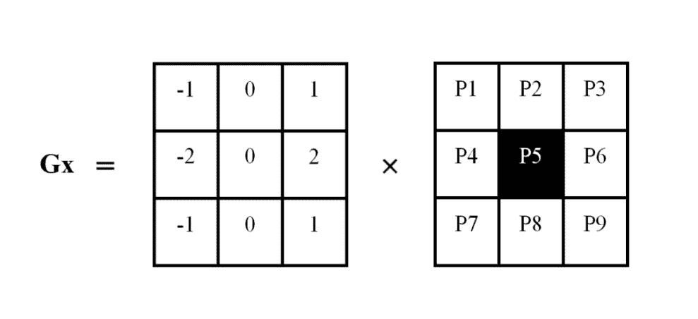

计算像素点P5的梯度，需要利用邻域内的像素点，公式为：

即用像素点P5右侧像素值减去左侧像素值，距离P5近的点权重较大，为2；距离P5远的点权重较小，为1。

##### **计算垂直方向偏导数的近似值**

##### 设原图像大小为 ，垂直方向偏导数 为：

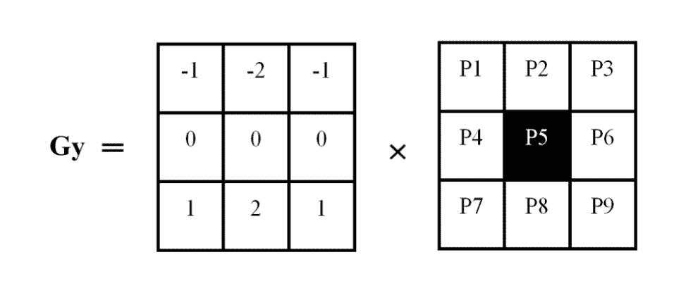

计算像素点P5的梯度，需要利用邻域内的像素点，公式为：

即用像素点P5下一行的像素值减去上一行的像素值，距离P5近的点权重较大，为2；距离P5远的点权重较小，为1。

#### **1.2 Scharr算子**

x和y方向的Scharr算子分别为： 

Sobel算子与Scharr算子比较：Sobel算子的缺点是，当结构较小是，精确度不高，Scharr算子具有更高的精度。

#### **1.3 Roberts算子**

当图像边缘接近于正45°或负45°时，该算法处理效果更理想。其缺点是对边缘的定位不太准确，提取的边缘线条较粗。正45°和负45°方向的Roberts算子分别为： 

**1.4 Laplacian算子**

Laplacian算子是一种二阶导数算子，具有旋转不变性，可以满足不同方向的边缘检测要求。通常其算子的系数之和需要为0。

例如，一个3×3的Laplacian算子如下：

对原图像使用Laplacian算子:

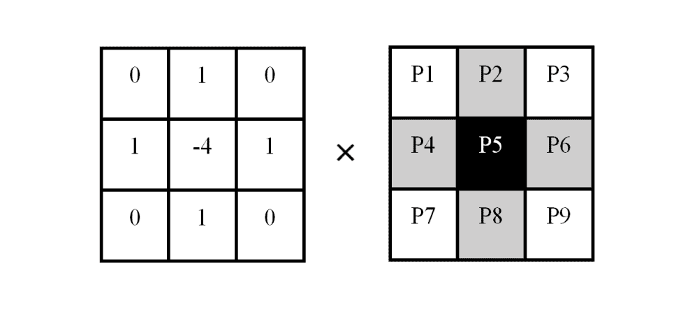

计算P5的近似导数值，如下：

**二、Canny边缘检测**

Canny边缘检测是一种多级边缘检测算法。于1986年由John F. Canny在论文《A Computational Approach to Edge Detection》中提出。

Canny边缘检测是从不同视觉对象中提取有用的结构信息并大大减少要处理的数据量的一种技术，目前已广泛应用于各种计算机视觉系统。Canny发现，在不同视觉系统上对边缘检测的要求较为类似，因此，可以实现一种具有广泛应用意义的边缘检测技术。边缘检测的一般标准包括：

1.  以低的错误率检测边缘，也即意味着需要尽可能准确的捕获图像中尽可能多的边缘。

2.  检测到的边缘应精确定位在真实边缘的中心。

3.  图像中给定的边缘应只被标记一次，并且在可能的情况下，图像的噪声不应产生假的边缘。

为了满足这些要求，Canny使用了变分法。Canny检测器中的最优函数使用四个指数项的和来描述，它可以由高斯函数的一阶导数来近似。

在目前常用的边缘检测方法中，Canny边缘检测算法是具有严格定义的，可以提供良好可靠检测的方法之一。由于它具有满足边缘检测的三个标准和实现过程简单的优势，成为边缘检测最流行的算法之一。

完成一个Canny边缘检测算法可以分为以下四步：

*   1.利用高斯滤波去噪。噪声会影响边缘检测的准确性，因此要先将噪声过滤掉。

*   2.计算梯度幅值和方向。       

*   3.非极大值抑制。

*   4.应用双阈值确定真实的和可能的边缘。             

#### **2.1 高斯滤波**

边缘检测非常容易受到图像噪声的影响，因此为了避免检测到错误的边缘信息，可以先用高斯滤波器去除图像噪声。

大小为 的高斯卷积核M的方程式为：

假设为src原图像，dst为高斯滤波后的图像，M为5×5的高斯卷积核（M不固定）：（*表示卷积运算）

注意：选择高斯核的大小会影响检测器的性能。尺寸越大，检测器对噪声的灵敏度越低。此外，随着高斯滤波器核大小的增加，用于检测边缘的定位误差将略有增加。一般5×5的核是比较不错的。

#### **2.2 计算梯度强度和方向**

梯度的方向与边缘的方向总是垂直的。图像中的边缘可以指向各个方向，通常会取水平（左、右）、垂直（上、下）、对角线（左上、右上、左下、右下）等八个不同的方向计算梯度。

接下来使用边缘检测的算子（如Roberts，Sobel，Scharr等）来计算图像中的水平、垂直和对角方向的梯度。得到水平 和垂直 方向的一阶导数值，由此便可以确定像素点的梯度的大小 和方向 。

其中 为梯度大小，  表示梯度方向， 为反正切函数。通过上式我们可以得到一个具有梯度大小 和方向 的矩阵。如下图：

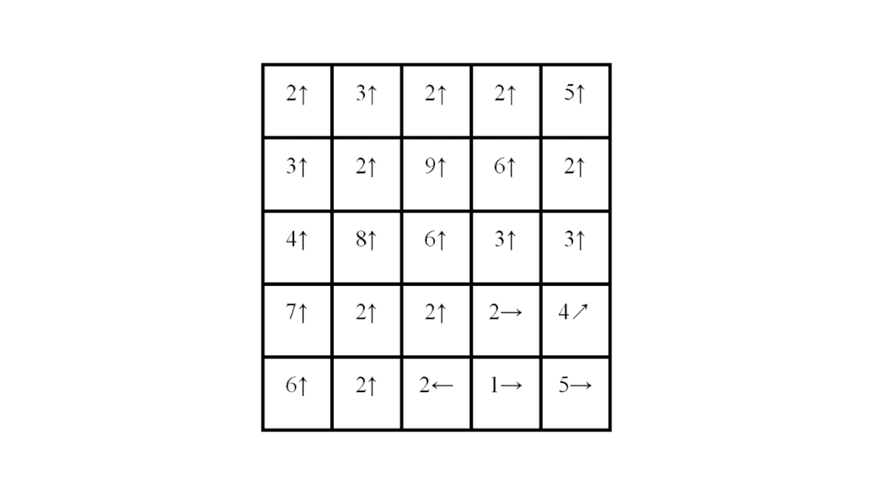

**角度的确定**：

得到的角度一般不在前边指定的放个方向上，我们需要将角度分类到八个方向中。假设有四条线，分别是0，45，90，135度线（0度和180重合，是一条线）。需要对通过（2）式求出的 进行近似，分类到这四条线分成的八个区域中。

比如计算出的 ，则应将其归类到 的区域，就是垂直向上方向。

**八个区域如下图：**

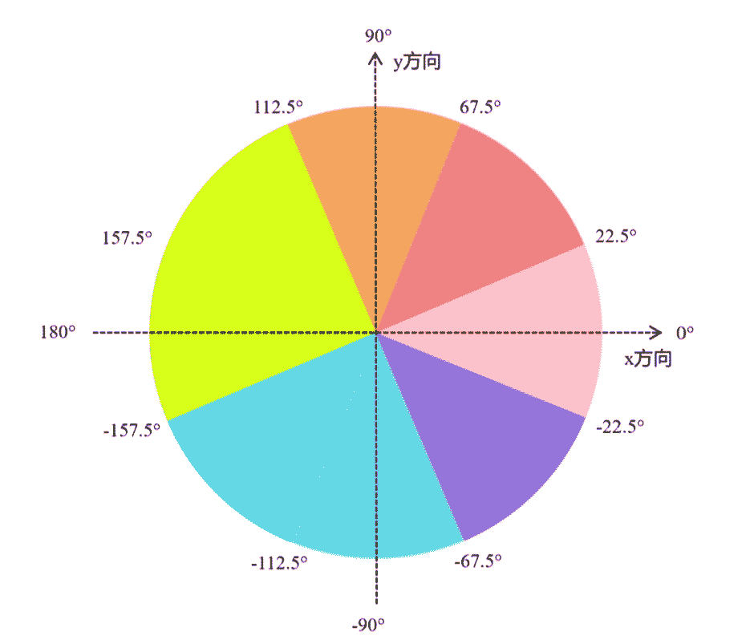

**2.3 非极大值抑制(NMS)**

在每一点上，邻域中心与沿着其对应的梯度方向的两个像素相比，若中心像素（）为最大值，则保留，否则中心置0，这样可以抑制非极大值，保留局部梯度最大的点，以得到细化的边缘。

*   如果该点是方向上的局部最大值，则保留该点

*   如果不是，则将其置为0

对图像进行梯度计算后，仅仅基于梯度值提取的边缘仍然很模糊。对边缘有且应当只有一个准确的响应。而非极大值抑制则可以帮助将局部最大值之外的所有梯度值抑制为0。非极大值抑制是一种边缘稀疏技术，非极大值抑制的作用在于“瘦”边。直观上地看，对第二步得到的图片，边缘由粗变细了。

经过上述处理后，对于同一个方向的若干边缘点，基本上只保留了一个，因此实现了边缘细化的目的。

如下图，A,B,C三点中，梯度方向上A点的局部梯度值最大，所以保留A点，其余两点被抑制。

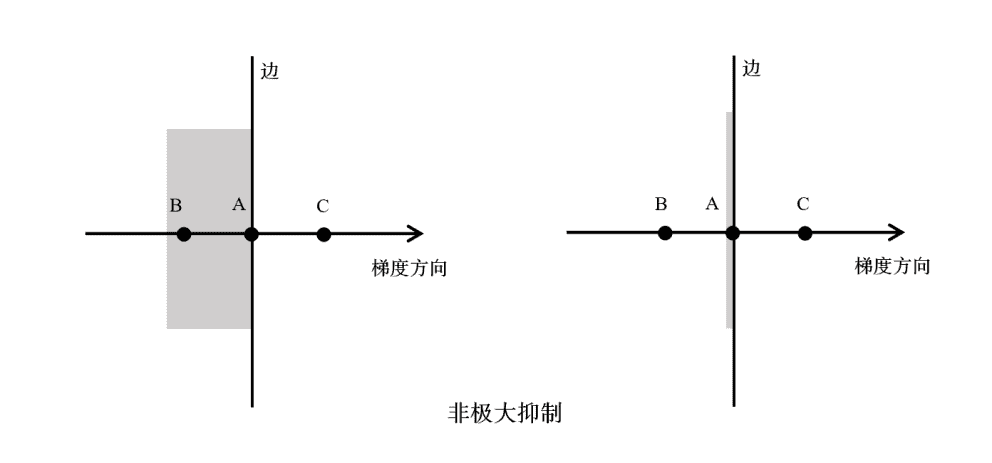

#### **2.4 用双阈值算法检测和连接边缘**

经过上述步骤后，图像内的强边缘已经在当前获取的边缘内，但是，一些虚边缘也在内。

我们设置两个阈值，高阈值maxVal和低阈值minVal，根据当前边缘点的梯度值与这两个阈值的关系，判断边缘的属性：

*   如果当前边缘点的梯度值大于或等于maxVal，，则将当前边缘标记为强边缘。

*   如果当前边缘点的梯度值介于maxVal与minVal之间，则将当前边缘标记为虚边缘。

*   如果当前边缘点的梯度值小于minVal，，则抑制当前边缘。

对得到的虚边缘，再做以下处理：

*   与强边缘相连，该边缘为边缘

*   与强边缘无连接，该边缘为弱边缘，将其抑制

可以肯定的是，强边缘必然是边缘点，因此必须将maxVal设置的足够高，以要求像素点的梯度值足够大（变化足够剧烈），而弱边缘可能是边缘，也可能是噪声，当虚边缘与强边缘相连时，就认为该虚边缘点是边缘点，以此来实现对强边缘的补充。

实际中maxVal:minVal=2:1的比例效果比较好，其中maxVal可以指定，也可以设计算法来自适应的指定，比如定义梯度直方图的前30%的分界线为maxVal。

## **三、基于OpenCV的实现**

#### **3.1 Sobel算子函数**

OpenCV使用Sobel 算子的方法是cv2.Sobel()

```
dst = cv2.Sobel(src,ddepth,dx,dy,ksize,scale,delta,borderType) 
```

**参数：**

*   src 原图像

*   ddepth 输出图像的深度，具体关系：

| 输入图像深度(src.depth()) | 输出图像深度(ddepth) |
| --- | --- |
| cv2.CV_8U | -1/cv2.CV_16S/cv2.CV_32F/cv2.CV_64F |
| cv2.CV_16U/cv2.CV_16S | -1/cv2.CV_32F/cv2.CV_64F |
| cv2.CV_32F | -1/cv2.CV_32F/cv2.CV_64F |
| cv2.CV_64F | -1/cv2.CV_64F |

*   dx：x方向上的求导阶数

*   dy：y方向上的求导阶数

*   ksize：Sobel核的大小。该值为-1时，会使用Scharr算子进行运算

*   scale：计算导数时采用的缩放因子，默认为1，是没有缩放的

*   delta：加在目标图像dst上的值，默认为0

*   borderType：边界样式，默认值为cv2.BORDER_DEFAULT。

**关于参数ddepth**：

该值为-1时，让处理结果与原始图像保持一致，但是直接将ddepth设置为-1，得到的结果可能是错误的。计算梯度值可能出现负数，当处理的图像是8位图类型，ddepth的值为-1时，运算结果也是8位图类型，负数会自动截断为0，发生信息丢失。为了避免信息丢失，要先使用更高的数据类型cv2.CV_64F，再通过取绝对值将其映射到cv2.CV_8U类型。所以，通常将ddepth值设置为“cv2.CV_8U”，并使用函数cv2.convertScaleAbs()对函数cv2.Sobel()的计算结果取绝对值。

**注意：**x方向和y方向的边缘叠加时，应先令dx=1，dy=0，得到一个结果；再令dx=0，dy=1，得到一个结果。将两个结果相加，而不是同时令dx=1和dy=1。

#### **代码示例：**

```
# -*- coding: utf-8 -*-
import cv2

#读取图像
img = cv2.imread('D:/yt/picture/Sobel/laplacian.bmp',0)

#计算x方向边缘信息
sobelx = cv2.Sobel(img,cv2.CV_64F,1,0,ksize=5)
#计算y方向边缘信息
sobely = cv2.Sobel(img,cv2.CV_64F,0,1,ksize=5)
#求绝对值
sobelx = cv2.convertScaleAbs(sobelx)
sobely = cv2.convertScaleAbs(sobely)
#x方向和y方向的边缘叠加
sobelxy = cv2.addWeighted(sobelx,0.5,sobely,0.5,0)

#显示图像
cv2.imshow("origin image",img)
cv2.imshow("x",sobelx)
cv2.imshow("y",sobely)
cv2.imshow("xy",sobelxy)

cv2.waitKey(0)
cv2.destroyAllWindows() 
```

#### **结果：**

##### 计算x方向的边缘


##### 计算y方向的边缘

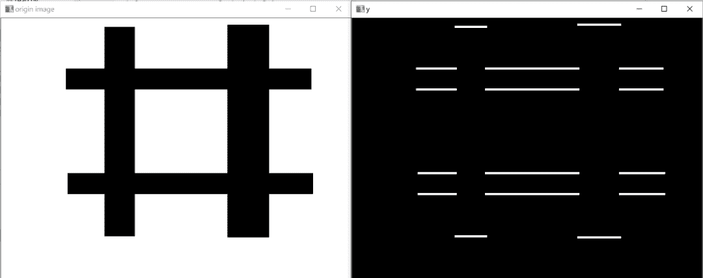

##### 计算x方向和y方向的边缘叠加

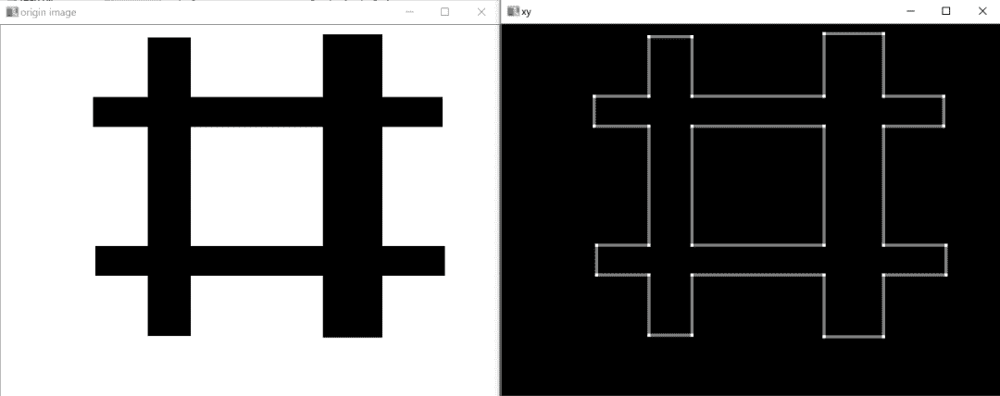

##### 同时令dx=1和dy=1时


#### **3.2 Scharr算子**

OpenCV使用Scharr算子的函数是cv2.Scharr()

```
dst = cv2.Scharr(src,ddepth,dx,dy,scale,delta,borderType) 
```

**参数：**

*   src 原图像

*   ddepth 输出图像的深度，该值与函数cv2.Sobel()中的参数ddepth的含义相同。

*   dx x方向上的求导阶数

*   dy y方向上的求导阶数

*   scale 计算导数时采用的缩放因子，默认为1，是没有缩放的

*   delta 加在目标图像dst上的值，默认为0

*   borderType 边界样式，默认值为cv2.BORDER_DEFAULT。

在cv2.Sobel()中，ksize=-1时，则会使用Scharr算子。所以下面两个语句等价：

```
dst = cv2.Scharr(src,ddepth,dx,dy)
dst = cv2.Sobel(src,ddepth,dx,dy,-1) 
```

**注意：**

*   参数ddepth的值应该设置为“cv2.CV_64F”，并对函数cv2.Scharr()的计算结果取绝对值。

*   dx和dy不能同时为1，否则语句是错误的。

*   计算x方向和y方向的边缘叠加时，应先令dx=1，dy=0，得到一个结果；再令dx=0，dy=1，得到一个结果。将两个结果相加，而不是同时令dx=1和dy=1。

#### **代码示例：**

```
import cv2

#读取图像
img = cv2.imread('D:/yt/picture/Sobel/lena.bmp',0)

#计算水平方向边缘信息
scharrx = cv2.Scharr(img,cv2.CV_64F,1,0)
#计算垂直方向边缘信息
scharry = cv2.Scharr(img,cv2.CV_64F,0,1)
#求绝对值
scharrx = cv2.convertScaleAbs(scharrx)
scharry = cv2.convertScaleAbs(scharry)
#水平方向和垂直方向的边缘叠加
scharrxy = cv2.addWeighted(scharrx,0.5,scharry,0.5,0)

#显示图像
cv2.imshow("origin image",img)
cv2.imshow("x",scharrx)
cv2.imshow("y",scharry)
cv2.imshow("xy",scharrxy)

cv2.waitKey(0)
cv2.destroyAllWindows() 
```

#### **结果：**

##### 计算x方向的边缘

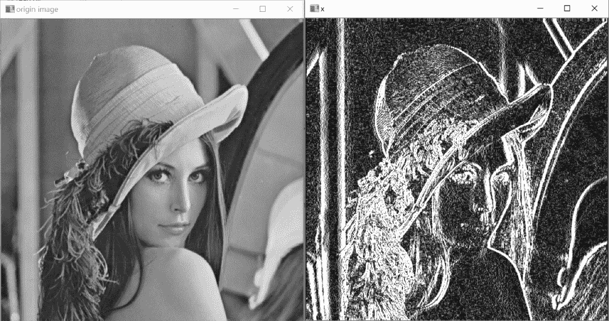

##### 计算y方向的边缘

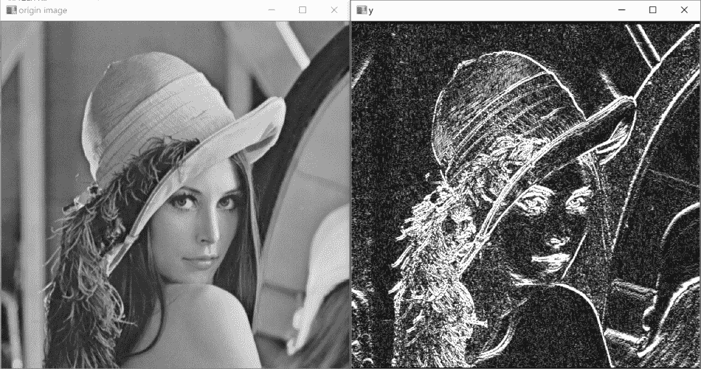

##### 计算x方向和y方向的边缘叠加

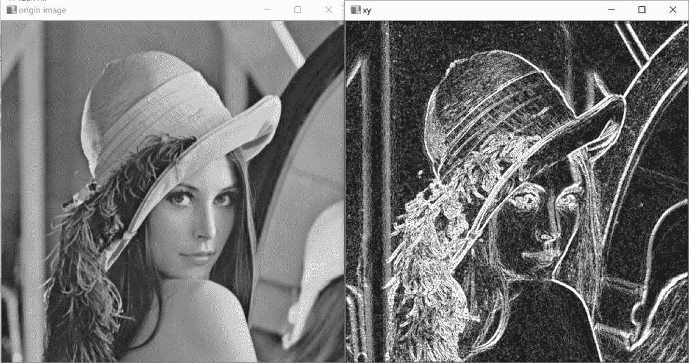

#### **3.3 Laplacian算子**

OpenCV使用Laplacian算子的函数是cv2.Laplacian()

```
dst = cv2.Laplacian(src,ddepth,ksize,scale,delta,borderType) 
```

**参数：**

*   src 原图像

*   ddepth 输出图像的深度，该值与函数cv2.Sobel()中的参数ddepth的含义相同。

*   ksize 计算二阶导数的核尺寸大小，必须为正的奇数。

*   scale 计算导数时采用的缩放因子，默认为1，是没有缩放的

*   delta 加在目标图像dst上的值，默认为0

*   borderType 边界样式，默认值为cv2.BORDER_DEFAULT。

该函数分别对x和y方向进行二次求导：

**注意：**当ksize=1时，计算时采用如下3×3的核：

**代码示例：**

```
import cv2

#读取图像
img = cv2.imread('D:/yt/picture/Sobel/laplacian.bmp',0)

#计算边缘信息
laplace = cv2.Laplacian(img,cv2.CV_64F)
#求绝对值
laplace = cv2.convertScaleAbs(laplace)

#显示图像
cv2.imshow("origin image",img)
cv2.imshow("laplace",laplace)

cv2.waitKey(0)
cv2.destroyAllWindows() 
```

#### **结果**


#### **4\. Canny函数**

OpenCV使用函数cv2.Cannyl()实现Canny边缘检测

```
edges = cv2.Canny(image,threshold1,threshold2,apertureSize,L2gradient) 
```

**参数：**

*   image 输入图像，必须为8位图像

*   threshold1 第一个阈值

*   threshold2 第二个阈值

*   apertureSize Sobel算子的大小

*   L2gradient 计算图像梯度幅度的表示。默认值为False，使用L1范数计算；如果为True，则使用更精确的L2范数计算。

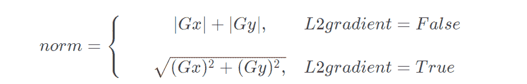

#### **代码示例：**

```
# -*- coding: utf-8 -*-
import cv2

#读取图像，为8位灰度图像
img = cv2.imread('D:/yt/picture/Sobel/lena.bmp',cv2.IMREAD_GRAYSCALE)

#canny边缘检测
#去噪
img = cv2.GaussianBlur(img,(3,3),0)
#threshold1为128，threshold2为200时的边缘检测结果
canny1 = cv2.Canny(img, 128, 200)
#threshold1为32，threshold2为128时的边缘检测结果
canny2 = cv2.Canny(img, 32, 128)

#显示图像
cv2.imshow("origin image",img)
cv2.imshow("canny1",canny1)
cv2.imshow("canny2",canny2)

cv2.waitKey(0)
cv2.destroyAllWindows() 
```

#### **结果：**

##### threshold1为128，threshold2为200时的边缘检测结果

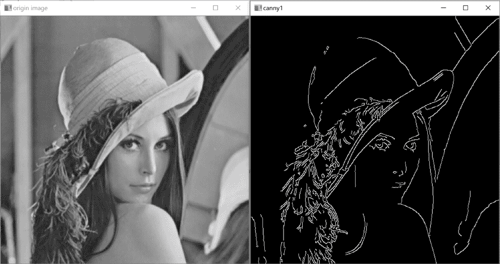

##### threshold1为32，threshold2为128时的边缘检测结果

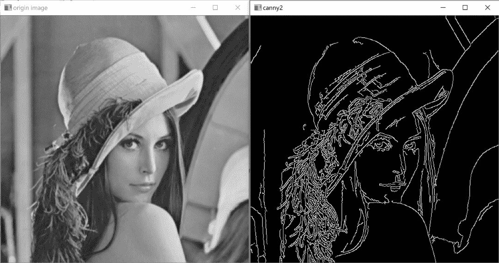

**本文电子版* 后台回复 **边缘检测** 获取* 


““感谢你的在看，点赞，分享三**连**↓