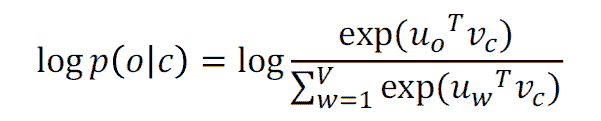
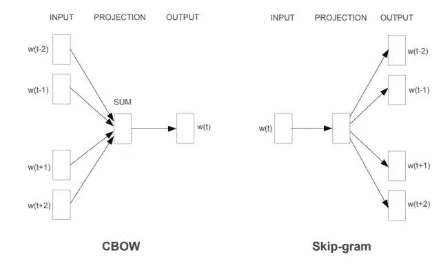

↑↑↑关注后"星标"Datawhale

每日干货 & [每月组队学习](https://mp.weixin.qq.com/mp/appmsgalbum?__biz=MzIyNjM2MzQyNg%3D%3D&action=getalbum&album_id=1338040906536108033#wechat_redirect)，不错过

 Datawhale干货 

**作者：芦冬生，**Datawhale优秀学习者**，北京理工大学**

自然语言处理( NLP )是信息时代最重要的技术之一，也是人工智能的重要组成部分。NLP的应用无处不在，因为人们几乎用语言交流一切：网络搜索、广告、电子邮件、客户服务、语言翻译、医疗报告等。

近年来，深度学习方法在许多不同的NLP任务中获得了非常高的性能，同时也吸引了越来越多的人加入学习NLP的大潮中。应广大学习者要求，Datawhale正式开启NLP专辑系列，提供NLP入门方向和指引，希望能帮助到大家。

本系列专辑以斯坦福的CS224N教学视频为基础，整理其课堂笔记、拓展作者的理解和学习感悟，帮助大家全面了解NLP深度学习的前沿研究。

现在，我们开启预训练模型(一)：Word vector。

本文目录：   

    1\. 人类语言和词义

*   *   如何表达一个单词的含义

    *   在计算机中如何具有可用的含义

    *   wordNet存在的问题

    *   将单词表示为离散符号

    *   单词作为离散符号存在的问题

    *   通过上下文表示单词

    *   词向量

    *   词义作为神经词向量-可视化

    2\. Word2Vec介绍

*   *   Word2Vec概述

    *   Word2Vec：目标函数

    *   带矢量的Word2Vec概述

    *   Word2Vec：预测功能

    *   通过优化参数来训练模型

    *   训练模型：计算所有矢量梯度

    3. Word2Vec梯度的导数

*   *   链式法则

    *   交互式白板会议

    *   计算所有梯度

    *   Word2vec：更多详细信息

    4. 常用工具总结

*   *   梯度下降

    *   随机梯度下降

# **一、****人类语言和词义**


## **1.1 我们如何表示一个单词的含义？**

定义：含义（韦伯斯特词典）

*   一个词或词组表示的意思；

*   人用这个单词，符号时表达的意思；

*   一个词在写作，艺术等作品中表达意思。

最普遍的意义语言学思维方式:

*能指（符号）⟺所指（思想或事物）*

=指称语义

## **1.2 我们在计算机中如何具有可用的含义？**

常见解决方案：使用 WordNet，一个同义词库，包含同义词集和上位词列表（“是”关系）

> 例如 包含“good”的同义词集

```
# 导入初始包
# pip install nltkimport nltk
#必须下载对应的wordnet包
nltk.download('wordnet')
from nltk.corpus import wordnet as wn
poses = {'n':'noun','v':'verb','s':'adj(s)','a':'adj','r':'adv'}
for synset in wn.synsets("good"):
    print("{}:{}".format(poses[synset.pos()],",".join([l.name() for l in synset.lemmas()]))) 
```


> 例如 "panda"的化身

```
# 导入初始包# pip install nltk
import nltk
#必须下载对应的wordnet包
nltk.download('wordnet')
from nltk.corpus import wordnet as wn
panda = wn.synset("panda.n.01")
hyper = lambda s: s.hypernyms()
list(panda.closure(hyper)) 
```


## **1.3 像WordNet这样的资源，存在的问题**

*   作为资源很好，但缺少细微差别
    例如：“proficient”被列为“good”的同义词，这仅在某些情况下是正确的。

*   缺少单词的新含义
    例如,wicked,badass,nifty,wizard,genius,ninja,bombest，不可能保持最新。

*   主观

*   需要人工来创造和适应

*   无法计算准确的单词相似度

## **1.4 将单词表示为离散符号**

在传统的自然语言处理中，我们将单词视为离散符号：hotel,conference,motel - 地方代表。单词可以用one-hot向量表示：<仅一个1，其余0s>

*motel=[000000000010000]*
*hotel = [000000010000000]*

向量维数=词汇中的单词数(例如：500,000)。

## **1.5 单词作为离散符号存在的问题**

示例：在网络搜索中，如果用户搜索“Seattle motel”，我们希望匹配包含“Seattle hotel”的文档。但是：

*motel=[000000000010000]*
*hotel = [000000010000000]*

这两个向量是正交的。one-hot向量没有自然的相似性概念。

《解决方案》

*   可以尝试依靠WordNet的同义词列表来获得相似性吗？

*   *   但是众所周知严重失败：不完整等。

*   替代：学习在向量本身中编码相似性。

## **1.6 通过上下文来表示单词**

*   分布语义：一个单词的含义由经常出现的单词给出

*   *   “您将知道它所经营的公司的一句话”（J.R. Firth 1957：11）

    *   现代统计NLP最成功的想法之一！

*   当单词w出现在文本中时，其上下文是附近出现的一组单词（在固定大小的窗口内）

*   使用w的许多上下文来构建w的表示


## **1.7 词向量**

我们将为每个单词构建一个密集的向量，并选择它，使其类似于出现在相似上下文中的单词的向量。


注意：单词向量有时也称为单词嵌入或单词表示形式，它们是分布式表示形式。

## **1.8 词义作为神经词向量-可视化**


# **二、Word2vec介绍**

Word2vec使用两层神经网络结构来为大量文本数据的语料库生成单词的分布式表达，并在数百维向量空间中表达每个单词的特征。在该向量空间中，假设在语料库中共享公共上下文的词彼此相似，并且将向量分配给这些词，以使它们在向量空间中彼此接近。

Word2vec（Mikolov et al.2013）是用于学习单词向量的框架。想法：

*   我们有大量的语料库；

*   固定词汇表中的每个单词都由一个向量表示；

*   遍历文本中的每个位置t，该位置具有中心词c和上下文（“outside”）词o；

*   使用c和o的词向量的相似度来计算o给定c的概率（反之亦然）；

*   不断调整单词向量以最大程度地提高这种可能性。

## **2.1 Word2Vec概述**

采样窗口和计算下图的过程：


下一步：


## **2.2 Word2vec：目标函数**

对于每个位置 ，在给定中心词 的情况下，在固定大小 的窗口中预测上下文词。


对于 是所有要优化的变量。

目标函数 是平均负对数似然度：< ：有时称为成本或损失函数>


*   我们想要最小化目标函数：


*   问题：怎样计算

*   回答：在每个单词 我们将使用两个向量：

*   *   当 是中心词时

    *   当 是上下文词时

*   然后对于中心词c和上下文词o：


## **2.3 带矢量的Word2Vec概述**

*   计算 的采样窗口和过程

*   的缩写为：


## **2.4 Word2vec：预测功能**


*   这是softmax函数的一个例子：


softmax函数将任意值 映射到概率分布

*   1\. max，因为放大了最大 的概率

*   2. soft”，因为仍然为较小的 分配了一些概率

## **2.5 通过优化参数来训练模型**

为了训练模型，我们调整参数以最大程度地减少损失。例如，对于下面两个参数的简单凸函数，等高线显示目标函数的级别。下图为等高线：


## **2.6 训练模型：计算所有矢量梯度！**

召回： 表示所有模型参数，在一个长矢量中。在我们以 维向量和 个单词为例的情况下：


**注意**：每个词都有两个向量，我们通过沿着梯度走来优化这些参数

# **三、Word2vec梯度的导数**

此处可观看吴恩达CS224n的视频，首先给出两个公式

1\. 有用的基础知识：


2. 链式法则！如果 和 ，即 ，然后：


## **3.1 链式法则**

链式法则！如果 和 ，即 ，然后：


简单的例子：


*   1\. 首先，展开成y对u的函数：


*   2. 接着，y对u求导：


*   3\. 其次，在展开u对x的函数：


*   4\. 接着，u对x求导：


*   5\. 最后，根据链式法则：


## **3.2 交互式白板会议！**


让我们一起得出中心词的梯度。对于一个采样窗口和一个采样外部单词：



然后，需要为上下文单词添加梯度（类似;左侧为作业），这就是这里的所有参数 。

## **3.3 计算所有梯度！**

对一个窗口中的每个中心向量v进行了渐变，我们还需要外部向量u的梯度通常在每个窗口中，计算该窗口中正在使用的所有参数的更新，例如：


## **3.4 Word2vec：更多详细信息**

为什么要选择两个向量？->简化优化。最后将两个向量平均。Word2Vec模型有两种类型，即CBOW和skip-gram，它们均由两层神经网络组成（输入层，中间层，输出层）。



*   Continuous Bag of Words（CBOW）
    从上下文词袋中预测中心词


如上所述，CBOW根据上下文（周围的单词）预测目标单词。顺便说一句，这里使用的文本是“You can do it!”。


它是一个学习模型，以上下文作为输入值来最大化目标词的后验概率。大致在如上图所示的图像中，输入值以one-hot 向量的形式输入，并且在中间层获得单词的分布式表示。在此，目标词是“can”，因此检查了预测输出结果（概率）与正确答案值（1）（1-0.93）之间的差异，并通过更新权重执行学习，以使误差变小。

*   Skip-grams（SG）
    根据给定的中心词来预测上下文（“外部”）词（与位置无关）


接下来是skip-gram，这是一个根据中心单词预测上下文（周围单词）的模型。


简而言之，它是反转CBOW的图像。到目前为止，我看到的两个模型都使用神经网络（它模仿人脑的神经细胞），因此当人出现带有可疑记忆的单词时考虑到有待猜测的地方，人脑可能以类似的机制主导结果。

这两种模型细节请参见：https://blog.csdn.net/dn_mug/article/details/69852740

# **四、优化：梯度下降**

我们有一个成本函数 我们想要最小化。梯度下降是最小化 的算法

**思路**：对于 的当前值，计算 的梯度，然后朝负梯度的方向走一小步。重复。<注意：我们的目标可能不会像这样凸出>


## **4.1 梯度下降**

*   更新公式（以矩阵表示法）：


*   更新公式（对于单个参数）：


*   算法：

```
while True:     
    theta_grad = evalute_gradient(J,corpus,theta)
    theta = theta - alpha * theta_grad 
```

## **4.2 随机梯度下降**

问题： 是语料库中所有窗口的函数（可能是数十亿！） 

*   因此 的计算非常昂贵

可能需要等待很长时间才能进行单个更新！对于几乎所有的神经网络来说，这都是一个非常糟糕的主意！

*   解决方案：随机梯度下降（SGD）

*   重复采样窗口，并在每个窗口之后进行更新

算法：

```
while True:
    window = sample_window(corpus)
    theta_grad = evaluate_gradient(J,window,theta)
    theta = theta - alpha * theta_grad 
```

**本文电子版* 后台回复 **NLP入门** 获取* 


“感谢你的分享，点赞，在看三**连**↓