```
↑↑↑关注后"星标"Datawhale
每日干货 & 每月组队学习，不错过
 Datawhale干货 
作者：耿远昊，Datawhale成员，华东师范大学
文本数据是指不能参与算术运算的任何字符，也称为字符型数据。如英文字母、汉字、不作为数值使用的数字(以单引号开头)和其他可输入的字符。文本数据具有数据维度高、数据量大且语义复杂等特点，是一种较为复杂的数据类型。今天，我们就来一起看看如何使用Pandas对文本数据进行数据处理。 本文目录
    1\. string类型的性质        1.1. string与object的区别        1.2\. string类型的转换    2. 拆分与拼接        2.1\. str.split方法        2.2. str.cat方法    3\. 替换        3.1\. str.replace的常见用法        3.2\. 子组与函数替换        3.3\. 关于str.replace的注意事项    4. 字串匹配与提取        4.1. str.extract方法        4.2. str.extractall方法        4.3. str.contains和str.match    5\. 常用字符串方法        5.1\. 过滤型方法        5.2\. isnumeric方法    6. 问题及练习        6.1\. 问题        6.2\. 练习 
```

## **一、string类型的性质**

### **1\. 1 string与object的区别**

#### string类型和object不同之处有三点：

#### ① 字符存取方法（string accessor methods，如str.count）会返回相应数据的Nullable类型，而object会随缺失值的存在而改变返回类型；

#### ② 某些Series方法不能在string上使用，例如：Series.str.decode()，因为存储的是字符串而不是字节；

#### ③ string类型在缺失值存储或运算时，类型会广播为pd.NA，而不是浮点型np.nan

#### 其余全部内容在当前版本下完全一致，但迎合Pandas的发展模式，我们仍然全部用string来操作字符串。

### **1.2 string类型的转换**

首先，导入需要使用的包

```
import pandas as pd
import numpy as np 
```

#### 如果将一个其他类型的容器直接转换string类型可能会出错：

```
#pd.Series([1,'1.']).astype('string') #报错
#pd.Series([1,2]).astype('string') #报错
#pd.Series([True,False]).astype('string') #报错 
```

#### 当下正确的方法是分两部转换，先转为str型object，在转为string类型：

```
pd.Series([1,'1.']).astype('str').astype('string') 
```

```
0     1
1     1
dtype: string
```

```
pd.Series([1,2]).astype('str').astype('string') 
```

```
0    1
1    2
dtype: string
```

```
pd.Series([True,False]).astype('str').astype('string') 
```

```
0     True
1    False
dtype: string
```

## **二、拆分与拼接**

### **2.1 str.split方法**

#### **（a）分割符与str的位置元素选取**

```
s = pd.Series(['a_b_c', 'c_d_e', np.nan, 'f_g_h'], dtype="string")
s 
```

```
0    a_b_c
1    c_d_e
2     <NA>
3    f_g_h
dtype: string
```

#### 根据某一个元素分割，默认为空格

```
s.str.split('_') 
```

```
0    [a, b, c]
1    [c, d, e]
2         <NA>
3    [f, g, h]
dtype: object 
```

#### 这里需要注意split后的类型是object，因为现在Series中的元素已经不是string，而包含了list，且string类型只能含有字符串。

#### 对于str方法可以进行元素的选择，如果该单元格元素是列表，那么str[i]表示取出第i个元素，如果是单个元素，则先把元素转为列表在取出。

```
s.str.split('_').str[1] 
```

```
0       b
1       d
2    <NA>
3       g
dtype: object
```

```
pd.Series(['a_b_c', ['a','b','c']], dtype="object").str[1] 
#第一个元素先转为['a','_','b','_','c'] 
```

```
0    _
1    b
dtype: object
```

#### **（b）其他参数**

#### expand参数控制了是否将列拆开，n参数代表最多分割多少次

```
s.str.split('_',expand=True) 
```

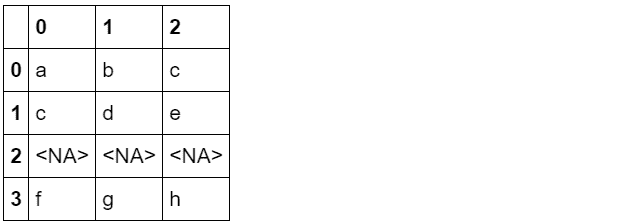

```
s.str.split('_',n=1) 
```

```
0    [a, b_c]
1    [c, d_e]
2        <NA>
3    [f, g_h]
dtype: object
```

```
s.str.split('_',expand=True,n=1) 
```

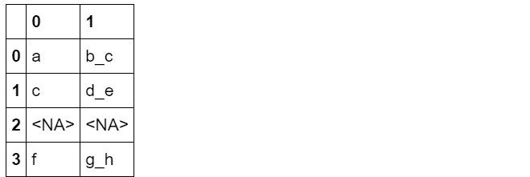

**2.2 str.cat方法**

#### **（a）不同对象的拼接模式**

#### cat方法对于不同对象的作用结果并不相同，其中的对象包括：单列、双列、多列

#### ① 对于单个Series而言，就是指所有的元素进行字符合并为一个字符串

```
s = pd.Series(['ab',None,'d'],dtype='string')
s 
```

```
0      ab
1    <NA>
2       d
dtype: string
```

```
s.str.cat() 
```

```
'abd'
```

#### 其中可选sep分隔符参数，和缺失值替代字符na_rep参数

```
s.str.cat(sep=',') 
```

```
'ab,d'
```

```
s.str.cat(sep=',',na_rep='*') 
```

```
'ab,*,d' 
```

#### ② 对于两个Series合并而言，是对应索引的元素进行合并

```
s2 = pd.Series(['24',None,None],dtype='string')
s2 
```

```
0      24
1    <NA>
2    <NA>
dtype: string
```

```
s.str.cat(s2) 
```

```
0    ab24
1    <NA>
2    <NA>
dtype: string
```

#### 同样也有相应参数，需要注意的是两个缺失值会被同时替换

```
s.str.cat(s2,sep=',',na_rep='*') 
```

```
0    ab,24
1      *,*
2      d,*
dtype: string
```

#### ③ 多列拼接可以分为表的拼接和多Series拼接

*   #### 表的拼接

```
s.str.cat(pd.DataFrame({0:['1','3','5'],1:['5','b',None]},dtype='string'),na_rep='*') 
```

```
0    ab15
1     *3b
2     d5*
dtype: string 
```

*   #### 多个Series拼接

```
s.str.cat([s+'0',s*2]) 
```

```
0    abab0abab
1         <NA>
2        dd0dd
dtype: string
```

#### **（b）cat中的索引对齐**

#### 当前版本中，如果两边合并的索引不相同且未指定join参数，默认为左连接，设置join='left'

```
s2 = pd.Series(list('abc'),index=[1,2,3],dtype='string')
s2 
```

```
1    a
2    b
3    c
dtype: string
```

```
s.str.cat(s2,na_rep='*') 
```

```
0    ab*
1     *a
2     db
dtype: string
```

## **三、替换**

#### 广义上的替换，就是指str.replace函数的应用，fillna是针对缺失值的替换，上一章已经提及。

#### 提到替换，就不可避免地接触到正则表达式，这里默认读者已掌握常见正则表达式知识点，若对其还不了解的，可以通过这份资料来熟悉

### **3.1 str.replace的常见用法**

```
s = pd.Series(['A', 'B', 'C', 'Aaba', 'Baca','', np.nan, 'CABA', 'dog', 'cat'],dtype="string")
s 
```

```
0       A
1       B
2       C
3    Aaba
4    Baca
5
6    <NA>
7    CABA
8     dog
9     cat
dtype: string
```

#### 第一个值写r开头的正则表达式，后一个写替换的字符串

```
s.str.replace(r'^[AB]','***') 
```

```
0       ***
1       ***
2         C
3    ***aba
4    ***aca
5
6      <NA>
7      CABA
8       dog
9       cat
dtype: string
```

### **3.2 子组与函数替换**

#### 通过正整数调用子组（0返回字符本身，从1开始才是子组）

```
s.str.replace(r'([ABC])(\w+)',lambda x:x.group(2)[1:]+'*') 
```

```
0       A
1       B
2       C
3     ba*
4     ca*
5
6    <NA>
7     BA*
8     dog
9     cat
dtype: string
```

#### 利用?P<....>表达式可以对子组命名调用

```
s.str.replace(r'(?P<one>[ABC])(?P<two>\w+)',lambda x:x.group('two')[1:]+'*') 
```

```
0       A
1       B
2       C
3     ba*
4     ca*
5
6    <NA>
7     BA*
8     dog
9     cat
dtype: string
```

### **3.3 关于str.replace的注意事项**

#### 首先，要明确str.replace和replace并不是一个东西：

*   #### str.replace针对的是object类型或string类型，默认是以正则表达式为操作，目前暂时不支持DataFrame上使用；

*   #### replace针对的是任意类型的序列或数据框，如果要以正则表达式替换，需要设置regex=True，该方法通过字典可支持多列替换。

#### 但现在由于string类型的初步引入，用法上出现了一些问题，这些issue有望在以后的版本中修复。

#### **（a）str.replace赋值参数不得为pd.NA**

#### 这听上去非常不合理，例如对满足某些正则条件的字符串替换为缺失值，直接更改为缺失值在当下版本就会报错

```
#pd.Series(['A','B'],dtype='string').str.replace(r'[A]',pd.NA) #报错
#pd.Series(['A','B'],dtype='O').str.replace(r'[A]',pd.NA) #报错 
```

#### 此时，可以先转为object类型再转换回来，曲线救国：

```
pd.Series(['A','B'],dtype='string').astype('O').replace(r'[A]',pd.NA,regex=True).astype('string') 
```

```
0    <NA>
1       B
dtype: string
```

#### 至于为什么不用replace函数的regex替换（但string类型replace的非正则替换是可以的），原因在下面一条

#### **（b）对于string类型Series**

#### 在使用replace函数时不能使用正则表达式替换，该bug现在还未修复

```
pd.Series(['A','B'],dtype='string').replace(r'[A]','C',regex=True) 
```

```
0    A
1    B
dtype: string
```

```
pd.Series(['A','B'],dtype='O').replace(r'[A]','C',regex=True) 
```

```
0    C
1    B
dtype: object
```

#### **（c）string类型序列如果存在缺失值，不能使用replace替换**

```
#pd.Series(['A',np.nan],dtype='string').replace('A','B') #报错 
```

```
pd.Series(['A',np.nan],dtype='string').str.replace('A','B') 
```

```
0       B
1    <NA>
dtype: string
```

#### 综上，概况的说，除非需要赋值元素为缺失值（转为object再转回来），否则请使用str.replace方法

## **四、子串匹配与提取**

### **4.1 str.extract方法**

#### **（a）常见用法**

```
pd.Series(['10-87', '10-88', '10-89'],dtype="string").str.extract(r'([\d]{2})-([\d]{2})') 
```

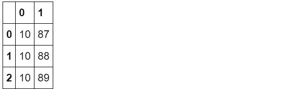

使用子组名作为列名

```
pd.Series(['10-87', '10-88', '-89'],dtype="string").str.extract(r'(?P<name_1>[\d]{2})-(?P<name_2>[\d]{2})') 
```

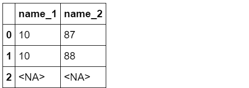

利用?正则标记选择部分提取

```
pd.Series(['10-87', '10-88', '-89'],dtype="string").str.extract(r'(?P<name_1>[\d]{2})?-(?P<name_2>[\d]{2})') 
```

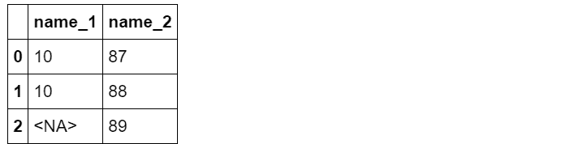

```
pd.Series(['10-87', '10-88', '10-'],dtype="string").str.extract(r'(?P<name_1>[\d]{2})-(?P<name_2>[\d]{2})?') 
```

**（b）expand参数（默认为True）**

#### 对于一个子组的Series，如果expand设置为False，则返回Series，若大于一个子组，则expand参数无效，全部返回DataFrame。

#### 对于一个子组的Index，如果expand设置为False，则返回提取后的Index，若大于一个子组且expand为False，报错。

```
s = pd.Series(["a1", "b2", "c3"], ["A11", "B22", "C33"], dtype="string")
s.index 
```

Index(['A11', 'B22', 'C33'], dtype='object')

```
s.str.extract(r'([\w])') 
```

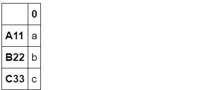

```
s.str.extract(r'([\w])',expand=False) 
```

```
A11    a
B22    b
C33    c
dtype: string
```

```
s.index.str.extract(r'([\w])') 
```


```
s.index.str.extract(r'([\w])',expand=False) 
```

Index(['A', 'B', 'C'], dtype='object')

```
s.index.str.extract(r'([\w])([\d])') 
```

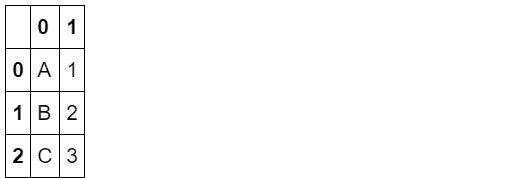

```
#s.index.str.extract(r'([\w])([\d])',expand=False) #报错 
```

### **4.2 str.extractall方法**

#### 与extract只匹配第一个符合条件的表达式不同，extractall会找出所有符合条件的字符串，并建立多级索引（即使只找到一个）

```
s = pd.Series(["a1a2", "b1", "c1"], index=["A", "B", "C"],dtype="string")
two_groups = '(?P<letter>[a-z])(?P<digit>[0-9])'
s.str.extract(two_groups, expand=True) 
```

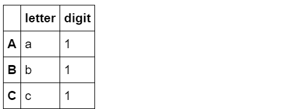

```
s.str.extractall(two_groups) 
```

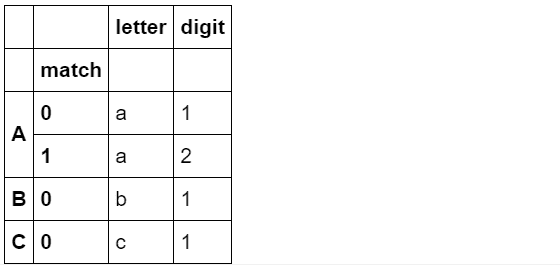

```
s['A']='a1'
s.str.extractall(two_groups) 
```

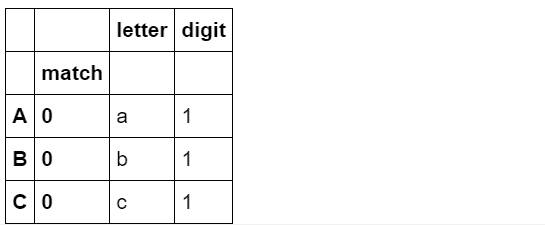

如果想查看第i层匹配，可使用xs方法

```
s = pd.Series(["a1a2", "b1b2", "c1c2"], index=["A", "B", "C"],dtype="string")
s.str.extractall(two_groups).xs(1,level='match') 
```

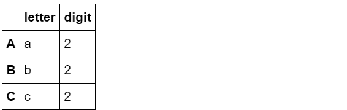

**4.3 str.contains和str.match**

#### 前者的作用为检测是否包含某种正则模式

```
pd.Series(['1', None, '3a', '3b', '03c'], dtype="string").str.contains(r'[0-9][a-z]') 
```

```
0    False
1     <NA>
2     True
3     True
4     True
dtype: boolean
```

#### 可选参数为na

```
pd.Series(['1', None, '3a', '3b', '03c'], dtype="string").str.contains('a', na=False) 
```

```
0    False
1    False
2     True
3    False
4    False
dtype: boolean
```

#### str.match与其区别在于，match依赖于python的re.match，检测内容为是否从头开始包含该正则模式

```
pd.Series(['1', None, '3a_', '3b', '03c'], dtype="string").str.match(r'[0-9][a-z]',na=False) 
```

```
0    False
1    False
2     True
3     True
4    False
dtype: boolean
```

```
pd.Series(['1', None, '_3a', '3b', '03c'], dtype="string").str.match(r'[0-9][a-z]',na=False) 
```

```
0    False
1    False
2    False
3     True
4    False
dtype: boolean
```

## **五、常用字符串方法**

### **5.1 过滤型方法**

#### **（a）str.strip**

#### 常用于过滤空格

```
pd.Series(list('abc'),index=[' space1  ','space2  ','  space3'],dtype="string").index.str.strip() 
```

```
Index(['space1', 'space2', 'space3'], dtype='object')
```

#### **（b）str.lower和str.upper**

```
pd.Series('A',dtype="string").str.lower() 
```

```
0    a
dtype: string
```

```
pd.Series('a',dtype="string").str.upper() 
```

```
0    A
dtype: string
```

#### **（c）str.swapcase和str.capitalize**

#### 分别表示交换字母大小写和大写首字母

```
pd.Series('abCD',dtype="string").str.swapcase() 
```

```
0    ABcd
dtype: string
```

```
pd.Series('abCD',dtype="string").str.capitalize() 
```

```
0    Abcd
dtype: string
```

### **5.2 isnumeric方法**

#### 检查每一位是否都是数字，请问如何判断是否是数值？（问题二）

```
pd.Series(['1.2','1','-0.3','a',np.nan],dtype="string").str.isnumeric() 
```

```
0    False
1     True
2    False
3    False
4     <NA>
dtype: boolean
```

## **六、问题与练习**

### **6.1 问题**

#### **【问题一】** str对象方法和df/Series对象方法有什么区别？

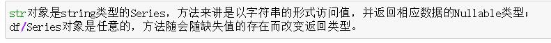

#### **【问题二】** 给出一列string类型，如何判断单元格是否是数值型数据？

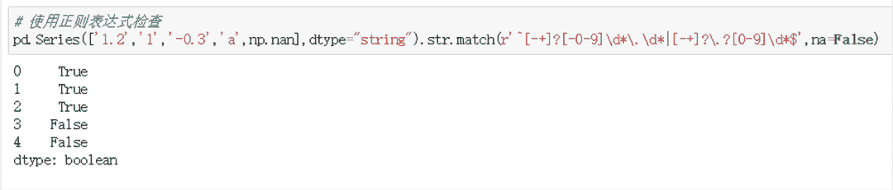

#### **【问题三】** rsplit方法的作用是什么？它在什么场合下适用？

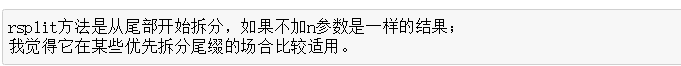

#### **【问题四】** 在本章的第二到第四节分别介绍了字符串类型的5类操作，请思考它们各自应用于什么场景？

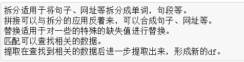

### **6.2 练习**

#### **【练习一】** 现有一份关于字符串的数据集，请解决以下问题：

#### （a）现对字符串编码存储人员信息（在编号后添加ID列），使用如下格式：“×××（名字）：×国人，性别×，生于×年×月×日”

```
# 方法一
> ex1_ori = pd.read_csv('data/String_data_one.csv',index_col='人员编号')
> ex1_ori.head()
  姓名  国籍  性别  出生年  出生月  出生日
人员编号            
1  aesfd  2  男  1942  8  10
2  fasefa  5  女  1985  10  4
3  aeagd  4  女  1946  10  15
4  aef  4  男  1999  5  13
5  eaf  1  女  2010  6  24

> ex1 = ex1_ori.copy()
> ex1['冒号'] = '：'
> ex1['逗号'] = '，'
> ex1['国人'] = '国人'
> ex1['性别2'] = '性别'
> ex1['生于'] = '生于'
> ex1['年'] = '年'
> ex1['月'] = '月'
> ex1['日'] = '日'
> ID = ex1['姓名'].str.cat([ex1['冒号'], 
                   ex1['国籍'].astype('str'),  
                   ex1['国人'],
                   ex1['逗号'],
                   ex1['性别2'],
                   ex1['性别'],
                   ex1['逗号'],
                   ex1['生于'],
                   ex1['出生年'].astype('str'),
                   ex1['年'],
                   ex1['出生月'].astype('str'),
                   ex1['月'],
                   ex1['出生日'].astype('str'),
                   ex1['日']
                  ])
> ex1_ori['ID'] = ID
> ex1_ori
  姓名  国籍  性别  出生年  出生月  出生日  ID
人员编号              
1  aesfd  2  男  1942  8  10  aesfd：2国人，性别男，生于1942年8月10日
2  fasefa  5  女  1985  10  4  fasefa：5国人，性别女，生于1985年10月4日
3  aeagd  4  女  1946  10  15  aeagd：4国人，性别女，生于1946年10月15日
4  aef  4  男  1999  5  13  aef：4国人，性别男，生于1999年5月13日
5  eaf  1  女  2010  6  24  eaf：1国人，性别女，生于2010年6月24日 
```

#### （b）将（a）中的人员生日信息部分修改为用中文表示（如一九七四年十月二十三日），其余返回格式不变。

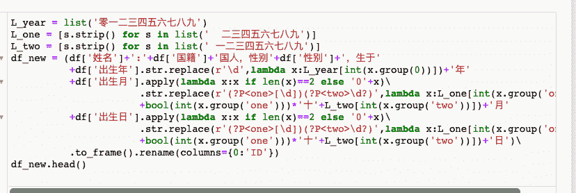

#### （c）将（b）中的ID列结果拆分为原列表相应的5列，并使用equals检验是否一致。

```
# 参考答案
> dic_year = {i[0]:i[1] for i in zip(list('零一二三四五六七八九'),list('0123456789'))}
> dic_two = {i[0]:i[1] for i in zip(list('十一二三四五六七八九'),list('0123456789'))}
> dic_one = {'十':'1','二十':'2','三十':'3',None:''}
> df_res = df_new['ID'].str.extract(r'(?P<姓名>[a-zA-Z]+):(?P<国籍>[\d])国人，性别(?P<性别>[\w])，生于(?P<出生年>[\w]{4})年(?P<出生月>[\w]+)月(?P<出生日>[\w]+)日')
> df_res['出生年'] = df_res['出生年'].str.replace(r'(\w)+',lambda x:''.join([dic_year[x.group(0)[i]] for i in range(4)]))
> df_res['出生月'] = df_res['出生月'].str.replace(r'(?P<one>\w?十)?(?P<two>[\w])',lambda x:dic_one[x.group('one')]+dic_two[x.group('two')]).str.replace(r'0','10')
> df_res['出生日'] = df_res['出生日'].str.replace(r'(?P<one>\w?十)?(?P<two>[\w])',lambda x:dic_one[x.group('one')]+dic_two[x.group('two')]).str.replace(r'^0','10')
> df_res.head()
  姓名  国籍  性别  出生年  出生月  出生日
人员编号            
1  aesfd  2  男  1942  8  10
2  fasefa  5  女  1985  10  4
3  aeagd  4  女  1946  10  15
4  aef  4  男  1999  5  13
5  eaf  1  女  2010  6  24 
```

**【练习二】** 现有一份半虚拟的数据集，第一列包含了新型冠状病毒的一些新闻标题，请解决以下问题：

#### （a）选出所有关于北京市和上海市新闻标题的所在行。

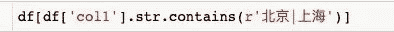

#### （b）求col2的均值。

```
ex2.col2.str.rstrip('-`').str.lstrip('/').astype(float).mean() 
```

-0.984

#### （c）求col3的均值。

```
ex2.columns = ex2.columns.str.strip(' ')

## ！！！用于寻找脏数据
def is_number(x):
      try:
          float(x)
          return True
      except (SyntaxError, ValueError) as e:
          return False
ex2[~ex2.col3.map(is_number)] 
```

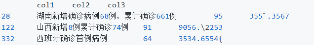

```
ex2.col3.str.replace(r'[`\\{]', '').astype(float).mean() 
```

24.707484999999988

**本文电子版* 后台回复* ***文本数******据** 获取* 


“感谢你的在看，点赞，分享三**连**↓