↑↑↑关注后"星标"Datawhale

每日干货 & [每月组队学习](https://mp.weixin.qq.com/mp/appmsgalbum?__biz=MzIyNjM2MzQyNg%3D%3D&action=getalbum&album_id=1338040906536108033#wechat_redirect)，不错过

 Datawhale干货 

**作者：吴忠强，Datawhale优秀学习者，东北大学**

一个复杂的事物,其中往往有许多因素互相制约又互相依存。方差分析是一种常用的数据分析方法，其目的是通过数据分析找出对该事物有显著影响的因素、各因素之间的交互作用及显著影响因素的最佳水平等。

本文介绍了方差分析的基础概念，详细讲解了单因素方差分析、双因素方差分析的原理，并且给出了它们的python实践代码。

**本文大纲：**

*   关于方差分析的基础概念

*   单因素方差分析原理及python实现

*   双因素方差分析原理及python实现

# **一、关于方差分析的基础概念**

在科学试验和生产实践中，影响某一事物的因素往往很多，比如化工生产中，像原料成分，剂量，反应温度，压力等等很多因素都会影响产品的质量，有些因素影响较大，有些影响较小， 为了使生产过程稳定， 保证优质高产， 就有必要找出对产品质量有显著影响的因素。

如何找到影响因素呢？就需要试验， 方差分析就是根据试验的结果进行分析， 鉴别各个有关因素对试验结果影响程度的有效方法。而根据涉及到的因素个数的不同， 又可以把方差分析分为单因素方差分析、多因素方差分析等。

下面我们先重点研究单因素方差分析， 通过一个例子，引出方差分析中的几个概念：

> 某保险公司想了解一下某险种在不同的地区是否有不同的索赔额。于是他们就搜集了四个不同地区一年的索赔额情况的记录如下表：
> 
> 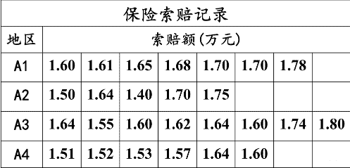
> 
> 尝试判断一下， 地区这个因素是否对与索赔额产生了显著的影响？

这个问题就是单因素方差分析的问题， 具体解决方法后面会说， 首先先由这个例子弄清楚几个概念：

1.  **试验指标**：方差分析中， 把考察的试验结果称为试验指标， 上面例子里面的“索赔额”。

2.  **因素**：对试验指标产生影响的原因称为因素， 如上面的“地区”

3.  **水平**：因素中各个不同状态， 比如上面我们有A1， A2， A3， A4四个状态， 四个水平。

这个类比的话， 就类似于y就是试验指标， 某个类别特征x就是因素， 类别特征x的不同取值就是水平。那么通过方差分析， 就可以得到某个类别特征对于y的一个影响程度了吧， 这会帮助分析某个类别特征的重要性！

# **二、单因素方差分析原理及python实现**

所谓单因素方差分析， 就是仅考虑有一个因素 对试验指标的影响。假如因素 有 个水平， 分别在第 个水平下进行多次独立的观测， 所得到的试验指标数据如下：

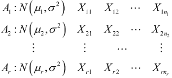

注意这里的 不一定一样，上面的例子。各总体间相互独立，因此我们会有下面的模型：

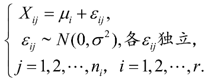

简单解释一下上面这个在说啥： 就是第 个水平的第 个观测值，上面例子里面就是第 个地区第 次的索赔额。 表示第 个水平的理论均值， 后面的 表示的随机误差， 假设这个服从正态。第一个等式的意思就是某个观测值可以用某水平下的均值加一个误差来表示。

如果我们想判断某个因素 对于试验指标是否有显著影响， 很直观的就是我们看看因素 不同的水平下试验指标的理论均值是否有显著差异， 即理论均值是否完全相同， 如果有显著差异， 就说明不同的水平对试验指标影响很大， 即 对试验指标有显著影响。这也是方差分析的目标， 故把问题转换成了比较不同水平下试验指标的均值差异。显著在这里的意思是差异达到的某种程度。

基于上面的分析， 我们就可以把方差分析也看成一个检验假设的问题， 并有了原假设和备择假设：

*   :

*   : 不全相等

那么这个假设检验的问题怎么验证呢？我们得先分析一下， 为啥各个 会有差异？从上面的模型中， 我们可以看到 ， 所以第一个可能就是 可能有差异， 比如 ， 那么 很容易就大于 。另一个可能就是随机误差的存在。在这样的启发下，我们得找一个衡量全部 之间差异的量， 就是下面这个了：


这个叫做**总偏差平方和**，如果这个越大， 就表示 之间的差异就越大。这里的 表示总的观测值个数：

接下来，我们把这个平方和分解开为两部分：一部分是由于因素 引起的差异， 这个叫做效应平方和 ， 另一部分是由于随机误差引起的差异，这个叫做误差平方和

关于 ， 先固定一个 , 此时对应的所有观测值 ， 他们之间的差异与每个水平的理论平均值就没有关系了， 而是取决于随机误差， 反应这些观察值差异程度的量

其中

综合所有的水平， 就可以得到误差平方和的公式如下：

而上面两者相减， 就会得到效应平方和：

由于 可以看作是每个水平的理论平均值的估计，所以如果每个水平理论平均值越大， 的差异也会越大，所以 可以衡量不同水平之间的差异程度。

通过上面的分析，我们会得到以下三点结论：

*   (这个分解式为上面模型的方差分析）

*   这里是因为：

后面这部分的加和如果除以 的话会服从自由度为 的卡方（具体看第二篇卡方分布的定义），那么前面又一个r水平的累加，根据卡方分布的可加性可得这个东西服从 的卡方

*   当 为真的时候，

我们上面说 可以衡量不同水平之间的差异程度。那么我们直观的看就是如果 比较大的时候，说明不同水平之间的差异程度比较大了，这时候就应该拒绝 ，但是我们看到上面的检验统计量里面 我们是不知道的， 所以为了抵消掉这个未知量，我们最终构造的检验统计量为：

这时候构造出了F统计量。在原假设成立的时候， 是偏小的，那么当 大于某个值的时候，我们就拒绝原假设。那么这个值是多大呢？我们会先给出一个显著水平 ， 如果 大于了 ，这时候我们就拒绝原假设。当然这里面确实省略了很多细节过程，因为这个东西涉及到了假设检验的底层原理，由于时间原因这里先不补，后期如果有机会，会补上假设检验的底层思想（这个得涉及参数估计，检验统计量及常见分布等知识），所以这里先记住这个结论， 这里主要是看看如何用代码实现单因素方差分析。

基于上面的分析，会得到一个单因素试验方差分析表：

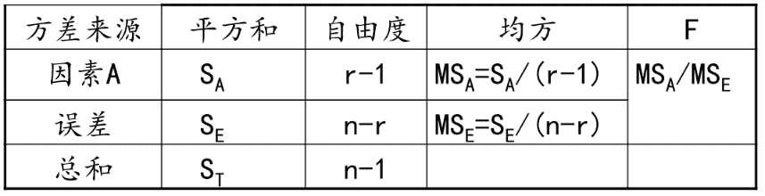

这个表就把上面所有的分析都给总结好了。但实际使用中，我们肯定是不会手算的，并且一般也不看F的值，我们是看p值的。

下面就用python实现一下上面的那个索赔额的例子， 看看单因素方差分析是怎么做的：

```
import pandas as pd
import numpy as np

from scipy import stats
from statsmodels.formula.api import ols
from statsmodels.stats.anova import anova_lm

# 这是那四个水平的索赔额的观测值
A1 = [1.6, 1.61, 1.65, 1.68, 1.7, 1.7, 1.78]
A2 = [1.5, 1.64, 1.4, 1.7, 1.75]
A3 = [1.6, 1.55, 1.6, 1.62, 1.64, 1.60, 1.74, 1.8]
A4 = [1.51, 1.52, 1.53, 1.57, 1.64, 1.6]

data = [A1, A2, A3, A4]
# 方差的齐性检验
w, p = stats.levene(*data)
if p < 0.05:
    print('方差齐性假设不成立')

# 成立之后， 就可以进行单因素方差分析
f, p = stats.f_oneway(*data)
print(f, p)      #  2.06507381767795 0.13406910483160134 
```

上面这段程序应该很容易懂， 首先前面是把数据构造出来， 然后进行一个方差的齐性检验， 这个用stats.levene函数， 这个的作用是要保证方差在每个水平上某种程度上(显著水平)是一致的， 这时候才能进行后面的均值分析, 因为方差分析的实质是检验多个水平的均值是否有显著差异，如果各个水平的观察值方差差异太大，只检验均值之间的差异就没有意义了，所以要进行方差齐性检验。

后面通过stats.f_oneway函数就可以直接算出检验假设的 值和 值。我们这里关注的是 值， 拿 值和给出的 （一般是0.05）比， 如果 ，我们就接受原假设，否则拒绝原假设，这个例子中 是0.134，大于 ，故接受原假设，认为不同的地区的索赔额没有显著差异。

所以单因素方差这块一般是懂了原理之后，用软件去分析，能看懂就算入门了。当然这个如果手算的话，思路就是需要先求 ，然后根据上面的公式计算 ，计算完了之后除以自由度然后相除得到 值，然后比较 和 的大小，当 ，拒绝原假设，否则接受原假设。一定要注意这个 值和 值的比较标准是不同的。因为这是两种假设检验的方法， 值比较的这种是基于 值法，而 的那种是临界值法。

上面的例子我们还可以进行那种单因素方差表的显示格式：首先改一下数据的格式

```
values = A1.copy()
groups = []
for i in range(1, len(data)):
    values.extend(data[i])

for i, j in zip(range(4), data):
    groups.extend(np.repeat('A'+str(i+1), len(j)).tolist())

df = pd.DataFrame({'values': values, 'groups': groups})
df 
```

数据长这个样子了，也是我们一般见到的pandas的形式：

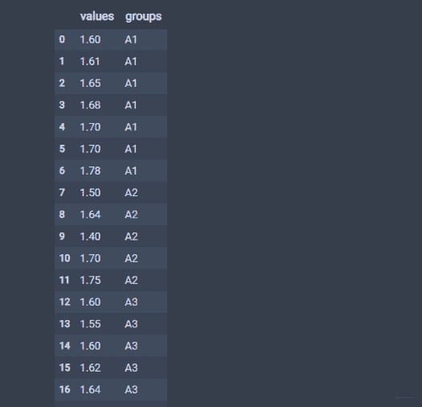

通过下面的方式做单因素方差分析：

```
anova_res = anova_lm(ols('values~C(groups)', df).fit())
anova_res.columns = ['自由度', '平方和', '均方', 'F值', 'P值']
anova_res.index = ['因素A', '误差']
anova_res        # 这种情况下看p值  >0.05 所以接受H0 
```

结果如下：


这样就会得到单因素方差分析表的格式。当然， 为了考虑的全面些， 我们应该评估检验的假设条件， 就是看看每个数据是不是真的服从正态。这里就使用上一篇文章中学习到的判断数据是不是服从正态的方法了Shapiro-Wilk test（小样本情况下， 常用的正态检验方法）：

```
# 数据格式张这样
A1 = [1.6, 1.61, 1.65, 1.68, 1.7, 1.7, 1.78]
A2 = [1.5, 1.64, 1.4, 1.7, 1.75]
A3 = [1.6, 1.55, 1.6, 1.62, 1.64, 1.60, 1.74, 1.8]
A4 = [1.51, 1.52, 1.53, 1.57, 1.64, 1.6]

data = [A1, A2, A3, A4]

from scipy.stats import shapiro

def normal_judge(data):
    stat, p = shapiro(data)
    if p > 0.05:
        return 'stat={:.3f}, p = {:.3f}, probably gaussian'.format(stat,p)
    else:
        return 'stat={:.3f}, p = {:.3f}, probably not gaussian'.format(stat,p)

for d in data:
    print(normal_judge(d)) 
```

结果如下：

```
stat=0.942, p = 0.660, probably gaussian
stat=0.938, p = 0.655, probably gaussian
stat=0.850, p = 0.096, probably gaussian
stat=0.918, p = 0.489, probably gaussian 
```

## **三、双因素方差分析及python实现**

在很多情况下， 只考虑一个指标对观察值的影响显然是不够的， 这时就会用到多因素方差分析。双因素方差分析和多因素方差分析原理上一致， 下面给出一种两个因素之间有交互的一种形式写法作为补充。

所谓双因素方差分析， 就是有两个因素 作用于试验的指标， 因素 有 个水平 ， 因素 有 个水平 . 现对因素 的水平的每对组合 都作 次试验，也会得到一个表：

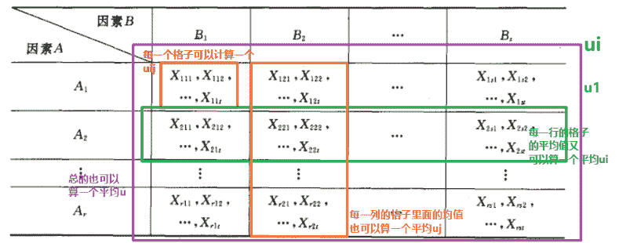

并设

这里的 独立， 类比着单因素方差分析那里， 我们就会先有下面的数学模型：

<svg xmlns="http://www.w3.org/2000/svg" viewBox="0 -883.9 12181 1233.4" style="-webkit-overflow-scrolling: touch;vertical-align: -0.791ex;width: 27.559ex;height: 2.791ex;max-width: 300% !important;"><g stroke="currentColor" fill="currentColor" stroke-width="0" transform="matrix(1 0 0 -1 0 0)"><g><g transform="translate(6921.1, 0)">各</g> <g transform="translate(9787.5, 0)">独立</g></g></g></svg>

这里的 表示的是第 个 因素第 个 因素下的第 个观测值。 是组合 下的所有观测值的平均数(平均效应)。 是随机误差， 这个其实和单因素那里的理解是一个意思， 上面的单因素的那个表格放在双因素这里就相当于这里的其中一个小格子了。

那么就开始引入一些新的公式， 因为既然每个格子里面有平均， 那么每一行的格子和每一列的格子也会有平均， 整体上也会有平均， 所以下面就定义三个公式：

我们称这里的 为总的平均。再定义两个公式：

我们称 为水平 上的效应， 称 为水平 的效应。下面尝试理解一下上面的这些公式， 因为符号有些多了， 对于双因素水平， 我们会发现 因素的某个 水平， 因素的某个 水平下的第 个观测值 其实会和 各个分水平效应有关， 也会和两者的组合效应有关，也会和一切水平的总组合效应有关，再加上残差项的影响。所以上面的 的引入是为了去衡量总的组合效应， 的引入是为了衡量因素 的水平 带来的影响， 衡量因素B水平 带来的影响。很显然，

这两个等式就会说明某些水平 或者 上的效应会高于总水平的平均效应，也会低于总水平的平均效应。加和之后，高的那部分和低的那部分就会抵消掉，因为总水平的平均效应是一个基准，单个因素的各个水平上或许会高于或者低于总平均效应，但是综合起来还是回到那个基准。

那么影响 的还有一个 和上的效应会高于总的 的组合效应， 也就是两者搭配起来联合起作用， 我们看看这个是个啥东西, 由：

这是个恒成立等式， 我们会发现后面括号里面那部分其实就是两者的组合效应， 我们令其等于 ， 此时上面的模型就可以化简成最终的结果：

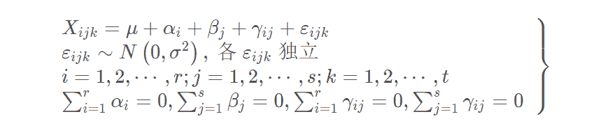

这个就是双因素试验方差分析的数学模型。对于这个模型， 我们就会有三个假设检验的问题了：

因素A对于试验结果是否带来了显著影响


因素B对于试验结果是否带来了显著影响


两者的组合对于试验结果是否带来了显著影响


与单因素的情况类似， 我们依然是采用平方和分解的方式进行验证。首先我们得先计算四个平均值：

因素A的 水平因素B的 水平的平均值：

因素A的 水平上的平均值：

因素B的 水平平均值：

总平均值：

有了上面的平均值， 我们就可以得到偏差平方和了， 总偏差平方和如下：

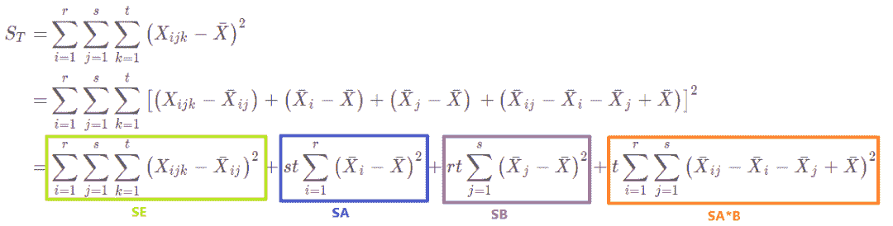

就得到了

其中 称为误差平方和， 分为称为因素A和B的效应平方和， 成为A和B的组合效应平方和。

这里也给出每个平方和的自由度， 的自由度 ， 自由度是 ， 自由度是 ， 自由度 ， 自由度是 。那么和单因素水平分析那样， 我们可以得到每个假设下面的拒绝域形式：

当 为真的时候，

这时候取显著水平为 ， 就会得到 的拒绝域：

的拒绝域形式：

的拒绝域形式：

依然会有个方差分析表：

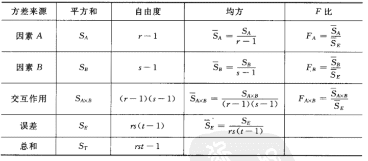

和单因素方差分析那里的思路是一样的， 碰到具体问题的时候， 我们一般不会采用手算的形式， 如果手算的话， 思路和上面一样， 就是先根据公式求四个平均值， 然后根据平均值求那四个平方和的东西， 求完了之后算三个 ， 看看是不是落在了拒绝域里面。当然手算， 单因素方差分析还能算算， 双因素这里就很麻烦了， 并且实际应用里面还可能是多因素方差分析，总不能全靠手算吧， 所以掌握软件的方式进行方差分析就很有必要了，哈哈。下面依然是给出两个实际应用中的例子：（一个无交互作用的， 一个有交互作用的）， 当然有没有交互作用， 要事先进行分析。

导入这次用到的包（依然是单因素分析时的ols和anova_lm）

```
import pandas as pd
import numpy as np

from scipy import stats
from statsmodels.formula.api import ols
from statsmodels.stats.anova import anova_lm

# 这三个交互效果的可视化画图
from statsmodels.graphics.api import interaction_plot
import matplotlib.pyplot as plt
from pylab import mpl      # 显示中文

# 这个看某个因素各个水平之间的差异
from statsmodels.stats.multicomp import pairwise_tukeyhsd 
```

**3.1、无交互作用的情况**

由于不考虑交互作用的影响，对每一个因素组合 只需进行一次独立试验，称为无重复试验。

**数据**：考虑三种不同形式的广告和五种不同的价格对某种商品销量的影响。选取某市15家大超市，每家超市选用其中的一个组合，统计出一个月的销量如下（设显著性水平为0.05）：

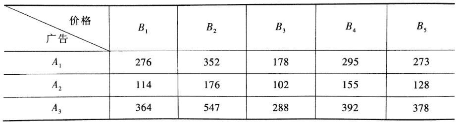

下面进行双因素方差分析，简要流程是，先用pandas库的DataFrame数据结构来构造输入数据格式。然后用statsmodels库中的ols函数得到最小二乘线性回归模型。最后用statsmodels库中的anova_lm函数进行方差分析。

```
dic_t2=[{'广告':'A1','价格':'B1','销量':276},{'广告':'A1','价格':'B2','销量':352},
       {'广告':'A1','价格':'B3','销量':178},{'广告':'A1','价格':'B4','销量':295},
       {'广告':'A1','价格':'B5','销量':273},{'广告':'A2','价格':'B1','销量':114},
       {'广告':'A2','价格':'B2','销量':176},{'广告':'A2','价格':'B3','销量':102},
       {'广告':'A2','价格':'B4','销量':155},{'广告':'A2','价格':'B5','销量':128},
       {'广告':'A3','价格':'B1','销量':364},{'广告':'A3','价格':'B2','销量':547},
       {'广告':'A3','价格':'B3','销量':288},{'广告':'A3','价格':'B4','销量':392},
       {'广告':'A3','价格':'B5','销量':378}]
df_t2=pd.DataFrame(dic_t2,columns=['广告','价格','销量'])
df_t2 
```

数据长这样：

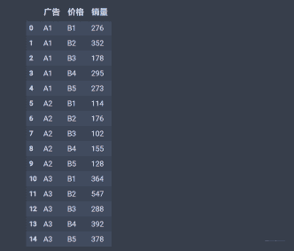

```
# 方差分析
price_lm = ols('销量~C(广告)+C(价格)', data=df_t2).fit()
table = sm.stats.anova_lm(price_lm, typ=2)
table 
```

结果如下：

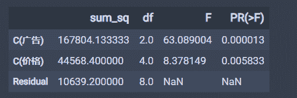

可以发现这里的p值都是小于0.05的， 所以我们要拒绝掉原假设， 即可认为不同的广告形式， 不同的价格均造成商品销量的显著差异。

下面还可以看一下交互影响效果：

```
fig = interaction_plot(df_t2['广告'],df_t2['价格'], df_t2['销量'],
                        ylabel='销量', xlabel='广告') 
```

结果如下：

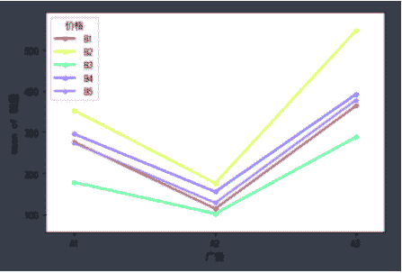

再来分析一下单因素各个水平之间的显著差异：

```
# 广告与销量的影响  注意这个的显著水平是0.01
print(pairwise_tukeyhsd(df_t2['销量'], df_t2['广告'], alpha=0.01)) # 第一个必须是销量， 也就是我们的指标 
```

结果如下：

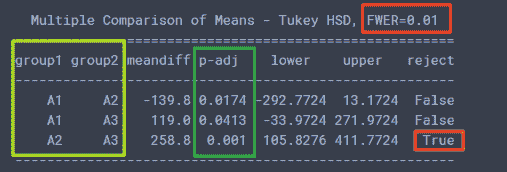

这个可以得到的结论是在显著水平0.01的时候， A2和A3的p值小于0.01， reject=True, 即认为A2和A3有显著性差异。

**3.2、有交互作用的情况**

由于因素有交互作用，需要对每一个因素组合 分别进行 次 重复试验，称这种试验为等重复试验。

数据：概率论课本上的那个例子， 火箭的射程与燃料的种类和推进器的型号有关，现对四种不同的燃料与三种不同型号的推进器进行试验，每种组合各发射火箭两次，测得火箭的射程结果如下（设显著性水平为0.01）：

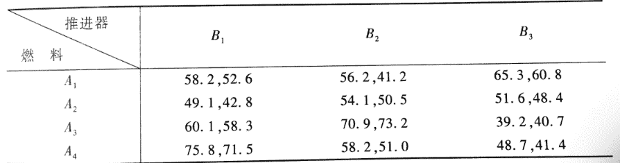

第一步依然是先构造数据，

```
dic_t3=[{'燃料':'A1','推进器':'B1','射程':58.2},{'燃料':'A1','推进器':'B1','射程':52.6},
       {'燃料':'A1','推进器':'B2','射程':56.2},{'燃料':'A1','推进器':'B2','射程':41.2},
       {'燃料':'A1','推进器':'B3','射程':65.3},{'燃料':'A1','推进器':'B3','射程':60.8},
       {'燃料':'A2','推进器':'B1','射程':49.1},{'燃料':'A2','推进器':'B1','射程':42.8},
       {'燃料':'A2','推进器':'B2','射程':54.1},{'燃料':'A2','推进器':'B2','射程':50.5},
       {'燃料':'A2','推进器':'B3','射程':51.6},{'燃料':'A2','推进器':'B3','射程':48.4},
       {'燃料':'A3','推进器':'B1','射程':60.1},{'燃料':'A3','推进器':'B1','射程':58.3},
       {'燃料':'A3','推进器':'B2','射程':70.9},{'燃料':'A3','推进器':'B2','射程':73.2},
       {'燃料':'A3','推进器':'B3','射程':39.2},{'燃料':'A3','推进器':'B3','射程':40.7},
       {'燃料':'A4','推进器':'B1','射程':75.8},{'燃料':'A4','推进器':'B1','射程':71.5},
       {'燃料':'A4','推进器':'B2','射程':58.2},{'燃料':'A4','推进器':'B2','射程':51.0},
       {'燃料':'A4','推进器':'B3','射程':48.7},{'燃料':'A4','推进器':'B3','射程':41.4},]
df_t3=pd.DataFrame(dic_t3,columns=['燃料','推进器','射程'])
df_t3.head() 
```

结果这样：

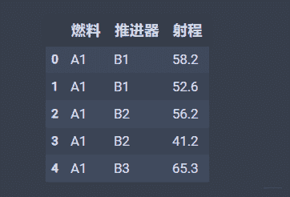

下面是方差分析：

```
moore_lm = ols('射程~燃料+推进器+燃料:推进器', data=df_t3).fit()
table = sm.stats.anova_lm(moore_lm, typ=1)
table 
```

结果如下：

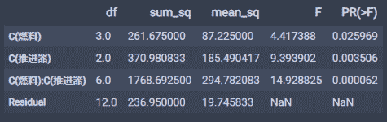

这里得到的结论就是燃料的P值是大于0.01的， 而推进器和两者组合的p值都小于0.01， 并且两者的组合非常小， 这就说明燃料对于火箭的射程没有显著影响， 而后两者都有显著影响，两者的交互作用更是高度显著。

下面是交互效应效果：

```
fig = interaction_plot(df_t3['燃料'],df_t3['推进器'], df_t3['射程'],
                        ylabel='射程', xlabel='燃料') 
```

结果如下：

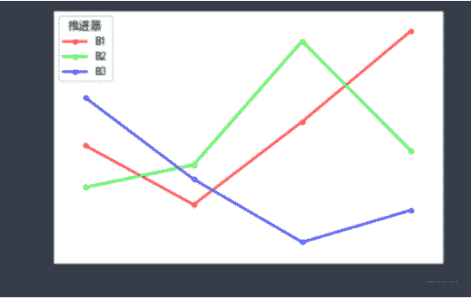

从这个图里面可以看出， (A4, B1)和(A3, B2)组合的进程最好。黄金搭档。单因素差异性分析：

```
print(pairwise_tukeyhsd(df_t3['射程'], df_t3['燃料'])) 
```

结果：

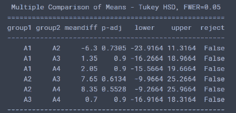

都是False， 说明A因素各个水平之间无显著差异。

**两个实验到这里就结束了， 这里再补充两点别的知识：**

1\. ols函数里面公式的写法

*   '射程~C(燃料)+C(推进器)+C(燃料):C(推进器)' ：相当于射程是y(指标), 燃料和推进器是x(影响因素)， 三项加和的前两项表示两个主效应， 第三项表示考虑两者的交互效应， 不加C也可。

*   '射程~C(燃料, Sum)*C(推进器, Sum)'和上面效果是一致的， 星号在这里表示既考虑主效应也考虑交互效应*'销量~C(广告)+C(价格)'：这个表示不考虑交互相应

但是要注意， 考虑交互相应和不考虑交互相应导致的Se（残差项）会不同， 所以会影响最终的结果。

stats.anova_lm(moore_lm, typ=1)这里面的typ参数， 这个参数我尝试还没有完全搞明白到底是什么意思， 这个参数有1,2，3 三个可选项， 分别代表着不同的偏差平方和的计算方法， 我在第二个实验中尝试过改这个参数，改成1的时候发现就加了一列mean_sq， 然后其他的没变。

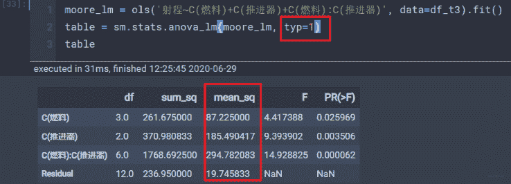

改成3的时候发现加一行Intercept， 并且此时燃料和推进器的数据都发生了变化。

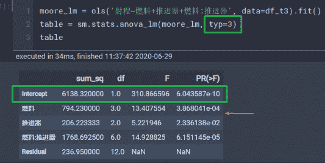

## **四、写到最后**

方差分析这块到这里就结束了， 随着这篇文章的结束也意味着概率统计的知识串联也到了尾声， 简单的回顾一下本篇的内容， 这篇文章主要是在实践的角度进行的分析， 方差分析在统计中还是很常用的， 比较适合类别因素对于数值指标的影响程度：

*   首先从单因素方差分析入手， 这个只考虑了一个因素对于指标的影响， 先分析了原理，然后基于python进行了实现。实际应用中，一般是会点原理，然后使用工具实现方差分析，会看结果，这样就算入门了。

*   然后就是进行双因素方差的分析， 重点补充了带有交互效应的形式原理和python实现， 这样与文档形成一种互补。最后是带有交互和不带交互的双因素方差的实验。

实际应用中， 或许可以通过这种方法去分析类别特征的重要性或者关联性，以及类别和类别特征之间的交互作用等。

**本文电子版* 后台回复 **概率统计** 获取* 


“感谢你的分享，点赞，在看三**连**↓