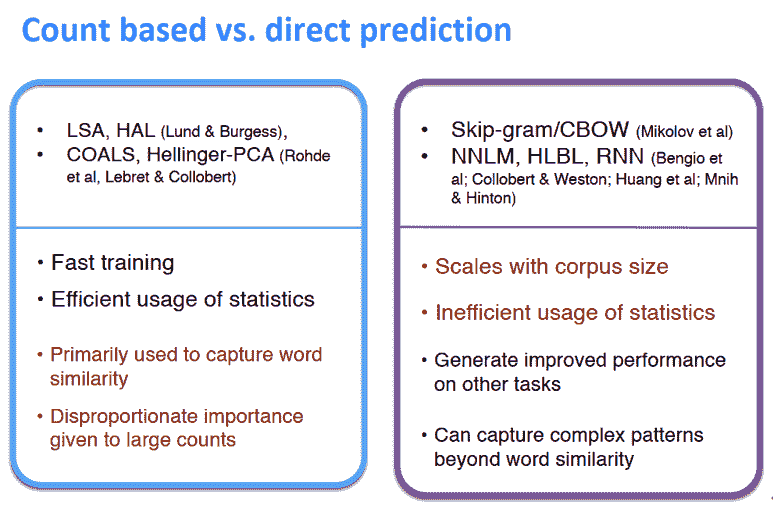

↑↑↑关注后"星标"Datawhale

每日干货 & [每月组队学习](https://mp.weixin.qq.com/mp/appmsgalbum?__biz=MzIyNjM2MzQyNg%3D%3D&action=getalbum&album_id=1338040906536108033#wechat_redirect)，不错过

 Datawhale干货 

**作者：芙蕖，**Datawhale优秀学习者**，东北石油大学**

为了处理语言，需要将文本信息用向量的形式表达。词向量（Word Vector）或称为词嵌入（Word Embedding）就是将词语向量化。常见的生成词向量的神经网络模型有NNLM模型,C&W模型,CBOW模型和Skip-gram模型。

本文目录：   

    1\. 词向量计算方法

*   1.1 Word2Vec的计算

    1.2 Word2Vec中计算方法详解

    1.3 高频词（the）引起的问题

    2. 优化基础

*   2.1 梯度下降

    2.2 随机梯度下降

    3. Word Vector优化过程

*   3.1 SGD引起的稀疏数据

    3.2 两种词向量建模方案

    3.3 训练效率提升方案

    4. 基于统计的单词向量表示

*   4.1 共现矩阵

    4.2 改进思路

    5\. GloVe模型

*   5.1 原理

    5.2 与Skip-Gram、CBOW模型比较

    5.3 步骤

    5.4 如何评估词向量的质量

# **一、词向量计算方法**

### **1.1 word2vec的计算**

对一个中心词，与窗口内的context词出现的概率：


通过极大似然方法最大化整个文本出现的概率：


损失函数：


### **1.2 word2vec中计算方法详解**

假设vocabulary包含m个词，每个词向量长度为n, 对于每一个词，作为中心词(center)和非中心词(outside)时分别使用v和u两个向量表示。在计算完成后将两个向量平均作为最终词向量表示。


对每一个词作为中心词时，计算概率分布。这里假定第4个词作为中心词时，有


其中，d为与m个outside词的点积，由于两个向量的点乘可以表示其相似度，进一步可用于表示其出现的概率大小，从而得到概率表示：


这里原理就很明显了，我们接下来需要做的，就是通过优化问题来更新矩阵U和V，从而使词向量模型需对出现在同一个context中的词赋予较大的概率。

### **1.3 高频词(the)引起的问题**

通过以上计算过程可以知道，如果两个词出现在一个context的次数越频繁，那么他们的词向量就会越接近，这样一来像the这样的高频词，就会使它前后的词向量高度集中，从而导致一些问题。

## **二、优化基础**

### **2.1 梯度下降**

梯度是指多元函数在某个点上升最快的方向，那么梯度的反方向当然就是下降最快的方向。从而得到直观的优化公式：


此处 为损失函数的梯度， 为学习率或步长，是一个超参数。以上是对整个问题的矩阵表示，但在计算过程中，需要一个个的更新参数，所以有对单个参数 表示版本：


在高等数学（同济）中关于梯度的定义如下，及梯度是各个自变量的偏导组成的向量。


### **2.2 随机(stochastic)梯度下降（SGD）**

在2.1中提到的梯度下降，为了计算出参数的梯度，需要代入整个数据集，这样一次更新计算量非常大，因此提出随机梯度下降方法，即每一个更新都是从数据及中随机抽样部分数据（batch), 在词向量计算中对每一个window数据计算一次更新。

*   每次只使用一个window来更新；

*   在一个window中，至多只有2m+1个词，所以梯度很稀疏（下图示例为：center word：like，contextwords：I，learning等）。


我们或许只能更新实际出现过的词的词向量

*   解决方法：要么使用稀疏矩阵只更新U和V的特定的行，或者对每个词向量使用hash；

*   若词向量数量很多，并且要做分布式计算，最好不要进行巨大的更新。

**带有负采样的Skip-grams（HW2）**

1）softmax的正则化因子（分母）计算消耗巨大


2）带有负采样(negative sampling)的Skip-grams：

    训练一对真词（上下文窗口中的中心词和单词）与几个噪声对（中心词和随机词）的二元逻辑回归（在标准的word2vec和HW2中都使用了负采样）

3）需要最大化目标函数


4）使用与HW2更类似的符号表示


选取了k个负样例（选取概率为P(w)=U(w)3/4/Z)

*   the unigram distributionU(w) raised to the 3/4 power；

*   The power makes lessfrequent words be sampled more often。

最大化真实上下文词出现在中心词的概率，最小化随机词出现在中心词的概率

## **三、word vector优化过程**

### **3.1 SGD引起的稀疏数据**

由于使用一个窗口更新一次，由于∇θJt(θ)各个词向量的偏导组成的向量，如果这个词没有出现，其偏导也就为0，因此梯度将非常稀疏。

对应方案：使用稀疏矩阵或者将词hash映射到具体向量，如果是分布式计算，必须避免大量的中间数据在节点之间的传送

### **3.2  两种词向量建模方案**

1）Skip-gram(SG)：给定中心词预测窗口context(outsides)

2）Continous Bag of Words(CBOW)：给定窗口context预测中心词

### **3.3 训练效率提升方案**

*   负采样。目前为止仍然以更简单但是计算量大的传统softmax为主要方案, 即公式2.1中的分母（正则项）。

*   由于经典方案正则化计算量太大，因此我们在作业二中使用负采样方案。其主要思想为：训练一个logistics regression分类器， 判断一个词语对是否来自于同一个context。

*   损失函数：最大化如下函数：


## **四、基于统计的单词向量表示**

### **4.1 共现矩阵（co-occurrence matrix）**

*   统计所有语料当中，任意两个单词出现在同一个窗口中的频率，结果表现为共现矩阵 X

*   直接统计得到的原始矩阵大小为 |V| x |V|

*   实践当中通常对原始统计矩阵施加 SVD（Singular Value Decomposition）来降低矩阵维度


#### **优点：**

*   训练速度快

*   充分利用了全局的统计信息

#### **缺点：**

*   向量空间结构没有达到最优化，在单词相似度任务上表现不好

*   随着字典的扩充，共现矩阵的大小也会改变

*   矩阵维度十分巨大，需要大量的存储空间

*   共现矩阵十分稀疏，其中大部分区域都为0

*   十分依赖大型的语料进行训练

#### **存在的问题：**

*   随着词表的增加而增加

*   维度较高->需要大量存储空间

*   后续分类模型存在稀疏性问题

*   模型缺乏鲁棒性

#### **解决方法：**

使用较低纬度的向量

*   想法：将“大多数”重要信息存储在一个固定的、少量的维度中：一个密集的向量

*   通常为25—100维，与word2vec类似

*   如何减小维度，有以下两种方法：

**1）奇异值分解（SVD）**


2）缩放单元格中的计数（Hacks to X (several used in Rohde et al. 2005)）

功能词出现太频繁，语法有太大的影响：

*   采用min(X, t), with t ≈100

*   直接忽视掉

*   使用皮尔逊相关代替计数，然后将负值设置为0

**对结果的可视化：**




*   左边是基于计数的方法的一些特点：训练快、有效利用了统计信息、初步统计了词的相似性

*   右边是基于预测的方法的一些特点：可以捕获超出单词相似度的复杂模式

### **4.2 改进思路**

只使用一个大小固定且维度较少的稠密向量来存储最重要的信息。现在的问题是，如何才能有效地降低向量的维度呢？

重要信息：共现概率的比值能够编码单词相似度的信息


从这个例子的最后一行中可以看出，x 与 ice 意思更加接近的话，概率比值远大于 1，x 与 steam 意思更加接近的话，概率比值远小于 1；如果 x 的意思既不与 ice 接近也不与 steam 接近，或者既与 ice 接近又与 steam 接近，那么概率比值在 1 附近。

## **五、GloVe模型**

### **5.1 原理**

**功能**：基于语料库构建词的共现矩阵，然后基于共现矩阵和GloVe模型对词汇进行向量化表示。

**输入**：语料库　　

**输出**：词向量

### **5.2 与Skip-Gram、CBOW模型比较**

例如：句子为"dogbarked at the mailman" ，目标单词为’at’

**Skip-gram模型**：Skip-gram模型只关注单个输入/输出元组中的目标词和上下文中的单个单词，输入为[“dog”, “at”]

```
CBOW模型：关注目标单词和单个样本中上下文的所有单词，则输入为：
[["dog","barked","the","mailman"],"at"] 
```

因此，在给定数据集中，对于指定单词的上下文而言，CBOW比Skip-gram会获取更多的信息。Global Vector融合了矩阵分解的全局统计信息和上下文信息。

### **5.3 步骤**

**1）构建共现矩阵**

例如句子为：i love youbut you love him i am sad

包括7个单词：i、love、you、but、him、am、sad

设context= 5，则目标单词的左右长度都为2，以下为统计窗口：

注：中心词为目标单词，窗口内容为目标单词的左右各两个单词。

如：“i"左边无单词，右边有两个单词"love”,“you”,所以窗口内容为[“i”,“love”,“you”]


窗口0、1长度小于5是因为中心词左侧内容少于2个，同理窗口8、9长度也小于5。

以窗口5为例说明如何构造共现矩阵。中心词为love，语境词为but、you、him、i；则执行：


使用窗口将整个语料库遍历一遍，即可得到共现矩阵X。

*   LSA和word2vec作为两大类方法的代表，一个是利用了全局特征的矩阵分解方法，一个是利用局部上下文的方法。

*   GloVe模型将这两中特征合并到一起，即使用了语料库的全局统计（overallstatistics）特征，也使用了局部的上下文特征（即滑动窗口）。为了做到这一点GloVe模型引入了Co-occurrence Probabilities Matrix。

*   目标函数如下：


### **5.4 如何评估词向量的质量**

**5.4.1 Intrinsic（****内部评价）**

*   在特定的子任务上对词向量进行评估（例如评估词向量时候可以正确预测词性标签，或者评估同义词是否具有相似的向量结构）

*   评估速度快，易于计算

*   能够帮助理解这个系统

*   除非与实际任务建立了关联，否则不清楚是否真正有用

**（1） 词向量类比（Word VectorAnalogies）**


通过捕获直观的语义和句法类比问题之后的余弦距离来评价词向量

问题：如果信息不是线性的？

GloVe的可视化


类比评价与超参数


*   训练次数越多越好

*   数据越多越好

**（2） 另一种内部评价**

词向量距离及其与人类判断的关系。

词义与词义歧义

*   大多数单词含有很多意义

*   一个向量能否捕获所有的意义，或者会将意义搞得一团糟

Improving Word Representations Via Global Context AndMultiple Word Prototypes (Huang et al. 2012)

想法：将单词窗口聚集在单词周围，重新训练每个单词，并将其分配给多个不同的集群bank1、bank2等

Linear Algebraic Structure of Word Senses, withApplications to Polysemy (Arora, …, Ma, …, TACL 2018)

*   单词的不同意义存在于标准单词嵌入（如word2vec）中的线性叠加（加权和）中


**5.4.2 Extrinsic（外部评价）**

*   在现实任务中进行评测

*   可能需要很长时间才能得到评估结果

*   有时无法确定具体是什么原因导致任务表现出现差异，因此难以合理地对词向量进行评估

## **下面对Glove模型训练词向量进行实现实战。**

```
# -*- coding: utf-8-*-
"""
word2vec embeddings start with a line with the number of lines (tokens?) and
the number of dimensions of the file. This allows gensim to allocate memory
accordingly for querying the model. Larger dimensions mean larger memory is
held captive. Accordingly, this line has to be inserted into the GloVe
embeddings file.
"""

import os
import shutil
import smart_open
from sys import platform

import gensim

def prepend_line(infile, outfile, line):
   """
   Function use to prepend lines usingbash utilities in Linux.
   (source:http://stackoverflow.com/a/10850588/610569)
   """
   with open(infile, 'r', encoding='UTF-8') as old:
      with open(outfile, 'w', encoding='UTF-8') as new:
         new.write(str(line) + "\n")
         shutil.copyfileobj(old, new)

def prepend_slow(infile, outfile, line):
   """
   Slower way to prepend the line byre-creating the inputfile.
   """
   with open(infile, 'r', encoding='UTF-8') as fin:
      with open(outfile, 'w', encoding='UTF-8') as fout:
         fout.write(line + "\n")
         for line in fin:
            fout.write(line)

def get_lines(glove_file_name):
    """Return the number ofvectors and dimensions in a file in GloVe format."""
    with smart_open.smart_open(glove_file_name, 'r', encoding='UTF-8') as f:
        num_lines = sum(1 for line in f)
    with smart_open.smart_open(glove_file_name, 'r', encoding='UTF-8') as f:
        num_dims = len(f.readline().split()) - 1
    return num_lines, num_dims

# Input: GloVeModel File
# More models can be downloaded from http://nlp.stanford.edu/projects/glove/
glove_file="glove.6B.300d.txt"

num_lines, dims = get_lines(glove_file)

# Output: GensimModel text format.
gensim_file='glove_model2.txt'
gensim_first_line= "{}{}".format(num_lines, dims)

# Prepends theline.
if platform == "linux" or platform == "linux2":
   prepend_line(glove_file, gensim_file, gensim_first_line)
else:
   prepend_slow(glove_file, gensim_file, gensim_first_line)

# Demo: Loads thenewly created glove_model.txt into gensim API.
model=gensim.models.KeyedVectors.load_word2vec_format(gensim_file, binary=False) #GloVe Model

print(model.most_similar(positive=['australia'], topn=10))
print(model.similarity('woman', 'man')) 
```

结果：


**本文电子版* 后台回复 **NLP入门** 获取* 


“点亮在看，星火**燎原**↓