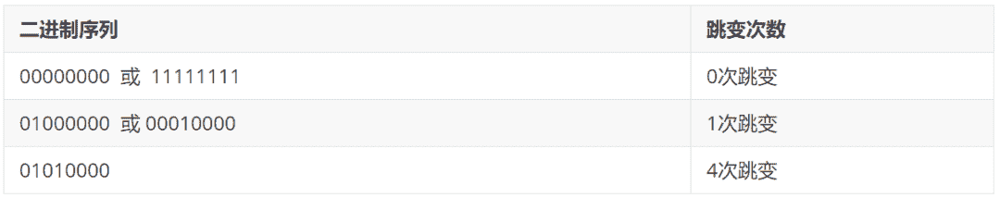

↑↑↑关注后"星标"Datawhale

每日干货 & [每月组队学习](https://mp.weixin.qq.com/mp/appmsgalbum?__biz=MzIyNjM2MzQyNg%3D%3D&action=getalbum&album_id=1338040906536108033#wechat_redirect)，不错过

 Datawhale干货 

**作者：游璐颖，**Datawhale优秀学习者**，福州大学**

计算机视觉在人脸检测领域的应用已经较为成熟，但依然存在较多难点。其中一大难点是光照问题，由于人脸的3D结构，光照投射出的阴影，会加强或减弱原有的人脸特征。如何解决光照问题对人脸检测带来的影响呢？


（本图在较暗环境下拍摄，利用LBP特征的人脸检测后，有效识别了图片中的小姐姐）

LBP特征是常用的方法之一，该方法对诸如光照变化等造成的灰度变化具有较强的鲁棒性，可以减弱光照不均匀对于人脸识别的影响。很多学者都采用adaboost+LBP的方式解决人脸识别问题，被誉为“万能算法”。具体本文将详细讲解：

本文目录：   

    1. 基本LBP

*   1.1 概念理解

    1.2 主要步骤

    2\. 圆形领域的LBP算子

*   2.1 概念理解

    2.2 计算方法

    3. 旋转不变的LBP算子

    4\. 统一化的LBP算子

*   4.1 理论基础

    4.2 统一化的意义

    4.3 收集箱个数计算

    5\. 案例实战

*   5.1 读取图片

    5.2 加载级联文件

    5.3 人脸检测

    5.4 处理脏数据

**一、基本LBP**

**1.1 概念理解**

LBP算子的基本思想是将中心像素的灰度值作为一个阈值，将其邻域内的像素点灰度值进行比较，从而得到二进制编码表示，来表示局部纹理特征。

邻域的类型可分为四邻域、D邻域、八邻域。

*   四邻域：该像素点的上下左右四个位置；

*   D领域：该像素点斜对角线上的四个相邻位置。

*   八邻域：四邻域与D邻域的并集。

*   基本的LBP算子考虑的是像素的八邻域。

LBP表示方法有一个较为明显的特点，它不容易收到图像整体灰度线性变化的影响。也就是说，当图像由于光线的影响使得整体灰度值发生线性均匀变化时，其LBP特征编码是不变的。换句话说，它并不在意整体的灰度变化，而是关注像素之间的相对灰度改变。

例如，在某些情况下，阳光照射强度更低，导致拍摄图像的整体亮度降低，但是实际上每个像素之间的差值仍然是固定的。那么在这种情况下，在图片亮度对LBP特征编码无影响。

**1.2 主要步骤**

使用一个3*3的矩形，处理待判断像素点及其邻域之间的关系。

**步骤1：二值化过程**

将像素点A的值与其八邻域处的像素点逐一比较：

1.  如果A的像素值大于其邻近点的像素值，则得到0。

2.  如果A的像素值小于其邻近点的像素值，则得到1。

此过程以中心像素的灰度值为阈值，与邻域的8个灰度值进行比较。

最后，根据顺时针方向，将像素点A与周围8个像素点比较所得到的0、1值连接起来，得到一个8位的二进制序列，然后将该二进制序列转换为十进制数字作为点A的LBP值。

如下图LBP原理示意图所示，在左侧 的区域中，中心点的像素为76，并设置它为此次的阈值。然后现在我们对该中心点的8邻域做进一步的处理。

*   将中心点周围的8个位置中灰度值大于76的像素点处理为1。例如，其邻域中像素值为128、251、99、213的点，都被处理为1，填入对应的像素点位置上。

*   将中心点周围的8个位置中灰度值值小于76的像素点处理为0。例如，其邻域中像素值为36、9、11、48的点，都被处理为0，填入对应的像素点位置上。

*   最后得到的二值结果如右图所示。


**步骤2：中心点处理**

完成上述的二值化过程之后，例如从像素点的正上方开始将得到的二值结果进行序列化，所以在上述例子中，二进制序列结果为“01011001”。

最后再将该二进制序列结果转换为对应的十进制数“89”，作为当前中心点的像素值，如下图所示。


**步骤3：整合处理**

上述过程仅仅是对一个像素点的处理过程，结果是一个LBP“编码”。所以对于某幅图像而言，需要进行逐行扫描完成每个像素点数值的更新。我们将采用分块的形式进行编码。其编码过程如下：

假设此时有一幅100*100大小的图像。

1.  在初始化时，将该图划分为10*10个Block，其中每个Block的大小为10*10。

2.  对每个Block的像素点提取其LBP特征，并建立一个计算某个“数字”出现的频率统计直方图。

3.  结束时，将生成10*10个统计直方图，选择性地对直方图进行规范化处理。

4.  连接所有小块的（规范化的）直方图，整合后构成了整个窗口的特征向量，用来描述这幅图片。

5.  得到特征向量之后，就可以使用各类算法对该图像进行特定的处理了。

**二、圆形邻域的LBP算子**

**2.1 概念理解**

基本LBP算子可以被进一步推广到使用不同大小和形状的邻域。采用圆形的邻域并结合双线性插值运算使得我们可以获得任意半径和任意数目的邻域像素点。该圆形邻域可以用 表示，其中P表示圆形邻域内参与运算的像素点个数，R表示邻域的半径。


**2.2 计算方法**

假设此时给出了一个半径为2的8邻域像素的圆形邻域，图中每个方格对应一个像素。

1.  处在方格中心的邻域点（左、上、右、下4个黑点）：以该点所在方格的像素值作为它的值

2.  不在方格中心的邻域点（斜45°方向的4个黑点）：线性插值法确定其值。

如下图所示，若现在我们想计算左上角空心点的值，此时它并不在任何像素点内：


可以发现，在空心点的上方，距离 处，有一个十叉点1，下方还有一个十叉点2。所以我们应首先分别计算这两个十叉点1和2的水平插值。

其中点1的值根据与之处于同一行的 以及 的线形插值得到。

同理计算出点2的值如下：

再计算出点1和点2竖直的线性插值。

如此，计算出各邻域像素点的灰度值之后，仍然使用基础LBP算子的方法，得到二进制序列后转换为十进制数等操作。

**三、旋转不变的LBP算子**

根据上述介绍发现，像素点的二进制序列将由于图像的旋转而改变，因此它并不具有旋转不变性。那么，应该如何解决这样的情况呢？

此后，Maenpaa等人又将 LBP 算子进行了扩展，提出了具有旋转不变性的 LBP 算子，即不断旋转圆形邻域得到一系列初始定义的 LBP 值，取其最小值作为该邻域的 LBP 值。

如下图所示，黑点代表0，白点代表1，假设初始的灰度值为255。经过7次旋转，得到7个不同的二进制序列，并分别转换为相应的十进制数，最后取到最小值“15”为最终中心点的LBP值，且序列为“00001111”。


**四、统一化的LBP算子**

**4.1 理论基础**

由于LBP直方图大多都是针对图像中的各个分区分别计算的，对于一个普通大小的分块区域，标准LBP算子得到的二进模式数目（LBP直方图收集箱数目）较多，而实际的位于该分块区域中的像素数目却相对较少，这将会得到一个过于稀疏的直方图，使得该直方图失去统计的意义。

例如，在5×5邻域内对20个像素点进行采样，有 种二进制模式，数量过于庞大了。所以，我们想到了一种特殊的方法，来减少一些冗余的LBP模式。

研究者们提出了统一化模式（Uniform Patterns），再次改进了LBP算子的理论。

**1\. 跳变：**

二进制序列中存在从1到0或者0到1的转变，可以称作是一次跳变。下面我们将举例说明跳变次数的计算：



**2\. 统一化模式：**

对于一个局部二进制模型而言，在将其二进制位串视为循环的情况下，如果其中包含的从0到1或者从1到0的转变不多于2个，则称为统一化模式。所以上例中的模式“01010000”就不属于统一化模式。

**3\. 混合模式：**

序列中包含的跳变为2次以上的，可以称为混合模式。

**4.2 统一化的意义**

在随后的LBP直方图的计算过程中，只为统一化模式分配单独的直方图收集箱，而所有的非统一化模式都被放入一个公用收集箱中，使得LBP特征的数目大大减少。

一般来说，保留的统一化的模式往往是反映重要信息的那些模式，而那些非统一化模式中过多的转变往往由噪声引起，没有良好的统计意义。

假设图像分块区域大小为 ，则像素的总数为360个。如果采用8邻域像素的标准LBP算子，收集箱（特征）数目为 个，平均到每个收集箱的像素数目还不到2个。但是在统一化LBP算子的收集箱数目为59个（58个统一化模式收集箱加上1个非统一化模式收集箱），平均每个收集箱中将含有6个左右的像素点，因此更具有统计意义。

**4.3 收集箱个数计算**

将模式进行统一化后，实现了模式数量的降维，从之前的 转换成为了 。笔者翻看了很多博客，并没有详细的说明最后的维度是怎么计算的，也就是我们收集箱的个数计算。那么这节我们就来讨论一下。

接下来对8位二进制序列下的收集箱个数进行计算：

*   0个转变（2个）：

11111111，00000000。

*   1个转变（7 x 2 = 14）：01111111，00111111，00011111，00001111，00000111，00000011，00000001。

*   2个转变（42）：

6 x 2：01000000，00100000，00010000，00001000，00000100，00000010

5 x 2：01100000，00110000，00011000，00001100，00000110

4 x 2：01110000，00111000，00011100，00001110

3 x 2：01111000，00111100，00011110

2 x 2：01111100，00111110

1 x 2：01111110

值得注意的是，上面的“ ”中的2表示有两种情况，即反码和原码两种，这样便得到了58种统一化的编码，比原来的256种减少了很多。

总结一下，经过上面的计算知道，这种统一化后的编码个数可以用公式（4）表示。

**五、案例实战**

**5.1 读取图片**

这次仍然是把待读取的照片放入img包中，图片名为cv_3.jpeg。

```
import cv2
import matplotlib.pyplot as plt

filepath = "../img/cv_3.jpeg"

# 读取图片，路径不能含有中文名，否则图片读取不出来
image = cv2.imread(filepath)
# 显示图片
plt.imshow('image', image)
plt.show() 
```

这次的待检测图片：


**5.2 加载级联文件**

```
# 需要是Anaconda虚拟环境下的绝对路径
cascade_path = "/Users/sonata/opt/anaconda3/share/opencv4/lbpcascades/lbpcascade_frontalface_improved.xml"
# 下载到了本地使用

# 加载人脸级联文件
faceCascade = cv2.CascadeClassifier(cascade_path) 
```

**5.3 人脸检测**

OpenCV给我们使用特征数据的方法：

```
def detectMultiScale(self, image, scaleFactor=None, minNeighbors=None, flags=None, minSize=None, maxSize=None) 
```

```
params:
  1\. scaleFactor: 指定每个图像比例缩小多少图像
  2\. minNeighbors: 指定每个候选矩形必须保留多少个邻居，值越大说明精度要求越高
  3\. minSize：检测到的最小矩形大小
  4\. maxSize: 检测到的最大矩形大小 
```

所以我们使用此方法检测图片中的人脸

```
# 灰度转换
gray = cv2.cvtColor(img, cv2.COLOR_BGR2GRAY)

# 人脸检测
faces = faceCascade.detectMultiScale(gray, 1.1, 2, minSize=(100, 100))
print(faces)  # 识别的人脸信息

# 循环处理每一张脸
for x, y, w, h in faces:
    cv2.rectangle(img, pt1=(x, y), pt2=(x+w, y+h), color=[0, 0, 255], thickness=2)

img = cv2.cvtColor(img, cv2.COLOR_BGR2RGB)
plt.imshow(img)
plt.show() 
```

得到检测结果如下：


**5.4 处理脏数据**

我们发现除了检测到人脸数据，还有一些其他的脏数据，这个时候可以打印检测出的人脸数据位置和大小结果如下：


从大小中我们看到最大的两个矩形，刚好是人脸数据，其余都是脏数据，那么继续修改函数参数

```
faces = faceCascade.detectMultiScale(gray, 1.1, 2, minSize=(150, 150))
# 把最小矩形大小改成150 
```

这样我们就可以把脏数据给除去了：


本文电子版 后台回复 **LBP特征** 获取


“感谢你的分享，点赞，在看三**连**↓