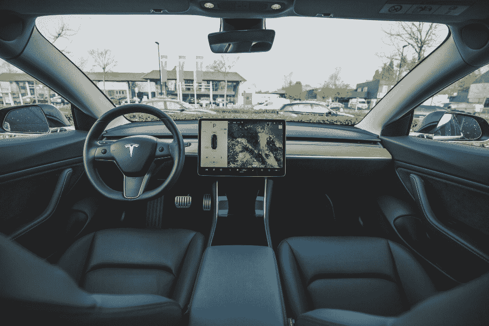
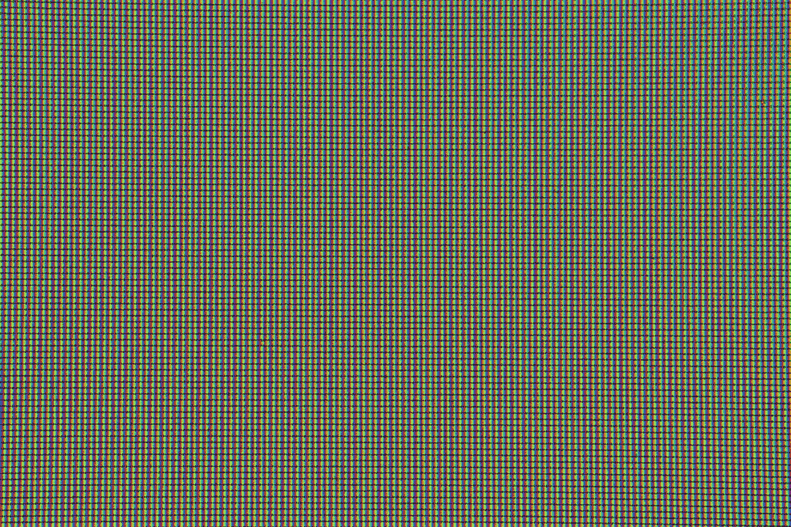
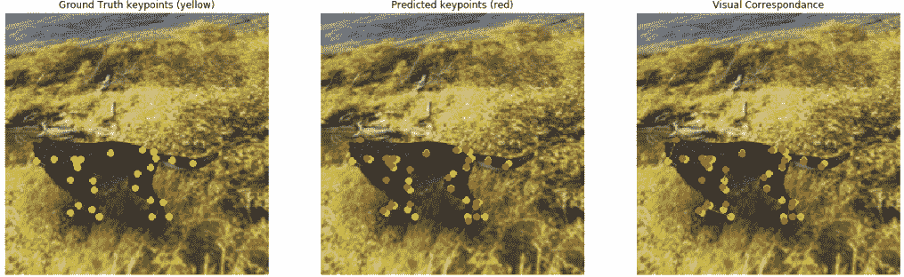

↑↑↑关注后"星标"Datawhale

每日干货 & [每月组队学习](https://mp.weixin.qq.com/mp/appmsgalbum?__biz=MzIyNjM2MzQyNg%3D%3D&action=getalbum&album_id=1338040906536108033#wechat_redirect)，不错过

 Datawhale推荐 

******作者：Richmond Alake，**来源：机器之心********

> 人工智能就业市场持续火热，越来越多的学子投身这一领域。然而，攻读计算机视觉和机器学习研究生需要哪些先决条件？你将学到哪些知识？攻读机器学习硕士是一种怎样的体验？英国萨里大学机器学习与计算机视觉专业硕士 Richmond Alake 对以上问题做了较为全面的解答。

****攻读机器学习硕士的先决条件****

在攻读机器学习高等学位的过程中需要选定一些研究课题，这些课题反映了未来你在机器学习领域发展的专业方向。

机器学习领域的任何一门课程都涵盖了许多知识量。因此，本文作者攻读的硕士学位会首先确保学生满足以下先决条件，然后再进行授课。

*   对线性代数和微积分（微分 / 优化）有充分的理解；

*   统计和概率学基础；

*   编程语言相关背景；

*   本科阶段毕业于计算机科学、数学、物理或电子与机械工程等专业。

进入正题，本文作者将一一介绍他在攻读机器学习硕士阶段都学到了什么。

****计算机视觉****

作者首先介绍攻读机器学习硕士过程中遇到的最强大课程模块：计算机视觉。计算机视觉和深度学习是作者本文非常感兴趣的机器学习领域。

各种媒体都对计算机视觉技术在过去几十年中的进步赞不绝口。面部识别系统的横空出世是该领域必须要提到的一大成就。在一些主要国际机场、银行和政府机构都可以发现面部识别系统的身影。

就作者本人而言，他在攻读硕士学位的过程中对计算机视觉的研究是非常有条理的，即并不会一开始就直接实现并分析最先进的技术。

事实上，你需要往回倒退几步，从学习最基础的图像处理技术知识开始，而这些技术在人们今天使用的先进计算机视觉技术之前就被开发了出来。

在深度学习课程中，作者了解到，卷积神经网络（CNN）的较低层从输入图像中学习到低级模式，比如线条和边缘。但在 CNN 被引入到计算机视觉领域之前，就已经有了一些基于启发式的技术被用于从图像中检测出感兴趣区域（ROI）以及特征提取。

因此，作者学习了基于启发式的技术的工作原理，并且在实际应用中运用到了这些知识，在计算机视觉方面的研究确保他了解了机器学习领域的基础。

以下是作者在研究计算机视觉的过程中学到的一些关键话题和术语：

1.尺度不变特征变换（Scale Invariant Feature Transform, SIFT）：这是一种被用于生成图像的关键点描述子（特征向量）的计算机视觉技术。生成的描述子包含一些特征信息，如边缘、角、团块等。描述子还可以用于检测不同尺度和失真的图像中的对象。SIFT 已经被广泛用于目标识别、手势识别、目标跟踪等应用中。SIFT 技术的关键之处在于它检测到的特性对于任何仿射变换（比如放缩、平移和旋转）都是不变的。SIFT 原始论文链接如下：https://www.cs.ubc.ca/~lowe/papers/ijcv04.pdf。 

2.定向梯度直方图（Histogram of Orientated Gradients, HOG）：这是一种被用来从图像中提取特征的技术。提取到的特征是图像中边和角提供的信息，更具体地说是凸显中的对象。简而言之，该技术识别图像中边缘（梯度）、角、线条的位置，获取边缘的方向信息。HOG 描述子会生成一个直方图，该直方图包含从图像中检测到的边缘和方向信息的分布信息。计算机视觉应用和图像处理领域中都能看到这种技术的身影，更详细信息请参阅：https://www.learnopencv.com/histogram-of-oriented-gradients/。 

3.主成分分析（Principal Component Analysis, PCA）：这是一种用于降低特征丰富的数据集维度的算法。降维是通过将数据点从较高维度投影到维度较低的平面来实现的，它仍然保留了信息，并最小化了信息损失。

此外，其它值得一提的话题还有：

*   线性插值（linear interpolation）

*   无监督聚类（K - 均值）

*   视觉词袋模型（视觉搜索系统）

那么作者在学习早期有哪些开发性研究呢？

在早期，他开始开发一些基于计算机视觉技术的应用。物体分类是一个比较热门的话题，同时也比较容易学习一些关于它的基本知识和实现方法。具体而言，他想要在 Matlab 环境下开发一个视觉搜索系统。

Matlab 是一种用于高效数值计算和矩阵处理的编程语言，并且 Matlab 程序库配备了一套算法和可视化工具。

由于作者过去具有 JavaScript、Java、Python 等语言环境下的开发经验，他很快就学会了 Matlab 编程语法，从而可以专注于计算机视觉方面的研究。

**更多视觉搜索系统的信息**

作者要实现的视觉系统是相当基础的，其工作原理是：用户向系统传入一张查询图像，然后系统返回的结果是一组与输入查询图像相似的图像。值得一提的是，该系统包含一个存储图像的数据库，系统从中提取返回的结果图像（输入查询图像，输出结果图像）。

这个视觉系统没有使用任何花哨的深度学习技术，而是使用了前文提到的一些传统的机器学习技术。

你只需将一个 RGB 图像转换成灰度图，然后在图像上施加一个特征提取器；之后，系统就会提取出一个图像描述子，并将其表征在一个 N 维特征空间上。在这个特征空间中，你可以通过计算两个 N 维数据点之间的欧氏距离来得到相似的图像。

**更深层次的理解和应用**

理解计算机视觉并不仅仅局限于处理图像，人们期望在视频中也用到这些算法和技术。实际上，视频也就是图像序列，所以在输入数据的准备和处理方面，你并不需要学习任何新的东西。

如果你使用的是 YOLO、RCNN 这样的目标检测框架，在一系列图像中进行目标跟踪看起来就非常简单。但是要认识到，进行计算机视觉研究并不只是在预训练好的网络基础上进行调优。在这里，你需要理解该领域在过去几年中是如何发展的，而获得扎实理解的最佳方法是按照时间顺序对各种传统技术进行综述。

因此，对于目标跟踪任务，作者学习了下面几个话题：

*   团块追踪模块（Blob trackers）

*   卡尔曼滤波器

*   粒子滤波器

*   马尔科夫过程

**与计算机视觉工程师的相关性**

实际上，本文作者目前还没有使用任何传统的机器学习分类器，也不会在近期使用它们。

但是为了让读者了解前文提到的技术与成为计算机视觉工程师有多大的相关性，作者以自动驾驶汽车、车牌识别器和车道探测器为例进行展示说明，这些都结合了前文讨论过的一到两种方法。

**深度学习**

深度学习技术是对计算机视觉研究的自然延伸。一些深度学习话题已经被包含在了计算机视觉模块中，而其它的深度学习话题是对传统计算机视觉技术的扩展或改进。

深度学习话题的教学与作者的计算机视觉研究相类似。也就是说，在转向学习高级话题和应用开发之前，要对该领域的基础知识有扎实的理解。

深度学习研究从理解最基本的图像构成单元（像素）开始。你很快就会了解到，数字图像是一个包含许多像素的网格。

在理解了图像的最基本的基础之后，你将继续学习如何在系统内存中存储图像。「Framebuffer」指的是像素在系统内存中存储的位置（大多数 MOOC 都不会讲这一点）

此外，作者还学习了关于摄像设备如何捕获数字图像知识。他不得不承认，对智能手机摄像头捕获图像的方式有一定的直观理解是很棒的。

接下来他快速介绍了一些更酷的知识。

首先是卷积神经网络。如果你不了解卷积神经网络（CNN），你就无法学习深度学习，它们是密切相关的。

作者的研究介绍了 CNN 在过去 20 年中诞生并发展的时间线（从 LeNet-5 到 RCNN），以及它们在取代传统工作流程完成物体识别等典型计算机视觉任务的作用。

作者的研究中介绍了对于深度学习早期提出的不同 CNN 架构的探索。通过对 AlexNet、LeNet、GoogLeNet 等具体架构的研究，他深入理解了卷积神经网络的内部构造，以及它们在解决诸如目标检测、识别和分类等任务中的应用。

此外，作者学到的一项重要技能是：如何阅读研究论文。

阅读研究论文不是老师直接传授给你的技能。如果你对深度学习和其他任何研究都持严谨的态度，那么很有必要了解信息和研究的来源。使用深度学习框架预训练好的模型是非常容易的。尽管如此，如果想从事先进的研究工作，你还是应该了解每个架构的技术和组件的内在细节，而只有在研究论文中才能找到这些信息。

以下是作者总结的深度学习模块中所涉及的一些话题：

*   多层感知机（Mutiplayer Perceptron, MLP）：多层感知机是一些连续堆叠的若干层感知器模型。MLP 由一个输入层、一个或多个被称为隐藏层的 TLU、以及最终的输出层组成；

*   神经风格迁移（NST）：这是一种利用深度卷积神经网络和相关算法从一张图像中提取内容信息，并从另一张参考图像中提取风格信息的技术。在提取了风格和内容信息之后，会生成一个组合图像，这里生成图像的内容和风格来自于不同的图像；

*   循环神经网络（RNN）和 LSTM：它们是神经网络架构的变体，可以接受任意大小的输入，产生随机大小的输出数据。RNN 神经网络架构可以学习时序关系； 

*   人脸检测：用于实现图像和视频中的人脸自动识别和定位的系统。人脸检测在面部识别、摄影技术、运动捕捉等领域有广泛的应用；

*   姿态估计：从提供的数字资源（如图像、视频或一段图像序列）中推理出身体主要关节位置的过程。各种姿态估计技术被用于动作识别、人机交互、虚拟现实和 3D 图形游戏资源创建、机器人等应用中；

*   目标识别：识别与目标对象相关联的类的过程。目标识别和目标检测这两种技术的最终结果和实现方法是类似的。虽然在各种各样的系统和算法中，目标识别过程是先于目标检测进行的；

*   目标追踪：在一段时间内的图像序列中识别、检测并跟踪一个感兴趣目标的方法。在监控摄像头和交通监控设备的系统中存在诸多目标跟踪应用；

*   目标检测：目标检测是一种可以识别图像中是否存在特定目标以及其位置的系统。请注意，需要检测的对象可能是单数，也可能不止一个。

其它值得注意的主题和子话题还包括神经网络、反向传播、CNN 网络架构，超分辨率、手势识别、语义分割等等。

**与计算机视觉工程师的相关性**

这基本上就是本文作者所从事的工作。到目前为止，他已经将人脸检测、手势识别、姿势估计、语义分割模型整合到了游戏边缘计算设备上。

具体来说，在作者当前的工作中，他已经实现、训练并评估了大量的深度学习模型。如果你想要紧跟前沿算法、工具，并与先进的公司合作，那么深度学习就是一个可以让你走在人工智能实际商业发展前沿的领域。

**论文**

撰写硕士论文旨在使你能够使用所有学到的技能、知识和直观感受来设计一个针对现实生活中问题的解决方案。

本文作者的论文是基于计算机视觉技术对四足动物进行运动分析，其中用到的关键性计算机视觉技术是姿态估计。

这是他第一次接触深度学习框架，所以决定以使用卷积神经网络的深度学习解决方案来进行运动分析。

在深度学习框架的选择上，他曾来回使用 Caffe 和 Keras，但最终选择了 PyTorch，因为该框架提供了与任务相关的预训练模型。作者使用的编程语言为 Python。

以下是作者在撰写论文的过程中学到的一些东西:

*   迁移学习 / 调优

*   Python 编程语言

*   C# 编程语言

*   姿态估计的理论知识

*   使用 Unity3D 进行仿真的知识

*   Google 云平台的使用经验

**关于运动分析研究的更多信息**

运动分析指的是从清晰的运动图像中获取运动的信息和细节，或者表示序列到序列的运动描述的图像排序。利用运动分析的应用和操作可以得到有关运动感知和关键点定位的最直接细节信息。复杂的应用程序使得我们可以利用序列相关的图像逐帧追踪目标对象。

目前，在利用时序数据时，运动分析及其各种各样的应用形式带来了显著的好处和丰富的信息。不同行业（如医疗保健、制造业、机械、金融等）都受益于通过运动分析提供的结果和信息。在这些行业中，运动分析的各种用例和方法可以解决问题或者为消费者创造价值。

在整个行业中，运动分析的多样性间接地引入了各种各样的运动分析任务子集，如姿态估计、目标检测、目标追踪、关键点检测，以及其它不同的子集。

**关于论文的更多信息**

本文作者的硕士论文提出了一种利用计算机视觉和机器学习技术进行运动分析的方法。该方法利用四足动物合成图像数据集训练了一个预训练好的关键点检测网络。

Keypoint-RCNN 是 PyTorch 程序库的内置模型，它扩展了原始的 Fast-RCNN 和 Faster-RCNN 的功能。具体来说，论文中的方法修改了在 COCO 2017 目标检测和分割数据集上预训练的 Keypoint-RCNN 神经网络架构，并利用合成的数据集对最后一层进行了重训练。

通过扩展人体 17 个关节的关键点检测基线框架，作者展示了该框架的一种扩展变体，它可以预测若干生成的带有 26 个关节的四足动物的主要关节位置。

作者采用定量和定性评价策略，展示了改进后的 Keypoint-RCNN 架构在预测人工四足动物关键点时的视觉和度量性能。

*论文部分实验结果。*

**紧跟最新研究，持之以恒地学习**

机器学习领域正发生着日新月异的变化，本文作者的课程学习内容对应了该领域 2018-2019 年的发展现状。现在到了 2020 年，我们已经看到机器学习对其它领域的巨大贡献。所以，如果你参加了一门机器学习课程，并且学习到了本文作者在这篇文章中并没有提到的话题或学科领域，请不要感到惊讶。

不要忘记，在人工智能领域中，你不仅仅需要学习创建模型。作为一个机器学习从业者，你必须紧跟最新的研究，所以要不断学习。

*原文链接：https://towardsdatascience.com/what-i-learnt-from-taking-a-masters-in-computer-vision-and-machine-learning-69f0c6dfe9df*

“为沉迷学习点**赞**↓