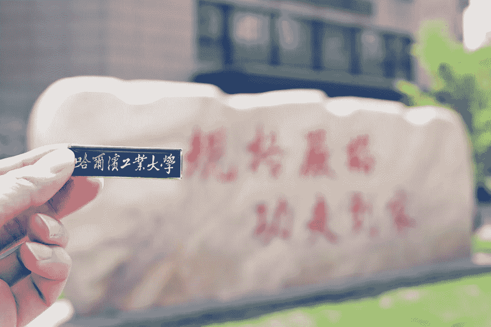
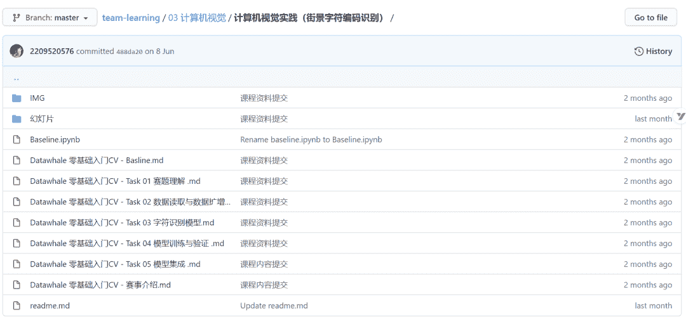
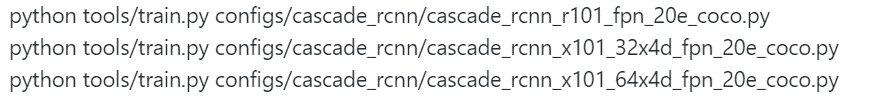
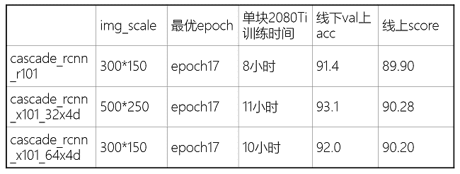
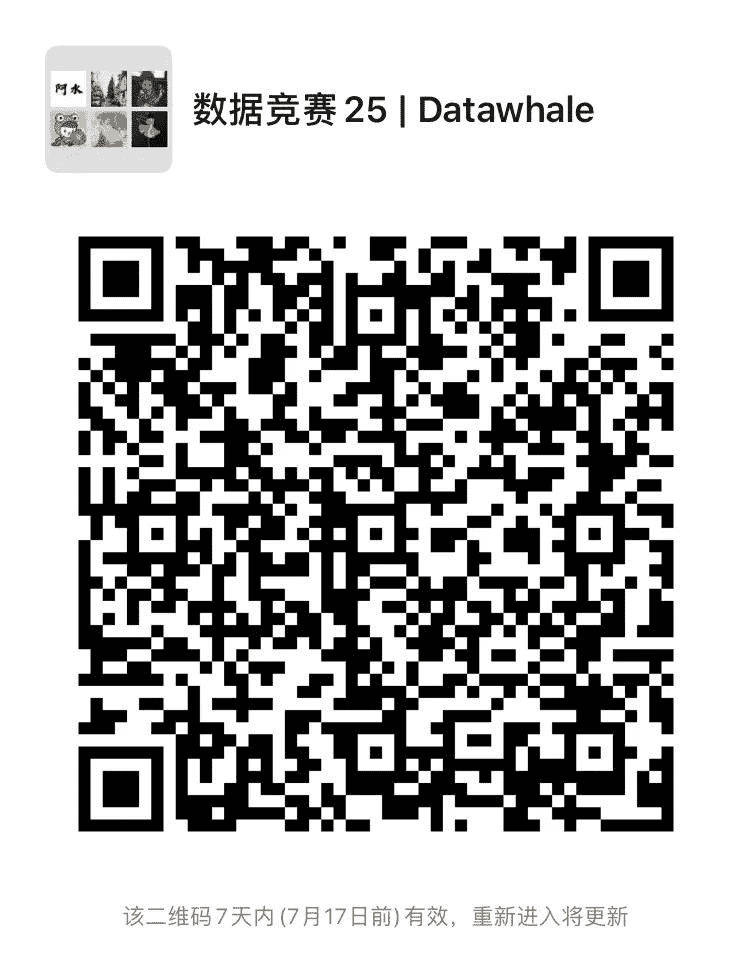

↑↑↑关注后"星标"Datawhale

每日干货 & [每月组队学习](https://mp.weixin.qq.com/mp/appmsgalbum?__biz=MzIyNjM2MzQyNg%3D%3D&action=getalbum&album_id=1338040906536108033#wechat_redirect)，不错过

 Datawhale干货 

**作者：刘钰舒，哈尔滨工业大学研一**

我是来自HIT的刘钰舒，因为我也是新手，我这个做的特别简单，以下分享不涉及单模调优，大概只是优化了一下输入输出...大佬们见笑啦。我这次分享的是一个适合新手的0.92+的上分经验，初赛排名11/1787。（现在研一在读，对cv和上分感兴趣的话，文末可以加我钉钉，一起成为战友呀）



**一、赛题背景**

赛事来自阿里云天池举办的「零基础入门CV赛事」：街景字符编码识别。赛事地址：

http://suo.im/64v8QF


针对这个赛事，Datawhale组织成员也给出了开源教程，从赛题理解、数据读取与扩增、模型构建、模型训练到模型集成五个方面，帮助我们走完赛事的全流程，供学习参考。

*开源教程地址：http://suo.im/5WYEd6*



# **二、核心思路**

用Cascade R-CNN做目标检测，分别训练三个模型

*   cascade_rcnn_r101

*   cascade_rcnn_x101_32x4d

*   cascade_rcnn_x101_64x4d

三个模型结果一起做NMS

**三、技巧**

1.  试了好几个网络，Cascade R-CNN似乎是mmdetection里效果最好的，啥也不改直接跑单模0.88+；

2.  比赛提供的数据集划分方式是3万张训练，1万张验证，可以将验证集里的数据也加入训练集一起训练，单模可提升0.01~0.02；

3.  目标检测的网络也可以做模型融合，每次训练前重新随机划分训练集和验证集，这样融合后相当于将全部数据用于训练，此外每次训练也可以将图片resize成不同大小，以训练不同尺度的网络，融合后可以在单模基础上提升0.02~0.03。

## **四、代码**

## **4.1 划分数据集**

## 先说说重新划分数据集，rename_val.py：因为验证集和训练集图片重名，放在一起训练需要先将验证集图片重命名

```
import os

path = 'data/mchar_val/mchar_val'
files = os.listdir(path)

for file in files:
        old = os.path.join(path,file)
        index = file.split('.')[0]
        index = '03' + index[2:]
        newpic = f"{index}.png"
        new = os.path.join(path,newpic)
        os.rename(old,new) 
```

split_train_val.py：随机划分90%的数据训练，10%的数据验证

```
import os
import json
import random

image_path1 = "data/mchar_train (复件)/mchar_train"
image_path2 = "data/mchar_val/mchar_val"

d={}
d['trainval'] = []
d['valval'] = []

piclist = os.listdir(image_path1)
for pic in piclist:
    r=random.random()
    if r<=0.1:
        d['trainval'].append(pic)

piclist = os.listdir(image_path2)
for pic in piclist:
    r = random.random()
    if r <= 0.1:
        index = pic.split('.')[0]
        index = '03' + index[2:]
        newpic = f"{index}.png"
        d['valval'].append(newpic)

print('trainval:',len(d['trainval']))
print('valval:',len(d['valval']))

with open('split.json','w') as f:
    json.dump(d,f) 
```

preprocess.py：把划分后的新数据集做成coco数据集那个格式

```
import os
import json
from PIL import Image

image_path2 = "data/mchar_val/mchar_val"
json_path2 = "data/mchar_val.json"

image_path1 = "data/mchar_train (复件)/mchar_train"
json_path1 = "data/mchar_train.json"

split_path = "split.json"

with open (split_path) as f:
    split_d = json.load(f)
smalllist = split_d['trainval']
largelist = split_d['valval']

d1 = {}
d1['info'] = {}
d1['licenses'] = []
d1['images'] = []
d1['annotations'] = []
d1['categories'] = []

d2 = {}
d2['info'] = {}
d2['licenses'] = []
d2['images'] = []
d2['annotations'] = []
d2['categories'] = []

# categories
for i in range(1,10):
    temp = {}
    temp['supercategory'] = str(i)
    temp['id'] = i
    temp['name'] = str(i)
    d1['categories'].append(temp)
    d2['categories'].append(temp)
temp = {}
temp['supercategory'] = str(0)
temp['id'] = 10
temp['name'] = str(0)
d1['categories'].append(temp)
d2['categories'].append(temp)

"""
处理train
"""
# images
piclist = os.listdir(image_path1)
for pic_name in piclist:
    pic_path = os.path.join(image_path1, pic_name)
    w,h = Image.open(pic_path).size
    temp = {}
    if pic_name == '000000.png':
        temp['id'] = 0
    else:
        temp['id'] = int(str(pic_name.split('.')[0]))
    temp['file_name'] = pic_name
    temp['width'] = w
    temp['height'] = h
    if pic_name in split_d['trainval']:
        d2['images'].append(temp)
    else:
        d1['images'].append(temp)

index = 0
#annotations
with open (json_path1) as f:
    load_dic = json.load(f)
    for pic_name in load_dic.keys():
        heightlist = load_dic[pic_name]['height']
        labellist = load_dic[pic_name]['label']
        leftlist = load_dic[pic_name]['left']
        toplist = load_dic[pic_name]['top']
        widthlist = load_dic[pic_name]['width']

        n = len(labellist)
        for i in range(n):
            box = [leftlist[i],toplist[i],widthlist[i],heightlist[i]]
            temp = {}
            if pic_name == '000000.png':
                temp['image_id'] = 0
            else:
                temp['image_id'] = int(str(pic_name.split('.')[0]))
            temp['segmentation'] = []
            temp['iscrowd'] = 0
            if labellist[i] == 0:
                temp['category_id'] = 10
            else:
                temp['category_id'] = labellist[i]
            temp['id'] = index
            index += 1
            temp['bbox'] = box
            temp['area'] = widthlist[i]*heightlist[i]

            if pic_name in split_d['trainval']:
                d2['annotations'].append(temp)
            else:
                d1['annotations'].append(temp)

"""
处理val
"""
# images
piclist = os.listdir(image_path2)
for pic_name in piclist:
    pic_path = os.path.join(image_path2, pic_name)
    w,h = Image.open(pic_path).size
    temp = {}
    temp['id'] = int(str(pic_name.split('.')[0]))
    temp['file_name'] = pic_name
    temp['width'] = w
    temp['height'] = h
    if pic_name in split_d['valval']:
        d2['images'].append(temp)
    else:
        d1['images'].append(temp)

#annotations
with open (json_path2) as f:
    load_dic = json.load(f)
    for pic_name in load_dic.keys():
        heightlist = load_dic[pic_name]['height']
        labellist = load_dic[pic_name]['label']
        leftlist = load_dic[pic_name]['left']
        toplist = load_dic[pic_name]['top']
        widthlist = load_dic[pic_name]['width']

        n = len(labellist)
        for i in range(n):
            box = [leftlist[i],toplist[i],widthlist[i],heightlist[i]]
            temp = {}
            indexno = pic_name.split('.')[0]
            indexno = '03' + indexno[2:]
            newpic_name = f"{indexno}.png"
            temp['image_id'] = int(str(newpic_name.split('.')[0]))
            temp['segmentation'] = []
            temp['iscrowd'] = 0
            if labellist[i] == 0:
                temp['category_id'] = 10
            else:
                temp['category_id'] = labellist[i]
            temp['id'] = index
            index += 1
            temp['bbox'] = box
            temp['area'] = widthlist[i]*heightlist[i]

            if newpic_name in split_d['valval']:
                d2['annotations'].append(temp)
            else:
                d1['annotations'].append(temp)

print("train:",len(d1['images']))
print("val:",len(d2['images']))

with open("data/newtrain.json","w") as f:
    json.dump(d1,f)
with open("data/newval.json","w") as f:
    json.dump(d2,f) 
```

**4.2 模型训练**

然后预处理阶段就结束了，就可以开始训练啦，这里主要用的是mmdetection，主要进行了以下操作：

*   mmdetection/mmdet/datasets/coco.py里的类别要记得改成0到9；

*   mmdetection/configs/base/datasets/coco_detection.py里的文件路径需要修改；

*   img_scale也要改，我试了一下300x150和500x250都挺好的，虽然大佬告诉我这里应该写2的冥，比如256x128和512x256这样，我也不懂了；

*   mmdetection/configs/base/schedules/schedule_1x.py中把训练的轮数写多一点，我试的大概是17轮比较好。

训练的话用的这三个：





**4.3 模型融合**
比如下面这个是单模的检测代码，需要把结果写入一个json，做成以下格式：

简单的说就是把单模测出来的每一个框的坐标置信度和标签都存起来，才能做后续的多模型NMS。

inference_demo.py：单模的测试并且把结果json和csv存起来

```
#!/usr/bin/env python
# coding: utf-8

from mmdet.apis import init_detector, inference_detector, show_result_pyplot
import mmcv
import os
import pandas as pd
import json

config_file = './configs/cascade_rcnn/cascade_rcnn_r101_fpn_20e_coco.py'
# download the checkpoint from model zoo and put it in `checkpoints/`
checkpoint_file = './work_dirs/cascade_rcnn_r101_fpn_20e_coco/epoch_17.pth'

# build the model from a config file and a checkpoint file
model = init_detector(config_file, checkpoint_file, device='cuda:0')

d = {}

df = pd.DataFrame(columns=['file_name','file_code'])
image_path = "data/mchar_test_a/mchar_test_a/"
piclist = os.listdir(image_path)

piclist.sort()
index = 0
for pic_name in piclist:
    index += 1
    if index % 1000 == 0:
        print(f"{index}/40000")
    pic_path = os.path.join(image_path, pic_name)
    result = inference_detector(model, pic_path)
    boxes = []
    for i in range(10):
        for box in result[i]:
            copybox = box.tolist()
            #copybox.append(i)

            if i==9:
                copybox.append(0)
            else:
                copybox.append(i+1)

            if copybox[-2]>=0.4:
                boxes.append(copybox)

    boxes.sort(key=lambda x:x[0])

    d[pic_name] = []

    s = ""
    for b in boxes:
        s = s+str(b[-1])
        d[pic_name].append(b)

    if len(boxes)==0:
        s="1"
    df = df.append([{"file_name": pic_name, "file_code": s}], ignore_index=True)

with open("r101.json","w") as f:

    json.dump(d,f)

df.to_csv("r101.csv",index=False) 
```

我**最最最核心的merge.py**：多模型NMS处理，输出最终结果

```
# coding:utf-8
import numpy as np
import json
import pandas as pd

jsonlist = ["r101.json",
            "x101_32.json",
            "x101_64.json"]

with open(jsonlist[0]) as f:
    load_dic = json.load(f)

for jsonpath in jsonlist[1:]:
    with open (jsonpath) as f:
        temp_dic = json.load(f)
        for k in load_dic.keys():
            load_dic[k] += temp_dic[k]

def py_cpu_nms(dets, thresh):
    """Pure Python NMS baseline."""
    x1 = dets[:, 0]
    y1 = dets[:, 1]
    x2 = dets[:, 2]
    y2 = dets[:, 3]
    scores = dets[:, 4]  # bbox打分

    areas = (x2 - x1 + 1) * (y2 - y1 + 1)
    # 打分从大到小排列，取index
    order = scores.argsort()[::-1]
    # keep为最后保留的边框
    keep = []
    while order.size > 0:
        # order[0]是当前分数最大的窗口，肯定保留
        i = order[0]
        keep.append(i)
        # 计算窗口i与其他所有窗口的交叠部分的面积
        xx1 = np.maximum(x1[i], x1[order[1:]])
        yy1 = np.maximum(y1[i], y1[order[1:]])
        xx2 = np.minimum(x2[i], x2[order[1:]])
        yy2 = np.minimum(y2[i], y2[order[1:]])

        w = np.maximum(0.0, xx2 - xx1 + 1)
        h = np.maximum(0.0, yy2 - yy1 + 1)
        inter = w * h
        # 交/并得到iou值
        ovr = inter / (areas[i] + areas[order[1:]] - inter)
        # inds为所有与窗口i的iou值小于threshold值的窗口的index，其他窗口此次都被窗口i吸收
        inds = np.where(ovr <= thresh)[0]
        # order里面只保留与窗口i交叠面积小于threshold的那些窗口，由于ovr长度比order长度少1(不包含i)，所以inds+1对应到保留的窗口
        order = order[inds + 1]

    return dets[keep]

df = pd.DataFrame(columns=['file_name','file_code'])

for picname in  load_dic.keys():
    print(picname)
    boxes = load_dic[picname]
    if len(boxes)>1:
        n = np.array(boxes[0])
        for box in boxes[1:]:
            n = np.vstack((n, np.array(box)))
        keep = py_cpu_nms(n, 0.4)
        keep = keep.tolist()
        keep.sort(key=lambda x: x[0])

        s = ""
        for b in keep:
            if b[-2]>=0.4:
                s = s + str(int(b[-1]))

        df = df.append([{"file_name": picname, "file_code": s}], ignore_index=True)

    else:
        s = ""
        for b in boxes:
            if b[-2] >= 0.2:
                s = s + str(int(b[-1]))

        df = df.append([{"file_name": picname, "file_code": s}], ignore_index=True)

df.to_csv("submit.csv", index=False) 
```

多模型NMS后至少可以到0.92+，我这也没有想到居然目标检测还能做模型融合，我也尝试了投票，投票的效果没有这个好，此外我也挣扎了比如调整检测框和loss函数，还是融合提升容易且无脑，听说yolov5直接跑已经可以0.925，也听说前排有大佬单模上了0.94，其实如果单模提升了融合也依然会有不错的效果。

**五、战友招募**

我在哈工大读研，目前研一，研究方向是计算机视觉，虽然没啥特别厉害的技术，但是最近沉迷给各种比赛上分，有同样想法的，可以加我钉钉号：liuyushu2333，或许可以一起玩，交给朋友呀。（我在竞赛群的微信昵称为 lys↓）

**Datawhale竞赛****群已成立**

可扫码加入Datawhale竞赛学习社群

在社群中，交流、讨论和组队算法赛事。

如果加入了之前的社群，请不要重复添加！




????点击阅读原文，本文实践