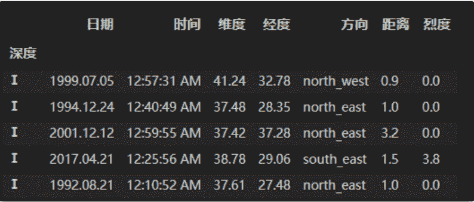

```
↑↑↑关注后"星标"Datawhale每日干货 & 每月组队学习，不错过
 Datawhale干货 
作者：耿远昊，Datawhale成员，华东师范大学 
```

分类数据(categorical data)是按照现象的某种属性对其进行分类或分组而得到的反映事物类型的数据，又称定类数据。直白来说，就是取值为有限的，或者说是固定数量的可能值。例如：性别、血型等。

今天，我们来学习下，Pandas如何处理分类数据。主要围绕以下几个方面展开：


本文目录

    1. Category的创建及其性质

        1.1. 分类变量的创建

        1.2\. 分类变量的结构

        1.3. 类别的修改

    2\. 分类变量的排序

        2.1\. 序的建立

        2.2. 排序

    3\. 分类变量的比较操作

        3.1\. 与标量或等长序列的比较

        3.2\. 与另一分类变量的比较

    4. 问题及练习

        4.1\. 问题

        4.2\. 练习

首先，读入数据：

```
import pandas as pd
import numpy as np
df = pd.read_csv('data/table.csv')
df.head() 
```

**一、category的创建及其性质**

### **1.1. 分类变量的创建**

#### （a）用Series创建

```
pd.Series(["a", "b", "c", "a"], dtype="category") 
```


#### （b）对DataFrame指定类型创建

```
temp_df = pd.DataFrame({'A':pd.Series(["a", "b", "c", "a"], dtype="category"),'B':list('abcd')})
temp_df.dtypes 
```


#### （c）利用内置Categorical类型创建

```
cat = pd.Categorical(["a", "b", "c", "a"], categories=['a','b','c'])
pd.Series(cat) 
```


#### （d）利用cut函数创建，默认使用区间类型为标签

```
pd.cut(np.random.randint(0,60,5), [0,10,30,60]) 
```


#### 可指定字符为标签

```
pd.cut(np.random.randint(0,60,5), [0,10,30,60], right=False, labels=['0-10','10-30','30-60']) 
```


### **1.2\. 分类变量的结构**

#### 一个分类变量包括三个部分，元素值（values）、分类类别（categories）、是否有序（order）。从上面可以看出，使用cut函数创建的分类变量默认为有序分类变量。下面介绍如何获取或修改这些属性。

#### （a）describe方法

#### 该方法描述了一个分类序列的情况，包括非缺失值个数、元素值类别数（不是分类类别数）、最多次出现的元素及其频数。

```
s = pd.Series(pd.Categorical(["a", "b", "c", "a",np.nan], categories=['a','b','c','d']))
s.describe() 
```


#### （b）categories和ordered属性，查看分类类别和是否排序

```
s.cat.categories 
```

Index(['a', 'b', 'c', 'd'], dtype='object')

```
s.cat.ordered 
```

```
False
```

### **1.3\. 类别的修改**

#### （a）利用set_categories修改，修改分类，但本身值不会变化

```
s = pd.Series(pd.Categorical(["a", "b", "c", "a",np.nan], categories=['a','b','c','d']))
s.cat.set_categories(['new_a','c']) 
```


#### （b）利用rename_categories修改，需要注意的是该方法会把值和分类同时修改

```
s = pd.Series(pd.Categorical(["a", "b", "c", "a",np.nan], categories=['a','b','c','d']))
s.cat.rename_categories(['new_%s'%i for i in s.cat.categories]) 
```


#### 利用字典修改值

```
s.cat.rename_categories({'a':'new_a','b':'new_b'}) 
```


#### （c）利用add_categories添加

```
s = pd.Series(pd.Categorical(["a", "b", "c", "a",np.nan], categories=['a','b','c','d']))
s.cat.add_categories(['e']) 
```


#### （d）利用remove_categories移除

```
s = pd.Series(pd.Categorical(["a", "b", "c", "a",np.nan], categories=['a','b','c','d']))
s.cat.remove_categories(['d']) 
```


#### （e）删除元素值未出现的分类类型

```
s = pd.Series(pd.Categorical(["a", "b", "c", "a",np.nan], categories=['a','b','c','d']))
s.cat.remove_unused_categories() 
```


## **二、分类变量的排序**

#### 前面提到，分类数据类型被分为有序和无序，这非常好理解，例如分数区间的高低是有序变量，考试科目的类别一般看做无序变量

### **2.1. 序的建立**

#### （a）一般来说会将一个序列转为有序变量，可以利用as_ordered方法

```
s = pd.Series(["a", "d", "c", "a"]).astype('category').cat.as_ordered()
s 
```


```
退化为无序变量，只需要使用as_unordered
```

```
s.cat.as_unordered() 
```


#### （b）利用set_categories方法中的order参数

```
pd.Series(["a", "d", "c", "a"]).astype('category').cat.set_categories(['a','c','d'],ordered=True) 
```


#### （c）利用reorder_categories方法，这个方法的特点在于，新设置的分类必须与原分类为同一集合

```
s = pd.Series(["a", "d", "c", "a"]).astype('category')
s.cat.reorder_categories(['a','c','d'],ordered=True) 
```


```
#s.cat.reorder_categories(['a','c'],ordered=True) #报错
#s.cat.reorder_categories(['a','c','d','e'],ordered=True) #报错 
```

### **2.2\. 排序**

#### 先前在第1章介绍的值排序和索引排序都是适用的

```
s = pd.Series(np.random.choice(['perfect','good','fair','bad','awful'],50)).astype('category')
s.cat.set_categories(['perfect','good','fair','bad','awful'][::-1],ordered=True).head() 
```


```
s.sort_values(ascending=False).head() 
```


```
df_sort = pd.DataFrame({'cat':s.values,'value':np.random.randn(50)}).set_index('cat')
df_sort.head() 
```


```
df_sort.sort_index().head() 
```


**三、分类变量的比较操作**

### **3.1\. 与标量或等长序列的比较**

#### （a）标量比较

```
s = pd.Series(["a", "d", "c", "a"]).astype('category')
s == 'a' 
```


#### （b）等长序列比较

```
s == list('abcd') 
```


### **3.2. 与另一分类变量的比较**

#### （a）等式判别（包含等号和不等号），两个分类变量的等式判别需要满足分类完全相同。

```
s = pd.Series(["a", "d", "c", "a"]).astype('category')
s == s 
```


```
s != s 
```


```
s_new = s.cat.set_categories(['a','d','e'])
#s == s_new #报错 
```

#### （b）不等式判别（包含>=,<=,<,>），两个分类变量的不等式判别需要满足两个条件：① 分类完全相同 ② 排序完全相同

```
s = pd.Series(["a", "d", "c", "a"]).astype('category')
#s >= s #报错 
```

```
s = pd.Series(["a", "d", "c", "a"]).astype('category').cat.reorder_categories(['a','c','d'],ordered=True)
s >= s 
```


## **四、问题与练习**

**4.1\. 问题**

#### **【问题一】** 如何使用union_categoricals方法？它的作用是什么？

*   如果要组合不一定具有相同类别的类别，union_categoricals函数将组合类似列表的类别。新类别将是合并的类别的并集。如下所示：

```
from pandas.api.types import union_categoricals
a = pd.Categorical(['b','c'])
b = pd.Categorical(['a','b'])
union_categoricals([a,b]) 
```


*   默认情况下，生成的类别将按照在数据中显示的顺序排列。如果要对类别进行排序，可使用sort_categories=True参数。

*   union_categoricals也适用于组合相同类别和顺序信息的两个分类。

*   union_categoricals可以在合并分类时重新编码类别的整数代码。

#### **【问题二】** 利用concat方法将两个序列纵向拼接，它的结果一定是分类变量吗？什么情况下不是？


**【问题三】** 当使用groupby方法或者value_counts方法时，分类变量的统计结果和普通变量有什么区别？

*   分类变量的groupby方法/value_counts方法，统计对象是类别。

*   普通变量groupby方法/value_counts方法，统计对象是唯一值(不包含NA)。

#### **【问题四】** 下面的代码说明了Series创建分类变量的什么“缺陷”？如何避免？（提示：使用Series中的copy参数）

```
cat = pd.Categorical([1, 2, 3, 10], categories=[1, 2, 3, 4, 10])
s = pd.Series(cat, name="cat")
cat 
```


```
s.iloc[0:2] = 10
cat 
```


```
4.2\. 练习 
```

#### **【练习一】** 现继续使用第四章中的地震数据集，请解决以下问题：

#### （a）现在将深度分为七个等级：[0,5,10,15,20,30,50,np.inf]，请以深度等级Ⅰ,Ⅱ,Ⅲ,Ⅳ,Ⅴ,Ⅵ,Ⅶ为索引并按照由浅到深的顺序进行排序。

*   使用cut方法对列表中的深度划分，并将该列作为索引值。然后按索引排序即可。

```
df = pd.read_csv('data/Earthquake.csv')
df_result = df.copy()
df_result['深度'] = pd.cut(df['深度'],[0,5,10,15,20,30,50,np.inf], right=False, labels=['Ⅰ','Ⅱ','Ⅲ','Ⅳ','Ⅴ','Ⅵ','Ⅶ'])
df_result = df_result.set_index('深度').sort_index()
df_result.head() 
```



#### （b）在（a）的基础上，将烈度分为4个等级：[0,3,4,5,np.inf]，依次对南部地区的深度和烈度等级建立多级索引排序。

*   跟(a)很相似，cut方法对深度，烈度进行切分，把index设为[‘深度’，‘烈度’]，然后进行索引排序即可。

```
df['烈度'] = pd.cut(df['烈度'],[0,3,4,5,np.inf], right=False, labels=['Ⅰ','Ⅱ','Ⅲ','Ⅳ'])
df['深度'] = pd.cut(df['深度'],[0,5,10,15,20,30,50,np.inf], right=False, labels=['Ⅰ','Ⅱ','Ⅲ','Ⅳ','Ⅴ','Ⅵ','Ⅶ'])
df_ds = df.set_index(['深度','烈度'])
df_ds.sort_index() 
```

**【练习二】** 对于分类变量而言，调用第4章中的变形函数会出现一个BUG（目前的版本下还未修复）：例如对于crosstab函数，按照官方文档的说法，即使没有出现的变量也会在变形后的汇总结果中出现，但事实上并不是这样，比如下面的例子就缺少了原本应该出现的行'c'和列'f'。基于这一问题，请尝试设计my_crosstab函数，在功能上能够返回正确的结果。

*   因为Categories中肯定包含出现的变量。所以将第一个参数作为index，第二个参数作为columns，建立一个DataFrame，然后把出现的变量组合起来，对应位置填入1即可。

```
foo = pd.Categorical(['b','a'], categories=['a', 'b', 'c'])
bar = pd.Categorical(['d', 'e'], categories=['d', 'e', 'f'])
import numpy
def my_crosstab(a, b):
    s1 = pd.Series(list(foo.categories), name='row')
    s2 = list(bar.categories)
    df = pd.DataFrame(np.zeros((len(s1), len(s2)),int),index=s1, columns=s2)
    index_1 = list(foo)
    index_2 = list(bar)
    for loc in zip(index_1, index_2):
        df.loc[loc] = 1
    return df
my_crosstab(foo, bar) 
```


**本文电子版* 后台回复 **分类数据*** *获取* 


“竟然学习完了，给自己点个**赞**↓