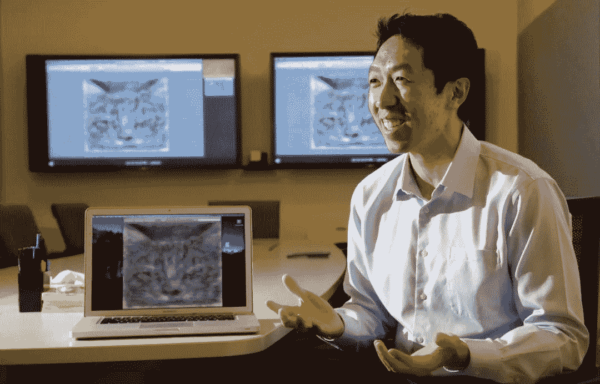
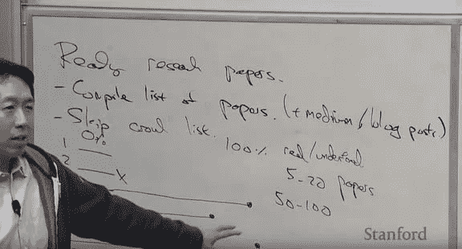
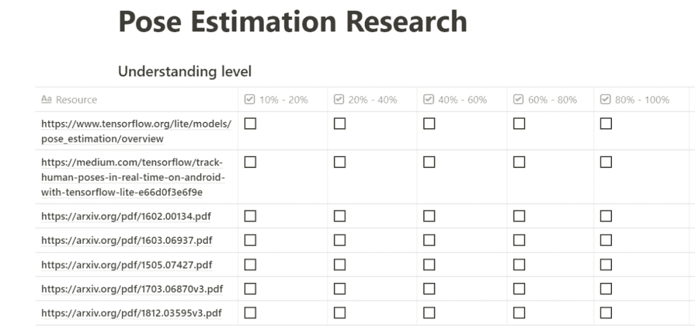
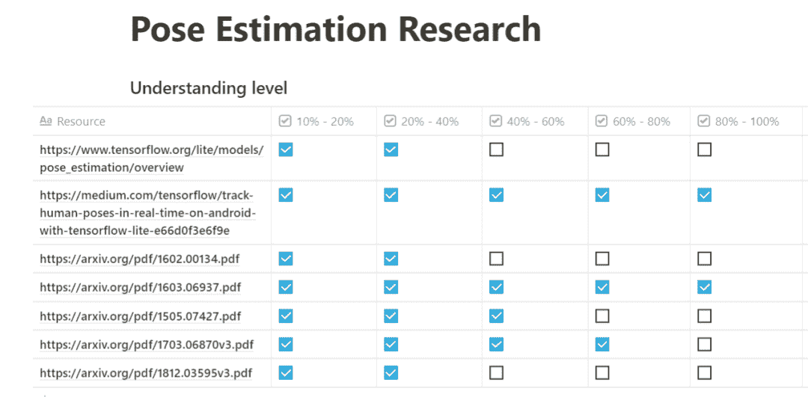

↑↑↑关注后"星标"Datawhale

每日干货 & [每月组队学习](https://mp.weixin.qq.com/mp/appmsgalbum?__biz=MzIyNjM2MzQyNg%3D%3D&action=getalbum&album_id=1338040906536108033#wechat_redirect)，不错过

 Datawhale推荐 

******作者：Richmond Alake，**来源：机器之心********

> 在科研领域中，读论文大概是大家的日常基本操作了。但如何读论文，才能实现效率最大化呢？斯坦福大学教授吴恩达在斯坦福 CS230 深度学习课程中专门讲述了如何读论文，那么具体效果如何呢？本文作者以「姿态估计」为例复现了吴恩达的读论文方法，并提出了他自己的读论文小技巧，希望对大家的科研有所帮助。

理解人工智能和机器学习领域中的前沿研究是每一位机器学习从业者应该掌握的技能。

要想实时追踪前沿研究并增加自己的知识，机器学习从业者需要养成开放的学术心态和习惯。人工智能、机器学习和深度学习领域每时每刻都在更新发展，所以我们必须用知识来武装自己，紧跟领域发展步伐，而这些只能通过读论文来实现。

但是读论文也不是盲目而就的，也需要一定的方法和流程。如果只是流水账似的通读下来，恐怕也不会有特别好的效果。

之前，斯坦福大学教授、Coursera 联合创始人吴恩达（Andrew Ng）在斯坦福 2018 年秋季 CS230 深度学习课程中就如何读论文提出了一些建议。但具体效果怎么样呢？按照吴恩达的方法是否可以充分地从论文中获取自己想要了解和掌握的知识和技能呢？

近日，计算机科学工程师 Richmond Alake 以「姿态估计」为例，示范了吴恩达 CS230 课程的读论文方法，目前相关文章已在 Medium 获得 3000 多赞。除了课程中提到的方法，Alake 还为读者介绍了他本人读论文时的一些小技巧。

在这篇博文中，读者不仅能够掌握高效、恰当读论文的系统性方法和技巧，还可以获取一些有助于搜索论文和关键信息的辅助性在线资源。

想要了解吴恩达 CS230 课程详细内容的读者，可以参考文章《[机器学习研究者的养成指南，吴恩达建议这么读论文](http://mp.weixin.qq.com/s?__biz=MzA3MzI4MjgzMw%3D%3D&chksm=871a7079b06df96f4b14d7888b0d9d2b9e95a89092c1b4364f39a6e51ac77590cf6552c59180&idx=1&mid=2650780679&scene=21&sn=a9358fe26492d1159939d0095d9c87bf#wechat_redirect)》。

接下来，我们就来看 Richmond Alake 如何一步步复现吴恩达的读论文方法，这包括阅读多篇相关性论文和阅读单篇论文两部分内容。

**整合论文资源，记录理解程度**

有时在开展某项主题研究时，我们需要阅读大量的文献，这就需要学会整合资源的方法了。Richmond Alake 以姿态估计为例为我们展示了如何有效地整合与该主题相关的论文等资源，以及论文阅读量等实用建议。

1\. **收集和研究主题相关的资源。**这些资源可以是研究论文、Medium 文章、博客、视频、GitHub 项目等等。

在谷歌搜索引擎中键入「pose estimation」进行快速搜索，你会得到一些与该主题相关的不错资源。这一步的目的是整理所有与研究主题相关的资源，如视频、实现文档和研究论文。

理想状况下，这一阶段你不用对自己认为重要的资源数量设置上限，但你需要创建一个有用论文、视频和文章的列表。

2\. 接下来，你将**深入探索找到的资源****。**这里的关键点在于，找到一种方法来跟踪记录对列表内每一项资源的理解程度。

吴恩达教授建议，用一个表格记录自己对相关资源的理解，如下图所示：

*资源理解程度表（来自 Richmond Alake）*

建议先至少对列表内每项资源的内容了解 10–20%。这可以确保你对每项资源的介绍性内容有足够了解，从而能够准确判断它与研究主题的相关度。

对于相关度最高的论文或资源，你可以进行更深层次的理解。最终，你会对某些资源产生充分的理解。

你可能会问自己：「多少论文 / 资源才足够？」。

吴恩达教授认为，5–20 篇论文可以让你对某个研究主题有一个基础了解，或许可以进一步去了解实现技术。50-100 篇论文可以提供对特定领域比较深的理解。

在浏览完这些资源，并提取出关键信息后，你的资源理解程度表可能会变成下图这样：

3\. 第三步是 Richmond Alake 在理解研究论文过程中发现的一个对自己有效的小贴士：**用自己的语言，将资源的核心发现和技术有条理地记录下来**。

**如何研读一篇论文**

**要想理解一篇论文，只读一遍是不够的。**吴恩达教授认为，从头到尾阅读一遍并不是理解论文的最佳方法。

想要理解一篇论文的内容，你至少需要阅读 3 遍。

4\. 第一遍：读标题、摘要和图片。

5\. 第二遍：读引言和结论部分，再浏览一遍图片，并快速浏览论文的其他部分。

引言和结论部分清晰明了地概括了论文内容和研究发现。这两个部分通常只包含关键信息，对其他补充信息不作赘述。而这些关键信息有助于你接下来阅读论文的其他部分。

6\. 第三遍：阅读论文的全部内容，跳过你不熟悉的复杂数学或技术公式。这一遍阅读时，你还可以跳过不理解或不熟悉的专业术语。

7\. 对某一领域进行深入研究的研究者还可以阅读更多遍，这主要是为了理解论文中的数学、技术以及不了解的术语。

不过，对于出于获取信息和工程目的而阅读论文的人来说，深入研究可能比较耗时，尤其是在有 20 多篇论文需要读的时候。

**阅读论文时，你需要问自己这些问题**

吴恩达教授还提供了一些阅读论文时读者需要问自己的问题。通过这些问题，能够看出你是否理解了论文的关键信息。

Richmond Alake 选取了以下几个重要问题作为参考：

1.  描述论文作者旨在实现或已经实现的研究目标。

2.  如果论文中提出了新的方法 / 技术，那么新方法的关键要素是什么？

3.  这篇论文中哪些内容对你来说是有用的？

4.  你还想要继续阅读哪些参考内容？

此外，Richmond Alake 还分享了一些查询相关研究信息的在线资源：

*   The Machine Learning Subreddit (https://www.reddit.com/r/MachineLearning/)

*   The Deep Learning Subreddit (https://www.reddit.com/r/deeplearning/)

*   PapersWithCode (https://paperswithcode.com/)

*   NeurIPS、ICML、ICLR 等顶级会议论文

*   Research Gate (https://www.researchgate.net/)

“为沉迷学习点**赞**↓