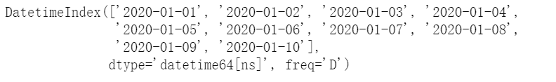
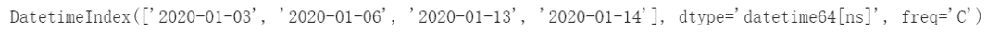
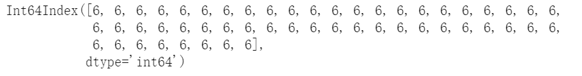
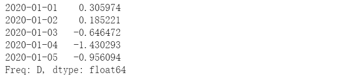
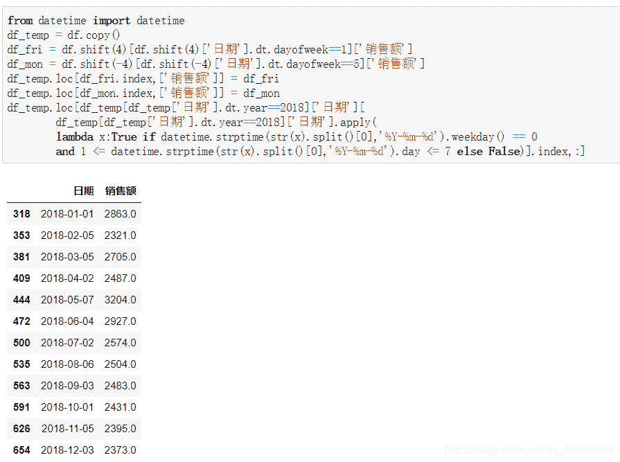

```
↑↑↑关注后"星标"Datawhale每日干货 & 每月组队学习，不错过
 Datawhale干货 
作者：耿远昊，Datawhale成员，华东师范大学 
```

时序数据是指时间序列数据。时间序列数据是同一统一指标按时间顺序记录的数据列。在同一数据列中的各个数据必须是同口径的，要求具有可比性。时序数据可以是时期数，也可以时点数。

时间序列分析的目的是通过找出样本内时间序列的统计特性和发展规律性，构建时间序列模型，进行样本外预测。

现在，一起来学习用Pandas处理时序数据。


本文目录

    1. 时序的创建

        1.1. 四类时间变量

        1.2\. 时间点的创建

        1.3. DataOffset对象

    2\. 时序的索引及属性

        2.1\. 索引切片

        2.2. 子集索引

        2.3\. 时间点的属性

    3\. 重采样

        3.1\. resample对象的基本操作

        3.2\. 采样聚合

        3.3\. 采样组的迭代

    4\. 窗口函数

        4.1\. Rolling

        4.2\. Expanding

    5. 问题及练习

        5.1\. 问题

        5.2\. 练习

```
import pandas as pd
import numpy as np 
```

## **一、时序的创建**

### **1.1\. 四类时间变量**

#### 现在理解可能关于③和④有些困惑，后面会作出一些说明


#### **1.2. 时间点的创建**

#### （a）to_datetime方法

#### Pandas在时间点建立的输入格式规定上给了很大的自由度，下面的语句都能正确建立同一时间点

```
pd.to_datetime('2020.1.1')
pd.to_datetime('2020 1.1')
pd.to_datetime('2020 1 1')
pd.to_datetime('2020 1-1')
pd.to_datetime('2020-1 1')
pd.to_datetime('2020-1-1')
pd.to_datetime('2020/1/1')
pd.to_datetime('1.1.2020')
pd.to_datetime('1.1 2020')
pd.to_datetime('1 1 2020')
pd.to_datetime('1 1-2020')
pd.to_datetime('1-1 2020')
pd.to_datetime('1-1-2020')
pd.to_datetime('1/1/2020')
pd.to_datetime('20200101')
pd.to_datetime('2020.0101') 
```

```
Timestamp('2020-01-01 00:00:00')
```

#### 下面的语句都会报错

```
#pd.to_datetime('2020\\1\\1')
#pd.to_datetime('2020`1`1')
#pd.to_datetime('2020.1 1')
#pd.to_datetime('1 1.2020') 
```

#### 此时可利用format参数强制匹配

```
pd.to_datetime('2020\\1\\1',format='%Y\\%m\\%d')
pd.to_datetime('2020`1`1',format='%Y`%m`%d')
pd.to_datetime('2020.1 1',format='%Y.%m %d')
pd.to_datetime('1 1.2020',format='%d %m.%Y') 
```

```
Timestamp('2020-01-01 00:00:00')
```

#### 同时，使用列表可以将其转为时间点索引

```
pd.Series(range(2),index=pd.to_datetime(['2020/1/1','2020/1/2'])) 
```


```
type(pd.to_datetime(['2020/1/1','2020/1/2'])) 
```

```
pandas.core.indexes.datetimes.DatetimeIndex
```

#### 对于DataFrame而言，如果列已经按照时间顺序排好，则利用to_datetime可自动转换

```
df = pd.DataFrame({'year': [2020, 2020],'month': [1, 1], 'day': [1, 2]})
pd.to_datetime(df) 
```


#### （b）时间精度与范围限制

#### 事实上，Timestamp的精度远远不止day，可以最小到纳秒ns

```
pd.to_datetime('2020/1/1 00:00:00.123456789') 
```

```
Timestamp('2020-01-01 00:00:00.123456789')
```

#### 同时，它带来范围的代价就是只有大约584年的时间点是可用的

```
pd.Timestamp.min 
```

```
Timestamp('1677-09-21 00:12:43.145225')
```

```
pd.Timestamp.max 
```

```
Timestamp('2262-04-11 23:47:16.854775807') 
```

#### （c）date_range方法

#### 一般来说，start/end/periods（时间点个数）/freq（间隔方法）是该方法最重要的参数，给定了其中的3个，剩下的一个就会被确定

```
pd.date_range(start='2020/1/1',end='2020/1/10',periods=3) 
```


```
pd.date_range(start='2020/1/1',end='2020/1/10',freq='D') 
```



```
pd.date_range(start='2020/1/1',periods=3,freq='D') 
```


```
pd.date_range(end='2020/1/3',periods=3,freq='D') 
```


#### 其中freq参数有许多选项，下面将常用部分罗列如下，更多选项可看这里

```
pd.date_range(start='2020/1/1',periods=3,freq='T') 
```


```
pd.date_range(start='2020/1/1',periods=3,freq='M') 
```


```
pd.date_range(start='2020/1/1',periods=3,freq='BYS') 
```


#### bdate_range是一个类似与date_range的方法，特点在于可以在自带的工作日间隔设置上，再选择weekmask参数和holidays参数

#### 它的freq中有一个特殊的'C'/'CBM'/'CBMS'选项，表示定制，需要联合weekmask参数和holidays参数使用

#### 例如现在需要将工作日中的周一、周二、周五3天保留，并将部分holidays剔除

```
weekmask = 'Mon Tue Fri'
holidays = [pd.Timestamp('2020/1/%s'%i) for i in range(7,13)]
#注意holidays
pd.bdate_range(start='2020-1-1',end='2020-1-15',freq='C',weekmask=weekmask,holidays=holidays) 
```



### **1.3. DateOffset对象**

#### （a）DataOffset与Timedelta的区别

#### Timedelta绝对时间差的特点指无论是冬令时还是夏令时，增减1day都只计算24小时

#### DataOffset相对时间差指，无论一天是23\24\25小时，增减1day都与当天相同的时间保持一致

#### 例如，英国当地时间 2020年03月29日，01:00:00 时钟向前调整 1 小时 变为 2020年03月29日，02:00:00，开始夏令时

```
ts = pd.Timestamp('2020-3-29 01:00:00', tz='Europe/Helsinki')
ts + pd.Timedelta(days=1) 
```

```
Timestamp('2020-03-30 02:00:00+0300', tz='Europe/Helsinki')
```

```
ts + pd.DateOffset(days=1) 
```

```
Timestamp('2020-03-30 01:00:00+0300', tz='Europe/Helsinki')
```

#### 这似乎有些令人头大，但只要把tz（time zone）去除就可以不用管它了，两者保持一致，除非要使用到时区变换

```
ts = pd.Timestamp('2020-3-29 01:00:00')
ts + pd.Timedelta(days=1) 
```

```
Timestamp('2020-03-30 01:00:00')
```

```
ts + pd.DateOffset(days=1) 
```

```
Timestamp('2020-03-30 01:00:00')
```

#### （b）增减一段时间

#### DateOffset的可选参数包括years/months/weeks/days/hours/minutes/seconds

```
pd.Timestamp('2020-01-01') + pd.DateOffset(minutes=20) - pd.DateOffset(weeks=2) 
```

```
Timestamp('2019-12-18 00:20:00')
```

#### （c）各类常用offset对象

```
pd.Timestamp('2020-01-01') + pd.offsets.Week(2) 
```

```
Timestamp('2020-01-15 00:00:00')
```

```
pd.Timestamp('2020-01-01') + pd.offsets.BQuarterBegin(1) 
```

```
Timestamp('2020-03-02 00:00:00')
```

#### （d）序列的offset操作

#### 利用apply函数

```
pd.Series(pd.offsets.BYearBegin(3).apply(i) for i in pd.date_range('20200101',periods=3,freq='Y')) 
```


#### 直接使用对象加减

```
pd.date_range('20200101',periods=3,freq='Y') + pd.offsets.BYearBegin(3) 
```


#### 定制offset，可以指定weekmask和holidays参数（思考为什么三个都是一个值）

```
pd.Series(pd.offsets.CDay(3,weekmask='Wed Fri',holidays='2020010').apply(i)
                                  for i in pd.date_range('20200105',periods=3,freq='D')) 
```


## **二、时序的索引及属性**

### **2.1\. 索引切片**

#### 这一部分几乎与第二章的规则完全一致

```
rng = pd.date_range('2020','2021', freq='W')
ts = pd.Series(np.random.randn(len(rng)), index=rng)
ts.head() 
```


```
ts['2020-01-26'] 
```

```
-0.47982974619679947
```

#### 合法字符自动转换为时间点

```
ts['2020-01-26':'20200726'].head() 
```


### **2.2\. 子集索引**

```
ts['2020-7'].head() 
```


#### 支持混合形态索引

```
ts['2011-1':'20200726'].head() 
```


### **2.3. 时间点的属性**

#### 采用dt对象可以轻松获得关于时间的信息

```
pd.Series(ts.index).dt.week.head() 
```


```
pd.Series(ts.index).dt.day.head() 
```


#### 利用strftime可重新修改时间格式

```
pd.Series(ts.index).dt.strftime('%Y-间隔1-%m-间隔2-%d').head() 
```


#### 对于datetime对象可以直接通过属性获取信息

```
pd.date_range('2020','2021', freq='W').month 
```


```
pd.date_range('2020','2021', freq='W').weekday 
```



## **三、重采样**

#### 所谓重采样，就是指resample函数，它可以看做时序版本的groupby函数

### **3.1. resample对象的基本操作**

#### 采样频率一般设置为上面提到的offset字符

```
df_r = pd.DataFrame(np.random.randn(1000, 3),index=pd.date_range('1/1/2020', freq='S', periods=1000),
                  columns=['A', 'B', 'C']) 
```

```
r = df_r.resample('3min')
r 
```


```
r.sum() 
```


```
df_r2 = pd.DataFrame(np.random.randn(200, 3),index=pd.date_range('1/1/2020', freq='D', periods=200),
                  columns=['A', 'B', 'C'])
r = df_r2.resample('CBMS')
r.sum() 
```


**3.2\. 采样聚合**

```
r = df_r.resample('3T') 
```

```
r['A'].mean() 
```


```
r['A'].agg([np.sum, np.mean, np.std]) 
```


类似地，可以使用函数lambda表达式

```
r.agg({'A': np.sum,'B': lambda x: max(x)-min(x)}) 
```


**3.3. 采样组的迭代**

#### 采样组的迭代和groupby迭代完全类似，对于每一个组都可以分别做相应操作

```
small = pd.Series(range(6),index=pd.to_datetime(['2020-01-01 00:00:00', '2020-01-01 00:30:00'
                                                 , '2020-01-01 00:31:00','2020-01-01 01:00:00'
                                                 ,'2020-01-01 03:00:00','2020-01-01 03:05:00']))
resampled = small.resample('H')
for name, group in resampled:
    print("Group: ", name)
    print("-" * 27)
    print(group, end="\n\n") 
```


## **四、窗口函数**

#### 下面主要介绍pandas中两类主要的窗口(window)函数:rolling/expanding

```
s = pd.Series(np.random.randn(1000),index=pd.date_range('1/1/2020', periods=1000))
s.head() 
```



### **4.1\. Rolling**

#### （a）常用聚合

#### 所谓rolling方法，就是规定一个窗口，它和groupby对象一样，本身不会进行操作，需要配合聚合函数才能计算结果

```
s.rolling(window=50) 
```

```
Rolling [window=50,center=False,axis=0]
```

```
s.rolling(window=50).mean() 
```


#### min_periods参数是指需要的非缺失数据点数量阀值

```
s.rolling(window=50,min_periods=3).mean().head() 
```


#### count/sum/mean/median/min/max/std/var/skew/kurt/quantile/cov/corr都是常用的聚合函数。

#### （b）rolling的apply聚合

#### 使用apply聚合时，只需记住传入的是window大小的Series，输出的必须是标量即可，比如如下计算变异系数

```
s.rolling(window=50,min_periods=3).apply(lambda x:x.std()/x.mean()).head() 
```


#### （c）基于时间的rolling

```
s.rolling('15D').mean().head() 
```


#### 可选closed='right'（默认）\'left'\'both'\'neither'参数，决定端点的包含情况

```
s.rolling('15D', closed='right').sum().head() 
```


### **4.2\. Expanding**

#### （a）expanding函数

#### 普通的expanding函数等价与rolling(window=len(s),min_periods=1)，是对序列的累计计算

```
s.rolling(window=len(s),min_periods=1).sum().head() 
```


```
s.expanding().sum().head() 
```


#### apply方法也是同样可用的

```
s.expanding().apply(lambda x:sum(x)).head() 
```


#### （b）几个特别的Expanding类型函数

#### cumsum/cumprod/cummax/cummin都是特殊expanding累计计算方法

```
s.cumsum().head() 
```


```
s.cumsum().head() 
```


#### shift/diff/pct_change都是涉及到了元素关系

#### ① shift是指序列索引不变，但值向后移动

#### ② diff是指前后元素的差，period参数表示间隔，默认为1，并且可以为负

#### ③ pct_change是值前后元素的变化百分比，period参数与diff类似

```
s.shift(2).head() 
```


```
s.diff(3).head() 
```


```
s.pct_change(3).head() 
```


## **五、问题与练习**

**5.1\. 问题**

#### **【问题一】** 如何对date_range进行批量加帧操作或对某一时间段加大时间戳密度？


#### **【问题二】** 如何批量增加TimeStamp的精度？

#### **【问题三】** 对于超出处理时间的时间点，是否真的完全没有处理方法？


#### **【问题四】** 给定一组非连续的日期，怎么快速找出位于其最大日期和最小日期之间，且没有出现在该组日期中的日期？


**5.2\. 练习**

#### **【练习一】** 现有一份关于某超市牛奶销售额的时间序列数据，请完成下列问题：


#### （a）销售额出现最大值的是星期几？（提示：利用dayofweek函数）


#### （b）计算除去春节、国庆、五一节假日的月度销售总额


#### （c）按季度计算周末（周六和周日）的销量总额


#### （d）从最后一天开始算起，跳过周六和周一，以5天为一个时间单位向前计算销售总和


#### （e）假设现在发现数据有误，所有同一周里的周一与周五的销售额记录颠倒了，请计算2018年中每月第一个周一的销售额（如果该周没有周一或周五的记录就保持不动）



**【练习二】** 继续使用上一题的数据，请完成下列问题：

#### （a）以50天为窗口计算滑窗均值和滑窗最大值（min_periods设为1）


#### （b）现在有如下规则：若当天销售额超过向前5天的均值，则记为1，否则记为0，请给出2018年相应的计算结果


#### （c）将(c)中的“向前5天”改为“向前非周末5天”，请再次计算结果


**本文电子版* 后台回复* ***时序******数据*** *获取* 


“竟然学习完了，给自己点个**赞**↓