↑↑↑关注后"星标"Datawhale

每日干货 & [每月组队学习](https://mp.weixin.qq.com/mp/appmsgalbum?__biz=MzIyNjM2MzQyNg%3D%3D&action=getalbum&album_id=1338040906536108033#wechat_redirect)，不错过

 Datawhale干货 

**作者：陈锴，**Datawhale优秀学习者**，中山大学数学系**

人脸检测属于计算机视觉的范畴，早期人们的主要研究方向是人脸识别，即根据人脸来识别人物的身份，后来在复杂背景下的人脸检测需求越来越大，人脸检测也逐渐作为一个单独的研究方向发展起来。

目前人脸检测的方法主要有两大类：基于知识和基于统计。

*   基于知识的方法：主要利用先验知识将人脸看作器官特征的组合，根据眼睛、眉毛、嘴巴、鼻子等器官的特征以及相互之间的几何位置关系来检测人脸。主要包括模板匹配、人脸特征、形状与边缘、纹理特性、颜色特征等方法。

*   基于统计的方法：将人脸看作一个整体的模式：二维像素矩阵，从统计的观点通过大量人脸图像样本构造人脸模式空间，根据相似度量来判断人脸是否存在。主要包括主成分分析与特征脸、神经网络方法、支持向量机、隐马尔可夫模型、Adaboost算法等。

本文主要基于统计的方法，通过Adaboost算法和Haar特征来构建Haar分类器，对人脸和非人脸进行分类。

本文目录

    1\. 算法要点

        1.1\. Haar分类器训练步骤

        1.2. Haar的局限性

    2. Haar原理解析

        2.1. Haar特征

        2.2\. 积分图构建

        2.3. 计算Haar特征值

        2.4. Haar特征归一化

        2.5. 级联分类器

    3\. 人脸检测案例

        3.1\. 人脸检测

        3.2\. 人脸检测+人眼检测

        3.3\. 调用摄像头的动态人脸检测

## **一、****算法要点**

**1.1 Haar分类器训练步骤**

Haar分类器=Haar特征+积分图方法+Adaboost+级联。

其训练的五大步骤：

1.  准备人脸、非人脸样本集；

2.  使用Haar特征做检测；

3.  使用积分图（Integral Image）对Haar特征求值进行加速；

4.  使用AdaBoost算法训练区分人脸和非人脸的强分类器；

5.  使用筛选式级联把强分类器级联到一起，提高准确率

具体步骤在第2节中会详细介绍。

### **1.2 Haar的局限性**

*   仅为人脸检测，非人脸“辩识”，即只能框出人脸的位置，看不出人脸是谁。

*   仅能标出静态图片和视频帧上的人脸、人眼和微笑，不能进行“活体识别”，即不能看出这张脸是真人还是手机上的照片，如果用于人脸打卡签到、人脸支付的话会带来潜在的安全风险。

*   仅为普通的机器学习方法，没有用到深度学习和深层神经网络。

# **二、Haar原理解析**

## **2.1 Haar特征**

Haar特征包含三种：边缘特征、线性特征、中心特征和对角线特征。每种分类器都从图片中提取出对应的特征。有点类似于卷积神经网络中的卷积核，每个卷积核提取出对应的特征。

我们最基础的卷积核（划掉），哦不haar特征为下图中的Basic Haar Set：

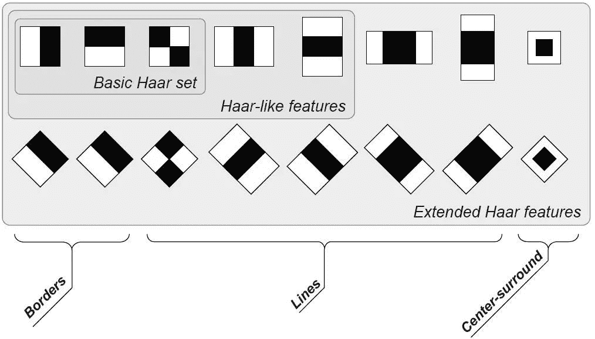

我们通常将Haar特征分为以下三类，我们根据名字就可以分辨出这三类的用途:

*   第一类是边缘特征：

    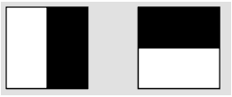

*   第二类是线性特征：

    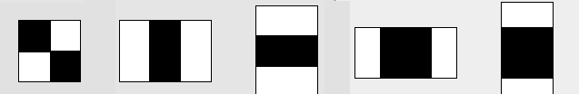

*   第三类是中心特征：

    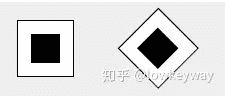

特征模板内有白色和黑色两种矩形，并定义该模板的特征值为白色矩形像素和减去黑色矩形像素和。Haar特征值反映了图像的灰度变化情况。

例如：脸部的一些特征能由矩形特征简单的描述，如：眼睛要比脸颊颜色要深，鼻梁两侧比鼻梁颜色要深，嘴巴比周围颜色要深等。但矩形特征只对一些简单的图形结构，如边缘、线段较敏感，所以只能描述特定走向（水平、垂直、对角）的结构。由于有时候人脸未必是定向的，可能是会有歪曲的，因此我们可以训练旋转一定角度的矩形特征来识别人脸。

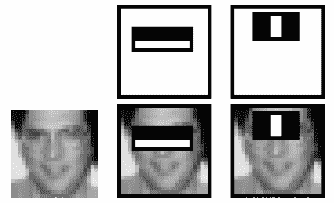

总而言之，Haar特征就是利用一些固定的特征来模拟人脸中的相关特征。

矩形特征可位于图像任意位置，大小也可以任意改变，所以矩形特征值是矩形模版类别、矩形位置和矩形大小这三个因素的函数。故类别、大小和位置的变化，使得很小的检测窗口含有非常多的矩形特征，如：在24*24像素大小的检测窗口内矩形特征数量可以达到16万个。这样就有两个问题需要解决了：

（1）如何快速计算那么多的特征？---积分图大显神通；

（2）哪些矩形特征才是对分类器分类最有效的？---如通过AdaBoost算法来训练。

## **2.2 积分图构建**

在一个图像窗口中，可以提取出大量的Haar矩形特征区域，如果在计算Haar特征值时，每次都遍历矩形特征区域，将会造成大量重复计算，严重浪费时间。积分图是一种快速计算矩形特征的方法，主要思想是将图像起始像素点到每一个像素点之间所形成的矩形区域的像素值的和，作为一个元素保存下来，即将原始图像转换为积分图(或者求和图)，当求某一矩形区域的像素和时，只需要索引矩形区域4个角点在积分图中的取值，进行普通的加减运算，即可求得Haar特征值，整个过程只需遍历一次图像，计算特征的时间复杂度为常数(O(1))，可以大大提升计算效率。积分图中元素的公式定义如下：

上式含义是在 位置处，积分图中元素为原图像中对应像素左上角所有像素值之和， 表示一个积分图像。在具体实现时，可用下式进行迭代运算:

其中 是行方向的累加和，初始值 ，但这个公式不是很好（为什么？），一个比较好的替代是下面这个公式：

**2.3 计算Haar特征值**

### **2.3.1 矩形特征**

构建好积分图后，图像中任何矩形区域的像素值累加和都可以通过简单的加减运算快速得到，如下图所示，矩形区域D的像素和值计算公式如下：

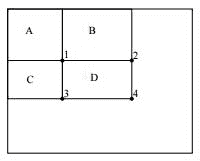

矩形区域求和示意图 在下图中，以水平向右为 轴正方向，垂直向下为 轴正方向，可定义积分图公式Summed Area Table:

以及迭代求解式

对于左上角坐标为 宽高为 的矩形区域 可利用积分图 求取像素和值

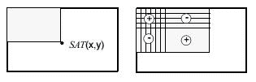

### **2.3.2 旋转矩形特征**

### 对于旋转矩形特征，相应的有 °倾斜积分图用于快速计算Haar特征值，如下图所示，倾斜积分图的定义为像素点左上角 °区域和左下角 °区域的像素和，公式表示如下：

其递推公式计算如下：

其中

也可直接通过下式递归计算:

以上3个积分图计算公式是等价的。

如下图所示，构建好倾斜积分图后，可快速计算倾斜矩形区域 的像素和值

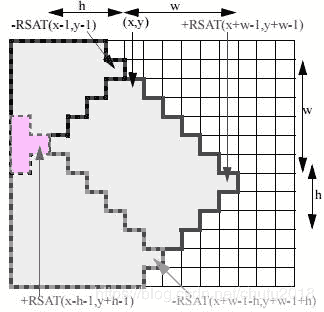

**2.3.3 举个例子 **

了解了特征值的计算之后，我们来看看不同的特征值的含义是什么。我们选取MIT人脸库中2706个大小为 的人脸正样本图像，计算如下图所示的Haar特征：

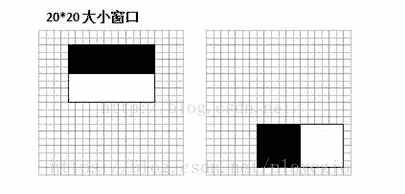

左边对应的人眼区域，右边无具体意义。

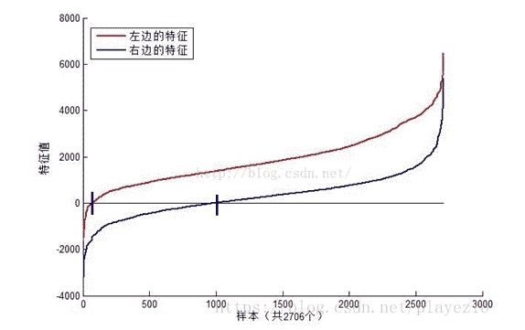

可以看到，图中2个不同Haar特征在同一组样本中具有不同的特征值分布，左边特征计算出的特征值基本都大于0（对样本的区分度大），而右边特征的特征值基本均匀分布于0两侧（对样本的区分度小）。所以，正是由于样本中Haar特征值分布不均匀，导致了不同Haar特征分类效果不同。显而易见，对正负样本区分度越大的特征分类效果越好，即红色曲线对应图中的的左边Haar特征分类效果好于右边Haar特征。

那么看到这里，应该理解了下面2个问题：

1.  在检测窗口通过平移+缩放可以产生一系列Haar特征，这些特征由于位置和大小不同，分类效果也不同；

2.  通过计算Haar特征的特征值，可以有将图像矩阵映射为1维特征值，有效实现了降维。

## **2.4 Haar特征归一化**

从上图我们可以发现，仅仅一个 维大小的Haar特征计算出的特征值变化范围从 ，跨度非常大。这种跨度大的特性不利于量化评定特征值，所以需要进行“归一化”，压缩特征值范围。假设当前检测窗口中的图像像素为 ，当前检测窗口为 大小（例如上图中为2020大小），OpenCV采用如下方式“归一化”：

*   计算检测窗口中图像的灰度值和灰度值平方和：

*   计算平均值：

*   计算归一化因子：

*   归一化特征值：<embed style="width: 26.912ex" src="https://mmbiz.qlogo.cn/mmbiz_svg/3a3QxMHZ8YwnLDxI5vXUicWuhMWgCicGRtGoIiarjwvkCiborv0PcqlBrgribjib4tqZIjib7NrQ5eyodxaMNlgwJcfA9KoqlXYugRw/0?wx_fmt=svg">之后使用归一化的特征值 与阈值对比。

## **2.5 级联**

### **2.5.1 白话解释**

这里我们并不打算详细阐述AdaBoost的完整工作机制以及一些更细节的部分，我们将从宏观层面来看级联的流程。

**基于Haar特征的cascade级联分类器**是Paul Viola和 Michael Jone在2001年的论文”Rapid Object Detection using a Boosted Cascade of Simple Features”中提出的一种有效的物体检测方法。

**Cascade级联分类器的训****练方法：Adaboost**

级联分类器的函数是通过大量带人脸和不带人脸的图片通过机器学习得到的。对于人脸识别来说，需要几万个特征，通过机器学习找出人脸分类效果最好、错误率最小的特征。训练开始时，所有训练集中的图片具有相同的权重，对于被分类错误的图片，提升权重，重新计算出新的错误率和新的权重。直到错误率或迭代次数达到要求。这种方法叫做Adaboost，在Opencv中可以直接调用级联分类器函数。

**将弱分类器聚合成强分类器**

最终的分类器是这些弱分类器的加权和。之所以称之为弱分类器是因为每个分类器不能单独分类图片，但是将他们聚集起来就形成了强分类器。论文表明，只需要200个特征的分类器在检测中的精确度达到了95%。最终的分类器大约有6000个特征。(将超过160000个特征减小到6000个，这是非常大的进步了）。

**级联的含义：需过五关斩六将才能被提取出来**

事实上，一张图片绝大部分的区域都不是人脸。如果对一张图片的每个角落都提取6000个特征，将会浪费巨量的计算资源。

如果能找到一个简单的方法能够检测某个窗口是不是人脸区域，如果该窗口不是人脸区域，那么就只看一眼便直接跳过，也就不用进行后续处理了，这样就能集中精力判别那些可能是人脸的区域。为此，有人引入了Cascade 分类器。它不是将6000个特征都用在一个窗口，而是将特征分为不同的阶段，然后一个阶段一个阶段的应用这些特征(通常情况下，前几个阶段只有很少量的特征)。如果窗口在第一个阶段就检测失败了，那么就直接舍弃它，无需考虑剩下的特征。如果检测通过，则考虑第二阶段的特征并继续处理。如果所有阶段的都通过了，那么这个窗口就是人脸区域。作者的检测器将6000+的特征分为了38个阶段，前五个阶段分别有1，10，25，25，50个特征(前文图中提到的识别眼睛和鼻梁的两个特征实际上是Adaboost中得到的最好的两个特征)。根据作者所述，平均每个子窗口只需要使用6000+个特征中的10个左右。

简单地说，在进行人脸检测的过程中，需要使用一个强分类器，且其由多个弱分类器组成。那么其中的每个弱分类器都只包含一个Haar特征。每个分类器都将确定一个阈值，如果某区域的处理差值小于该阈值，则被归为负类，反之则进行下一级的弱分类，最终经过多个弱分类器后，可完成检测。其分类过程如下图所示：

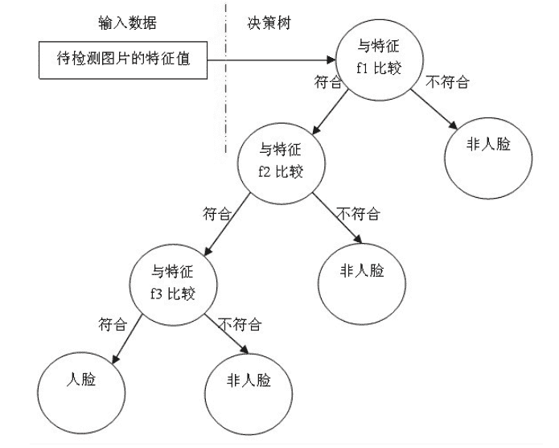

### **2.5.2 举个****例子**

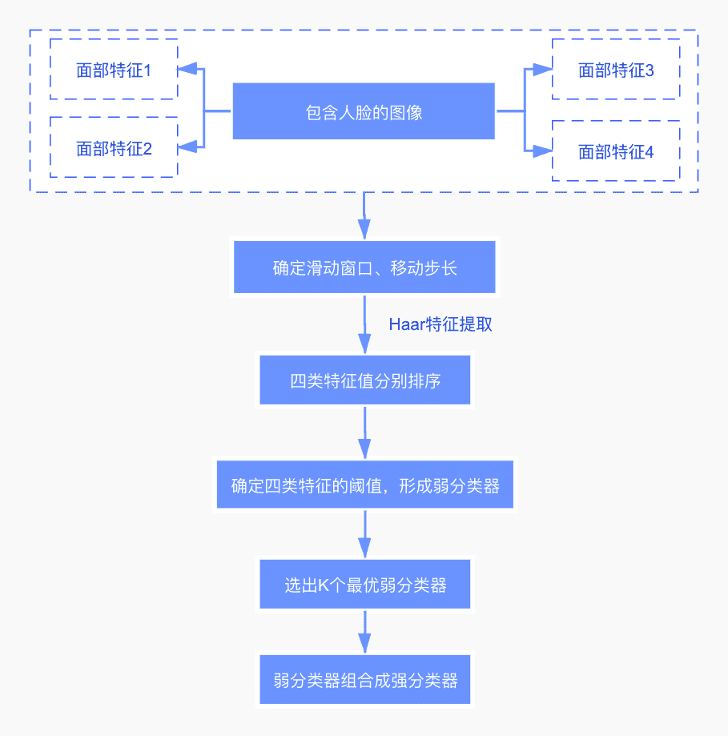

1\. 首先，对于一幅图像，它可能存在K个面部特征，假设这些面部特征可以用来区分眼睛、眉毛、鼻子、嘴等特征。

2\. 确定一些超参数，如滑动窗口的大小，及窗口的移动步长。窗口从上往下，从左向右地滑动。在滑动的过程中，每次都可以计算出一个数值$K$。

3\. 滑动结束时，将得到的特征值进行排序，并选取一个最佳特征值（最优阈值），使得在该特征值下，对于该特征而言，样本的加权错误率最低。这样就训练出了一个弱分类器。

4\. 因为面部特征的不同，我们将采用不同的滑动窗口进行特征提取。所以根据不同的窗口识别不同的特征，进而训练出了不同的弱分类器。

5\. 对于每个弱分类器都将计算它的错误率，选择错误率最低的K个弱分类器，组合成强分类器。

6\. 一组样本投入强分类器后，在每个渐进的阶段，分类器逐渐在较少的图像窗口上使用更多的特征（负类被丢弃）。如果某个矩形区域在所有弱分类器中都被归结为正类，那么可以认为该区域是存在人脸的。

**其中，弱分类器训练的具体步骤如下：**

1\. 对于每个特征 ，计算所有训练样本的特征值，并将其排序：

2\. 扫描一遍排好序的特征值，对排好序的表中的每个元素，计算下面四个值：

*   计算全部正例的权重和 ；

*   计算全部负例的权重和 ；

*   计算该元素前之前的正例的权重和 ；

*   计算该元素前之前的负例的权重和

3\. 选取当前元素的特征值 和它前面的一个特征值 之间的数作为阈值，所得到的弱分类器就在当前元素处把样本分开 —— 也就是说这个阈值对应的弱分类器将当前元素前的所有元素分为人脸（或非人脸），而把当前元素后（含）的所有元素分为非人脸（或人脸）。该阈值的分类误差为：

于是，通过把这个排序表从头到尾扫描一遍就可以为弱分类器选择使分类误差最小的阈值（最优阈值），也就是选取了一个最佳弱分类器。

# **三、****人脸检测例子**

### **3.1 ****人脸检测**

在开始介绍Haar特征描述算子之前，为了便于理解，我们直接看具体怎么通过opencv调用训练好的haar模型，从而实现人脸识别。首先Mark一下一些已经训练好的haar的模型，可以直接下载，里面包含了多种人类特征检测的训练模型，包括脸、身体、眼睛、笑脸等，链接戳我。

我们打开的github链接长这样：

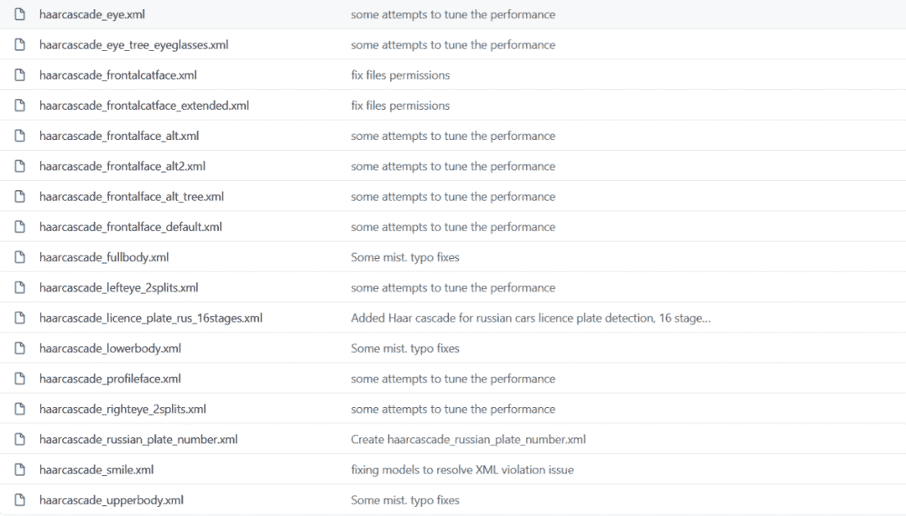

我们下载其中一个作为示例（点Raw后下载网页）。然后我们导入待识别图：

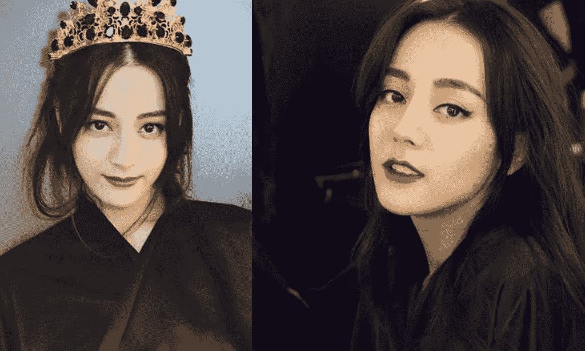

执行以下代码，即可获得人脸检测的结果：

```
img = cv2.imread("Pic/1.jpg")

face_engine = cv2.CascadeClassifier(cv2.data.haarcascades+'haarcascade_frontalface_default.xml')

faces = face_engine.detectMultiScale(img,scaleFactor=1.3,minNeighbors=5)

for (x,y,w,h) in faces:
   img = cv2.rectangle(img,(x,y),(x+w,y+h),(255,0,0),2)

cv2.imshow('img',img)
cv2.waitKey(0)
cv2.destroyAllWindows() 
```

检测结果不负众望：


我们留意到以上代码的face_engine步骤，其作用是导入人脸级联分类器引擎，'.xml'文件里包含训练出来的人脸特征。随后用人脸级联分类器引擎进行人脸识别，返回的faces为人脸坐标列表，1.3是放大比例，5是重复识别次数。

## **3.2 人脸检测和人眼检测**

我们也可以尝试前面xml文件中的人眼检测：

```
#导入opencv
import cv2

# 导入人脸级联分类器引擎，'.xml'文件里包含训练出来的人脸特征，cv2.data.haarcascades即为存放所有级联分类器模型文件的目录
face_cascade = cv2.CascadeClassifier(cv2.data.haarcascades+'haarcascade_frontalface_default.xml')
# 导入人眼级联分类器引擎吗，'.xml'文件里包含训练出来的人眼特征
eye_cascade = cv2.CascadeClassifier(cv2.data.haarcascades+'haarcascade_eye.xml')

# 读入一张图片，引号里为图片的路径，需要你自己手动设置
img = cv2.imread('image3.png')

# 用人脸级联分类器引擎进行人脸识别，返回的faces为人脸坐标列表，1.3是放大比例，5是重复识别次数
faces = face_cascade.detectMultiScale(img, 1.3, 5)

# 对每一张脸，进行如下操作
for (x,y,w,h) in faces:
   # 画出人脸框，蓝色（BGR色彩体系），画笔宽度为2
   img = cv2.rectangle(img,(x,y),(x+w,y+h),(255,0,0),2)
   # 框选出人脸区域，在人脸区域而不是全图中进行人眼检测，节省计算资源
   face_area = img[y:y+h, x:x+w]
   eyes = eye_cascade.detectMultiScale(face_area)
   # 用人眼级联分类器引擎在人脸区域进行人眼识别，返回的eyes为眼睛坐标列表
   for (ex,ey,ew,eh) in eyes:
       #画出人眼框，绿色，画笔宽度为1
       cv2.rectangle(face_area,(ex,ey),(ex+ew,ey+eh),(0,255,0),1)

# 在"img2"窗口中展示效果图
cv2.imshow('img2',img)
# 监听键盘上任何按键，如有案件即退出并关闭窗口，并将图片保存为output.jpg
cv2.waitKey(0)
cv2.destroyAllWindows()
cv2.imwrite('output.jpg',img) 
```

上面的代码最值得注意的就是face_area = img[y:y+h, x:x+w]，这一步会将人脸区域框出来，在其中执行人眼检测。同样对上图进行检测，结果如下：

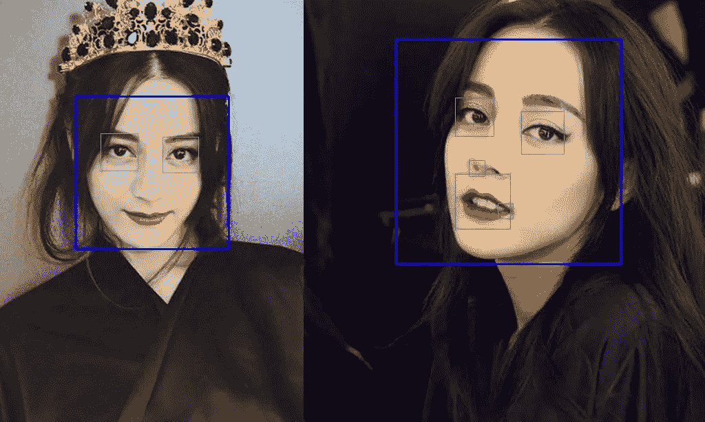

## **3.3 调用电脑摄像头进行实时人脸识别和人眼识别**

```
import cv2

face_cascade = cv2.CascadeClassifier(cv2.data.haarcascades+'haarcascade_frontalface_default.xml')

eye_cascade = cv2.CascadeClassifier(cv2.data.haarcascades+'haarcascade_eye.xml')
# 调用摄像头摄像头
cap = cv2.VideoCapture(0)

while(True):
   # 获取摄像头拍摄到的画面
   ret, frame = cap.read()
   faces = face_cascade.detectMultiScale(frame, 1.3, 5)
   img = frame
   for (x,y,w,h) in faces:
  # 画出人脸框，蓝色，画笔宽度微
       img = cv2.rectangle(img,(x,y),(x+w,y+h),(255,0,0),2)
  # 框选出人脸区域，在人脸区域而不是全图中进行人眼检测，节省计算资源
       face_area = img[y:y+h, x:x+w]
       eyes = eye_cascade.detectMultiScale(face_area)
  # 用人眼级联分类器引擎在人脸区域进行人眼识别，返回的eyes为眼睛坐标列表
       for (ex,ey,ew,eh) in eyes:
           #画出人眼框，绿色，画笔宽度为1
           cv2.rectangle(face_area,(ex,ey),(ex+ew,ey+eh),(0,255,0),1)

# 实时展示效果画面
   cv2.imshow('frame2',img)
   # 每5毫秒监听一次键盘动作
   if cv2.waitKey(5) & 0xFF == ord('q'):
       break

# 最后，关闭所有窗口
cap.release()
cv2.destroyAllWindows() 
```

本文电子版 后台回复 **Haar特征**获取


“感谢你的分享，点赞，在看三**连**↓