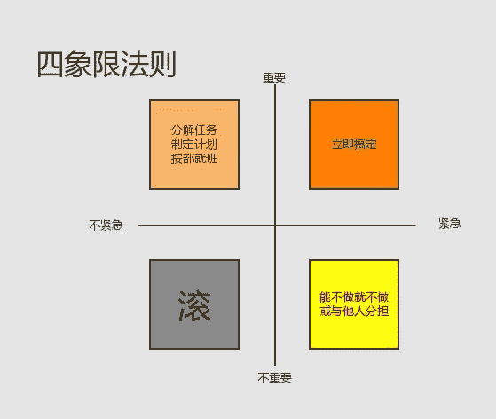

↑↑↑关注后"星标"Datawhale

每日干货 & [每月组队学习](https://mp.weixin.qq.com/mp/appmsgalbum?__biz=MzIyNjM2MzQyNg%3D%3D&action=getalbum&album_id=1338040906536108033#wechat_redirect)，不错过

 Datawhale交流 

**作者：阿布，Datawhale成员，上海大学硕士**

> 「WhaleFace」：当我们选择面对(Face)问题，解决问题便成了可能。
> 
> 明知一堆事却死活不想干，选择拖延，事情却越堆越多，尤其是在毕业季和面临找工作阶段，事情的扎堆让我感觉到压力，但是又找不到突破口。在Datawhale聊了这个话题后，才发现不是我一个人有这个困惑，索性在组织内部成立了「WhaleFace」小组，一起去厘清问题和解决问题，从面对拖延开始。
> 
> 这就是「WhaleFace」第一期的由来。

我们被各种事情包围着。要搞好学习、工作，有时还想忙里偷闲兼顾下爱好，再保养下日益稀疏的头顶和优秀到突出的腰椎间盘……要做的事简直堆满整个小宇宙。这些事情越想越觉得重要，又越堆越多，全做？做不完，单做哪件？也说不好。哎，索性两手一推，随它去吧。一边焦虑一边拖延，等到哪件事迫在眉睫，再赶着生死线干完它。好像一片叶子被风吹着、水推着，反而愈加焦虑拖延。

（是我本人了）

这种情况下，有些人会蒙住眼睛，不去面对问题，而更多的人开始发问：事情越多越拖延，恶性循环的突破口在哪里？

这也是WhaleFace第1期希望直面的问题，如果你也有相同的困惑，欢迎一起交流探讨，本文就是我们在Datawhale内部交流探讨中的整理。

## **一、问题背景**

首先回到问题根源，什么是拖延？可以先一起看看这个TED视频。

<iframe id="v0345fo484e-1594656740" src="https://v.qq.com/txp/iframe/player.html?vid=v0345fo484e" allowfullscreen="true" data-mediaembed="tencent"></iframe>

在拖延上，我们从来不是一个人。无论是某个领域的新手，还是别人眼中的大佬，当诚实地面对自己，总会发现自己或多或少存在拖延现象，现在才发现太正常了，简直就像苹果会落地一样正常。

找到「突破口」才是这个关键。

> 提起突破口，就想到“初极狭，才通人，复行数十步，豁然开朗”，仿佛只要找到这个入口就好，从这个口进去，坚持一段时间，前面总会到良田美池、阡陌纵横的桃花源。

我们向往、试图做到，却在大多时候，难以达成，所以这个问题才会引起普遍关注。

是它就不可能实现吗？

不是的，问题总有解决办法，但关键的是，你找对问题了吗？没有找对问题，就像拿着副假地图，怎么走也是在原地打转。

找不到相应方案，首先要考虑的是，我们提的问题是不是处在根源的「真问题」。这是整个过程中，最为重要的一步。

## **二、问题定义（what）**

「真问题」应当是事件的关键点，是根源，而不仅是大脑下意识呈现出的表象。如果从表象入手，不寻找事件根源，我们会发现问题如同俄罗斯套娃一样层出不穷，又像被困在了奇异博士的时间循环里，长着大长脸的问题们排着队，解决一个又来一个，怎么走都走不到尽头。

（多玛姆，我是来谈条件的 多玛姆，我是来谈条件的 多……）

> 当我们仅考虑问题的表象时，很容易受到「自动化思维」的干扰。

> 自动化思维（automatic thoughts）：在大脑的运作过程中，出于对效率与节约资源的考虑，思考过程是模糊的、跳跃的，就像一些自动化的反应。在这种状态下，思维中的一些错误观念也在不经意间被留存下来，并形成惯性思维。

> 要解决问题，首先就要摆脱自动化思维的干扰，找到背后的根源问题。

了解「真问题」的重要性，现在来看道题：

*   已知: “明知一堆事却不想干”是我们面临的现象

*   求解：什么是背后的「真问题」？

## 

**a. 厘清「一堆事」**

看看题干，这里有个容易被忽视的关键点：真的有「一堆事」要做吗？

似乎是的，眼下事情一件叠一件，争先恐后挤得脑袋都大了，衬得头上那几根头发加倍凄凉。

但当我们回忆过去，那些可以被称为转折点的事件，又有多少呢？把时间拉长一点，你会发现很多事情并没有那么重要，随着时间流逝，它会被消磨殆尽。

但就是这些不重要的事情，让人反复纠结、思考，消耗时间和精力，从而无法专注在真正有价值的事上。

破解困境，首先要厘清「一堆事」哪些才是重要的。

## 

**b. 执行「一堆事」**

在理清关键后，就是具体的落地执行了。如何高效的完成任务，也是需要我们探讨的。高效率地完成任务，不仅可以节省我们的时间，还可以通过不断的正向反馈来提高我们的自信心，减少以前赶时间匆忙做事带来的挫败感。

现在，我们寻找到了提问者面对的「真问题」：如何在繁杂事务厘清关键点，并加之执行？下一步，就是寻找相应解决方法。

## **三、解决措施（how）**

厘清问题与执行事情两部分，各介绍两种WhaleFace成员亲身验证有效的、又简单易行的方法，帮你找出最关键的事、以及如何入手。

## 

**a.厘清「一堆事」**

**方法1**：聚焦重点

老板们都说好的《高效能人士的七个习惯》中也有“要事第一”这样的表述，指在时间管理中关注重要的事，尤其是重要而不紧急的事，因为我们很容易忽略这一部分任务，然而这部分对于个人长远的发展，却起着最为关键的作用。

（时间管理的四象限法则）

四象限法则我们都快听烂了，但真到实际运用中，将所有事情罗列出来，还要每次都做个四选一的选择题，未免对新手和选择困难症患者不太友好。如果觉得这样做麻烦，不妨简化一下目标，从找到本周最重要的三件事开始。

找到这三件事，然后告诉自己，在这一周里，这三件事是最重要的，其他事完成与否都没关系，不要给自己太大压力，只要在这三件事上有所进展就好。用这个方法帮助自己聚焦关键问题。

**方法2**：找事情关联

如果事情太多，聚焦重点的方法也不灵验，或许你可以试试找到重要事情的连接，这件将几项要事关联在一起的事情，也许就是最需要关注的问题。下面这种提问形式，可以帮你更好地找到这件事：

*   重要事情间有没有内部关联？

*   是否有哪件事可以促进其他要事的发展？

*   自己在兴趣偏向上更倾向于几件重要事务中的哪一件？

> 举个例子：提问者在这一步得到的启示是，把专业知识分享一事放在关键点。毫无疑问，分享知识可以促进个人学习的；同时，我们平时的学习与工作较难以衡量，酒香也怕巷子深，而分享可以，无论是分享活动还是文章，都可以产出可查询、可量化的成果，在工作上帮助他获得业界的认可，获得更多发展机会。此外，对于提问者个人来说，分享也是他喜欢且较为擅长的事。不是说每个人都要选择“专业知识分享”这件事作为重点，而是尝试去寻找可以在长远时间内对关键目标有促进作用的事。

**b. 执行「一堆事」**

**方法3**：If...then...

常言道：一顿操作猛如虎，开始行动零点五。计划总是那么动人，但很多时候，怎样真正开始是问题所在。

你想过我们为什么会不愿意行动吗？

一般情况下，我们决定做一件事，是由理智决定的，但真正的决策权，在感性的管辖内：我是做还是不做呢？感性觉得，这件事做起来辛苦又麻烦，我选择躺着。这时你还是挣扎着起来干活，会消耗大量意志力。而意志力这个东西是限量供应的， 用完就真没有了，于是耗光了意志力，你下次还是选择躺着。

If...then...这个简单的条件语句，不仅可以帮你处理一连串的编程问题，处理起意志力困境来也得心应手。

它的原理是另辟蹊径，通过设置一个日常活动作为「触发器」，与想要完成的行动相关联，形成本能反应，绕过情感的决策过程。

举两个例子：

> 你希望每天看10页书，就告诉自己“如果我晚上刷完牙（日常活动），就开始看书（目标行动）”。

> 你希望完成论文，就告诉自己“如果我坐在书桌前（日常活动），我就坐下来写论文（目标行动）”。

这一方法的关键点在于，作为「触发器」的日常行动得是个足够小又日常的活动，这样才可以效用最大化。同时，配合下面的「两分钟法则」搭配使用，可以让你事半功倍。

**方法4**：两分钟法则

多数情况下我们不想干活，并不是真的懒惰，而是每次行动的成本太大，就像「一堆事」这个词，会造成极大压力，反而更不愿意行动。这时候不妨试一试从最省力简单的步骤开始做。无论要做的是什么事，不要思考，先去做两分钟。

比如说，想要写一篇英语论文，相对于每天花两小时在论文写作上，想到这件事就去写两分钟，是不是就轻松很多呢？

短短两分钟真的可以解决问题吗？这要提到认知的运作原理。人的大脑天生就是个偏心眼，追求快乐，喜欢成就感和掌控感。所以遇到比较辛苦的事务会产生抵触，越发不想去做。而只做两分钟是个几乎没有门槛的事情，非常容易获得成就感，得到正向反馈，自然而然地让你想做更多，更愉快地练习……所以两分钟后，最可能的结果是你简直停不下来，想继续做下去。

还有许多大同小异的方法，比如行为科学家BJ Fogg的Tiny habit，应用心理学者陈海贤的小步子原理。有兴趣可以详细了解。

**四、写在最后**

通过大家的认真分析和积极分享，我们找到了「真问题」：如何从繁杂事务中找到关键点，并开始行动。也分别介绍了聚焦重点和落实行动的简易方法。

拖延难以解决，因为这是个牵一发而动全身的问题，我们的思维方式、完美主义、时间管理、外界的反馈、对各种工具的使用……都对拖延有影响。不过探索任何一个问题，都可以用找到「真问题」，再逐个击破的方法，探寻出路。只要我们选择面对，问题就有解决的希望。WhaleFace希望成为你途中的伙伴，给你更多思路与支持。

当我们选择面对(Face)问题，解决问题便成为可能。

“为直面问题点**赞**↓