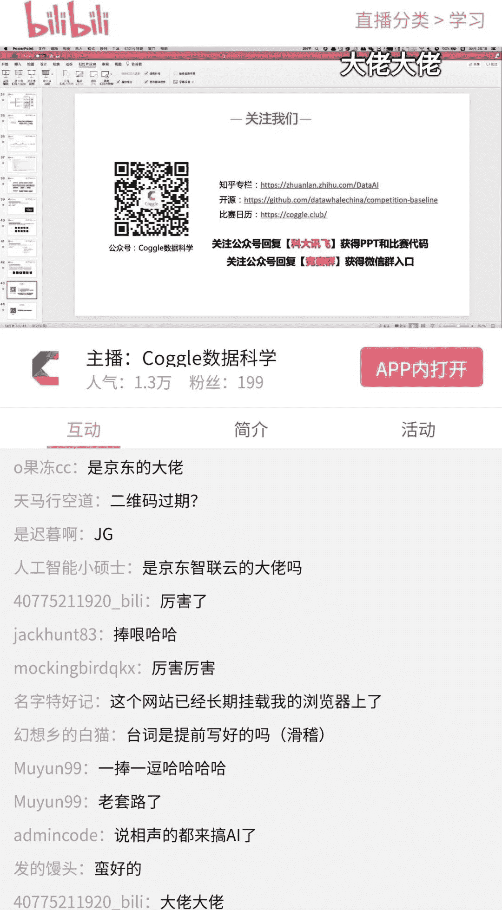

↑↑↑关注后"星标"Datawhale

每日干货 & [每月组队学习](https://mp.weixin.qq.com/mp/appmsgalbum?__biz=MzIyNjM2MzQyNg%3D%3D&action=getalbum&album_id=1338040906536108033#wechat_redirect)，不错过

 Datawhale干货 

**鱼佬，武汉大学硕士；阿水，北京航空航天大学硕士**

> 鱼佬：Datawhale成员，数据竞赛爱好者，多个赛事冠亚军选手，其中2019年获得腾讯广告算法大赛冠军，2020年获得DCIC智慧海洋建设赛冠军。
> 
> 阿水：Datawhale成员，擅长计算机视觉，天池数据大神，知乎全网阅读量20W+，数据竞赛学习开源项目发起者，目前1000+star：
> 
> https://github.com/datawhalechina/competition-baseline

晚上7点，鱼佬一个人来到阿水的家里，在长达2个小时的时间里，两个人开始渐入状态，第一次进行了深入交流……开始各自的比赛刷分经验分享。听说2小时杀进了排名前10%？是兄弟，就讲讲上分经验啊。话不多说，直接看那晚发生了什么 ↓↓↓

<iframe id="j3081l4ll6j-1594743083" src="https://v.qq.com/txp/iframe/player.html?vid=j3081l4ll6j" allowfullscreen="true" data-mediaembed="tencent"></iframe>

（特别感谢阿水的整理）

本次分享，鱼佬和阿水结合正在进行的科大讯飞AI赛事（数据挖掘，cv，nlp等多个类型赛题），从新人角度分享了比赛入门和进阶的经验，同时结合 温室温度预测挑战赛（入门级，数据挖掘类型）给出了前10%的比赛baseline，供学习参考。

比赛地址：http://challenge.xfyun.cn/?ch=dc29

没想到的是，这次在b站的分享，达到了1.3万的人气，是因为学习，还是喜欢听相声，难不成因为？欢迎在留言区给出观后感，点赞第一的，将送出由鱼佬和阿水寄出的一份百元礼物。

*鱼佬和阿水的PPT，后台回复：****科大讯飞****下载*

????比赛实践地址↓