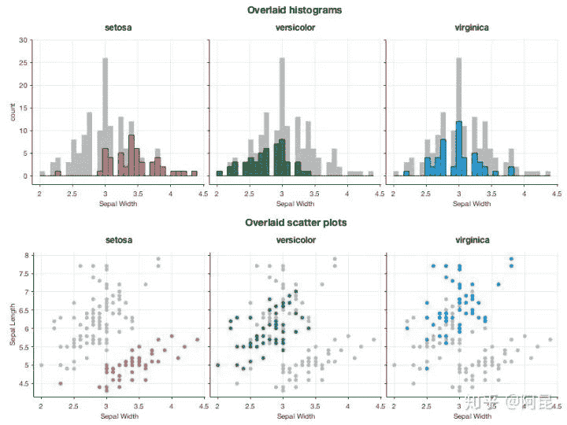
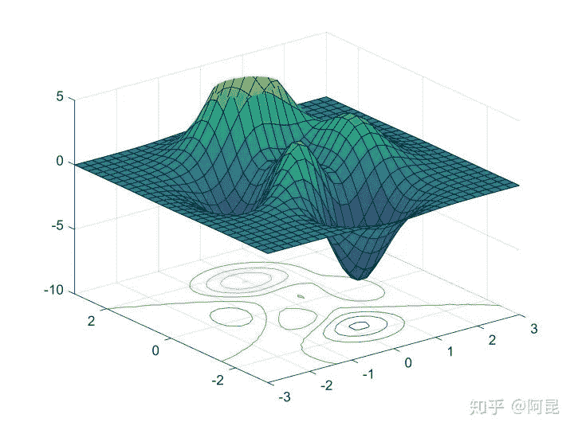

↑↑↑关注后"星标"Datawhale

每日干货 & [每月组队学习](https://mp.weixin.qq.com/mp/appmsgalbum?__biz=MzIyNjM2MzQyNg%3D%3D&action=getalbum&album_id=1338040906536108033#wechat_redirect)，不错过

 Datawhale干货 

**来源：极市平台**

## **方法一**

**作者｜冯昱尧**

https://www.zhihu.com/question/21664179/answer/18928725

强烈推荐 Python 的绘图模块 matplotlib: python plotting 。画出来的图真的是高端大气上档次，低调奢华有内涵~ 适用于从 2D 到 3D，从标量到矢量的各种绘图。能够保存成从 eps, pdf 到 svg, png, jpg 的多种格式。并且 Matplotlib 的绘图函数基本上都与 Matlab 的绘图函数名字都差不多，迁移的学习成本比较低。开源免费。如图所示（题目描述中的图在最后）：
（以下图片均引用自 Thumbnail gallery ）

像这种普通的函数图象：


```
plt.fill(x, y1, 'b', x, y2, 'r', alpha=0.3) 
```

以及这种 Scatter 图（中文不知道该怎么说…）：


```
plt.scatter(x, y, s=area, alpha=0.5) 
```

精致的曲线，半透明的配色。都显出你那高贵冷艳的X格，最重要的是只需一行代码就能搞定。从此以后再也不用忍受 Matlab以及GNUPlot 中那蛋疼的配色了。

想画 3D 数据？没有问题 (不过用 mayavi 可能更方便一些)：


```
ax.plot_surface(X, Y, Z, rstride=8, cstride=8, alpha=0.3)
cset = ax.contourf(X, Y, Z, zdir='z', offset=-100, cmap=cm.coolwarm)
cset = ax.contourf(X, Y, Z, zdir='x', offset=-40, cmap=cm.coolwarm)
cset = ax.contourf(X, Y, Z, zdir='y', offset=40, cmap=cm.coolwarm) 
```

四行代码你就能拥有（后三行是画坐标平面上的等高线，严格的额说还是一行）。

除此以外，不过你是矢量场，网络还是什么奇葩的需求都能够搞定：


```
plt.streamplot(X, Y, U, V, color=U, linewidth=2, cmap=plt.cm.autumn)
plt.colorbar() 
```


```
plt.triplot(x, y, triangles, 'go-')
plt.title('triplot of user-specified triangulation')
plt.xlabel('Longitude (degrees)')
plt.ylabel('Latitude (degrees)') 
```


```
ax = plt.subplot(111, polar=True)
bars = ax.bar(theta, radii, width=width, bottom=0.0) 
```

这还没完，Matplotlib 还支持Latex公式的插入，当别人画的图还是这个样子的时候（以下图片引用自Matplotlib Tutorial(译)）


你能够把它变成这个样子：


如果再搭配上 IPython 作为运行终端（这张图是自己的~）：


简直就是神器啊，有木有！

心动不如行动，还等什么？

经@许铖同学提醒，再补充一句，matplotlib 还可以话 xkcd 风格的图呦~


（图片引用自网络）

此外结合 IPython Notebook 后更多精彩内容，请看http://nbviewer.ipython.org/

如果嫌安装麻烦并且恰好在 Windows 系统下的话可以尝试Python的一个发行版winpython - Portable Scientific Python 2/3 32/64bit Distribution for Windows。

鉴于@van li同学质疑 matplotlib 是否能画出题目中所示的图像，我在这里将题目中的图像用 matplotlib 画出来如下：


代码在此处：

https://gist.github.com/coldfog/c479124328fc6bb8b789


代码在此处：

https://gist.github.com/coldfog/5da63a6958fc0a949b52

看到楼下有人说配色和好看，唉....那我也贴几个吧...只不过当初限于篇幅没有写而已。

首先，python 有一个专门的配色包jiffyclub/brewer2mpl 路 GitHub，提供了从美术角度来讲的精美配色（戳这里感受ColorBrewer: Color Advice for Maps）。

此外还有一些致力于美化绘图的库，用起来也都非常方便，比如olgabot/prettyplotlib 路 GitHub。

废话不多说，上图就是王道。
（一下图片来源网络）

  

有人可能会说需要复杂的设置，其实也不用。比如上边这幅图，只需要多加一个参数就好：

```
cmap=brewer2mpl.get_map('RdBu', 'diverging', 8, reverse=True).mpl_colormap, 
```

楼下说到统计绘图。嘛 seaborn (https://github.com/mwaskom/seaborn) 是一个调用 matplotlib 的统计绘图库，上图：


代码一行，后边的几乎都是一行，没做其他设置，默认就这样。我就不贴其他的代码了：

```
g = sns.jointplot(x1, x2, kind="kde", size=7, space=0) 
```

    

这还有个更炫酷的可交互式的绘图，大家自己戳开看吧：

http://nbviewer.ipython.org/github/plotly/python-user-guidechaocc/blob/master/s0_getting-started/s0_getting-started.ipynb

哼哼，完爆了吧~~~~\(≧▽≦)/~

---

遇到安装问题的请尝试Anaconda这个Python发行版。下载安装后直接使用即可，它几乎预装了所有要用到的科学计算及可视化的库。

有盆友在评论里说希望能有完整的教程，确实就这个答案来说，离实际使用还有很大的距离，网上相关的中文资料也不多。不过真要写起来这个答案也装不下，况且写在这个问题下也不是很恰当。等到那天我有专栏了再说吧，到时候也许会写一个关于可视化的系列教程。

**方法二**

**作者｜阿昆**

https://www.zhihu.com/question/21664179/answer/1182984311

翻遍这个问题下的所有回答，发现凡是提到Matlab的，其评价中常有‘锯齿’，‘菜鸟’，‘难看’，‘不忍直视’等标签。

然而，2020年了，技术提升了，观念进步了，当一些基本问题解决后，Matlab还那么‘不堪’吗？


观察Mathematica、Origin、Python/matplotlib、R/ggplot2等软件绘制的数据、结果图，其**与Matlab图的差异主要体现在点、线、面等对象属性（位置、尺寸、颜色等）的不同上**。

既然只是属性的不同，那是不是只要修改一下这些信息，就可以实现各种软件绘图风格之间的转换了呢？

答案是肯定的。

比如，这是高赞回答 @冯昱尧用Python/matplotlib绘制的一幅图：


我们用Matlab默认属性来绘制，效果是这样的（没加误差棒）：


然后，只需再修改一下位置、尺寸、颜色等信息，就可以得到风格差不多的图（没加误差棒）：


**当我们用这一思想来思考该如何绘制插图时，就很容易实现自己的小想法，仿造甚至创造出理想的插图。**

比如，某一天，发现傍晚的天空颜色很美，心想：为什么不能把它画到论文插图里呢？（见：Matlab论文插图配色2——自然渐变）

于是，

 

再比如，某一天，看到女朋友的照片，觉得很美，心想：为什么不能把她画到论文插图里呢？（见：Matlab论文插图配色1——是女朋友的颜色）

于是，


这时，有朋友就要说了：“哎呀答主，你整这些个花里花哨的东西，还不是得一行代码一行代码的敲出来啊，太麻烦了吧。”

此言差矣。

就像R有ggplot2，Python有matplotlib，Matlab其实也有很多现成的绘图工具包，并不需要你自己开发。

比如，

## Pierre Morel [1] 结合ggplot2，开发了gramm工具，用于绘制复杂图形。

> Inspired by ggplot2 (Wickham 2009), the R implementation of “grammar of graphics” principles (Wilkinson 1999), gramm improves Matlab’s plotting functionality, allowing to generate complex figures using high-level object-oriented code.

示例效果如下：

          

类似的，Stephen Cobeldick [2] 将matplotlib配色方案移植到了Matlab。

也就是说，在Matlab中就可以直接用matplotlib的配色方案了，就不必总是‘jet’了。

> The MatPlotLib 2.0 default colormaps ported to MATLAB. This submission also includes the Line ColorOrder colormaps!

示例效果如下：

 

还有很多专门针对论文插图的工具包，这里就不一一介绍了。

总的来说，工具只是工具，它们并没有高低贵贱之分。

**若想画出好看的插图，关键还是在于使用工具的人**。

集中一点，登峰造极。

本文电子版 后台回复 **插图** 获取


“竟然学习完了，给自己点个**赞**↓