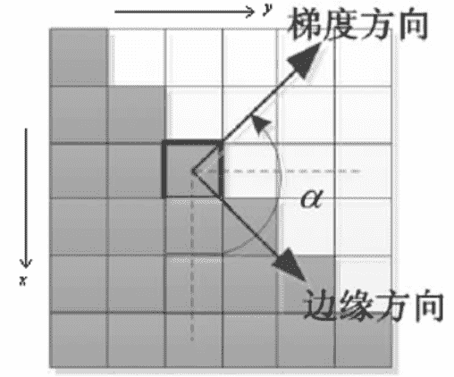
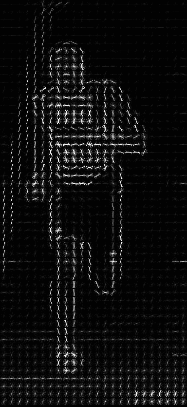

↑↑↑关注后"星标"Datawhale

每日干货 & [每月组队学习](https://mp.weixin.qq.com/mp/appmsgalbum?__biz=MzIyNjM2MzQyNg%3D%3D&action=getalbum&album_id=1338040906536108033#wechat_redirect)，不错过

 Datawhale干货 

**作者：苏丽敏，**Datawhale优秀学习者**，北理工计算机硕士**

支持向量机(Support Vector Machine)是Cortes和Vapnik于1995年首先提出的，它在解决小样本、非线性及高维模式识别中表现出许多特有的优势，并能够推广应用到函数拟合等其他机器学习问题中。

正是由于SVM具有很多独特的优势，基于SVM分类器在很多时候都具有较好的拟合作用。本文对SVM算法在行人检测项目实践中的应用进行详细讲解，同时给出调用OpenCV分类器及可视化的代码实现，便于大家学习实践。

目前的行人检测基本上都是基于法国研究人员Dalal在2005的CVPR发表的HOG+SVM的行人检测算法(Histograms of Oriented Gradients for Human Detection, Navneet Dalel,Bill Triggs, CVPR2005)。HOG+SVM作为经典算法也集成到OpenCV里面去了，可以直接调用实现行人检测。

本文目录

    1\. HOG特征描述符

        1.1\. 主要思想

        1.2\. 微观

        1.3\. 宏观（硬核）

        1.4\. HOG算法优缺点

    2. HOG特征的原理

        2.1. 图形预处理

        2.2\. 计算图像梯度

        2.3. 计算梯度直方图

        2.4. Block归一化

        2.5. 获得HOG描述子

        2.6. 使用HOG特征数据

    3\. 基于OpenCV的简单实现

        3.1\. 行人检测

        3.2\. 可视化

**一、HOG特征描述符**

HOG（Histogram of Oriented Gradients）HOG特征在对象检测与模式匹配中是一种常见的特征提取技术（深度学习之前），是基于本地像素块进行特征直方图提取的一种算法，对像局部的变形与光照影响有很好的稳定性，最初是用HOG特征来识别人像，通过HOG特征提取+SVM训练，可以得到很好的效果，OpenCV已经有相应的接口。

HOG特征是在2005年CVPR的会议发表，在图像手工特征提取方面具有里程碑式的意义，当时在行人检测领域获得了极大成功。

### **1.1 主要思想**

局部目标的外表和形状可以被局部梯度的分布很好的描述，即使我们不知道对应的梯度和边缘的位置。(本质：梯度的统计信息，梯度主要存在于边缘edge或角落corner的地方)

### **1.2 宏观**

特征描述符就是通过提取图像的有用信息，并且丢弃无关信息来简化图像的表示。

HOG特征描述符可以将3通道的彩色图像转换成一定长度的特征向量。

那么我们就需要定义什么是“有用的”，什么是“无关的”。这里的“有用”，是指对于什么目的有用，显然特征向量对于观察图像是没有用的，但是它对于像图像识别和目标检测这样的任务非常有用。当将这些特征向量输入到类似支持向量机（SVM）这样的图像分类算法中时，会得到较好的结果。

那什么样的“特征”对分类任务是有用，比如我们想检测出马路上的车道线，那么我们可以通过边缘检测来找到这些车道线，在这种情况下，边缘信息就是“有用的”，而颜色信息是无关的。

方向梯度直方图(HOG)特征描述符常和线性支持向量机(SVM)配合使用，用于训练高精度的目标分类器。

### **1.3 微观（硬核）**

在HOG特征描述符中，梯度方向的分布，也就是梯度方向的直方图被视作特征。图像的梯度(x和y导数)非常有用，因为边缘和拐角(强度突变的区域)周围的梯度幅度很大，并且边缘和拐角比平坦区域包含更多关于物体形状的信息。

HOG特征是一种图像局部特征，基本思路是将图像划分为很多小的连通区域，即细胞单元Cell，然后对Cell的梯度幅值和方向进行投票统计，形成基于梯度特性的直方图。把直方图在图像更大的范围内(又名区间或者Block)进行归一化。归一化的块描述符叫做HOG描述子feature descriptor。将检测窗口中的所有块的HOG描述子组合成最终的特征向量。然后使用SVM分类器进行目标和非目标的二分类（检测）。

HOG+SVM的工作流程如下：


首先对输入的图片进行预处理，然后计算像素点的梯度特性，包括梯度幅值和梯度方向。然后投票统计形成梯度直方图，然后对blocks进行normalize，最后收集到检测窗口的HOG feature(一行多维的vector)放入SVM里进行监督学习，实现行人的检测。接下来对上述HOG的主要步骤进行学习。

检测窗口在整个图像的所有位置和尺度进行扫描，并对输出的金字塔进行非极大值抑制来检测目标（检测窗口的大小一般为128x64）

### **1.4 HOG算法优缺点**

HOG算法具有以下优点：

*   核心思想是所检测的局部物体外形能够被梯度或边缘方向的分布所描述，HOG能较好地捕捉局部形状信息，对几何和光学变化都有很好的不变性；

*   HOG是在密集采样的图像块中求取的，在计算得到的HOG特征向量中隐含了该块与检测窗口之间的空间位置关系。

HOG算法具有以下缺点：

*   特征描述子获取过程复杂，维数较高，导致实时性差；

*   很难处理遮挡问题，人体姿势动作幅度过大或物体方向改变也不易检测（这个问题后来在DPM中采用可变形部件模型的方法得到了改善）；

*   跟SIFT相比，HOG没有选取主方向，也没有旋转梯度方向直方图，因而本身不具有旋转不变性（较大的方向变化），其旋转不变性是通过采用不同旋转方向的训练样本来实现的；

*   跟SIFT相比，HOG本身不具有尺度不变性，其尺度不变性是通过缩放检测窗口图像的大小来实现的；

*   此外，由于梯度的性质，HOG对噪点相当敏感，在实际应用中，在block和Cell划分之后，对于得到各个区域，有时候还会做一次高斯平滑去除噪点。

## **二、HOG特征的原理**

接下来让我们进入到计算图像的HOG特征描述符的具体步骤。以下面这张图片为例（宽高为100x200）:


**2.1 图形预处理**

预处理包括灰度化和Gamma变换。

灰度处理是可选操作，因为灰度图像和彩色图像都可以用于计算梯度图。对于彩色图像，先对三通道颜色值分别计算梯度，然后取梯度值最大的那个作为该像素的梯度。

然后进行伽马矫正，调节图像对比度，减少光照对图像的影响（包括光照不均和局部阴影），使过曝或者欠曝的图像恢复正常，更接近人眼看到的图像。

Gamma矫正公式： ，其中 表示图像， 表示幂指数。( 越大，图像越暗；为1时，表示没有变化。) 如图，当 取不同的值时对应的输入输出曲线( =1时输入输出保持一致) ：

1） 当 <1时，输入图像的低灰度值区域动态范围变大，进而图像低灰度值区域对比度得以增强；在高灰度值区域，动态范围变小，进而图像高灰度值区域对比度得以降低。最终，图像整体的灰度变亮。

2） 当 >1时，输入图像的低灰度值区域动态范围变小，进而图像低灰度值区域对比度得以降低；在高灰度值区域，动态范围变大，进而图像高灰度值区域对比度得以增强。最终，图像整体的灰度变暗。


代码：

```
import cv2
import numpy as np
from matplotlib import pyplot as plt
img = cv2.imread('*.png', 0)
img = cv2.cvtColor(img,cv2.COLOR_BGR2RGB)
img2 = np.power(img/float(np.max(img)),1/2.2)
plt.imshow(img2)
plt.axis('off')
plt.show() 
```

放图，左图是 ，中图是 ，右图是 ：


作者在他的博士论文里有提到，对于涉及大量的类内颜色变化，如猫，狗和马等动物，没标准化的RGB图效果更好，而牛，羊的图做gamma颜色校正后效果更好。是否用gamma校正分情况吧。(●ˇ∀ˇ●)

### **2.2 计算图像梯度**

为了得到梯度直方图，那么首先需要计算图像水平方向和垂直方向梯度。可以通过使用以下内核过滤图像实现，分别用于计算水平梯度和垂直梯度。


一般使用特定的卷积核对图像滤波实现，可选用的卷积模板有：sobel算子、Prewitt算子、Roberts模板等等。

可以使用内核大小为1的sobel算子获取相同结果，OpenCV也是如此。

利用sobel水平和垂直算子与输入图像卷积计算 、 ：

进一步得到图像梯度的幅值：

简化计算，幅值也可以做近似：

图像梯度的方向：

这里需要注意的是：梯度方向和图像边缘方向是互相正交的。



代码：

```
mport cv2
import numpy as np

# Read image
img = cv2.imread('*.jpg')
img = np.float32(img) / 255.0  # 归一化

# 计算x和y方向的梯度
gx = cv2.Sobel(img, cv2.CV_32F, 1, 0, ksize=1)
gy = cv2.Sobel(img, cv2.CV_32F, 0, 1, ksize=1)

# 计算合梯度的幅值和方向（角度）
mag, angle = cv2.cartToPolar(gx, gy, angleInDegrees=True) 
```

下图展示了梯度：


第一个图：x-梯度的绝对值，第二个图：y梯度的绝对值 ，第三个图：梯度的幅值，第四个图：角度。

注意到，x-梯度在垂直线触发，y-梯度在水平线触发。梯度的幅值在有密集的剧烈改变时触发。当区域很平缓时，梯度没有明显变化。梯度图除去了很多不必要的信息（例如有颜色的背景），强调凸显线条。当你看到梯度图像，很容易想到这张图片有一个人。
在每个像素点，梯度有一个幅值和方向。对于有颜色的图像，计算三通道的梯度（如上图所示）。一个像素点的梯度的幅值是三通道中梯度幅值最大的值，角度也是最大梯度对应的角度。

**2.3 计算梯度直方图**

此时，每一个像素点具有两个值：梯度幅值和梯度方向。

在这一步中，图像被分成若干个8×8的Cell，如下图所示，例如我们将图像resize至64x128的大小，那么这幅图像就被划分为8x16个8x8的Cell单元，并为每个8×8的Cell计算梯度直方图。当然，Cell的划分也可以是其他值：16x16，8x16等，根据具体的场景确定。


计算梯度直方图之前，先了解一下为什么要把图像分为若干个Cell?

这是因为如果对一整张梯度图逐像素计算，其中的有效特征是非常稀疏的，不但运算量大，而且会受到一些噪声干扰。使用特征描述符便提供了紧凑的表示。一个8x8的图像块包含8x8x3=192个像素值。一个8x8的Cell包含了8x8x2 = 128个值（每个像素包括梯度的大小和方向）。128个值将由9-bin的直方图（存储9个值的向量，想想坐标应该就明白了）。同时，计算Cell上的梯度直方图更具鲁棒性。逐像素计算梯度会产生噪音，直方图表示对噪音更不敏感。

在HOG中，每个8x8的Cell的梯度直方图本质是一个由9个数值组成的向量， 对应于0、20、40、60…160的梯度方向(角度)。那么原本Cell中8x8x2 = 128个值就由长度为9的向量来表示，用这种梯度直方图的表示方法，大大降低了计算量，同时又对光照等环境变化更加地鲁棒。

如下图所示，左图是衣服64x128的图像，被划分为8x16个8x8的Cell；中间的图像表示一个Cell中的梯度矢量，箭头朝向代表梯度方向，箭头长度代表梯度大小。

右图是 8×8 的Cell中表示梯度的原始数值，注意角度的范围介于0到180度之间，而不是0到360度， 这被称为“无符号”梯度，因为两个完全相反的方向被认为是相同的。 和 是相同的。（经验表明这样处理对于行人检测效果更好。）


接下来，计算Cell中像素的梯度直方图，将0-180度分成9等份，称为9个bins，分别是0，20，40…160。然后对每个bin中梯度的贡献进行统计：


这里采用加权投票统计，比如上面方向图中蓝圈包围的像素，角度为80度，这个像素对应的幅值为2，所以在直方图80度对应的bin加上2。红圈包围的像素，角度为10度，介于0度和20度之间，其幅值为4，那么这个梯度值就被按比例分给0度和20度对应的bin，也就是各加上2。


再比如：（如上图所示）某像素的梯度幅值为13.6，方向为36，36度两侧的角度bin分别为20度和40度，那么按一定加权比例分别在20度和40度对应的bin加上梯度值，加权公式为：

*   20度对应的bin：(（40-36）/20) x13.6，分母的20表示20等份，其中4份给20度对应的bin；

*   40度对应的bin：(（36-20）/20) x13.6，分母的20表示20等份,其中16份给20度对应的bin；

还有一个细节需要注意，如果某个像素的梯度角度大于160度，也就是在160度到180度之间，那么把这个像素对应的梯度值按比例分给0度和160度对应的bin。如左下图绿色圆圈中的角度为165度，幅值为85，则按照同样的加权方式将85分别加到0度和160度对应的bin中。


对整个Cell进行投票统计，最终得到9-bin直方图：


可以看到直方图中，0度和160附近有很大的权重，说明了大多数像素的梯度向上或者向下，也就是这个Cell是个横向边缘。

### **2.4 Block归一化**

HOG特征将8×8的一个局部区域作为一个Cell，再以2×2个Cell作为一组，称为一个block，也就是说一个block表示16x16的区域。

由于每个Cell有9个值，一个block（2×2个Cell）则有36个值，HOG是通过滑动窗口的方式来得到block的，如下图所示：


为什么需要分Block呢？

我们已经为图像的8×8单元构造了基于梯度的直方图，但是图像的梯度对整体光照很敏感。这意味着对于特定的图像，图像的某些部分与其他部分相比会非常明亮。虽然不能从图像中完全消除，但是可以通过使用16×16个块来对梯度进行归一化来减少这种光照变化的影响。比如通过将所有像素值除以2来使图像变暗，那么梯度幅值将减小一半，因此直方图中的值也将减小一半。

接下来对Block进行归一化。（再再再一次强调，归一化的目的是为了降低光照/迁移的影响）：

归一化的方法有很多：L1-norm、L2-norm、max/min等等，一般选择L2-norm。

例如对于一个[128，64，32]的三维向量来说，模长是：

这叫做向量的L2范数。将这个向量的每个元素除以146.64就得到了归一化向量 [0.87, 0.43, 0.22]。

现在有一个新向量，是第一个向量的2倍 [128x2, 64x2, 32x2]，也就是 [256, 128, 64]，我们将这个向量进行归一化，你可以看到归一化后的结果与第一个向量归一化后的结果相同。所以，对向量进行归一化可以消除整体光照的影响。

知道了如何归一化，现在来对block的梯度直方图进行归一化（注意不是Cell），一个block有4个直方图，将这4个直方图拼接成长度为36的向量，然后对这个向量进行归一化。

因为使用的是滑动窗口，滑动步长为8个像素，一个Cell大小，每滑动一次，就在这个窗口上进行归一化计算得到长度为36的向量，并重复这个过程。如上图所示。

### **2.5 获得HOG描述子**

每一个16x16大小的block将会得到一个长度为36x1的特征向量，并进行归一化。那会得到多大的特征向量呢？

对于上图被划分8 x16个Cell ，每个block有2x2个Cell的话，那么Cell的个数为：(8-1)x(16-1)=105。

每个16x16 block由36x1维向量，合并所有105个block的特征，最终得到由36 x105=3780维向量表示的特征描述符。

获得HOG特征向量，就可以用来可视化和分类了。对于多维的HOG特征，SVM就可以排上用场了。

介绍以下Dalal等人的训练方法：

1.  提取正负样本的HOG特征；

2.  用正负样本训练一个初始的分类器，然后由分类器生产检测器；

3.  然后用初始分类器在负样本原图上进行行人检测，检测出来的矩形区域自然都是分类错误的负样本，这就是所谓的难例(hard examples)；

4.  提取难例的HOG特征并结合第一步中的特征，重新训练，生成最终的检测器 ；

这种二次训练的处理过程显著提高了每个检测器的表现，一般可以使得每个窗口的误报率(FPPW False Positives Per Window)下降5%。

### **2.6 使用HOG特征数据**

HOG特征本身是不支持旋转不变性与多尺度检测的，但是通过构建高斯金字塔实现多尺度的开窗检测就会得到不同分辨率的多尺度检测支持，如下图所示。


OpenCV中HOG多尺度对象检测API如下：

virtual void cv::HOGDescriptor::detectMultiScale(

   InputArray  img,
   std::vector< Rect > &   foundLocations,
   double  hitThreshold = 0,
   Size    winStride = Size(),
   Size    padding = Size(),
   double  scale = 1.05,
   double  finalThreshold = 2.0,
   bool    useMeanshiftGrouping = false
)
Img-表示输入图像
foundLocations-表示发现对象矩形框
hitThreshold-表示SVM距离度量，默认0表示，表示特征与SVM分类超平面之间
winStride-表示窗口步长
padding-表示填充
scale-表示尺度空间
finalThreshold-最终阈值，默认为2.0
useMeanshiftGrouping-不建议使用，速度太慢拉

在[基于Adaboost算法的人脸检测分类器！](http://mp.weixin.qq.com/s?__biz=MzIyNjM2MzQyNg%3D%3D&chksm=e8736295df04eb838142fa0f53fa0925b9b6e312df07352e5822570c498cee5c4ecfc857bc2b&idx=1&mid=2247513048&scene=21&sn=651696eddeab5d4f4b01f57e29a8af99#wechat_redirect)这一节我们利用haar特征和级联分类器Adaboost检测人脸时我们使用过detectMultiScale()函数，级联分类器对象尝试在输入图像的不同尺度下检测对象，该函数有一个比较重要的参数scaleFactor(一般设置为1.3)，表示一个比率：即在每层金字塔中所获得的图像与上一层图像的比率，scaleFactor越小，金字塔的层数就越多，计算就越慢，计算量也会更大，但是计算结果相对更精确。

# **三、基于OpenCV的简单实现**

## **3.1 行人检测**

代码：

```
import cv2 as cv
import numpy as np
from matplotlib import pyplot as plt

if __name__ == '__main__':
    src = cv.imread("*.jpg")
    cv.imshow("input", src)

    hog = cv.HOGDescriptor()
    hog.setSVMDetector(cv.HOGDescriptor_getDefaultPeopleDetector())
    # Detect people in the image
    (rects, weights) = hog.detectMultiScale(src,
                                            winStride=(2,4),
                                            padding=(8, 8),
                                            scale=1.2,
                                            useMeanshiftGrouping=False)
    for (x, y, w, h) in rects:
        cv.rectangle(src, (x, y), (x + w, y + h), (0, 255, 0), 2)

    cv.imshow("hog-detector", src)
    cv.imwrite("hog-detector.jpg",src)
    cv.waitKey(0)
    cv.destroyAllWindows() 
```

待检测图片：


检测图片(有点不完美，调参调不动了，先酱~)：


**3.2 可视****化**

feature.log函数：

image：可以是灰度图或者彩色图；

orientations：就是把180度分成几份，也就是bin的数量；

pixels_per_Cell：一个Cell里包含的像素个数；

Cells_per_block：一个block包含的Cell个数；

visualize：是否返回一个hog图像用于显示，下面会显示这张图；

为了显示效果，把Cell的尺寸改为(16, 16)，对于每一个Cell，画出它归一化后的梯度直方图。如下图所示，我们可以很明显的看出一个人的轮廓。

```
from skimage import feature, exposure
import cv2
image = cv2.imread('hog.jpg')
fd, hog_image = feature.hog(image, orientations=9, pixels_per_Cell=(16, 16),
                    Cells_per_block=(2, 2), visualize=True)
# Rescale histogram for better display
hog_image_rescaled = exposure.rescale_intensity(hog_image, in_range=(0, 10))
cv2.imshow('img', image)
cv2.imshow('hog', hog_image_rescaled)
hog_image_rescaled = 255.0 * hog_image_rescaled
cv2.imwrite('edge_hog.jpg', hog_image_rescaled)
cv2.waitKey(0)==ord('q') 
```



本文电子版 后台回复 **行人检测** 获取


“竟然学习完了，给自己点个**赞**↓