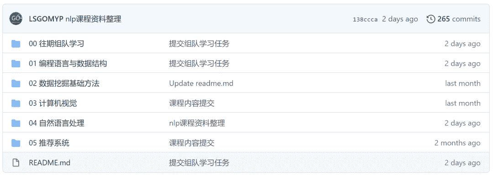
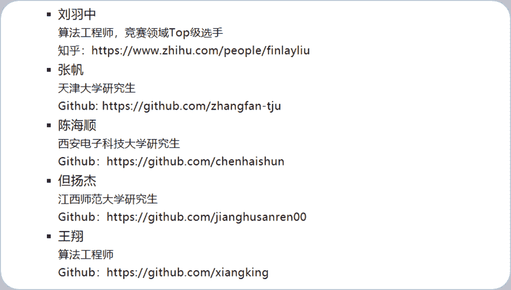
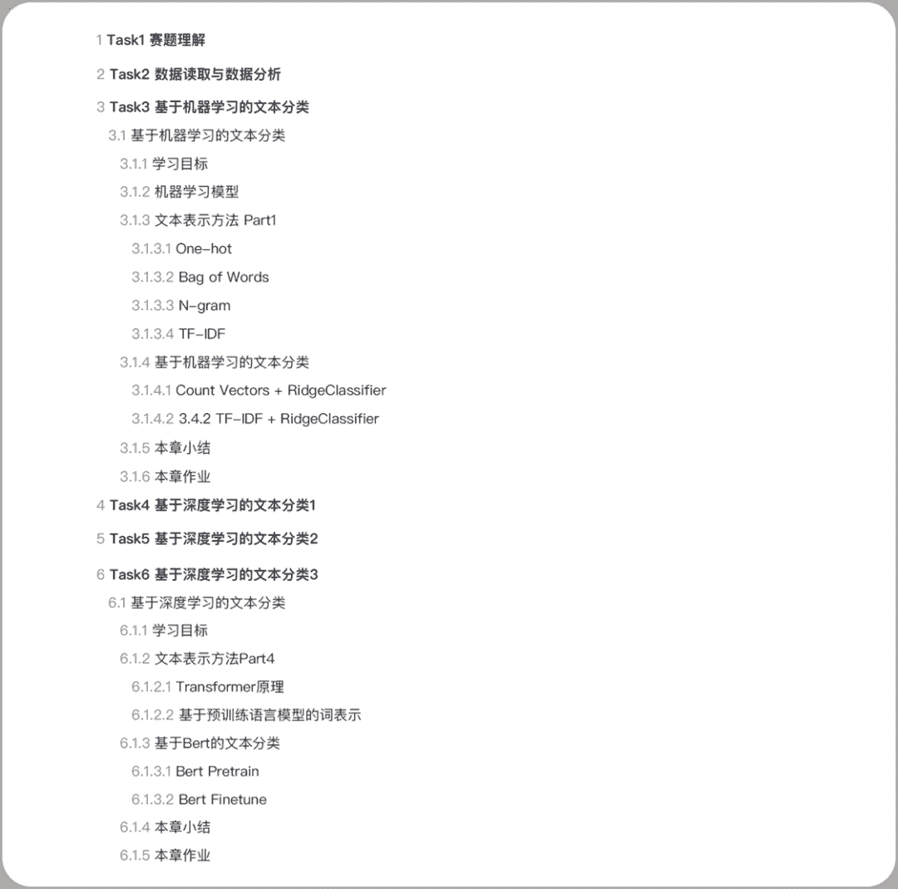
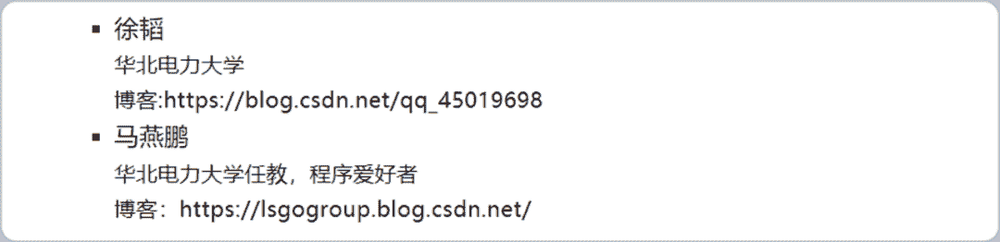
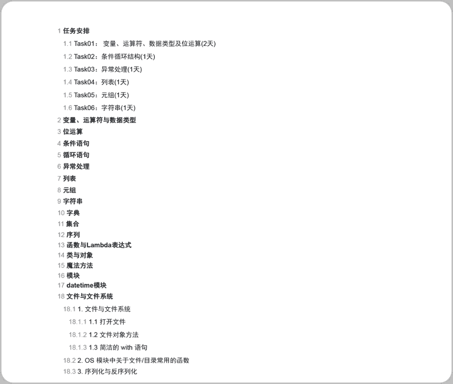
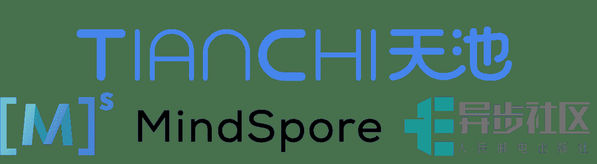

↑↑↑关注后"星标"Datawhale

每日干货 & [每月组队学习](https://mp.weixin.qq.com/mp/appmsgalbum?__biz=MzIyNjM2MzQyNg%3D%3D&action=getalbum&album_id=1338040906536108033#wechat_redirect)，不错过

 Datawhale学习 

****开源支持：阿里云天池、********MindSpore开源社区、异步社区****

本月组队学习，主要包含Python编程基础 和 NLP自然语言处理 两个学习。都说人生苦短，我用Python，自然语言处理是AI皇冠上的明珠，这次我们一石二鸟，一箭双雕，一举两得。

**一、关于开源**

Datawhale作为开源组织，更多是希望营造互促的学习氛围和纯粹的学习环境，所有学习内容和学习规划都将开源在Datawhale Github上，方便大家有监督和无监督学习，从而帮助到更多学习者成长。

**开源内容：**

截止今日，Datawhale已经开源近20门学习内容，涉及编程与数据结构、数据挖掘、cv、nlp和推荐系统五大模块，这来自每一个开源贡献者的参与。也欢迎更多被帮助的学习者，加入我们一起建设开源组织。附：[Datawhale团队第一期录取名单](http://mp.weixin.qq.com/s?__biz=MzIyNjM2MzQyNg%3D%3D&chksm=e8733174df04b8628f780941e288b4158adb7f7111fbbf6b82d78728f4ffaaeba02c8b889bb6&idx=1&mid=2247491641&scene=21&sn=eb98ebb9b13639ca7d22e91b8ad62da6#wechat_redirect)，第二期名单明晚公示。

**开源地址：**

https://github.com/datawhalechina/team-learning

**组队学习：**关于组队学习，顾名思义，就是一群志同道合的小伙伴聚集一起，一起学习，一起讨论，一起组队打boss，一起克服拖延症。其实没有老师，没有教学，有的是一群热爱学习和渴望改变的小伙伴，交流学习，互促共进。附：[自组织学习报告](http://mp.weixin.qq.com/s?__biz=MzIyNjM2MzQyNg%3D%3D&chksm=e87313f1df049ae77bcc7af8ee9496445f66bd78f5ad28ebff567d82b18b9bee05192736e14c&idx=1&mid=2247500476&scene=21&sn=dac0900cae2cfdbd603c1ce43d37fc39#wechat_redirect)。

事不宜迟，来看看这次具体有哪些内容吧。

**二、****开源内容**

本期组队学习包含 NLP自然语言处理 与 Python编程基础，具体详情如下：

## **NLP自然语言处理**

本次学习结合自然语言处理知识 和 以NLP竞赛项目为实践，将会对基于机器学习的文本分类、基于深度学习的文本分类等方法展开学习，帮助学习者对自然语言处理项目的完整流程进行梳理学习。

**开源贡献**：阿水、张帆、陈海顺、但扬杰、王翔

**开源教程**：NLP新闻文本分类实践目录

上图仅展示部分目录，***完整电子版（共50多页）***：在Datawhale后台回复 ****开源教程**** 下载

**开源地址**：http://33h.co/dZza

## **Python编程基础**

本次学习针对Python语言入门学习者，对Python的核心知识点进行了系统性梳理，帮助大家快速入门Python语言。

**开源贡献**：徐韬、马燕鹏

**开源教程**：Python编程语言目录

上图仅展示部分目录，***完整电子版（共100多页）***：在Datawhale后台回复 **开源教程** 下载

**开源地址**：http://33h.co/dZzj

**三、学习实践**

为了理论结合实践，针对NLP与Python，阿里天池作为开源支持方，为Datawhale学习提供了实践机会：

*   **NLP 项目实践**

    Datawhale与阿里天池开放了零基础入门NLP赛事「新闻文本分类」，让学习与实践相结合：

    *https://tianchi.aliyun.com/competition/entrance/531810/introduction*

*   ## **Python 编程实践**

    ## Datawhale与阿里天池开放了AI内容体验平台，为学习者提供实践环境和免费算力资源：

    ## *https://developer.aliyun.com/ai/*

同时，对于参与Datawhale学习中的优秀学习者、优秀队长，阿里天池、MindSpore开源社区、异步社区将联合颁发官方证书，对接实习等机会。

四、参与学习

**学习规则**

1\. 需交督促金3块：1块学习，1块分享，1块成长，完成所有学习后返还；

2\. 需要有一个博客等可以记录学习的公开帐号；

3\. 根据任务安排学习，完成后写学习笔记blog；

4\. 任务截止前在群内打卡，遇到问题一起交流讨论；

5\. 未按时打卡的同学视为自动放弃，流出学习群。

**报名方式**

**7月18日晚20:00**在Datawhale社群（高校群和在职群）分享本次组队学习入群二维码，学习时长**两周**左右。未在社群的小伙伴，可在公众号后台回复关键词“**在校**”或“**在职**”进群（已在的不需要重复加入！）

**五、开源支持**

*   **天池**：阿里云旗下大数据竞赛平台，围绕云生态挖掘输送优秀人才，聚集全球顶尖AI开发者，旨在打造“数据众智、众创”平台。

*   **MindSpore**：MindSpore作为国产自研的AI开源计算框架，着重提升易用性并降低AI开发者的开发门槛，通过实现AI算法即代码，使开发态变得更加友好，显著减少模型开发时间，降低模型开发门槛。

*   **人民邮电出版社异步社区**：国内领先的IT专业图书社区。致力于优质学习内容的出版和分享，实现作者与读者在线交流互动，传统出版与数字出版的融合发展。

*后台回复 ****在校*** ***或 ******在职 ****可进群学习*

“为学习和开源**点赞支持**↓