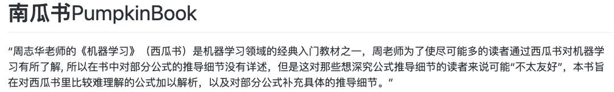
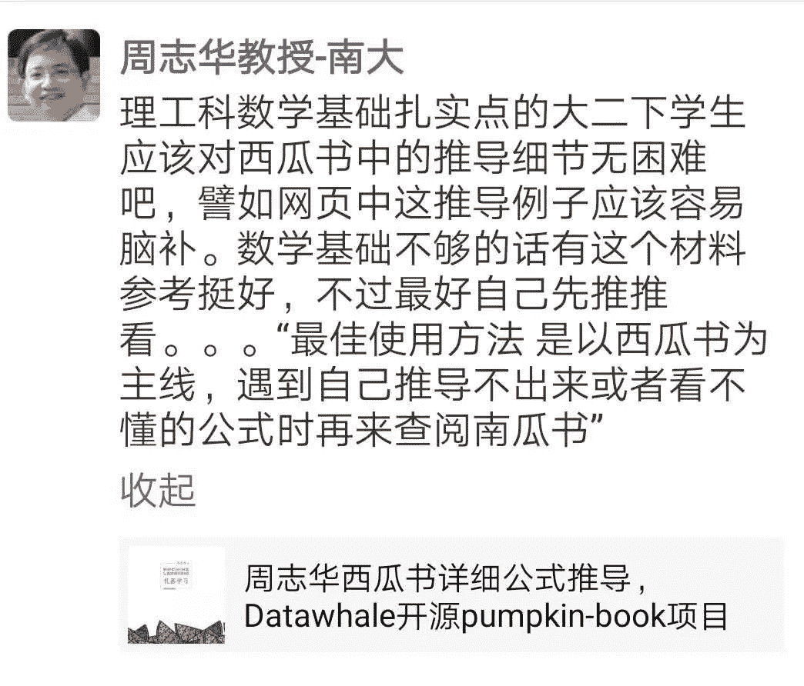
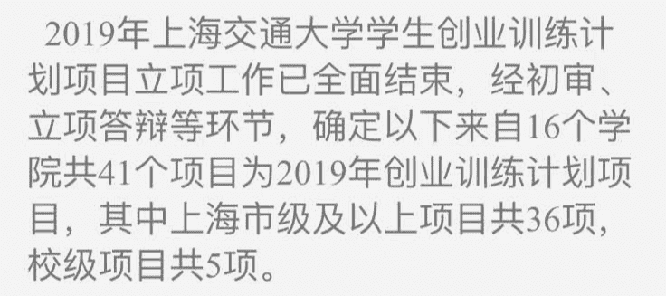
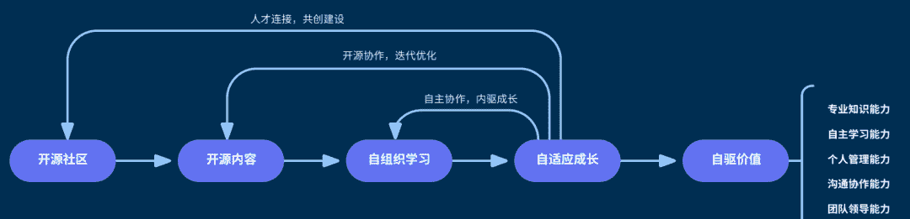
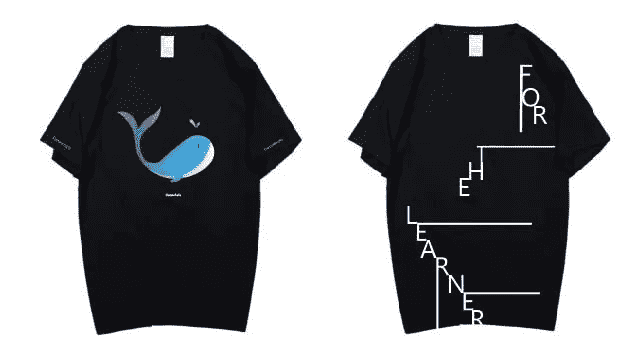
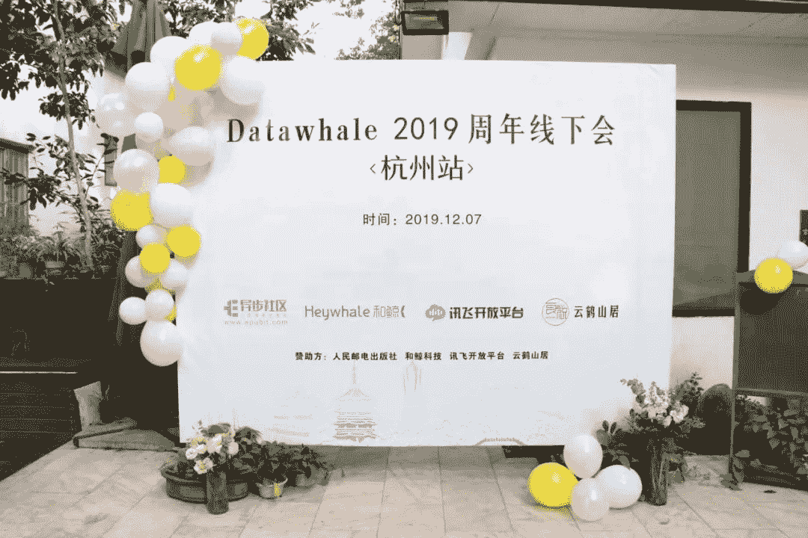
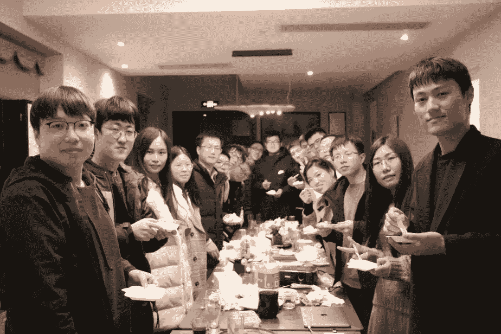
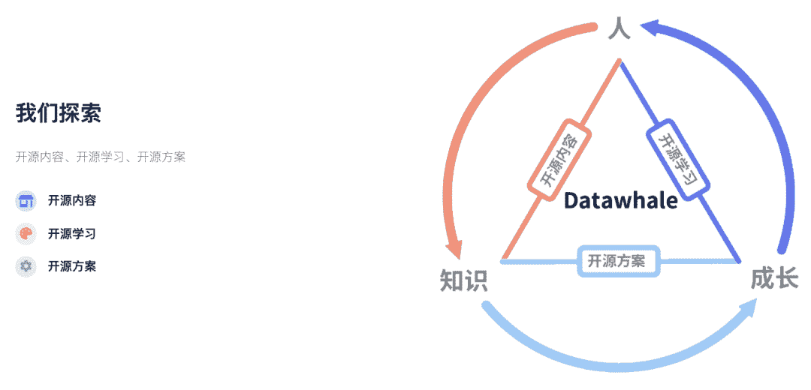

 Datawhale团队 

****公示：Datawhale组织成员****

Datawhale已经成立一年半了，从一开始的12个人，学习互助，到提议建立开源组织，做更多开源的事情，帮助更多学习者，也促进我们更好地成长。于是有了我们的愿景：“for the learner，和学习者一起成长”，希望成为国内对学习者最有价值的开源组织，也欢迎更多志同道合的伙伴一起建设开源组织。

**文末****阅读原文****，可申请加入Datawhale**

在这一年半的时间，Datawhale从发布第一个开源项目《Pumpkinook-南瓜书》。

开源地址：https://github.com/datawhalechina/pumpkin-book

惊喜于周老师分享。

设计了组织第一个鲸鱼logo。

在老师的鼓励下参与了交大项目评选，惊喜于被评为国家级项目（3/41），第一次得到学校资源和场地支持。

每月组织学习：包含了数据分析，数据挖掘，CV，NLP，机器学习，爬虫等多个领域，并将开源学习的理念首次写入[数据科学教育白皮书](http://mp.weixin.qq.com/s?__biz=MzIyNjM2MzQyNg%3D%3D&chksm=e870c9d0df0740c68ac2543b14063c68ac832032e4612007aaf34a37cc447d7d9575d22bcd0a&idx=1&mid=2247489693&scene=21&sn=accffa1372c16ac782f8e79beaa590cf#wechat_redirect)。

点击可跳转↓

[七月组队学习（nlp，Python）](http://mp.weixin.qq.com/s?__biz=MzIyNjM2MzQyNg%3D%3D&chksm=e873661bdf04ef0d06753aa384ada8bfdc3a0059c73ce50b15637f808f0ad5b6bfaa3a976896&idx=1&mid=2247513942&scene=21&sn=03af15ab0cea588cd8b8847a3ee75c95#wechat_redirect)

[六月组队学习（cv，nlp，概率统计等）](http://mp.weixin.qq.com/s?__biz=MzIyNjM2MzQyNg%3D%3D&chksm=e873121adf049b0cf6d11bb673ca5cddfb657b2ed5f82e2edd8c1e877ad8b8817ed840f9dfa1&idx=1&mid=2247500631&scene=21&sn=2706a0ee958f53b4d37d4ccd7c01beb3#wechat_redirect)

[五月组队学习（计算机视觉）](http://mp.weixin.qq.com/s?__biz=MzIyNjM2MzQyNg%3D%3D&chksm=e873339fdf04ba8920a6948b9b681b512fc03d93649bb67706c728c62747d8f16588f98ac2fb&idx=1&mid=2247492306&scene=21&sn=f78bf461e6ae56af6044c1e0b15f15f3#wechat_redirect)

[四月组队学习（数据挖掘）](http://mp.weixin.qq.com/s?__biz=MzIyNjM2MzQyNg%3D%3D&chksm=e870c69cdf074f8a1d038d52f634a80aded40c77ccd5573c43d8ba2a0623b7004d7b69524885&idx=1&mid=2247489489&scene=21&sn=5784d433b93e2315d87a825de3910e33#wechat_redirect)

设计了组织的第一件文化衫。

组织的第一个周年聚会。

开始逐步清晰我们要做些什么。

一年多的时间，我们开始有了100多个团队成员，主要来自组织成员推荐，Datawhale读者和面向组织优秀学习者定向邀请：有高校的教授，学生，也有领域的KOL，企业从业者等。在[第一期录取名单公示](http://mp.weixin.qq.com/s?__biz=MzIyNjM2MzQyNg%3D%3D&chksm=e8733174df04b8628f780941e288b4158adb7f7111fbbf6b82d78728f4ffaaeba02c8b889bb6&idx=1&mid=2247491641&scene=21&sn=eb98ebb9b13639ca7d22e91b8ad62da6#wechat_redirect)后，共收到180份新的申请（其中多位是二次申请）。

## 最终确认名单

总共收到180份申请。由组织成员范晶晶、马燕鹏、谢文睿、李碧涵、杨冰楠、刘羽中、杨煜6人进行审核。共投票选出了31位优秀的候选者，最终加权确定了20位优秀的小伙伴加入组织团队。第二期团队成员名单公示如下：

 1   韩绘锦  华北电力大学（杨煜等推荐）

 2   毛鹏志  中国科学院（张雨推荐）

 3   闫永强  深圳大学

 4   黄玉龙  中南大学

 5   杨毅远  清华大学（王琦推荐）

 6   袁明坤  西安电子科技大学 

 7   蔡富贵  北京邮电大学（范晶晶推荐）

 8   汪健麟  电子科技大学

 9   陈   锴  中山大学（游路颍推荐）

10  王复振  河北科技大学（金娟娟推荐）

11  舒   敏  海南大学

12  冷百强  清华大学

13  苏丽敏  北京理工大学（游璐颖推荐）

14  李运佳  上海交通大学（樊亮推荐）

15  李云龙  中国科学技术大学

16  杨佳乐  华东师范大学（樊亮推荐）

17  胡锐锋  华东交通大学

18  吴晓均  北京大学

19  陶言溪  北京师范大学

20  浩浩雷  华东师范大学（杨开漠推荐）

-------------------------

21  赵   可  三峡大学

22  张   晨  杭州电子科技大学

23  王云川  山东农业大学

24  李芝翔  华北电力大学

25  左秉文  华北电力大学

26  凌锦涛  江西财经大学

27  吴光辉  北京航空航天大学

28  刘晓琼  纽约州立石溪大学

29  马曾欧  伦敦大学

30  周郴莲  东北石油大学

31  张   伟  扬州大学

与此同时，了解到到大家如何接触到Datawhale，认为Datawhale存在的价值，以及对Datawhale的建议，在前行的路上共勉。

## 你是怎么了解到Datawhale的？

网络一线牵，珍惜这段缘。我们在此相遇、相识、相知。

**1\. 通过开源学习**

数据挖掘组队学习。

—小   熙

疫情刚开始时的一个公益学习。

—闫润斌

五月份在朋友的朋友圈看到，第一次报名组队学习参加了爬虫组队。

—陈   锴

今年2月在朋友推荐下一起参加了第十期学习活动，从此迷恋且一发不可收拾。

—袁明坤

**更多学习组织：****[每月组队学习](https://mp.weixin.qq.com/mp/appmsgalbum?__biz=MzIyNjM2MzQyNg%3D%3D&action=getalbum&album_id=1338040906536108033&scene=21#wechat_redirect)**

**2\. 通过开源内容**

阅读西瓜书的时候发现了南瓜书开源项目。

—袁鸿健

大三下学期，联系导师后学习机器学习相关知识时看到了LeeML-Notes。

—张   兵

2019年5月份刷github偶然看到Datawhale的南瓜书项目，后来关注了微信公众号，再后来就参加了组织的活动，一直在陪伴。

—杨佳乐

*更多学习开源：**https://github.com/datawhalechina*

**3\. 通过数据竞赛**

csdn上baseline分享。

—顾家铭

今年6月份，CV比赛学习项目。

—张   辉

2020腾讯算法大赛鱼佬的分享。

—席从勋

参加天池比赛-二手车价格预测。

—钟建平

*后台回复 **竞赛**可进入竞赛学习群*

**4\. 通过微信、知乎、CSDN等多种渠道**

通过微信公众号看到的。

—刘   阳

6月在知乎上阅读机器学习话题。

—刘   权

机缘巧合下浏览CSDN，发现有博友发关于Datawhale打卡，就关注到了，之后了解了一下感觉还蛮切合自己。

—孙子涵

开始撰写博客时看到Datawhale的文章，起初只是觉得文章很好，经过长时间在开源社区的共同探讨和行动，也渐渐被Datawhale同样想法的人感染。

—张   伟

**5\. 通过导师&朋友推荐**

做刷题项目的时候收到的朋友推荐。

—蔡富贵

通过老师接触到，然后关注了公众号并参与了组队学习。

—任   帅

2019年11月上学期跟随马老师学习数据结构与算法。

—李云龙

*感谢把 Datawhale推荐给朋友的每一个小伙伴。*

## 你认为Datawhale体现的价值？

一千个人眼里有一千个哈姆雷特，但开源、分享、学习、成长依然是众多回复里出现的高频词。

1加1是远远大于2的，Datawhale使这个效应变得更大。

—刘双超

开源与共享，建议多加推广，并邀请更多的优秀小伙伴加入，一起打造国内最大最优秀的AI组织。

—易文鑫

从我的角度来看，Datawhale正在很好的践行着自己的价值：分享，学习，并与学习者一同成长。

—任   帅

降低学习和信息获取的门槛，为有需求的人提供弱社群关系下的激励督促和协作学习，项目共建机会。

—许   浩

成为中国最大的，最有影响力的开源组织，为开源技术社区贡献自己的力量，壮大活跃开源的力量。

—闫永强

我认为Datawhale存在的价值：1、技术开源共享的理念，提供学习路线，减少学习者的畏难性，推动学习者开始学习 2、结伴式学习理念，我非常认可这种学习方式，自己单独学习，非常容易放弃。

—李云龙

Datawhale开源的活动让学习知识更容易，每个人都把自己的一些精华部分拿出来，一份价值的东西分享给1000个人就变成了1000份的价值，同时汇聚了一匹志同道合的小伙伴，大家相互学习相互成就。

—韩绘锦

我觉得Datawhale存在的价值，是一个开源学习资源的社区，帮助与分享，能帮助更多的人进步，从而实现自我价值，也为社会输送了优质人才，做出中国的开源社区。      

—黄玉龙

Datawhale首先为我们学习者提供了一个很好的学习平台，可以便捷且较系统的学习一个小方向知识。作为开源社区，感觉吸纳更好更多的建设者是比较重要的，可以分组分布式地建设各个方向，优质的项目一定会再引来优质的开发者，良性循环。同时除了学习项目，或许可开发几个对工业界或学术界有应用的工程工具类项目。希望Datawhale影响力越来越大。

—毛志鹏

相信国内的开源环境会越来越好。

*文末****阅读原文**可申请加入我们*

“给Datawhale**点个****赞**吧↓