↑↑↑关注后"星标"Datawhale

每日干货 & [每月组队学习](https://mp.weixin.qq.com/mp/appmsgalbum?__biz=MzIyNjM2MzQyNg%3D%3D&action=getalbum&album_id=1338040906536108033#wechat_redirect)，不错过

 Datawhale干货 

**编译：张峰，Datawhale成员**

**来源：TowardsDataScience**

原文链接：https://towardsdatascience.com/my-10-favorite-resources-for-learning-data-science-online-c645aa3d0afb

当我声明数据科学正在成为最受欢迎的工作领域之一时，我想你不会与我争辩，特别是考虑到《哈佛商业评论》将 "数据科学家 "评为21世纪最性感的工作。在这个领域，我们已经走过了很长的路，从数据科学和机器学习等术语还不为人所知，到一切都聚集在统计学的保护伞下的时代。然而，我们还远远没有走到终点。

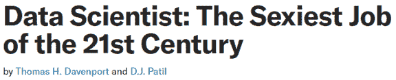

这也可能是数据科学的一个分界点——这个领域发展得非常迅速，甚至很难跟上所有新的算法、技术和方法。因此，在数据科学领域工作，与软件工程类似，往往需要不断学习和发展。正如我提到的，在数据科学领域工作可能是一个旅程。

这就是为什么在这篇文章中，我想分享我最喜欢的10个在线数据科学资源，我经常使用这些资源进行学习，并试图跟上当前的发展。这个列表将专注于在线资源(博客、视频、播客)，不会涵盖MOOCs或书籍。让我们开始吧！

# **一、****Towards Data Science 走向数据科学**

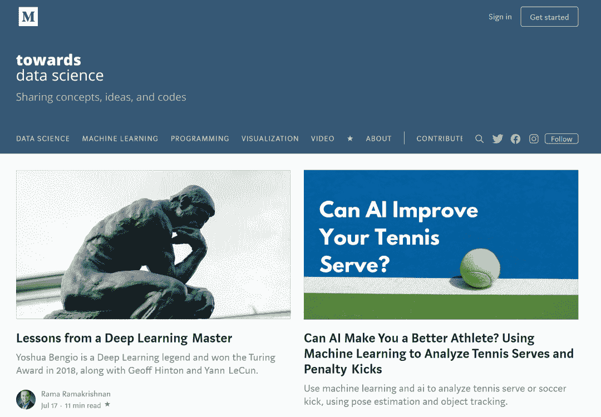

网址：https://towardsdatascience.com/

如果你正在阅读发表在《Towards Data Science》上的文章，这并不奇怪。TDS是Medium最大的出版物，涵盖所有数据科学相关的主题。你可以在这里找到：

*   兼具代码的初学者友好型教程（使用大多数流行的语言，例如Python，R，Julia，SQL等）；

*   特定ML算法或技术的深入描述；

*   有影响力的论文摘要；

*   个人宠物项目的描述；

*   该领域的最新消息；

*   以及更多！

TDS创造了一个非常好的社区，鼓励大家分享和参与。此外，我可以强烈推荐你加入时事通讯并在Twitter上关注TDS，以了解最新和最受欢迎的文章。

最后，我会推荐TowardsData Science播客，这对于想知道如何进入数据科学并找到自己完美角色的人来说特别有帮助。

# **二、PyData（会议+视频）**

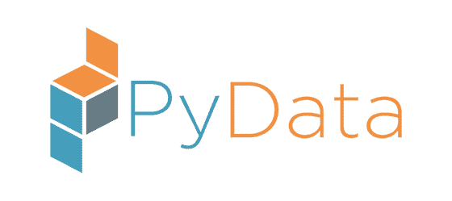

网址：https://pydata.org/

PyData是NumFOCUS的教育项目，NumFOCUS是一个非营利性的慈善机构，致力于促进研究、数据和科学计算的开放实践。他们在世界各地组织会议，鼓励研究人员和从业者分享他们的工作心得。在讲座中，你可以找到一般的Python最佳实践、数据科学家们所做的真实案例（例如，他们如何建立流失率模型，或者他们使用哪些工具来促进营销活动），以及一些新库的介绍。

根据经验，亲自参加会议是一件非常有趣的事情，因为你可以积极地参与到讲座中，提出问题，并与有共同兴趣的人建立联系。然而，人的时间是有限的，不可能线下参加所有的会议，这时你可以在他们的YouTube频道上找到所有的录播。通常情况下，每次会议结束后几个月就会发布录播。

TouTube地址：https://www.youtube.com/channel/UCOjD18EJYcsBog4IozkF_7w

PyData的讲座是一个很好的灵感来源，因为你可以看到其他公司是如何处理某个特定的主题的，也许你可以在你的公司中应用类似的方法。

# **三、Machine Learning Mastery 精通机器学习**

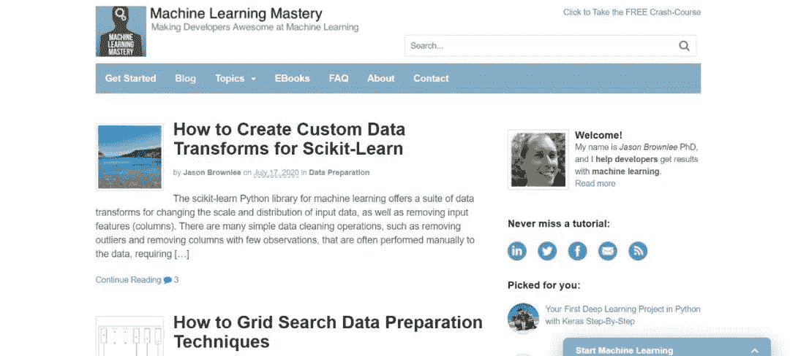

网址：https://machinelearningmastery.com/blog/

杰森·布朗利（Jason Brownlee）的网站/博客对于数据科学家来说是一座内容丰富的的金矿，特别是对于那些比较初级的科学家来说。你可以找到大量的教程，从经典的统计建模方法（线性回归，ARIMA），到最新最伟大的机器/深度学习解决方案。文章总是非常实用，并且包含将特定概念应用到特定数据集的Python代码。这个网站真正伟大的地方在于，Jason清楚地解释了概念，也为那些想要深入了解理论背景的人提供了进一步地阅读机会。你也可以按主题过滤所有文章，使得你只对不平衡学习或如何编写你的第一个LSTM网络感兴趣。

# **四、Distill**

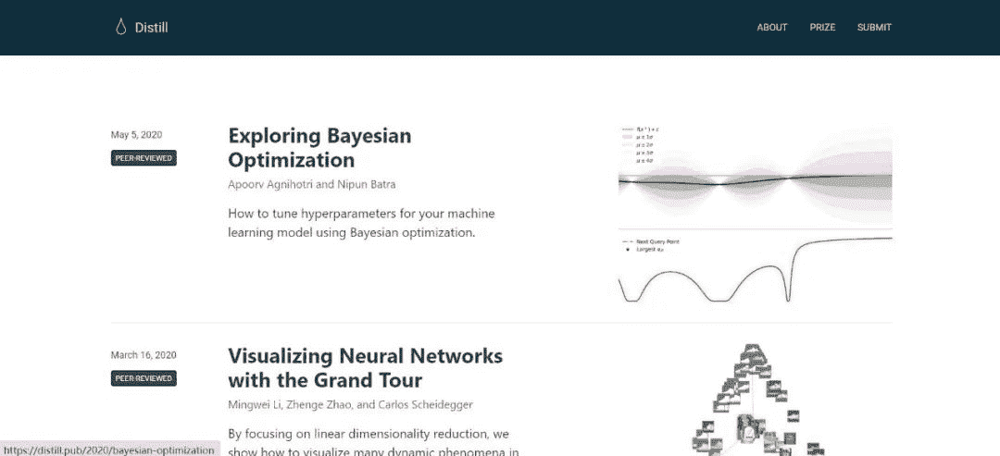

网址：https://distill.pub/

Distill旨在为机器学习概念提供清晰直观的解释。他们认为，论文往往局限于PDF文件，不一定能展示全貌。而在ML获得越来越多影响的时代，很好地理解我们所使用的工具是如何实际工作的至关重要。

Distill使用令人印象深刻的交互式可视化来清晰地解释机器学习算法幕后实际发生的事情。我最喜欢的一篇文章（https://distill.pub/2016/misread-tsne/）描述了t-SNE（t-分布式随机邻域嵌入），并展示了生成的图形如何在视觉上令人愉悦，但可能会产生误导。它还指出了超参数的重要性，提供了一个交互式的工具来直接看到影响。

如果你需要任何关于内容质量的额外保证，Distill背后的指导委员会包括Yoshua Bengio、Ian Goodfellow、Michael Nielsen、Andrej Karpathy等翘楚。

# **五、Paper With Code 有代码的论文**

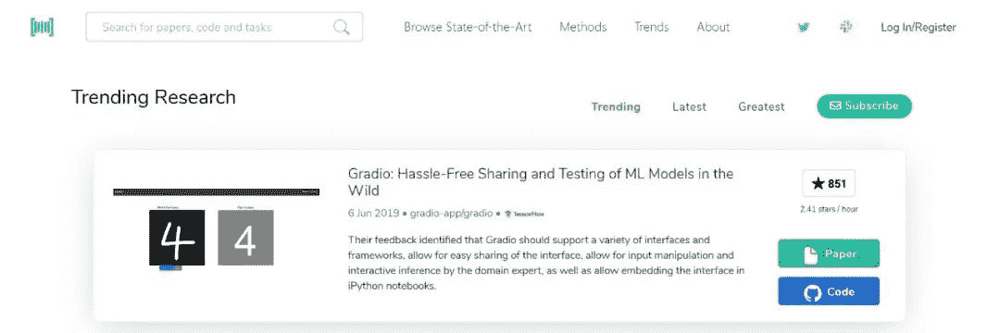

网址：https://paperswithcode.com/

PapersWith Code是一个伟大的倡议，它创建了一个免费和开放的资源库，其中包含ML论文，以及代码和评估表。你可以很容易地浏览可用的论文（包括最先进的技术），并按主题搜索，例如，计算机视觉领域的图像着色。

当你想实验一些方法或将其应用到你的数据集上时，这个网站也很方便，并不需要自己编写所有的代码。虽然这样的练习肯定是有帮助的，你会学到很多东西，但有时你只需要共同编写一个MVP，以表明一些东西确实适用于你的用例并产生增值。在获得所需的批准后，你可以全身心地投入到代码中，了解特定模型或架构的所有细微差别。

# **六、Kaggle**

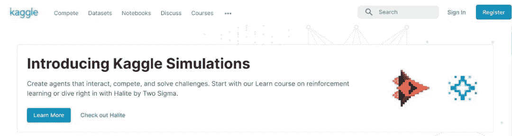

网址：https://www.kaggle.com/

Kaggle成为人们想要参加机器/深度学习竞赛的首选平台。成千上万的人参加比赛，训练最好的模型（通常是大型复杂的模型合集），以达到最好的成绩，并获得认可（和奖金）。

然而，平台本身的功能远不止于此。首先，Kaggle包含数千个Kernels/Notebook，展示了ML算法的实际实现。通常情况下，创作者还提供了对模型及其超参数的深入理论解释。

网址：https://www.kaggle.com/notebooks

这个Notebook包含了许多最流行的ML/DL算法的进一步链接，这些算法在Kaggle Kernels（包括Python和R）中实现了自定义数据集。

网址：https://www.kaggle.com/shivamb/data-science-glossary-on-kaggle

更重要的是，Kaggle还包含了许多用户上传的自定义数据集（在写这篇文章的时候，超过4万个），你可以用于自己的分析。你可以找到几乎所有能激发你兴趣的东西，从有关COVID-19的最新数据到所有神奇宝贝的统计。很多TDS的文章都是利用Kaggle的数据集进行编写的。因此，如果你想在泰坦尼克号或波士顿房屋以外的东西上练习你的技能，Kaggle是一个很好的开始。

# **七、R-博客**

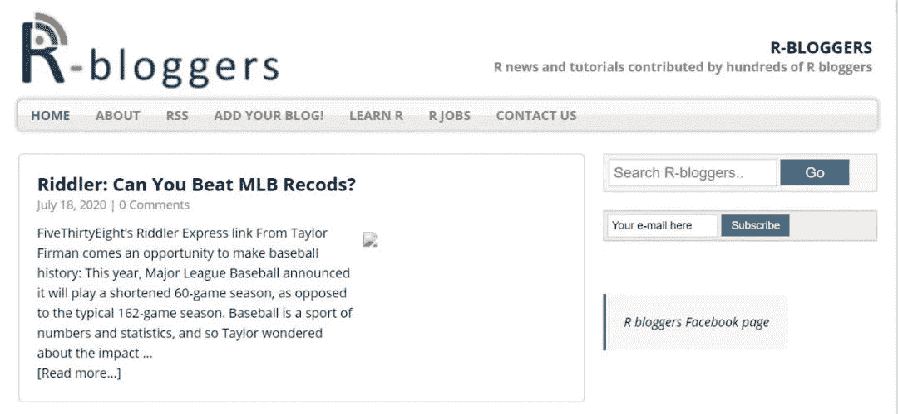

网址：https://www.r-bloggers.com/

# 我是从R开始我的数据科学之旅的，即使在把我的主要编程语言换成Python之后，我仍然关注R-bloggers。它是一个博客聚合器，涵盖了广泛的主题。虽然其中大部分是与R相关的，但通过阅读数据科学任务的一般方法，你仍然可以学到不少东西。

我认为，一个人不应该只局限于一种编程语言，而忽略了其他一切。也许你会在R中读到一个有趣的项目/包，并决定将其移植到Python中？或者，你可以使用rpy2从Python中访问R包，让你的生活更轻松。

虽然Python是目前数据科学领域的第一语言，但仍有许多包和工具没有从R移植到Python，这就是为什么我相信R-bloggers是一个非常有价值的资源，可能是将一些R功能移植到Python的灵感来源。

# **八、arXiv**

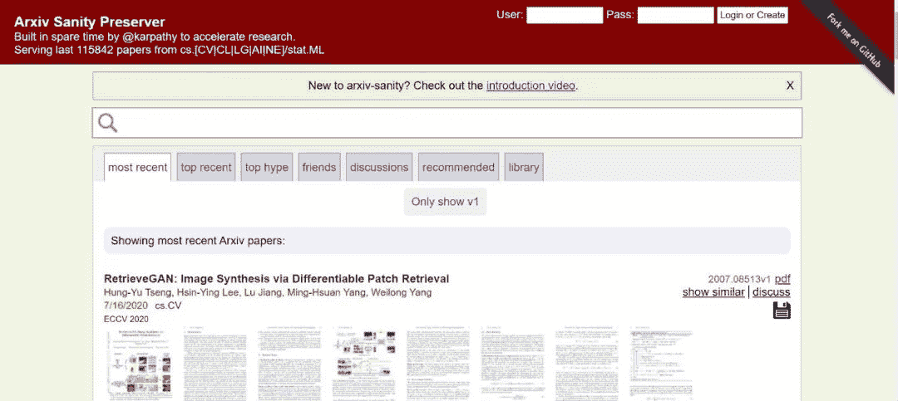

网址：http://www.arxiv-sanity.com/

arXiv是康奈尔大学开放的科学论文电子预印库，涉及计算机科学、机器学习等领域。基本上，这里是寻找最新研究和最先进算法的地方。然而，现在每天都有很多新的文章加入，基本上不可能关注所有的文章。这就是为什么Andrej Karpathy创建了ArXiv Sanity Preserver，试图过滤出最重要/相关的论文。

此外，你还可以在Twitter上关注arXiv Daily，每天都会收到一份最重要的研究文章的精选列表。友情提醒：推文的数量可能会让人难以承受。

网址：https://twitter.com/arXiv_Daily

# **九、GitHub Awesome Machine Learning**

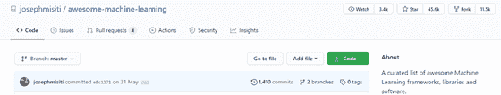

这个GitHub 仓库包含了一个精选的机器学习框架、库和一般软件的列表。为了我们的方便，它们按照语言进行了分组。

网址：https://github.com/josephmisiti/awesome-machine-learning

此外，这个仓库还包含了博客、免费书籍、在线课程、会议、聚会等列表。这个资源库绝对是非常有价值的，你可以沉浸在探索所有可用信息的过程中相当长的时间。尽情享受吧！

免费书籍地址：https://github.com/josephmisiti/awesome-machine-learning/blob/master/books.md

# **十、Twitter 推特**

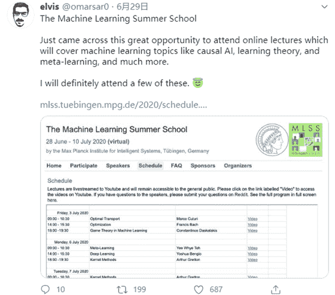

这个可能是非常主观的，因为在很多情况下，Twitter就像Facebook一样，被当作一个社交网络。然而，我尽量只用它来关注数据科学领域的人，并避免点击垃圾内容。许多研究人员、作者和其他著名的数据科学家都有活跃的Twitter账户，他们经常分享有趣/相关的内容。这是一个很好的方式来了解数据科学的最新发展和 "热门话题"。

要关注的人名单将高度依赖于你的兴趣范围，例如，如果你专注于计算机视觉的深度学习，或者可能是NLP。我建议从一些你最喜欢的作者开始，无论是书籍还是MOOCs，然后名单会自然增长，因为你会通过转发等方式接触到其他有趣的人。

# **其他有用的资源**

上面的列表绝不是详尽的，因为互联网上有很多关于数据科学的非常有用的资源。下面我列出了一些额外的资源，这些资源尽管没有进入我的前10名，但也很好，我经常使用它们：

*   KDnuggets-掘金队

    https://www.kdnuggets.com/

*   AWS-机器学习博客

    https://aws.amazon.com/blogs/machine-learning/

*   PyImageSearch

    https://www.pyimagesearch.com/

*   Explained.ai

    https://explained.ai/

*   Visual-Capitalist

    https://www.visualcapitalist.com/

*   Datais Beautiful

    https://www.reddit.com/r/dataisbeautiful/

*   AnalyticsVidhya

    https://www.analyticsvidhya.com/blog/

# 在本文中，作者向大家展示了10个国外最喜欢的数据科学学习资源，可以用来提升学习。欢迎在留言区写下你最喜欢的国内的数据科学学习资源，它给你提供了哪些帮助呢？

*本文电子版 后台回复* ***数据科学****获取*

“为沉迷学习**点赞**↓