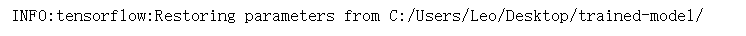
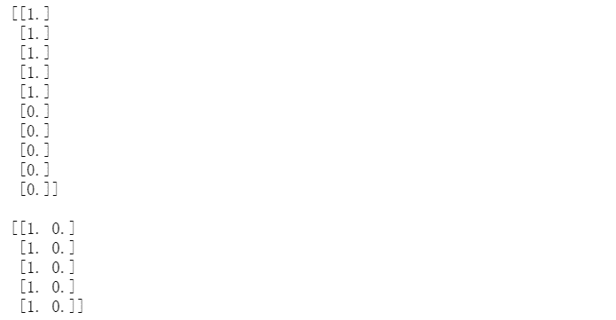

↑↑↑关注后"星标"Datawhale

每日干货 & [每月组队学习](https://mp.weixin.qq.com/mp/appmsgalbum?__biz=MzIyNjM2MzQyNg%3D%3D&action=getalbum&album_id=1338040906536108033#wechat_redirect)，不错过

 Datawhale干货 

**作者：李祖贤，**Datawhale高校群成员，深圳大学****

TensorFlow 是一个开源的、基于 Python 的机器学习框架，它由 Google 开发，提供了 Python，C/C++、Java、Go、R 等多种编程语言的接口，并在图形分类、音频处理、推荐系统和自然语言处理等场景下有着丰富的应用，是目前最热门的机器学习框架。

但不少小伙伴跟我吐苦水说Tensorflow的应用太乱了，感觉学的云里雾里，能不能搞个Tensorflow的教程呀。今天，就和大家一起梳理下TensorFlow的十大基础操作。详情如下：


## **一、Tensorflow的排序与张量**

Tensorflow允许用户把张量操作和功能定义为计算图。张量是通用的数学符号，代表保存数据值的多维列阵，张量的维数称为阶。


引用相关的库

```
import tensorflow as tf
import numpy as np 
```

获取张量的阶（从下面例子看到tf的计算过程）

```
# 获取张量的阶（从下面例子看到tf的计算过程）
g = tf.Graph()
# 定义一个计算图
with g.as_default():
    ## 定义张量t1,t2,t3
    t1 = tf.constant(np.pi)
    t2 = tf.constant([1,2,3,4])
    t3 = tf.constant([[1,2],[3,4]])

    ## 获取张量的阶
    r1 = tf.rank(t1)
    r2 = tf.rank(t2)
    r3 = tf.rank(t3)

    ## 获取他们的shapes
    s1 = t1.get_shape()
    s2 = t2.get_shape()
    s3 = t3.get_shape()
    print("shapes:",s1,s2,s3)
# 启动前面定义的图来进行下一步操作
with tf.Session(graph=g) as sess:
    print("Ranks:",r1.eval(),r2.eval(),r3.eval()) 
```


## **二、Tensorflow 计算图**

Tensorflow 的核心在于构建计算图，并用计算图推导从输入到输出的所有张量之间的关系。

假设有0阶张量a,b,c，要评估  ，可以表示为下图所示的计算图：


可以看到，计算图就是一个节点网络，每个节点就像是一个操作，将函数应用到输入张量，然后返回0个或者更多个张量作为张量作为输出。

在Tensorflow编制计算图步骤如下： 

    1\. 初始化一个空的计算图

    2\. 为该计算图加入节点（张量和操作）

    3\. 执行计算图：

        a.开始一个新的会话

        b.初始化图中的变量

        c.运行会话中的计算图

```
# 初始化一个空的计算图
g = tf.Graph()

# 为该计算图加入节点（张量和操作）
with g.as_default():
    a = tf.constant(1,name="a")
    b = tf.constant(2,name="b")
    c = tf.constant(3,name="c")

    z = 2*(a-b)+c

# 执行计算图
## 通过调用tf.Session产生会话对象，该调用可以接受一个图为参数（这里是g），否则将启动默认的空图
## 执行张量操作的用sess.run(),他将返回大小均匀的列表
with tf.Session(graph=g) as sess:
    print('2*(a-b)+c =>',sess.run(z)) 
```

```
2*(a-b)+c => 1
```

## **三、Tensorflow中的占位符**

Tensorflow有提供数据的特别机制。其中一种机制就是使用占位符，他们是一些预先定义好类型和形状的张量。

通过调用tf.placeholder函数把这些张量加入计算图中，而且他们不包括任何数据。然而一旦执行图中的特定节点就需要提供数据阵列。

**3.1 定义占位符**

```
g = tf.Graph()

with g.as_default():
    tf_a = tf.placeholder(tf.int32,shape=(),name="tf_a")  # shape=[]就是定义0阶张量,更高阶张量可以用【n1,n2,n3】表示，如shape=（3,4,5）
    tf_b = tf.placeholder(tf.int32,shape=(),name="tf_b")
    tf_c = tf.placeholder(tf.int32,shape=(),name="tf_c")

    r1 = tf_a - tf_b
    r2 = 2*r1
    z = r2 + tf_c 
```

```
3.2 为占位符提供数据 
```

当在图中处理节点的时候，需要产生python字典来为占位符来提供数据阵列。

```
with tf.Session(graph=g) as sess:
    feed = {
        tf_a:1,
        tf_b:2,
        tf_c:3
    }

    print('z:',sess.run(z,feed_dict=feed)) 
```

```
z: 1
```

**3.3 用batch_sizes为数据阵列定义占位符**

在研发神经网络模型的时候，有时会碰到大小规模不一致的小批量数据。占位符的一个功能是把大小无法确定的维度定义为None。

```
g = tf.Graph()

with g.as_default():
    tf_x = tf.placeholder(tf.float32,shape=(None,2),name="tf_x")
    x_mean = tf.reduce_mean(tf_x,axis=0,name="mean")

np.random.seed(123)
with tf.Session(graph=g) as sess:
    x1 = np.random.uniform(low=0,high=1,size=(5,2))
    print("Feeding data with shape",x1.shape)
    print("Result:",sess.run(x_mean,feed_dict={tf_x:x1}))

    x2 = np.random.uniform(low=0,high=1,size=(10,2))
    print("Feeding data with shape",x2.shape)
    print("Result:",sess.run(x_mean,feed_dict={tf_x:x2})) 
```


## **四、Tensorflow 的变量**

就Tensorflow而言，变量是一种特殊类型的张量对象，他允许我们在训练模型阶段，在tensorflow会话中储存和更新模型的参数。

**4.1 定义变量**

*   方式1：tf.Variable() 是为新变量创建对象并将其添加到计算图的类。

*   方式2：tf.get_variable()是假设某个变量名在计算图中，可以复用给定变量名的现有值或者不存在则创建新的变量，因此变量名的name非常重要！

无论采用哪种变量定义方式，直到调用tf.Session启动计算图并且在会话中具体运行了初始化操作后才设置初始值。事实上，只有初始化Tensorflow的变量之后才会为计算图分配内存。

```
g1 = tf.Graph()

with g1.as_default():
    w = tf.Variable(np.array([[1,2,3,4],[5,6,7,8]]),name="w")
    print(w) 
```


**4.2 初始化变量**

由于变量是直到调用tf.Session启动计算图并且在会话中具体运行了初始化操作后才设置初始值，只有初始化Tensorflow的变量之后才会为计算图分配内存。因此这个初始化的过程十分重要，这个初始化过程包括：为 相关张量分配内存空间并为其赋予初始值。
初始化方式：

*   方式1.tf.global_variables_initializer函数，返回初始化所有计算图中现存的变量，要注意的是：定义变量一定要造初始化之前，不然会报错！！！

*   方式2：将tf.global_variables_initializer函数储存在init_op（名字不唯一，自己定）对象内，然后用sess.run出来

```
with tf.Session(graph=g1) as sess:
    sess.run(tf.global_variables_initializer())
    print(sess.run(w)) 
```


```
# 我们来比较定义变量与初始化顺序的关系
g2 = tf.Graph()

with g2.as_default():
    w1 = tf.Variable(1,name="w1")
    init_op = tf.global_variables_initializer()
    w2 = tf.Variable(2,name="w2")

with tf.Session(graph=g2) as sess:
    sess.run(init_op)
    print("w1:",sess.run(w1)) 
```

```
w1: 1
```

```
with tf.Session(graph=g2) as sess:    sess.run(init_op)
    print("w2:",sess.run(w2)) 
```


**4.3 变量范围**

变量范围是一个重要的概念，对建设大型神经网络计算图特别有用。

可以把变量的域划分为独立的子部分。在创建变量时，该域内创建的操作与张量的名字都以域名为前缀，而且这些域可以嵌套。

```
g = tf.Graph()

with g.as_default():
    with tf.variable_scope("net_A"):   #定义一个域net_A
        with tf.variable_scope("layer-1"): # 在域net_A下再定义一个域layer-1
            w1 = tf.Variable(tf.random_normal(shape=(10,4)),name="weights")   # 该变量定义在net_A/layer-1域下
        with tf.variable_scope("layer-2"):
            w2 = tf.Variable(tf.random_normal(shape=(20,10)),name="weights")
    with tf.variable_scope("net_B"):   # 定义一个域net_B
        with tf.variable_scope("layer-2"):
            w3 = tf.Variable(tf.random_normal(shape=(10,4)),name="weights")
    print(w1)
    print(w2)
    print(w3) 
```


## **五、建立回归模型**

我们需要定义的变量：

*   1.输入x：占位符tf_x

*   2.输入y：占位符tf_y

*   3.模型参数w：定义为变量weight

*   4.模型参数b：定义为变量bias

*   5.模型输出 ̂ y^：有操作计算得到

```
import tensorflow  as tf
import numpy as np
import matplotlib.pyplot as plt
%matplotlib inline

g = tf.Graph()

# 定义计算图
with g.as_default():
    tf.set_random_seed(123)

    ## placeholder
    tf_x = tf.placeholder(shape=(None),dtype=tf.float32,name="tf_x")
    tf_y = tf.placeholder(shape=(None),dtype=tf.float32,name="tf_y")

    ## define the variable (model parameters)
    weight = tf.Variable(tf.random_normal(shape=(1,1),stddev=0.25),name="weight")
    bias = tf.Variable(0.0,name="bias")

    ## build the model
    y_hat = tf.add(weight*tf_x,bias,name="y_hat")

    ## compute the cost
    cost = tf.reduce_mean(tf.square(tf_y-y_hat),name="cost")

    ## train the model
    optim = tf.train.GradientDescentOptimizer(learning_rate=0.001)
    train_op = optim.minimize(cost,name="train_op") 
```

```
# 创建会话启动计算图并训练模型
## create a random toy dataset for regression
np.random.seed(0)
def make_random_data():
    x = np.random.uniform(low=-2,high=4,size=100)
    y = []
    for t in x:
        r = np.random.normal(loc=0.0,scale=(0.5 + t*t/3),size=None)
        y.append(r)
    return x,1.726*x-0.84+np.array(y)

x,y = make_random_data()

plt.plot(x,y,'o')
plt.show() 
```


```
## train/test splits
x_train,y_train = x[:100],y[:100]
x_test,y_test = x[100:],y[100:]

n_epochs = 500
train_costs  = []
with tf.Session(graph=g) as sess:
    sess.run(tf.global_variables_initializer())

    ## train the model for n_epochs
    for e in range(n_epochs):
        c,_ = sess.run([cost,train_op],feed_dict={tf_x:x_train,tf_y:y_train})
        train_costs.append(c)
        if not e % 50:
            print("Epoch %4d: %.4f"%(e,c))
plt.plot(train_costs)
plt.show() 
```


**六、在Tensorflow计算图中用张量名执行对象**

只需要把

```
sess.run([cost,train_op],feed_dict={tf_x:x_train,tf_y:y_train}) 
```

改为

```
sess.run(['cost:0','train_op:0'],feed_dict={'tf_x:0':x_train,'tf_y:0':y_train}) 
```

注意：只有张量名才有：0后缀，操作是没有：0后缀的，例如train_op并没有train_op：0

```
## train/test splits
x_train,y_train = x[:100],y[:100]
x_test,y_test = x[100:],y[100:]

n_epochs = 500
train_costs  = []
with tf.Session(graph=g) as sess:
    sess.run(tf.global_variables_initializer())

    ## train the model for n_epochs
    for e in range(n_epochs):
        c,_ = sess.run(['cost:0','train_op'],feed_dict={'tf_x:0':x_train,'tf_y:0':y_train})
        train_costs.append(c)
        if not e % 50:
            print("Epoch %4d: %.4f"%(e,c)) 
```


## **七、在Tensorflow中储存和恢复模型**

神经网络训练可能需要几天几周的时间，因此我们需要把训练出来的模型储存下来供下次使用。

储存的方法是在定义计算图的时候加入：saver = tf.train.Saver()，并且在训练后输入saver.save(sess,'./trained-model')

```
g = tf.Graph()

# 定义计算图
with g.as_default():
    tf.set_random_seed(123)

    ## placeholder
    tf_x = tf.placeholder(shape=(None),dtype=tf.float32,name="tf_x")
    tf_y = tf.placeholder(shape=(None),dtype=tf.float32,name="tf_y")

    ## define the variable (model parameters)
    weight = tf.Variable(tf.random_normal(shape=(1,1),stddev=0.25),name="weight")
    bias = tf.Variable(0.0,name="bias")

    ## build the model
    y_hat = tf.add(weight*tf_x,bias,name="y_hat")

    ## compute the cost
    cost = tf.reduce_mean(tf.square(tf_y-y_hat),name="cost")

    ## train the model
    optim = tf.train.GradientDescentOptimizer(learning_rate=0.001)
    train_op = optim.minimize(cost,name="train_op")
    saver = tf.train.Saver()
# 创建会话启动计算图并训练模型
## create a random toy dataset for regression
np.random.seed(0)
def make_random_data():
    x = np.random.uniform(low=-2,high=4,size=100)
    y = []
    for t in x:
        r = np.random.normal(loc=0.0,scale=(0.5 + t*t/3),size=None)
        y.append(r)
    return x,1.726*x-0.84+np.array(y)

x,y = make_random_data()

plt.plot(x,y,'o')
plt.show()

## train/test splits
x_train,y_train = x[:100],y[:100]
x_test,y_test = x[100:],y[100:]

n_epochs = 500
train_costs  = []
with tf.Session(graph=g) as sess:
    sess.run(tf.global_variables_initializer())

    ## train the model for n_epochs
    for e in range(n_epochs):
        c,_ = sess.run(['cost:0','train_op'],feed_dict={'tf_x:0':x_train,'tf_y:0':y_train})
        train_costs.append(c)
        if not e % 50:
            print("Epoch %4d: %.4f"%(e,c))
    saver.save(sess,'C:/Users/Leo/Desktop/trained-model/') 
```


```
# 加载保存的模型g2 = tf.Graph()
with tf.Session(graph=g2) as sess:
    new_saver = tf.train.import_meta_graph("C:/Users/Leo/Desktop/trained-model/.meta")
    new_saver.restore(sess,'C:/Users/Leo/Desktop/trained-model/')
    y_pred = sess.run('y_hat:0',feed_dict={'tf_x:0':x_test}) 
```



```
## 可视化模型
x_arr = np.arange(-2,4,0.1)
g2 = tf.Graph()
with tf.Session(graph=g2) as sess:
    new_saver = tf.train.import_meta_graph("C:/Users/Leo/Desktop/trained-model/.meta")
    new_saver.restore(sess,'C:/Users/Leo/Desktop/trained-model/')
    y_arr = sess.run('y_hat:0',feed_dict={'tf_x:0':x_arr})
    plt.figure()
    plt.plot(x_train,y_train,'bo')
    plt.plot(x_test,y_test,'bo',alpha=0.3)
    plt.plot(x_arr,y_arr.T[:,0],'-r',lw=3)
    plt.show() 
```


## **八、把张量转换成多维数据阵列**

**8.1 获得张量的形状**

在numpy中我们可以用arr.shape来获得Numpy阵列的形状，而在Tensorflow中则用tf.get_shape函数完成：

注意：在tf.get_shape函数的结果是不可以索引的，需要用as.list()换成列表才能索引。

```
g = tf.Graph()

with g.as_default():
    arr = np.array([[1.,2.,3.,3.5],[4.,5.,6.,6.5],[7.,8.,9.,9.5]])
    T1 = tf.constant(arr,name="T1")
    print(T1)
    s = T1.get_shape()
    print("Shape of T1 is ",s)
    T2 = tf.Variable(tf.random_normal(shape=s))
    print(T2)
    T3 = tf.Variable(tf.random_normal(shape=(s.as_list()[0],)))
    print(T3) 
```


**8.2 改变张量的形状**

现在来看看Tensorflow如何改变张量的形状，在Numpy可以用np.reshape或arr.reshape，在一维的时候可以用-1来自动计算最后的维度。在Tensorflow内调用tf.reshape

```
with g.as_default():
    T4 = tf.reshape(T1,shape=[1,1,-1],name="T4")
    print(T4)
    T5 = tf.reshape(T1,shape=[1,3,-1],name="T5")
    print(T5) 
```


```
with tf.Session(graph=g) as sess:
    print(sess.run(T4))
    print()
    print(sess.run(T5)) 
```


**8.3 将张量分裂为张量列表**

```
with g.as_default():
    tf_splt = tf.split(T5,num_or_size_splits=2,axis=2,name="T8")
    print(tf_splt) 
```


**8.4 张量的拼接**

```
g = tf.Graph()

with g.as_default():
    t1 = tf.ones(shape=(5,1),dtype=tf.float32,name="t1")
    t2 = tf.zeros(shape=(5,1),dtype=tf.float32,name="t2")
    print(t1)
    print(t2) 
```


```
with g.as_default():
    t3 = tf.concat([t1,t2],axis=0,name="t3")
    print(t3)
    t4 = tf.concat([t1,t2],axis=1,name="t4")
    print(t4) 
```


```
with tf.Session(graph=g) as sess:
    print(t3.eval())
    print()
    print(t4.eval()) 
```


```
with tf.Session(graph=g) as sess:    print(sess.run(t3))
    print()
    print(sess.run(t4)) 
```



**九、利用控制流构图**

这里主要讨论在Tensorflow执行像python一样的if语句，循环while语句，if...else..语句等。

**9.1 条件语句**

tf.cond()语句我们来试试：


```
x,y = 1.0,2.0

g = tf.Graph()

with g.as_default():
    tf_x = tf.placeholder(dtype=tf.float32,shape=None,name="tf_x")
    tf_y = tf.placeholder(dtype=tf.float32,shape=None,name="tf_y")
    res = tf.cond(tf_x<tf_y,lambda: tf.add(tf_x,tf_y,name="result_add"),lambda: tf.subtract(tf_x,tf_y,name="result_sub"))
    print("Object:",res)  #对象被命名为"cond/Merge:0"

with tf.Session(graph=g) as sess:
    print("x<y: %s -> Result:"%(x<y),res.eval(feed_dict={"tf_x:0":x,"tf_y:0":y}))
    x,y = 2.0,1.0
    print("x<y: %s -> Result:"%(x<y),res.eval(feed_dict={"tf_x:0":x,"tf_y:0":y})) 
```


**9.2 执行python的if...else语句**

tf.case()

```
f1 = lambda: tf.constant(1)
f2 = lambda: tf.constant(0)
result = tf.case([(tf.less(x,y),f1)],default=f2)
print(result) 
```


**9.3 执行python的while语句**

tf.while_loop()

```
i = tf.constant(0)
threshold = 100
c = lambda i: tf.less(i,100)
b = lambda i: tf.add(i,1)
r = tf.while_loop(cond=c,body=b,loop_vars=[i])
print(r) 
```


## **十、用TensorBoard可视化图**

TensorBoard是Tensorflow一个非常好的工具，它负责可视化和模型学习。可视化允许我们看到节点之间的连接，探索它们之间的依赖关系，并且在需要的时候进行模型调试。

```
def build_classifier(data, labels, n_classes=2):
    data_shape = data.get_shape().as_list()
    weights = tf.get_variable(name='weights',
                              shape=(data_shape[1], n_classes),
                              dtype=tf.float32)
    bias = tf.get_variable(name='bias',
                           initializer=tf.zeros(shape=n_classes))
    print(weights)
    print(bias)
    logits = tf.add(tf.matmul(data, weights),
                    bias,
                    name='logits')
    print(logits)
    return logits, tf.nn.softmax(logits)

def build_generator(data, n_hidden):
    data_shape = data.get_shape().as_list()
    w1 = tf.Variable(
        tf.random_normal(shape=(data_shape[1],
                                n_hidden)),
        name='w1')
    b1 = tf.Variable(tf.zeros(shape=n_hidden),
                     name='b1')
    hidden = tf.add(tf.matmul(data, w1), b1,
                    name='hidden_pre-activation')
    hidden = tf.nn.relu(hidden, 'hidden_activation')

    w2 = tf.Variable(
        tf.random_normal(shape=(n_hidden,
                                data_shape[1])),
        name='w2')
    b2 = tf.Variable(tf.zeros(shape=data_shape[1]),
                     name='b2')
    output = tf.add(tf.matmul(hidden, w2), b2,
                    name = 'output')
    return output, tf.nn.sigmoid(output)

batch_size=64
g = tf.Graph()

with g.as_default():
    tf_X = tf.placeholder(shape=(batch_size, 100),
                          dtype=tf.float32,
                          name='tf_X')
    ## build the generator
    with tf.variable_scope('generator'):
        gen_out1 = build_generator(data=tf_X,
                                   n_hidden=50)

    ## build the classifier
    with tf.variable_scope('classifier') as scope:
        ## classifier for the original data:
        cls_out1 = build_classifier(data=tf_X,
                                    labels=tf.ones(
                                        shape=batch_size))

        ## reuse the classifier for generated data
        scope.reuse_variables()
        cls_out2 = build_classifier(data=gen_out1[1],
                                    labels=tf.zeros(
                                        shape=batch_size))

        init_op = tf.global_variables_initializer() 
```


```
with tf.Session(graph=g) as sess:
    sess.run(tf.global_variables_initializer())
    file_writer = tf.summary.FileWriter(logdir="C:/Users/Leo/Desktop/trained-model/logs/",graph=g) 
```

在win+R输入cmd后输入命令：

```
tensorboard --logdir="C:/Users/Leo/Desktop/trained-model/logs" 
```


接着复制这个链接到浏览器打开：


*本文电子版 后台回复* ***TF** 获取*


“给Datawhale**点个****赞**吧↓