↑↑↑关注后"星标"Datawhale

每日干货 & [每月组队学习](https://mp.weixin.qq.com/mp/appmsgalbum?__biz=MzIyNjM2MzQyNg%3D%3D&action=getalbum&album_id=1338040906536108033#wechat_redirect)，不错过

 Datawhale干货 

**作者：芙蕖，****Datawhale优秀学习者**，东北石油大学****

> 对于英文来说，文字的粒度从细到粗依次是character, subword, word，character和word都很好理解，分别是字母和单词。而subword相当于英文中的词根、前缀、后缀等，如unfortunately中的un、ly、fortun(e)等就是subword，它们都是有含义的。

之前介绍的模型都是基于词向量的, 那么能不能换一个角度来表示语言。说英文的时候, 每个单词都是由音节构成的, 而人们听到了连续的音节就可以理解其中的含义, 而音节显然比词粒度更细。

首先，来梳理下word-level存在的几个问题:

*   需要系统需要极大的词汇量;

*   如果遇到了不正式的拼写, 系统很难进行处理;

*   做翻译问题时, 音译姓名比较难做到。

为了解决这些问题, 一开始想到的是采用character级别的模型，即对26个字母训练word2vec，每个词由其字母的embedding拼接或者求平均得到。但这种方法梯度消失（爆炸）的问题也会更严重。

后来，人们就想用subword模型作为character和word的折中模型。subword模型主要有两种，它们都能解决未登录词（OOV）的问题。第一种是模型结构和word模型完全一样，只不过把word换成了subword。第二种则是word和character模型的杂交模型。

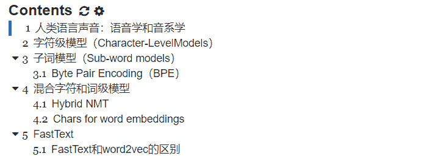

## **一、人类语言声音：语音学和音系学**

*   语音学(Phonetics)是一种非常基本的理论，只要是正常人，有着相同的人体器官和相同的发声结构，就会遵循着相同的发声规则和原理。

*   语音体系(Phonology)是有语义的声音的合集，各国各文明的人都会制定自己的语音体系。

*   音素(Phoneme)是语音中划分出来的最小的语音单位，分为元音和辅音

国际音标(由音素构成)按理来说可以表示所有的语音，但是会发现好多语音是没有语义的，这时我们采取的办法就是看音素的下一级(part of words)。

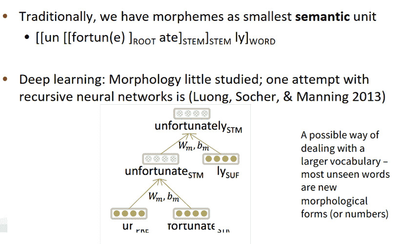

词法学：一个n-grams的代替方案。在基于单词的模型中存在一些问题：需要处理很大的词汇表，在英语中单词只要变个形态就是另一个单词了，比如说：gooooood bye

## **二、字符级模型（Character-LevelModels）**

通常针对字符级的模型有两种处理思路：一种是把原有的词向量分解处理，一种是把连接的语言分解成字符。

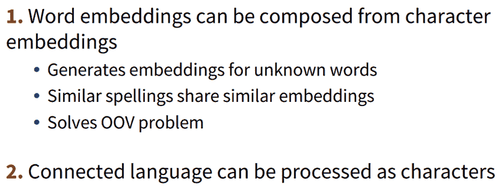

单词嵌入可以由字符嵌入表示：

1.  能为不知道的单词生成嵌入

2.  相似的拼写有相似的嵌入

3.  解决了oov问题

这两种方法都被证明是成功的。后续也有很多的工作使用字符级的模型来解决NMT任务。但这些任务有一些共同的缺点，由于从单词替换成字符导致处理的序列变长，速度变慢；由于序列变长，数据变得稀疏，数据之间的联系的距离变大，不利于学习。于是2017年，Jason等人发表了论文Fully Character-Level Neural MachineTranslation without Explicit Segmentation 解决了这些问题。

论文的模型结构如图所示：

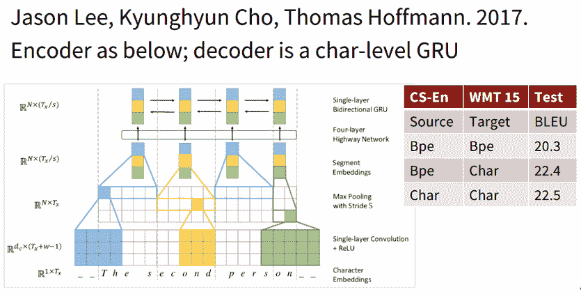

首先是对输入的character首先做一个embedding, 然后分别与大小为3，4，5的filter进行卷积运算，就相当于3-grams, 4-grams和5-grams。之后进行max-pooling操作，相当与选出了有语义信息的segment-embedding。之后将这些embedding送入Highway Network(相当于resnet, 解决了深层神经网络不容易训练的问题)后再通过一个单层的双向GRU，得到最终的encoder的output。之后经过一个character-level的GRU(作为decoder)得到最终结果。

还有一篇2018年的文章（Revisiting Character-Based Neural Machine Translation with Capacity andCompression. 2018.Cherry, Foster, Bapna, Firat, Macherey, Google AI）中展示了纯字符级模型的效果。此论文表明在一些复杂的语言中(比如捷克语)，character级别的模型会大幅提高翻译准确率，但在较为简单的语言中(如英语法语)，character级别的模型提升效果不显著。同时，研究发现在模型较小时word-level的模型效果更好，在模型较大时character-level 的效果更好。如图所示：

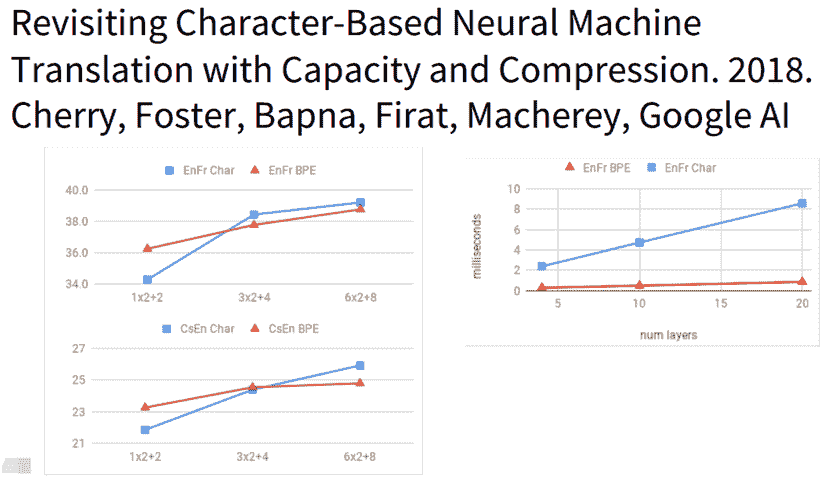

总之，现有的character-level的模型在NMT任务上可以更好的处理OOV的问题，可以理解为我们可以学习一些字符级别的语义信息帮助我们进行翻译。

## **三、子词模型（Sub-word models）**

所谓subword，就是取一个介于字符和单词之间成分为基本单元建立的模型。而所谓Byte Pair Encoding(一下简称BPE)，就是寻找经常出现在一起的Byte对，合并成一个新的Byte加入词汇库中。即若给定了文本库，若我们的初始词汇库包含所有的单个字符，则我们会不断的将出现频率最高的n-gram的pair作为新的n-gram加入词汇库中，直到达到我们的要求。

课程在这里介绍了介于word-level和char-leval之间的Sub-word models，主要一般有两种结构，一种是仍采用和word-level相同的结构，只不过采用更小的单元word pieces来代替单词；另一种是hybrid architectures, 主要部分依然是基于word, 但是其他的一些部分用characters。

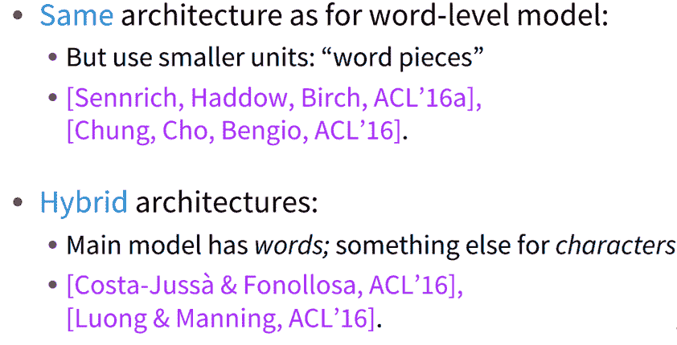

Hybrid architectures：主要的模型含有单词，一些其他的含有字符、字节对的编码。使用的是一个压缩算法：将大部分频繁出现的字节对标记为新的字节对。

### **3.1 Byte Pair Encoding（BPE）**

Byte Pair Encoding,简称BPE，是一种压缩算法。

给定了文本库，我们的初始词汇库仅包含所有的单个的字符，然后不断的将出现频率最高的n-gram pair作为新的n-gram加入到词汇库中，直到词汇库的大小达到我们所设定的某个目标为止。如图所示：

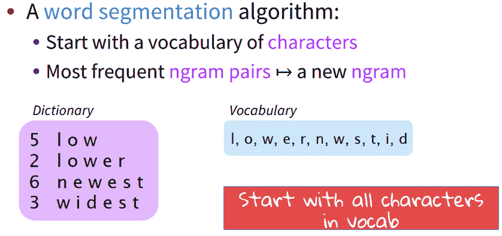

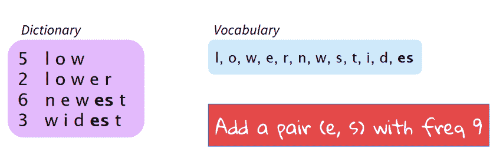

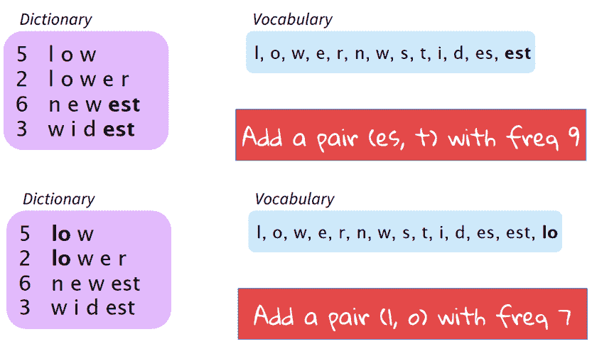

上述例子是，比如有一个初始的文本库和词汇库。首先，可见此时出现频率最高的n-gram pair是“e,s”,出现了9次，因此我们将“es”作为新词加入到词汇库中同时更新文本库。然后，这时词汇库中出现频率最高的n-gram pair是“es,t”,出现了9次，因此我们将“est”加入词汇库中同时更新文本库。依次类推，可以逐渐的通过增加新的n-gram的方式达到我们的目标。对于现实生活中有很多词汇量非常大的task,这种通过BPE逐步建立词汇库的方式就显得非常有用了。

使用这种方法可以自动生成vocab。

谷歌的NMT模型有两个版本，版本一采用的是BPE模型，版本二对BPE模型进行了改进，称为wordpiece mode。这种方法不在使用n-gram的计算来算，而是使用搜索算法搜索最大化的该语言模型的片段去选择pieces。

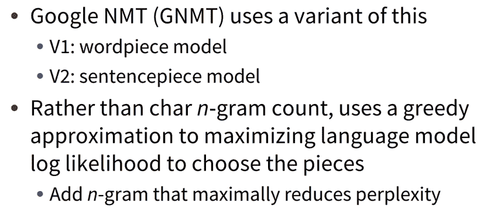

另外还有一种模型叫sentencepiece，它直接从raw text中获取，同时把空格视为一种特殊的token(_)

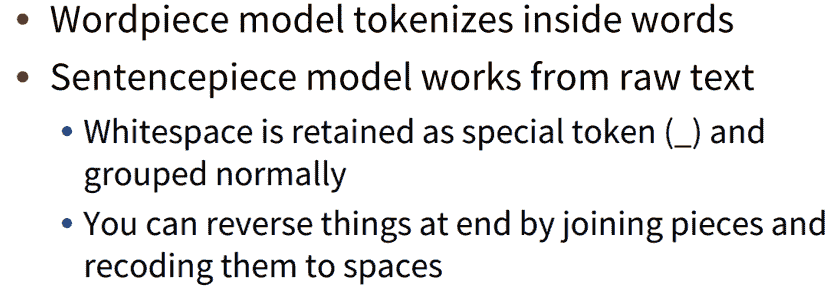

课程介绍了几篇在这方面发展的论文，有用Character-level去产生词向量的（LearningCharacter-level Representations for Part-of Speech Tagging），还有用char-level结合high-way网络进行机器翻译的。

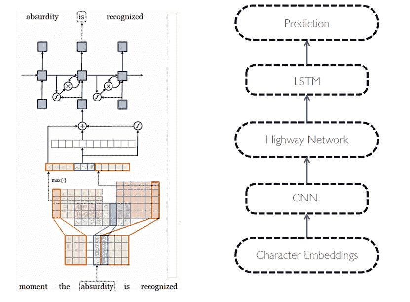

课程分析用char-level得到词向量的特点，经由他们直接输出的word-embedding更倾向于在形状上相似，输入high-way之后，形状上的相似会朝含义上的相似发展。如图所示：

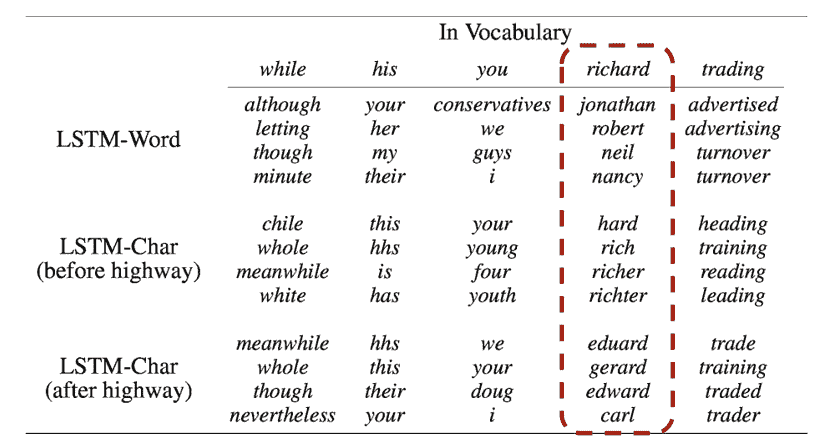

使用char-level的可以轻易解决，此没有出现在词库的情况，如图所示：

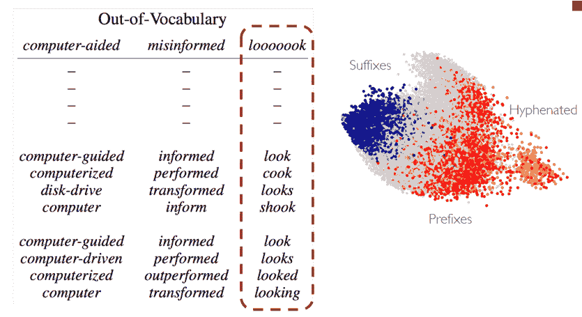

## **四、混合字符和词级模型**

### **4.1 Hybrid NMT**

核心思想：大部分时候都使用word-level的模型来做translate，只有在遇到rare or unseen的words的时候才会使用character-level的模型协助。这种做法产生了非常好的效果。

混合模型即两种方式并存的模型，在正常处理时采用word-level的模型，当出现奇怪的词的后，使用char-level级的模型。

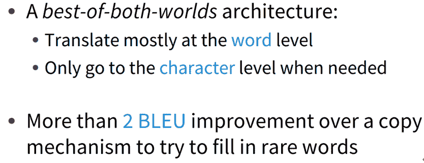

一篇论文的结构如图所示：

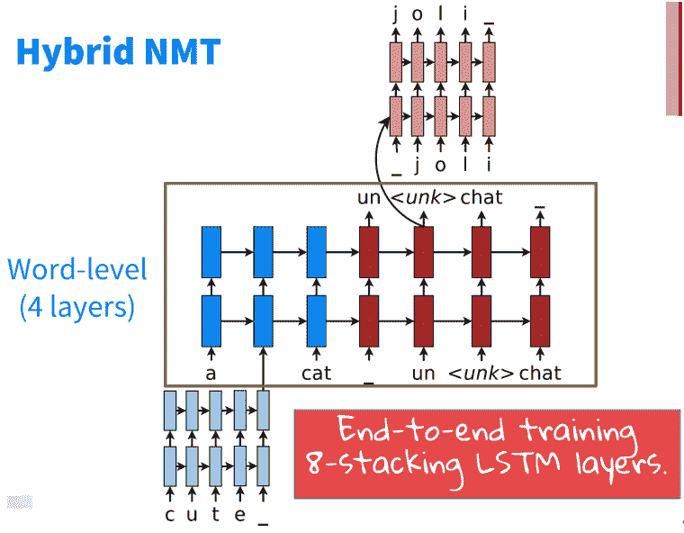

可以看到输入未知的单词时，采用char-level进行编码，输出< unk >时也采用char-level级的进行解码。同时训练跟beam-search也时要同时对两个结构进行。

### **4.2 Ch****ars for word embeddings**

采用subword的方式长生词向量，课程中提到了FastText。主要思路如图所示：

1.  字符的卷积来生成词嵌入

2.  使用pos标记固定的窗口

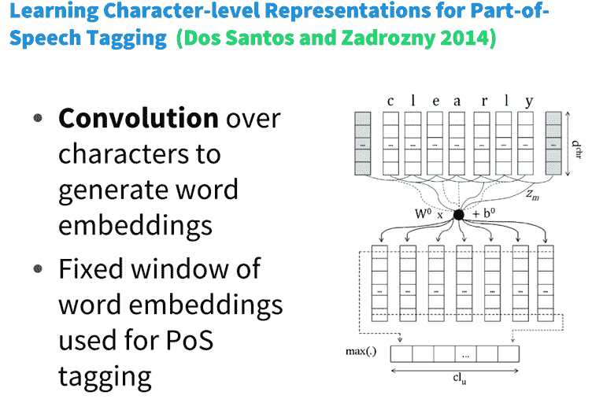

## **五、FastText**

使用n-grams和整个单词来代表单词。我们知道在word2vec方法中我们基于word-level的模型来得到每一个单词的embedding,但是对于含有许多OOV单词的文本库word2vec的效果并不好。由此很容易联想到，如果将subword的思想融入到word2vec中是不是会产生更好的效果呢？

FastText embeddings是一个word2vec like embedding。用where举例, 它把单词表示成了: "where = <wh, whe, her,ere, re>, <where>"这样的形式. 注意这里的"<>"符号是表达了开始和结束. 这样就可以有效地解决OOV的问题, 并且速度依然很快。

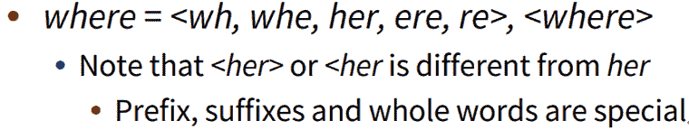

然后把它们加起来：

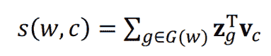

于是，就可以使用原有的word2vec算法来训练得到对应单词的embedding。其保证了算法速度快的同时，解决了OOV的问题，是很好的算法。

### **5.1 FastText和word2vec的区别**

**1\. 相似处：**

*   图模型结构很像，都是采用embedding向量的形式，得到word的隐向量表达。

*   都采用很多相似的优化方法，比如使用Hierarchicalsoftmax优化训练和预测中的打分速度。

**2\. 不同处：**

*   模型的输出层：word2vec的输出层，对应的是每一个term，计算某term的概率最大；而fasttext的输出层对应的是分类的label。不过不管输出层对应的是什么内容，起对应的vector都不会被保留和使用。

*   模型的输入层：word2vec的输出层，是 context window 内的term；而fasttext 对应的整个sentence的内容，包括term，也包括 n-gram的内容。

**3\. 两者本质的不同，体现在 h-softmax的使用：**

*   Word2vec的目的是得到词向量，该词向量 最终是在输入层得到，输出层对应的 h-softmax也会生成一系列的向量，但最终都被抛弃，不会使用。

*   fastText则充分利用了h-softmax的分类功能，遍历分类树的所有叶节点，找到概率最大的label（一个或者N个）

FastText是一个能用浅层网络取得和深度网络相媲美的精度，并且分类速度极快的算法。按照作者的说法“在标准的多核CPU上，能够训练10亿词级别语料库的词向量在10分钟之内，能够分类有着30万多类别的50多万句子在1分钟之内”。但是它也有自己的使用条件，它适合类别特别多的分类问题，如果类别比较少，容易过拟合。

**六、写到最后**

本文介绍了Subword Model的两种模型。对于第一种模型，其关键点在于怎样得到subword，在此采用BPE算法来提取高频Subword的形式。第二种被称为杂交模型的方法相对简单，是在文本中有这个word时就用word embedding，没有的时候就用char embedding来学习word embedding，非常简单。

俗话说，读万卷书，行万里路。理论结合实践才是学习最好的方式，对于AI算法更是如此。天池NLP新闻文本分类入门学习赛，旨在引导大家走入自然语言处理的世界，带大家实践NLP的预处理、模型构建和模型训练等知识点。点击 **阅读原文** 了解更多详情。

*本文电子版 后台回复 **Subword** 获取*

????点击阅读原文，NLP实践