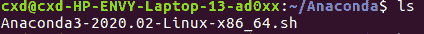

↑↑↑关注后"星标"Datawhale

每日干货 & [每月组队学习](https://mp.weixin.qq.com/mp/appmsgalbum?__biz=MzIyNjM2MzQyNg%3D%3D&action=getalbum&album_id=1338040906536108033#wechat_redirect)，不错过

 Datawhale干货 

**作者：****伍天舟、****马曾欧、****陈信达**

入门深度学习，很多人经历了从入门到放弃的心酸历程，且千军万马倒在了入门第一道关卡：环境配置问题。俗话说，环境配不对，学习两行泪。

如果你正在面临配置环境的痛苦，不管你是Windows用户、Ubuntu用户还是苹果死忠粉，这篇文章都是为你量身定制的。接下来就依次讲下Windows、Mac和Ubuntu的深度学习环境配置问题。

**一、Windows系统深度学习环境配置**

系统：Win10  64位操作系统

安装组合：Anaconda+PyTorch(GPU版)+GTX1060

开源贡献：伍天舟，内蒙古农业大学

### **1.1 打开Anaconda Prompt**

1、conda create -n pytorch python=3.7.0：创建名为pytorch的虚拟环境，并为该环境安装python=3.7。

2、activate pytorch：激活名为pytorch的环境


**1.2 确定硬件支持的CUDA版本**

NVIDIA控制面板-帮助-系统信息-组件


2020年5月19日16:46:31，我更新了显卡驱动，看到我的cuda支持11以内的

**1.3 确定pytorch版本，torchvision版本**

进入pytorch官网：https://pytorch.org/get-started/locally/


因为官方源太慢了，这里使用清华源下载

**1.4 镜像中下载对应的安装包**

清华镜像：

https://mirrors.tuna.tsinghua.edu.cn/anaconda/cloud/pytorch/win-64/

pytorch：


torchvision：


**1.5 本地安装**

接着第一步，在pytorch环境下进行安装，依次输入如下指令。


然后回到虚拟环境所在目录，用conda install anaconda安装环境所需的基础包


**1.6 测试**

代码1：

```
from future import print_function
import torch
x = torch.rand(5, 3)
print(x) 
```

输出类似于以下的张量：


代码2：

```
import torch
torch.cuda.is_available() 
```

输出：True

如果以上两段代码输出无异常，表明环境搭建成功。

**1.7 遇到的问题**

*   ****用下面命令创建虚拟环境报错****

```
conda create -n py37_torch131 python=3.7 
```


【解决方法】https://blog.csdn.net/weixin_42329133/article/details/102640763

环境会保存在Anaconda目录下的envs文件夹内

*   ****PackagesNotFoundError: The following packages are not available from current channels**** 


【解决方法】：

https://www.cnblogs.com/hellojiaojiao/p/10790273.html

*   **conda下载太慢问题**

【解决方案】https://mirror.tuna.tsinghua.edu.cn/help/anaconda/

我直呼一声清华NB！

*   **cuda安装**

cuda历史版本下载：https://developer.nvidia.com/cuda-toolkit-archive

要看NVIDIA的组件，自己的CUDA支持哪个版本，我是1060显卡，所以我下的10.0版本的cuda


*   **pytorch安装**

官网没有我的组合，我满脸问号


这里我直接（别忘了先进入刚创建的环境）

```
conda install pytorch torchvision cudatoolkit=10.0 -c pytorch 
```

*   **jupyter note如何进入虚拟环境**

python -m ipykernel install --name 虚拟环境名

1.打开Anaconda Prompt,输入conda env list 查看现有环境

2.输入activate name（name是你想切换的环境）

3.conda install ipykernel 安装必要插件

4.python -m ipykernel install --name Name 将环境添加到Jyputer中（Name是此环境显示在Jyputer中的名称，可自定义）

删除内核

jupyter kernelspec remove 内核名称


报错[Errono 13]

[Errno 13] Permission denied: ‘/usr/local/share/jupyter’

为此，需要添加–user选项，将配置文件生成在本账户的家目录下。

```
python -m ipykernel install --user --name py27-caffe-notebook 
```

至此，添加kernel完成。查看已有的kernel：

```
jupyter kernelspec list 
```

删除已有的kernel

```
jupyter kernelspec remove kernelname 
```

以上的命令删除仅仅是配置文件，并没有卸载相应虚拟环境的ipykernel，因此若要再次安装相应python虚拟环境的kernel，只需激活虚拟环境，然后

```
python -m ipykernel install --name kernelname 
```

*   conda安装一半总失败

把文件下载到本地，进入该文件的目录，然后用命令

```
conda install --offline 包名 
```

**二、Mac深度学习环境配置**

安装组合：Anaconda+PyTorch(GPU版)

开源贡献：马曾欧，伦敦大学

**2.1 安装Anaconda**

Anaconda 的安装有两种方式，这里仅介绍一种最直观的- macOS graphical install。

https://www.anaconda.com/products/individual里，Anaconda Installers的位置，选择Python 3.7 下方的“64-Bit Graphical Installer (442)”。下载好


pkg 安装包后点击进入，按下一步完成安装即可。默认安装地点为~/opt。想用command line install 的，请自行参考：https://docs.anaconda.com/anaconda/install/mac-os/

**2.2 确认下载情况**


在Mac 的Terminal 里，输入

```
python --version 
```

确保安装的Python 是3.x 版本。在Terminal 输入

```
jupyter notebook 
```

弹出网页，即可进入notebook。


在网页右上角点击Quit，或返回Terminal，command + c，退出notebook。


**2.2.1 常见问题**

如果电脑中下载了多个Anaconda，运行时可能出现冲突。在Terminal 中输入

```
cd ~ 
```

返回home 目录，输入

```
cat .bash_profile 
```

如果只能看到一个Anaconda 版本就没有问题。如果有多个则下载包时有可能

造成一定的冲突。用vim、nano 或其他文本编辑器把旧版本Anaconda 的

```
export PATH= ... 
```

删除。

**2.3 虚拟环境和包的下载**

用conda 去创建虚拟环境和下载对应的包是很简单的一件事。

**2.3.1 Graphic**

点击Anaconda-Navigator，可以看到自己下载好的应用程序，左上角“Applications on”应该指向的是“base (root)”，左边点击“Environments”就可以看到自己建立的虚拟环境和对应的包了。点击左下角的Create 即可创建一个新的虚拟环境。


输入环境名称和python 的版本，点击create 进行创建。


之后在Home 页面，确保左上角指向的是你刚刚创建的环境名，在这个环境下install jupyter notebook，注意原本装的notebook 是在base 里的，不可通用。

回到Environments 中，可以看到在此环境中的所有包，左上方选择All，然后输入想要下载的包名


然后选中进行下载


**2.3.2 Command Line**

用command line 完成以上的操作也很简洁。这次以Pytorch 为例。在Terminal 中输入

```
conda create --name env_name 
```

就可以创建一个虚拟环境，叫“env_name”。输入

```
conda env list 
```

即可看到创建了的所有虚拟环境，其中打* 的就是当前环境。输入

```
conda activate env_name 
```

进入环境

```
conda deactivate 
```

退出当前虚拟环境，进入base。

**2.3.3 下载Pytorch**

一般情况下Mac 是不支持CUDA 的。进入https://pytorch.org/ 可以看到


pytorch 官网显示当前设备应该用的下载语句。此情况，我的是

```
conda install pytorch torchvision -c pytorch 
```

复制下来，粘贴到Terminal 中运行就可以开始下载了。

下载完成后，在Terminal 输入

```
python3 
```

之后import 两个刚下载的包，确认下载完成

```
import torch
import torchvision

print(torch.__version__)
print(torchvision.__version__) 
```

如果import 和输出正常，配置就完成了！输入


```
quit() 
```

就ok 了。

**2.4 额外情况**

国内如果直接用conda 下载，可能会很慢。可以换下载源进行加速。换源方法可参考下列资料中的Linux 部分：https://zhuanlan.zhihu.com/p/87123943。

conda 下载中常会出现“Solving environment: failed...”的问题，如果正常创建虚拟环境，这位问题应该就是没有问题的，如果还发生，可以再创建一个虚拟环境。

conda 的社群很大，基本上遇到的问题很有可能有人遇到、有人解答，Google会是一个很好的解决办法。

**三、Ubuntu深度学习环境配置**

安装组合：Anaconda+PyTorch(CPU版)或PyTorch(GPU版)

开源贡献：陈信达，华北电力大学

**3.1 Anacond安装**

Anaconda和Python版本是对应的，所以需要选择安装对应Python2.7版本的还是Python3.7版本或其他版本的，根据自己的需要下载合适的安装包。

下载链接：https://www.anaconda.com/download/#linux

点击下面的64-Bit (x86) Installer (522 MB)，下载64位的版本。


下载完后的文件名是：Anaconda3-2020.02-Linux-x86_64.sh。

cd到Anaconda3-2020.02-Linux-x86_64.sh所在的目录：



执行bash Anaconda3-2020.02-Linux-x86_64.sh开始安装：


一直按回车直到如下界面，然后输入yes：


这里直接回车安装到默认路径，或者在>>>后输入自定义路径


等待安装进度条走完，然后出现下面的提示，yes是加入环境变量，no是不加入环境变量，这里我们以输入no为例


接下来手动加入环境变量，先cd到~，然后编辑.bashrc文件：sudo vim .bashrc


在最下面添加如下几行(注意.后有空格)：

```
# 区分anaconda python与系统内置python
alias python3="/usr/bin/python3.5"
alias python2="/usr/bin/python2.7"

. /home/cxd/anaconda3/etc/profile.d/conda.sh 
```

然后按esc + : + wq!保存


输入source .bashrc来执行刚修改的初始化文档


下面输入conda env list来试试环境变量是否设置成功：


试试刚刚设置的使用内置python的命令：python2、python3


如果到这就结束的话，大家安装包的时候肯定会无比煎熬～这里需要将anaconda换一下源（加入清华源）：


然后我们创建一个名为pytorch的虚拟环境，发现报了下面的错误：


原因是我们没有清除上次安装留下来的源，输入sudo vim  .condarc，修改该文件的内容（记得删除default那行）：


然后输入source .condarc，再次创建虚拟环境：


## **3.2 pytorch cpu版本安装**

打开pytorch官网：https://pytorch.org/


激活刚刚创建的虚拟环境：conda activate pytorch在安装之前先添加下面这个源：

```
conda config --add channels https://mirrors.tuna.tsinghua.edu.cn/anaconda/cloud/pytorch 
```

然后输入下面代码：

```
conda install pytorch torchvision cpuonly -c pytorch 
```


等到安装好后测试一下是否安装完成：

```
import torch
print(torch.__version__) 
```

输出如下则安装成功：


# **3.3 pytorch-gpu安装**

## **3.3.1 GPU驱动安装**

*   ### **检测显卡类型**

执行命令：' ubuntu-drivers devices'

```
== /sys/devices/pci0000:00/0000:00:01.0/0000:01:00.0 ==
modalias : pci:v000010DEd00001C8Dsv00001028sd0000086Fbc03sc02i00
vendor   : NVIDIA Corporation
model    : GP107M [GeForce GTX 1050 Mobile]
driver   : nvidia-driver-390 - distro non-free
driver   : nvidia-driver-435 - distro non-free
driver   : nvidia-driver-440 - distro non-free recommended
driver   : xserver-xorg-video-nouveau - distro free builtin

== /sys/devices/pci0000:00/0000:00:14.3 ==
modalias : pci:v00008086d0000A370sv00008086sd000042A4bc02sc80i00
vendor   : Intel Corporation
model    : Wireless-AC 9560 [Jefferson Peak]
manual_install: True
driver   : backport-iwlwifi-dkms - distro free 
```

大家可以看到，这里有个设备是GTX1050。推荐安装驱动是440。

*   ### **安装驱动**

安装所有推荐驱动

```
sudo ubuntu-drivers autoinstall 
```

安装一个驱动

```
sudo apt install nvidia-440 
```

## **3.3.2 安装cuda**

cuda安装需要对应合适的显卡驱动。下面是驱动和cuda的版本对应关系

```
Table 1\. CUDA Toolkit and Compatible Driver Versions
CUDA Toolkit    Linux x86_64 Driver Version Windows x86_64 Driver Version
CUDA 10.2.89    >= 440.33   >= 441.22
CUDA 10.1 (10.1.105 general release, and updates)   >= 418.39   >= 418.96
CUDA 10.0.130   >= 410.48   >= 411.31
CUDA 9.2 (9.2.148 Update 1) >= 396.37   >= 398.26
CUDA 9.2 (9.2.88)   >= 396.26   >= 397.44
CUDA 9.1 (9.1.85)   >= 390.46   >= 391.29
CUDA 9.0 (9.0.76)   >= 384.81   >= 385.54
CUDA 8.0 (8.0.61 GA2)   >= 375.26   >= 376.51
CUDA 8.0 (8.0.44)   >= 367.48   >= 369.30
CUDA 7.5 (7.5.16)   >= 352.31   >= 353.66
CUDA 7.0 (7.0.28)   >= 346.46   >= 347.62 
```

cuda下载链接：http://suo.im/6dY8rL

Installer Type选择第一第二个都可。但是要在获得cuda文件后先检测gcc版本。下面以第一个runfile(local)安装方式为例。

*   ### **安装gcc**

linux一般会自带了gcc，我们先检测一下自己系统的gcc版本

```
gcc --version 
```

而cuda的gcc依赖版本在官方文档的安装指南上会给出


如果版本和cuda依赖gcc不对应，就安装cuda需要的版本

```
sudo apt-get install gcc-7.0
sudo apt-get install g++-7.0 
```

安装完成后需要更换系统gcc版本

```
sudo update-alternatives --install /usr/bin/gcc gcc /usr/bin/gcc-7 50
sudo update-alternatives --install /usr/bin/g++ g++ /usr/bin/g++-7 50 
```

选择需要的版本

```
sudo update-alternatives --config gcc

  选择       路径          优先级  状态
------------------------------------------------------------
* 0            /usr/bin/gcc-9   50        自动模式
  1            /usr/bin/g++-9   50        手动模式
  2            /usr/bin/gcc-7   50        手动模式 
```

输入前面显示的编号即可。

*   ### **安装cuda**

```
sudo sh cuda_你的版本_linux.run 
```

*   ### **配置环境变量**

```
sudo vim ~/.bashrc 
```

将下面的命令复制进去

```
export PATH=/usr/local/cuda-10.2/bin${PATH:+:$PATH}}    
export LD_LIBRARY_PATH=/usr/local/cuda-10.2/lib64${LD_LIBRARY_PATH:+:${LD_LIBRARY_PATH}} 
```

检查是否安装成功

```
nvcc -V 
```

## **3.3.3 安装cudnn**

https://developer.nvidia.com/cudnn    选择对应cuda的版本即可


然后将cudnn解压后的include和lib64文件夹复制到cuda中

```
sudo cp cuda/include/cudnn.h    /usr/local/cuda-10.2/include    #解压后的文件夹名字为cuda-10.2  
sudo cp cuda/lib64/libcudnn*    /usr/local/cuda-10.2/lib64
sudo chmod a+r /usr/local/cuda-10.2/include/cudnn.h   /usr/local/cuda-10.2/lib64/libcudnn* 
```

## **3.3.4 安装pytorch-gpu**


conda安装：

```
# 选择自己对应的cuda版本
conda install pytorch torchvision cudatoolkit=10.2 
```

pip安装：

```
pip install torch torchvision -i  https://pypi.mirrors.ustc.edu.cn/simple 
```

**四、写在最后**

所有的深度学习环境安装指南到这里就结束了，希望能解决你面临的环境配置难题。关于实践项目，可以结合阿里天池的学习赛进行动手实践。

数据挖掘学习赛（进行中，5832人参与）

https://tianchi.aliyun.com/competition/entrance/231784/forum

cv实践学习赛（进行中，1933参与）

https://tianchi.aliyun.com/competition/entrance/531795/forum

nlp实践学习赛（进行中，573人参与）

https://tianchi.aliyun.com/competition/entrance/531810/forum


“整理不易，**点****赞**三连↓