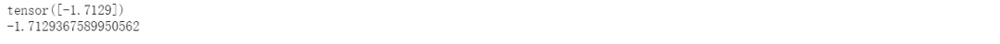
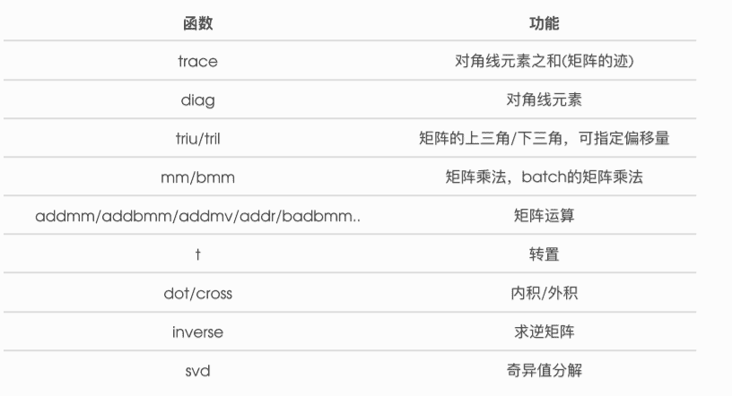
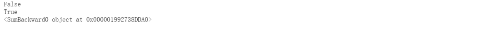
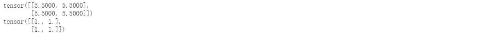
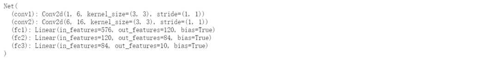

↑↑↑关注后"星标"Datawhale

每日干货 & [每月组队学习](https://mp.weixin.qq.com/mp/appmsgalbum?__biz=MzIyNjM2MzQyNg%3D%3D&action=getalbum&album_id=1338040906536108033#wechat_redirect)，不错过

 Datawhale干货 

**作者：李祖贤，**Datawhale高校群成员，深圳大学****

随着深度学习的发展，深度学习框架开始大量的出现。尤其是近两年，Google、Facebook、Microsoft等巨头都围绕深度学习重点投资了一系列新兴项目，他们也一直在支持一些开源的深度学习框架。目前研究人员正在使用的深度学习框架不尽相同，有 TensorFlow 、Pytorch、Caffe、Theano、Keras等。


这其中，TensorFlow和Pytorch占据了深度学习的半壁江山。前几天分享了TensorFlow的基本教程后，很多人在后台留言说能不能写写Pytorch入门。本着粉丝的诉求必须满足的原则，熬夜干，有了今天的文章。所以你懂我意思吧，记得转发、点赞、在看三联。

本文结合Pytorch官方教程、邱锡鹏老师的《神经网络与深度学习》和李沐老师的《动手学深度学习》，为大家介绍的一下Pytorch深度学习框架。具体目录如下：


## **一、****数据操作**

```
import torch 
```

**1.1 创建TENSOR**

```
# 创建未初始化的Tensor
x = torch.empty(5,3)
print(x) 
```


```
# 创建随机初始化的Tensor
x = torch.rand(5,3)
print(x) 
```


```
# 创建全为0的Tensor
x = torch.zeros(5,3,dtype=torch.long)
print(x) 
```


```
# 根据数据创建Tensor
x = torch.tensor([5.5,3])
print(x) 
```


```
# 修改原Tensor为全1的Tensor
x = x.new_ones(5,3,dtype=torch.float64)
print(x)

# 修改数据类型
x = torch.rand_like(x,dtype=torch.float64)
print(x) 
```


```
# 获取Tensor的形状
print(x.size())
print(x.shape)
# 注意：返回的torch.Size其实就是⼀一个tuple, ⽀支持所有tuple的操作。 
```


这些创建方法都可以在创建的时候指定数据类型dtype和存放device(cpu/gpu)。

**1.2 操作**

**1.2.1 算术操作**

在PyTorch中，同⼀种操作可能有很多种形式，下⾯面⽤用加法作为例子。

```
# 形式1：
y = torch.rand(5,3)
print(x+y) 
```


```
# 形式2
print(torch.add(x,y))
# 还可以指定输出
result = torch.empty(5, 3)
torch.add(x, y, out=result)
print(result) 
```


```
# 形式3
y.add_(x)
print(y) 
```


**1.2.2 索引**

我们还可以使⽤类似NumPy的索引操作来访问 Tensor 的一部分，需要注意的是：索引出来的结果与原数据共享内存，也即修改⼀个，另⼀个会跟着修改。

```
y = x[0,:]
y += 1
print(y)
print(x[0,:])  # 观察x是否改变了 
```


**1.2.3 改变形状**

注意 view() 返回的新tensor与源tensor共享内存（其实是同⼀个tensor），也即更改其中的⼀个，另 外⼀个也会跟着改变。(顾名思义，view仅是改变了对这个张量的观察角度)

```
y = x.view(15)
z = x.view(-1,5) #  -1所指的维度可以根据其他维度的值推出来
print(x.size(),y.size(),z.size()) 
```


```
x += 1
print(x)
print(y) 
```


所以如果我们想返回⼀个真正新的副本（即不共享内存）该怎么办呢？Pytorch还提供了⼀ 个 reshape() 可以改变形状，但是此函数并不能保证返回的是其拷贝，所以不推荐使用。推荐先 ⽤ clone 创造一个副本然后再使⽤ view 。

```
x_cp = x.clone().view(15)
x -= 1
print(x)
print(x_cp) 
```


另外⼀个常用的函数就是 item() , 它可以将⼀个标量 Tensor 转换成⼀个Python

```
number：x = torch.randn(1)
print(x)
print(x.item()) 
```





**1.2.4 线性代数**

官方文档：https://pytorch.org/docs/stable/torch.html

**1.3 广播机制**

前⾯我们看到如何对两个形状相同的 Tensor 做按元素运算。当对两个形状不同的 Tensor 按元素运算时，可能会触发广播（broadcasting）机制：先适当复制元素使这两个 Tensor 形状相同后再按元素运算。例如：

```
x = torch.arange(1,3).view(1,2)
print(x)
y = torch.arange(1,4).view(3,1)
print(y)
print(x+y) 
```


**1.4 Tensor和Numpy相互转化**

我们很容易⽤ numpy() 和 from_numpy() 将 Tensor 和NumPy中的数组相互转换。但是需要注意的⼀点是：这两个函数所产生的的 Tensor 和NumPy中的数组共享相同的内存（所以他们之间的转换很快），改变其中⼀个时另⼀个也会改变！！！

```
a = torch.ones(5)
b = a.numpy()
print(a,b) 
```


```
a += 1
print(a,b) 
```


```
b += 1
print(a,b) 
```


使⽤ from_numpy() 将NumPy数组转换成 Tensor :

```
import numpy as np
a = np.ones(5)
b = torch.from_numpy(a)
print(a,b) 
```


```
a += 1
print(a,b)
b += 1
print(a,b) 
```


**1.5 GPU运算**

```
# let us run this cell only if CUDA is available
# We will use ``torch.device`` objects to move tensors in and out of GPU
if torch.cuda.is_available():
    device = torch.device("cuda")          # a CUDA device object
    y = torch.ones_like(x, device=device)  # directly create a tensor on GPU
    x = x.to(device)                       # or just use strings ``.to("cuda")``
    z = x + y
    print(z)
    print(z.to("cpu", torch.double))       # ``.to`` can also change dtype together! 
```


## **二、自动求梯度（非常重要）**

很多人看到这里是懵的，因为为什么会得出导数的结果，在这里我给出自动求导的一些原理性的知识，希望能帮助大家更好的学习pytorch这个重要的框架。

该autograd软件包是PyTorch中所有神经网络的核心。让我们首先简要地访问它，然后我们将去训练我们的第一个神经网络。

该autograd软件包可自动区分张量上的所有操作。这是一个按运行定义的框架，这意味着您的backprop是由代码的运行方式定义的，并且每次迭代都可以不同。

如果想了解数值微分数值积分和自动求导的知识，可以查看邱锡鹏老师的《神经网络与深度学习》第四章第五节：

下载地址：https://nndl.github.io/

在这里简单说说自动微分的原理吧：我们的目标是求

  

在  处的导数。我们的做法是利用链式法则分解为一系列的操作：


**2.1 张量及张量的求导（Tensor）**

```
# 加入requires_grad=True参数可追踪函数求导
x = torch.ones(2,2,requires_grad=True)
print(x)
print(x.grad_fn) 
```


```
# 进行运算
y = x + 2
print(y)
print(y.grad_fn)  # 创建了一个加法操作<AddBackward0 object at 0x0000017AF2F86EF0> 
```


像x这种直接创建的称为叶子节点，叶子节点对应的 grad_fn 是 None 。

```
print(x.is_leaf,y.is_leaf) 
```


```
# 整点复杂的操作
z = y * y * 3
out = z.mean()
print(z,out) 
```


.requires_grad_( ... )改变requires_grad 的属性。

```
a = torch.randn(2,2)    # 缺失情况下默认 requires_grad = False
a = ((a*3)/(a-1))
print(a.requires_grad)  # False
a.requires_grad_(True)
print(a.requires_grad)
b = (a*a).sum()
print(b.grad_fn) 
```



**2.2 梯度**

现在让我们反向传播：因为out包含单个标量，out.backward()所以等效于out.backward(torch.tensor(1.))。

```
out.backward()
print(x.grad) 
```


```
# 再来反向传播⼀次，注意grad是累加的
out2 = x.sum()
out2.backward()
print(x.grad)

out3 = x.sum()
x.grad.data.zero_()
out3.backward()
print(x.grad) 
```



**三、神经网络设计的pytorch版本**

这是一个简单的前馈网络。它获取输入，将其一层又一层地馈入，然后最终给出输出。神经网络的典型训练过程如下：

*   定义具有一些可学习参数（或权重）的神经网络

*   遍历输入数据集

*   通过网络处理输入

*   计算损失（输出正确的距离有多远）

*   将梯度传播回网络参数

*   通常使用简单的更新规则来更新网络的权重：weight = weight - learning_rate * gradient


**3.1 定义网络**

```
import torch
import torch.nn as nn
import torch.nn.functional as F

class Net(nn.Module):

    def __init__(self):
        super(Net,self).__init__()
        # 1 input image channel, 6 output channels, 3x3 square convolution
        # kernel
        self.conv1 = nn.Conv2d(1,6,3)
        self.conv2 = nn.Conv2d(6,16,3)
        # an affine operation: y = Wx + b
        self.fc1 = nn.Linear(16*6*6,120)   # 6*6 from image dimension
        self.fc2 = nn.Linear(120,84)
        self.fc3 = nn.Linear(84,10)

    def forward(self,x):
        # Max pooling over a (2, 2) window
        x = F.max_pool2d(F.relu(self.conv1(x)),(2,2))  # CLASStorch.nn.MaxPool2d(kernel_size, stride=None, padding=0, dilation=1, return_indices=False, ceil_mode=False)
        x = F.max_pool2d(F.relu(self.conv2(x)),2)
        x = x.view(-1,self.num_flat_features(x))
        x = F.relu(self.fc1(x))
        x = F.relu(self.fc2(x))
        x = self.fc3(x)
        return x

    def num_flat_features(self,x):
        size = x.size()[1:] # all dimensions except the batch dimension
        num_features = 1
        for s in size:
            num_features *= s
        print(num_features)
        return num_features

net = Net()
print(net) 
```



```
# 模型的可学习参数由返回 net.parameters()
params = list(net.parameters())
print(len(params))
print(params[0].size())  # conv1's .weight 
```


```
# 尝试一个32x32随机输入
input = torch.randn(1,1,32,32)
out = net(input)
print(out) 
```


```
# 用随机梯度将所有参数和反向传播器的梯度缓冲区归零：
net.zero_grad()
out.backward(torch.randn(1,10)) 
```

**3.2 损失函数**

```
output = net(input)
target = torch.randn(10)    # a dummy target, for example
target = target.view(-1,1)  # # make it the same shape as output
criterion = nn.MSELoss()

loss = criterion(output,target)
print(loss) 
```


我们现在的网络结构：


```
# 如果loss使用.grad_fn属性的属性向后移动，可查看网络结构
print(loss.grad_fn)  # MSELoss
print(loss.grad_fn.next_functions[0][0])  # Linear
print(loss.grad_fn.next_functions[0][0].next_functions[0][0])  # ReLU 
```


**3.3 更新权重**

实践中使用的最简单的更新规则是随机梯度下降（SGD）：

weight = weight - learning_rate * gradient

```
import torch.optim as optim

#  create your optimizer
optimizer = optim.SGD(net.parameters(),lr = 0.01)

# in your training loop:
optimizer.zero_grad()  # zero the gradient buffers
output = net(input)
loss = criterion(output,target)
loss.backward()
optimizer.step() 
```

576

**四、写到最后**

今天，要讲的Pytorch基础教程到这里就结束了，相信大家通过上边的学习已经对Pytorch基础教程有了初步的了解。

关于Pytorch的项目实践，阿里天池「零基础入门NLP」学习赛中提供了Pytorch版实践教程，供学习参考（阅读原文直接跳转）：

https://tianchi.aliyun.com/competition/entrance/531810/forum

*Pytorch项目实践教程 后台回复* ***Pytorch** 获取*


“整理不易，**点****赞****三连**↓