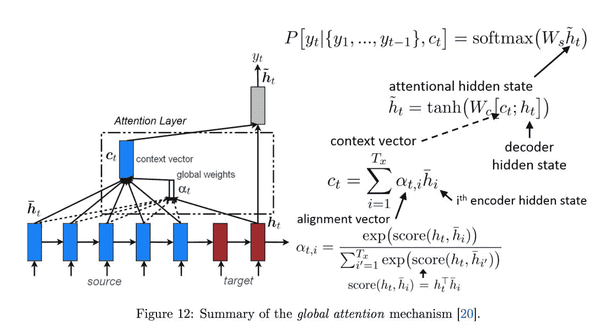
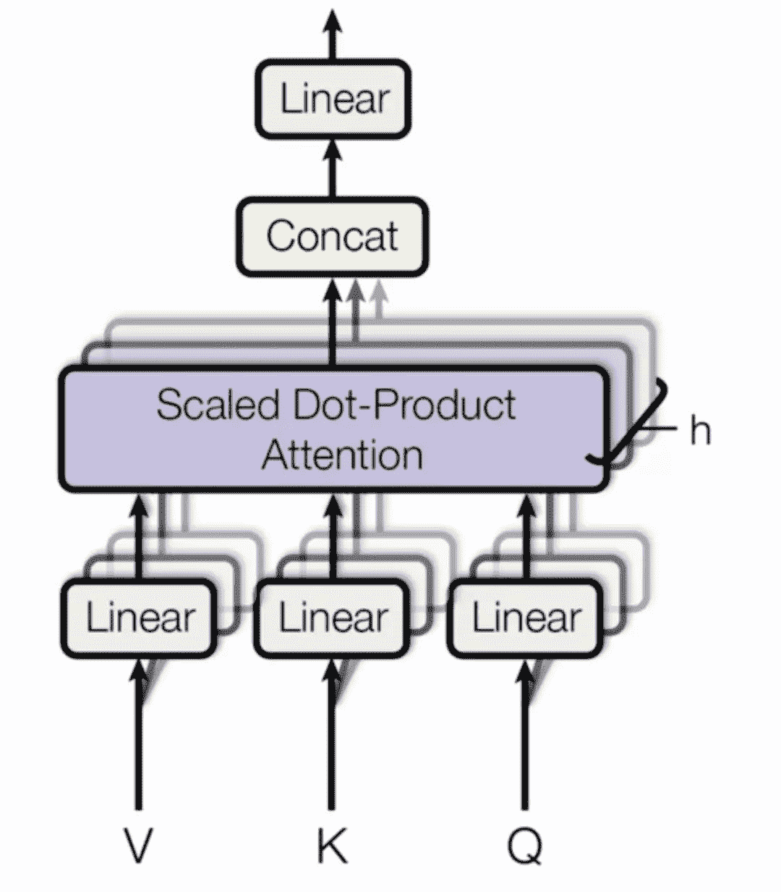

↑↑↑关注后"星标"Datawhale

每日干货 & [每月组队学习](https://mp.weixin.qq.com/mp/appmsgalbum?__biz=MzIyNjM2MzQyNg%3D%3D&action=getalbum&album_id=1338040906536108033#wechat_redirect)，不错过

 Datawhale干货 

**参与：思源、贾伟   来源：机器之心**

> NLP 的研究，从词嵌入到 CNN，再到 RNN，再到 Attention，以及现在正红火的 Transformer，模型已有很多，代码库也成千上万。对于初学者如何把握其核心，并能够自己用代码一一实现，殊为不易。如果有人能够将诸多模型和代码去粗取精，只保留核心，并能够「一键执行」，对于初学者不啻为天大的福音。

近日，来自韩国庆熙大学的 Tae Hwan Jung 在 Github 上创建了这样一个项目：「nlp-tutorial」。

项目地址：https://github.com/graykode/nlp-tutorial

NLP学习：

https://tianchi.aliyun.com/competition/entrance/531810/forum

这个项目并不复杂，但却包含了基本的嵌入式表征模型、CNN、RNN、注意力模型、Transformer 等的 13 个重要模型的核心代码实现。整体而言，基本所有代码都是作者自己完成的，当然都会借鉴已有的实现。很多模型都同时有 TensorFlow 和 PyTorch 两种版本，但像 Transformer 和 BERT 等拥有谷歌官方实现的模型，作者只提供了 PyTorch 实现。据作者介绍，随后他计划将添加 Keras 版本的实现。

引入瞩目的是，这个项目中几乎所有模型的代码实现长度都在 100 行左右（除了注释和空行外），很多预处理、模型持久化和可视化等操作都被简化或删除了。因此精简后的代码非常适合学习，我们不需要从复杂的大型模型实践中抽丝剥茧地找出核心部分，只要懂一点深度学习框架的入门者就能很容易理清整个模型的实现过程。

另外值得注意的是，每一个模型都只有一个文件；如果你要训练，那么只需要「一键」运行即可。对于刚入行的小白简直再美好不过了。

当然这里还需要注意配置问题。据作者介绍，他的运行是在谷歌 Colab 上使用 GPU 跑的，这样就免除了不同机器的环境配置问题。因此如果你想测试一下他的代码能不能正常运行，只需要直接将代码复制粘贴到 Colab 即可。而对于想在本地运行代码的同学，环境配置也非常简单，基本上所有代码都只依赖 Tensorflow 1.12.0+ 和 Pytorch 0.4.1+两个库，Python 也是常见的 3.5。

**项目目录**

下面为项目的基本框架以及每个模型的功能：

1、基本嵌入模型

*   NNLM - 预测下一个单词

*   Word2Vec(Skip-gram) - 训练词嵌入并展示词的类推图

*   FastText(Application Level) - 情感分类

2、CNN

*   TextCNN - 二元情感分类

*   DCNN（进行中……）

3、RNN

*   TextRNN - 预测下一步

*   TextLSTM - 自动完成

*   Bi-LSTM - 在长句子中预测下一个单词

4、注意力机制

*   Seq2Seq - 同类词转换

*   Seq2Seq with Attention - 翻译

*   Bi-LSTM with Attention - 二元情感分类

5、基于 Transformer 的模型

*   Transformer - 翻译

*   BERT - 分类是否是下一句和预测 Mask 掉的词

**模型示例**

在这一部分中，我们将以带注意力机制的 Bi-LSTM 与 Transformer 为例分别介绍 TensorFlow 和 PyTorch 的代码实现。当然我们也只会介绍模型部分的核心代码，其它训练迭代和可视化等过程可以查阅原项目。

**基于注意力机制的双向 LSTM**

作者用不到 90 行代码简单介绍了如何用双向 LSTM 与注意力机制构建情感分析模型，即使使用 TensorFlow 这种静态计算图，Tae Hwan Jung 借助高级 API 也能完成非常精简代码。总的而言，模型先利用双向 LSTM 抽取输入词嵌入序列的特征，再使用注意力机制选择不同时间步上比较重要的信息，最后用这些信息判断输入句子的情感倾向。

首先对于构建双向 LSTM，我们只需要定义前向和后向 LSTM 单元（lstm_fw_cell 与 lstm_bw_cell），并传入高级 API tf.nn.bidirectional_dynamic_rnn() 就行了：

```
# LSTM Model
X = tf.placeholder(tf.int32, [None, n_step])
Y = tf.placeholder(tf.int32, [None, n_class])
out = tf.Variable(tf.random_normal([n_hidden * 2, n_class]))

embedding = tf.Variable(tf.random_uniform([vocab_size, embedding_dim]))
input = tf.nn.embedding_lookup(embedding, X) # [batch_size, len_seq, embedding_dim]

lstm_fw_cell = tf.nn.rnn_cell.LSTMCell(n_hidden)
lstm_bw_cell = tf.nn.rnn_cell.LSTMCell(n_hidden)

# output : [batch_size, len_seq, n_hidden], states : [batch_size, n_hidden]
output, final_state = tf.nn.bidirectional_dynamic_rnn(lstm_fw_cell,lstm_bw_cell, input, dtype=tf.float32) 
```

第二个比较重要的步骤是构建注意力模块，注意力机制其实就是衡量不同时间步（不同单词）对最终预测的重要性，它的过程也就计算重要性并根据重要性合成上下文语义特征两部分。下图展示了全局注意力的具体过程，它确定不同时间步的权重（alpha），并加权计算得出上下文向量（context vextor）。如果读者希望详细了解 Attention，查阅下图的来源论文就好了，当然也可以跳过原理直接进入实战部分～



*选自论文：Notes on Deep Learning for NLP, arXiv: 1808.09772。*

如下所示，模型主要根据前面双向 LSTM 输出的结果（output）与最终隐藏状态之间的余弦相似性计算怎样为输出结果 output 加权，加权得到的上下文向量 context 可进一步用于计算最终的预测结果。

```
# Attention
output = tf.concat([output[0], output[1]], 2)                             # output[0] : lstm_fw, output[1] : lstm_bw
final_hidden_state = tf.concat([final_state[1][0], final_state[1][1]], 1) # final_hidden_state : [batch_size, n_hidden * num_directions(=2)]
final_hidden_state = tf.expand_dims(final_hidden_state, 2)                # final_hidden_state : [batch_size, n_hidden * num_directions(=2), 1]

attn_weights = tf.squeeze(tf.matmul(output, final_hidden_state), 2) # attn_weights : [batch_size, n_step]
soft_attn_weights = tf.nn.softmax(attn_weights, 1)
context = tf.matmul(tf.transpose(output, [0, 2, 1]), tf.expand_dims(soft_attn_weights, 2)) # context : [batch_size, n_hidden * num_directions(=2), 1]
context = tf.squeeze(context, 2) # [batch_size, n_hidden * num_directions(=2)]

model = tf.matmul(context, out) 
```

当然，实际上这个模型还有更多关于损失函数、最优化器和训练过程等模块的定义，感兴趣的读者可以在 Colab 上跑一跑。

**Transformer**

机器之心曾解读过基于 TensorFlow 的 Transformer 代码，总体而言代码量还是比较大的，其中包括了各模块的可视化与预处理过程。对 Transformer 原理及实现代码感兴趣的读者可查阅以下文章：

*   [基于注意力机制，机器之心带你理解与训练神经机器翻译系统 ](https://mp.weixin.qq.com/s?__biz=MzA3MzI4MjgzMw%3D%3D&idx=1&mid=2650742155&scene=21&sn=137825a13a4c31fffb6b2347c0304366#wechat_redirect)

Transformer 比较重要的结构主要是经过缩放的点乘注意力和 Multi-head 注意力，其它前馈网络、位置编码等结构主要起到协助作用，它们共同可以构建 Transformer。在 Tae Hwan Jung 的实现中，他只使用了两百行代码就完成了核心过程，而且大量使用类和实例的结构更能理清整体架构。这一部分主要介绍点乘注意力和 Multi-head 注意力两个类。

首先对于点乘注意力，它率先形式化地定义了整个注意力过程，过程和上面双向 LSTM 案例使用的注意力机制基本差不多，只不过 Transformer 会有一个缩放过程。如下所示，scores 即表示模型对输入（Value/V）所加的权重，最后算出来的为上下文信息 context。

```
class ScaledDotProductAttention(nn.Module):
    def __init__(self):
        super(ScaledDotProductAttention, self).__init__()

    def forward(self, Q, K, V, attn_mask=None):
        scores = torch.matmul(Q, K.transpose(-1, -2)) / np.sqrt(d_k) # scores : [batch_size x n_heads x len_q(=len_k) x len_k(=len_q)]
        if attn_mask is not None:
            scores.masked_fill_(attn_mask, -1e9)
        attn = nn.Softmax(dim=-1)(scores)
        context = torch.matmul(attn, V)
        return context, attn 
```

最后，下图展示了 Transformer 中所采用的 Multi-head Attention 结构，它其实就是多个点乘注意力并行地处理并最后将结果拼接在一起。一般而言，我们可以对三个输入矩阵 Q、V、K 分别进行 h 个不同的线性变换，然后分别将它们投入 h 个点乘注意力函数并拼接所有的输出结果。



*选自：Attention Is All You Need, arXiv: 1706.03762。*

最后核心的 MultiHeadAttention 同样很精简，读者可以感受一下：

```
class MultiHeadAttention(nn.Module):
    def __init__(self):
        super(MultiHeadAttention, self).__init__()
        self.W_Q = nn.Linear(d_model, d_k * n_heads)
        self.W_K = nn.Linear(d_model, d_k * n_heads)
        self.W_V = nn.Linear(d_model, d_v * n_heads)
    def forward(self, Q, K, V, attn_mask=None):
        # q: [batch_size x len_q x d_model], k: [batch_size x len_k x d_model], v: [batch_size x len_k x d_model]
        residual, batch_size = Q, Q.size(0)
        # (B, S, D) -proj-> (B, S, D) -split-> (B, S, H, W) -trans-> (B, H, S, W)
        q_s = self.W_Q(Q).view(batch_size, -1, n_heads, d_k).transpose(1,2)  # q_s: [batch_size x n_heads x len_q x d_k]
        k_s = self.W_K(K).view(batch_size, -1, n_heads, d_k).transpose(1,2)  # k_s: [batch_size x n_heads x len_k x d_k]
        v_s = self.W_V(V).view(batch_size, -1, n_heads, d_v).transpose(1,2)  # v_s: [batch_size x n_heads x len_k x d_v]

        if attn_mask is not None: # attn_mask : [batch_size x len_q x len_k]
            attn_mask = attn_mask.unsqueeze(1).repeat(1, n_heads, 1, 1) # attn_mask : [batch_size x n_heads x len_q x len_k]
        # context: [batch_size x n_heads x len_q x d_v], attn: [batch_size x n_heads x len_q(=len_k) x len_k(=len_q)]
        context, attn = ScaledDotProductAttention()(q_s, k_s, v_s, attn_mask=attn_mask)
        context = context.transpose(1, 2).contiguous().view(batch_size, -1, n_heads * d_v) # context: [batch_size x len_q x n_heads * d_v]
        output = nn.Linear(n_heads * d_v, d_model)(context)
        return nn.LayerNorm(d_model)(output + residual), attn # output: [batch_size x len_q x d_model]
```

NLP学习教程 后台回复 **NLP** 下载


????NLP学习实践↓