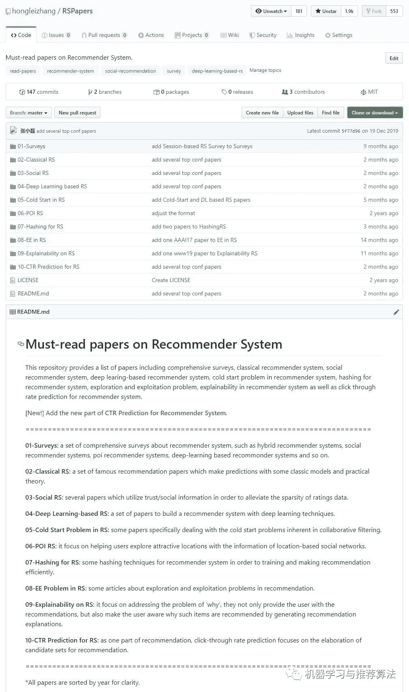

## 推荐系统简介

随着大数据时代的飞速发展，信息逐渐呈现出过载状态，**推荐系统（又称为个性化内容分发）****作为近年来****实现信息生产者与消费者之间利益均衡化的有效手段之一**，越来越发挥着举足轻重的作用。再者这是一个张扬个性的时代，人们对于个性化的追求、千人千面的向往愈来愈突出，谁能捕捉住用户的个性化需求，谁就能在这个时代站住脚跟。现在人们不再单单依靠随大流式的热门推荐，而是基于每个用户的行为记录来细粒度的个性化的生成推荐内容。像今日头条、抖音这样的APP之所以如此之火，让人们欲罢不能，无非是抓住了用户想看什么的心理，那么如何才能抓住用户的心理，那就需要推荐系统的帮助了。因此在这个张扬个性的时代，无论你是开发工程师还是产品经理，我们都有必要了解一下个性化推荐的一些经典工作与前沿动态。

## 推荐系统清单

> **https://github.com/hongleizhang/RSPapers**

该项目提供了一些关于推荐系统的**经典综述文章**、**主流的推荐算法文章**、**著名的社会化推荐算法论文**、**基于深度学习的推荐系统论文**（包括目前较火的GCN网络）以及**关于专门处理冷启动问题的相关论文**、**推荐中的哈希**以及**推荐当中的探索与利用问题**等。当然该项目包含但不局限于以上这些模块。为了保持统一和易于维护，整理的论文是按照年份来进行排序的。**目前累计star数量已达2.4k，感谢大家的贡献与支持**。该项目主要包括以下几部分：

**0、****点击率预估（New）**

众所周知，推荐系统的核心分为两部分，一个是召回，一个是精排。其中的精排其实可以看作是点击率预估的部分，因此本次更新将CTR Prediction作为一部分加入到RS Papers里边，希望大家能够从点击率预估的角度来对推荐系统有一个全新的认识。

1、经典综述

包含了关于推荐系统的综述文章、社会化推荐的综述文章、协同过滤算法的综述文章以及基于深度学习构建推荐系统的综述文章。

2、主流推荐算法

包括了一些经典的协同过滤模型，对于协同过滤模型的一些经典扩展（尤其是矩阵分解模型）以及其他经典方法等。

3、社会化推荐

整理了近年来关于社会化推荐的一系列文章，例如SoRec、SoReg、RSTE、TrustSVD、UniWalk等经典方法。

4、深度学习推荐算法

整理关于利用深度学习技术来构建推荐系统的文章，比如受限的玻尔兹曼机、卷积神经网络等技术来融合到推荐模块中。

5、冷启动问题

专注于解决协同过滤中固有的冷启动问题，主要是利用除评分信息之外的其他边信息（社交信息、评论信息等）以及利用映射机制来缓解冷启动问题。

6、推荐中的哈希问题

随着用户、项目规模的不断扩大，使得推荐模型的训练与预测的时间开销与内存开销也与日俱增，因此如何压缩训练的时间以及空间成为推荐当中的另一经典问题，因此推荐中的哈希也值得我们去认真对待。

7、探索与利用问题

顾明思议，我们在推荐的过程中，既想利用用户的已知兴趣来精确的推荐用户感兴趣的项目（利用），又想给用户推荐他之前没遇到过同时用户很可能感兴趣的项目（探索）。众所周知，当我们相对保守的时候，即只给用户推荐他一定感兴趣的东西时，用户体验并不是很好，因为不能给用户以惊喜度和新鲜感；相反，如果我们只给用户推荐新奇的、他未见过的项目，这样很具有冒险精神，但该方案风险较大，不如前者带来的效益稳定。因此如何兼顾两者的重要程度是业界比较关注的话题。

* * *

*注：*该项目将持续更新，欢迎大家star。**关注公众号回复关键字【rspapers】获取打包完整的推荐系统论文pdf全集，尽享论文盛宴。**

