本文含 **5062 **字，**19** 图表截屏

建议阅读 **10**分钟

相信很多读者学习Python就是希望作出各种酷炫的可视化图表，当然你一定会听说过**Matplotlib、Pyecharts、Seaborn、Plotly、Bokeh**这五大工具，本文就将通过真实绘图来深度评测这五个Python数据可视化的库，看看到底这几种工具各有什么优缺点，在制作图表时该如何选择。


## 指标说明

为了更清晰的了解这几款用于可视化的Python在作图时的异同，本文将使用**同一组数据**分别制作多系列条形图来对比，主要将通过以下几个指标来进行评测：

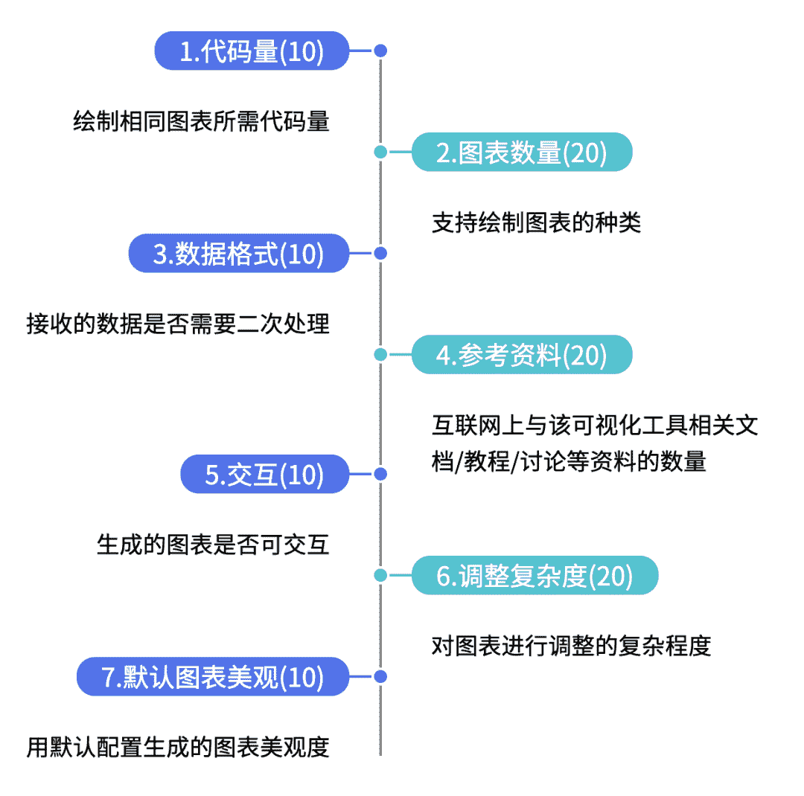

## 数据说明

本文使用的数据为Pyecharts中的faker数据

```
from pyecharts.faker import Faker
x = Faker.choose()
y1 = Faker.values()
y2 = Faker.values()
```

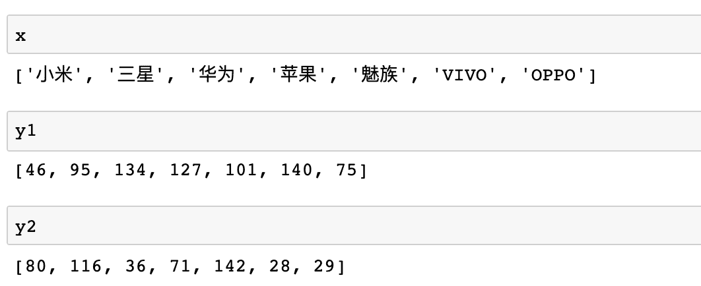

x为一列品牌名称，y1/y2为一列相同长度的**无意义**数据，接下来让我们使用不同的库对这组数据进行可视化！

01

**Pyecharts**

`Echarts`是一个由百度开源的数据可视化，凭借着良好的交互性，精巧的图表设计，得到了众多开发者的认可。而Python是一门富有表达力的语言，很适合用于数据处理。当数据分析遇上数据可视化时，`pyecharts` 诞生了，支持**30+**种图表。在pyecharts中制作条形图首先需要导入相关库

```
from pyecharts import options as opts
from pyecharts.charts import Bar
```

接着是绘图并不做任何任何调整，首先创建一个Bar实例，接着添加x轴y轴数据，注意**仅接收list格式**数据，最后添加标题并设置在notebook中直接展示。总体来说还是比较符合正常的作图逻辑，整体**代码量并不多**。

```
c = (
    Bar()
    .add_xaxis(x)
    .add_yaxis("商家A", y1)
    .add_yaxis("商家B", y2)
    .set_global_opts(title_opts=opts.TitleOpts(title="Pyecharts—柱状图", subtitle=""))
).render_notebook()
```

默认生成的两系列柱状图如下：

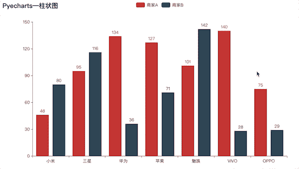

可以看到，该图**支持交互式**展示与点击，默认生成的样式也较为美观，并且Pyecharts有详细的中文文档与demo，网上关于Pyecharts的讨论也较多，如果是刚接触的读者也能比较快的上手。当然如果对默认样式不满意的话，可以进行一些调整，由于**文档十分完整**，所以代码修改起来并不困难，比如可以修改主题并设置一些标记线、DataZoom，添加小组件等

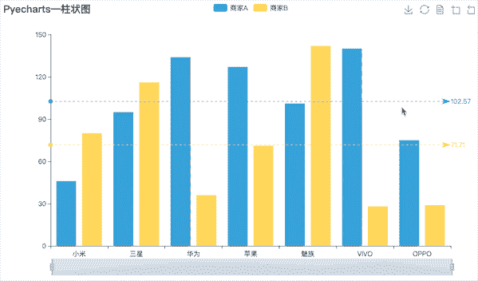

总体来说，由于Pyecharts是基于Echarts制作的，因此生成图表比较美观，并且**官方中文文档**对相关设置讲解非常详细，有关Pyecharts的**讨论也非常多**，所以如果在使用过程中有相关疑问也很容易通过检索找到答案，但遗憾的是不支持使用pandas中的series数据，需要**转换为list**才可以使用，不过整体还是让我很满意的一款可视化库。主观评分:**85**分

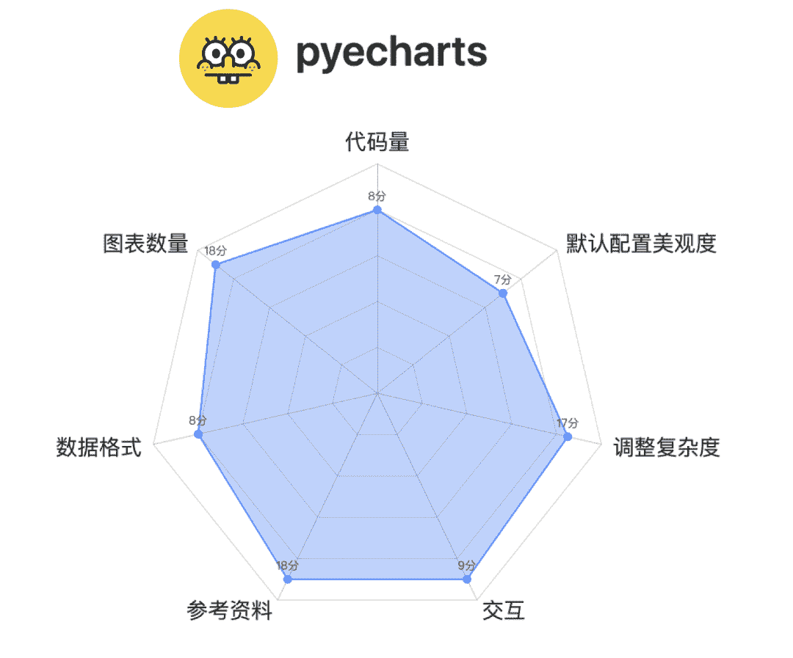

02

**Matplotlib**

`Matplotlib`应该是最广泛使用的Python可视化工具，支持的图形种类非常多，使用Matplotlib制作相同效果的图需要先导入相关库，并且并不支持原生中文所以还要设置下中文显示

```
import matplotlib.pyplot as plt
import numpy as np
plt.rcParams['font.sans-serif'] = ['SimHei'] 
```

接着就是绘图，但是相比较于pyecharts大多是往写好的代码里面添加数据、配置不同，matplotlib大多数需要我们自己写代码，所以**代码量可能稍多一点**

```
width = 0.35
x1 = np.arange(len(x)) 

fig, ax = plt.subplots()
rects1 = ax.bar(x1 - width/2, y1, width, label='商家A')
rects2 = ax.bar(x1 + width/2, y2, width, label='商家B')

ax.set_title('Matplotlib—柱状图')
ax.set_xticks(x1)
ax.set_xticklabels(x)
ax.legend()

plt.show()
```

最后生成的默认图像如下

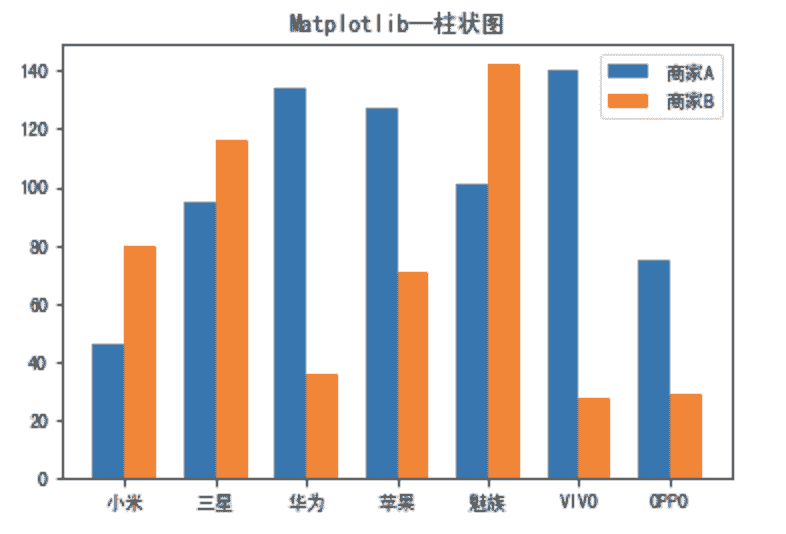

默认配色不是很好看但也没有很难看，看起来更学术一点，但是**不支持交互式**点击查看等操作，虽然代码量更多一点，但是由于Matplotlib的火热，**网上关于matplotlib的资料比Pyecharts要多很多**，所以写代码于调整代码的过程也**并不复杂**，整体主观评分77分

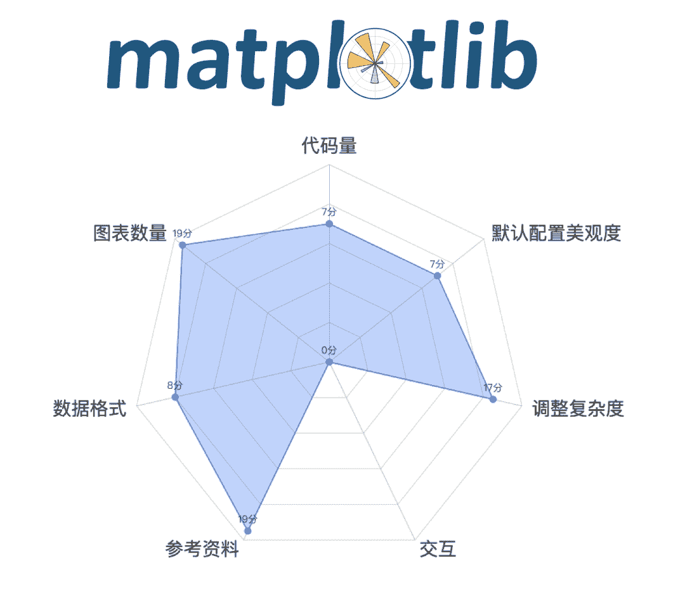

03

**Plotly**

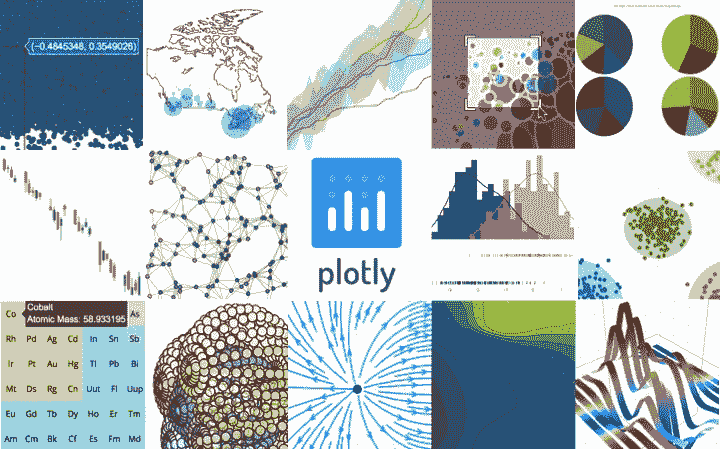

`Plotly`也是一款非常强大的Python可视化库，Plotly内置完整的交互能力及编辑工具，支持在线和离线模式，提供稳定的API以便与现有应用集成，既可以在web浏览器中展示数据图表，也可以存入本地拷贝。但是由于官方**未提供中文文档**，网上关于Plotly的教程也仅限于官方的一些demo，对于一些详细的参数设置并**没有太多资料**，首先还是先导入相关库并设置notebook显示

```
import plotly
import plotly.offline as py
import plotly.graph_objs as go
plotly.offline.init_notebook_mode(connected=True)
```

接下来是绘图代码，**首先要对数据先进行处理**，剩下的基础配置其实和Pyecharts比较类似

```
trace0 = go.Bar(
    x = x,
    y = y1,
    name = '商家A',
)
trace1 = go.Bar(
    x = x,
    y = y2,
    name = '商家B',
)
data = [trace0,trace1]
layout = go.Layout(
        title={
        'text': "Plotly-柱状图",
        'y':0.9,
        'x':0.5,
        'xanchor': 'center',
        'yanchor': 'top'})
fig = go.Figure(data=data, layout=layout)
py.iplot(fig)
```

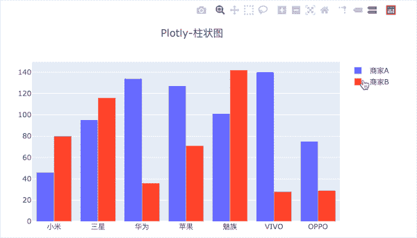

默认样式生成的图如上，**配色也不难看**，并且可以看到是**支持交互式**操作的，同时是默认添加toolbox小组件，可以更方便的查看，**支持30多种图形**，总体来说还是比较优秀的一个可视化工具，但是如果真要熟练使用的话可能需要一点时间用于查找相关资料，因为网上**关于Plotly的资料不多**，大多是基本使用的简单教程，如果想查找一些细节的操作比如我为了查找让标题居中的方法，百度之后用Google在国外某论坛找到类似问题并找到设置，主观评分：**76**分

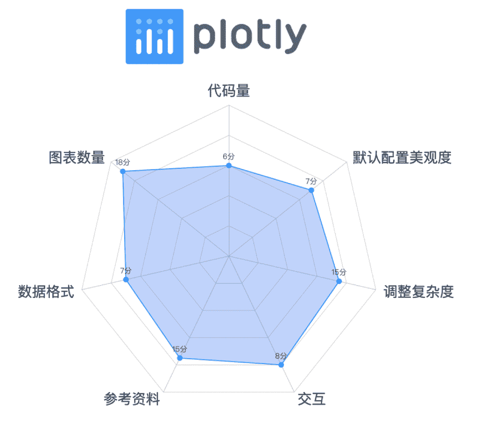

04

**Bokeh**

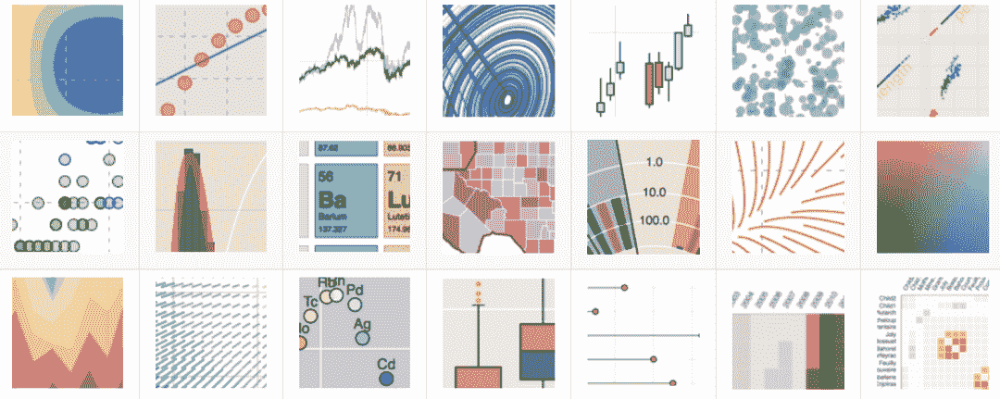

`Bokeh`是一个专门针对Web浏览器的呈现功能的**交互式**可视化Python库。这是Bokeh与其它可视化库最核心的区别，它可以做出像`D3.js`简洁漂亮的交互可视化效果，但是使用难度低于D3.js，首先还是导入相关库

```
from bokeh.transform import dodge
import pandas as pd
from bokeh.core.properties import value
import numpy as np
import matplotlib.pyplot as plt
%matplotlib inline
from bokeh.io import output_notebook
output_notebook() # 导入notebook绘图模块
from bokeh.plotting import figure,show
from bokeh.models import ColumnDataSource# 导入图表绘制、图标展示模块 # 导入ColumnDataSource模块 # 导入dodge、value模块
```

相关依赖比上面三个要多出很多，并且Bokeh有自己的数据结构`ColumnDataSource`，所以要先对数据进行转换，接着就是创建画布、添加数据及设置

```
df = pd.DataFrame({'商家A':y1,'商家B':y2},
                 index = x_)
_x = ['商家A','商家B']    # 系列名
data = {'index':x_}
for i in _x:
    data[i] = df[i].tolist()# 生成数据，数据格式为dict
source = ColumnDataSource(data=data)# 将数据转化为ColumnDataSource对象

p = figure(x_range=x_, y_range=(0, 150), plot_height=350, title="boken-柱状图",tools="crosshair,pan,wheel_zoom,box_zoom,reset,box_select,lasso_select")

p.vbar(x=dodge('index', -0.1, range=p.x_range), top='商家A', width=0.2, source=source,color="#718dbf", legend=value("商家A"))
p.vbar(x=dodge('index',  0.1, range=p.x_range), top='商家B', width=0.2, source=source,color="#e84d60", legend=value("商家B"))# dodge(field_name, value, range=None) → 转换成一个可分组的对象，value为元素的位置（配合width设置）
p.xgrid.grid_line_color = None
p.legend.location = "top_left"
p.legend.orientation = "horizontal" # 其他参数设置
show(p)
```

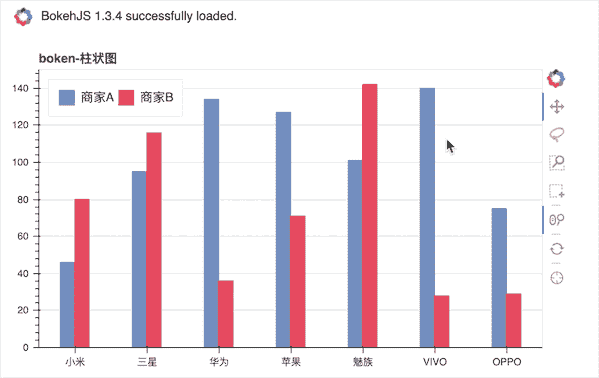

可以看到，Bokeh做出来的图也是**支持交互**的，不并且样式之类的看上去还是比较舒服的，不过上面这张图是经过调整颜色的，因为默认不对两个系列进行区分颜色

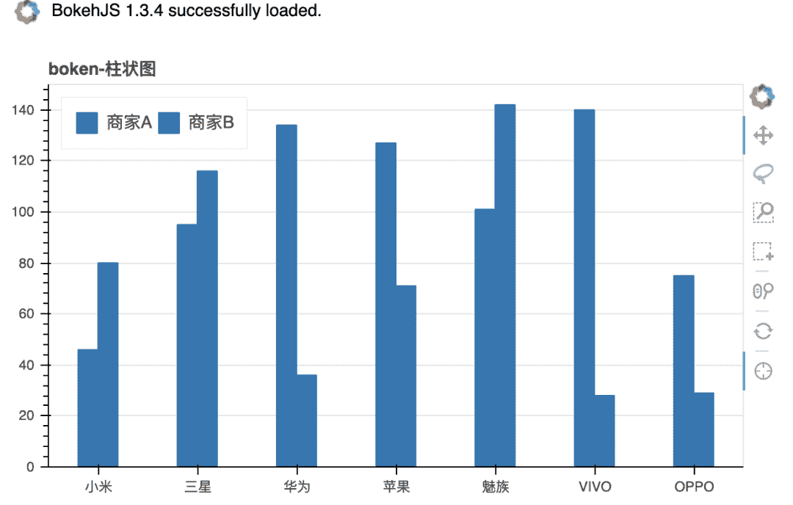

Bokeh一个很明显的特点就是**代码量较上面三个工具要多了很多**，大多是在**数据的处理**上，并且和Plotly一样，有关bokeh相关的**中文资料也不多**，大多是入门型的基本使用于介绍，虽然从官方给出的图来看能作出很多比pyecharts更精美的图，但是查找相关参数的设置上将会耗费一定时间，主观评分**71**分。

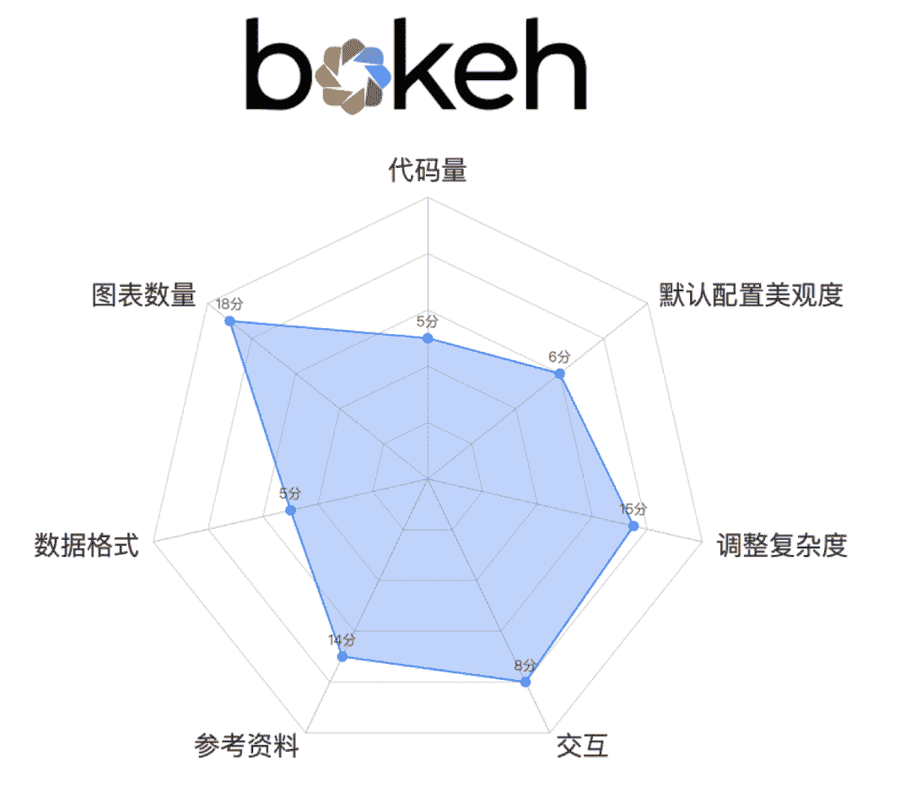

05

**Seaborn**

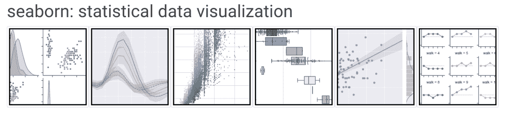

从`seaborn`官网给出的标题就知道，seaborn是为了**统计图表**设计的，它是一种**基于matplotlib**的图形可视化库，也就是在matplotlib的基础上进行了更高级的API封装，从而使得作图更加容易，在大多数情况下使用seaborn就能做出很具有吸引力的图，而使用matplotlib就能制作具有更多特色的图，还是我们的数据，使用Seaborn制作首先需要导入相关库，由于是基于Matplotlib，所以还是**需要设置中文**

```
import seaborn as sns
import matplotlib.pyplot as plt
plt.rcParams['font.sans-serif'] = ['SimHei'] 
```

接下来只要**一行代码**就能生成我们要的图，默认配色也没有显得很难看

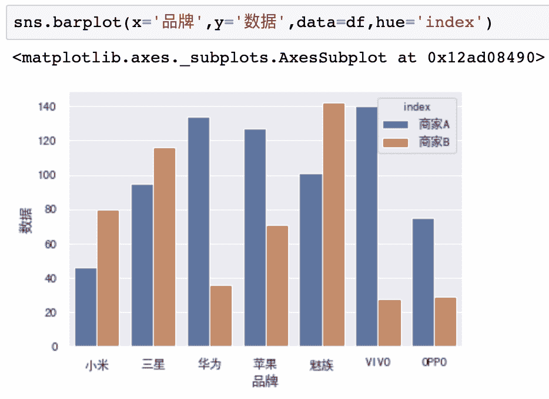

相比上面四种工具，从**代码量**上来看是非常简洁的，不过还是要先将**数据转换**为DataFrame格式，这里没在代码中体现，但依旧是**最简短的代码**，同时并不支持交互。并且Seaborn和Plotly、bokeh有一个共同的地方就是虽然强大，但是**网上有关这三个库的教程、讨论都远少于Pyecharts与Matplotlib**，如果是新手的话可能很难快速通过搜索解决你遇到的问题，而需要自己研究别人的代码，主观评分**72**分

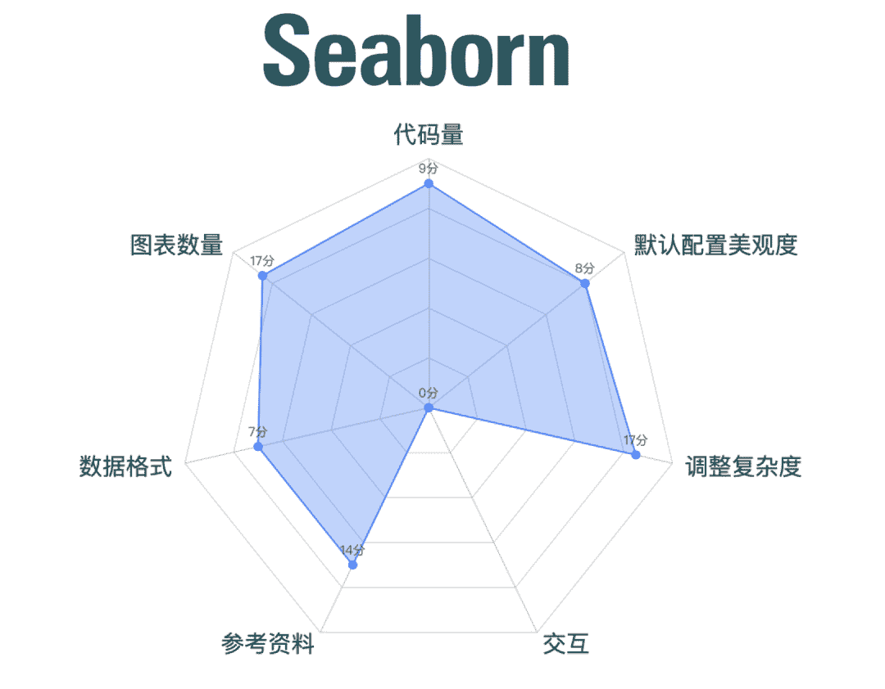

## 小结

以上就是对常见的5个Python数据可视化的评测，可能通过绘制条形图的方式去给每个工具打分不是非常合适，但我想你应该能够大致熟悉到每个库在绘图时的特点，同时也能在选择这些工具之前有一个简单的了解。最后正如我们文中介绍的一样，**不同工具的应用场景、目标用户都不完全相同**，所以我们在选择工具时需要**先思考自己的使用场景**，并且需要评估绘制目标图形的难度，就像有些工具虽然强大但是资料太少，不要为了追求高级的样式而浪费太多时间！如果你仍在犹豫学习哪一个工具的话，我的意见是**：熟练掌握一个工具之后，了解其他工具即可**！最后留一个彩蛋，大家可以猜一猜文中的雷达图是使用文中提到的哪一款工具制作。

### 

