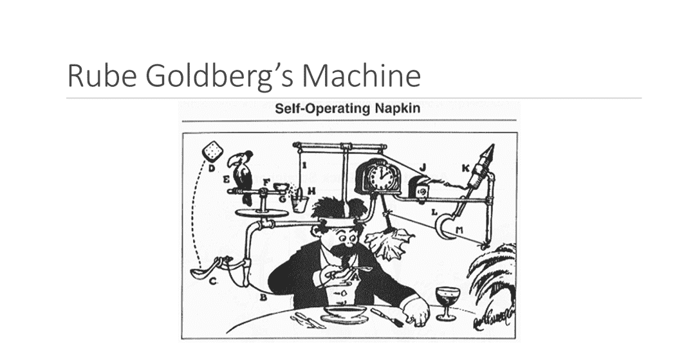
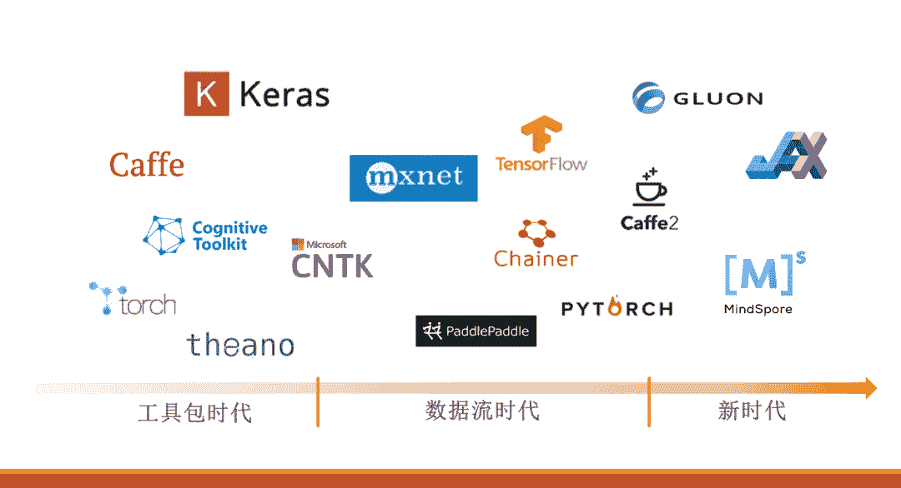
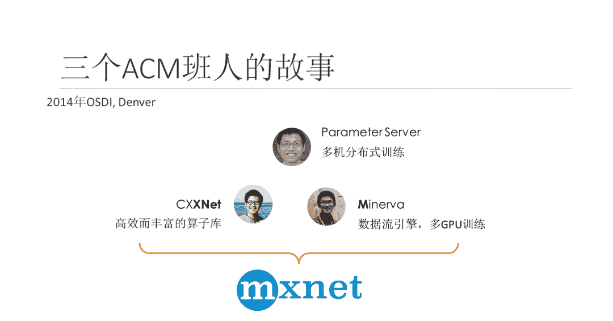
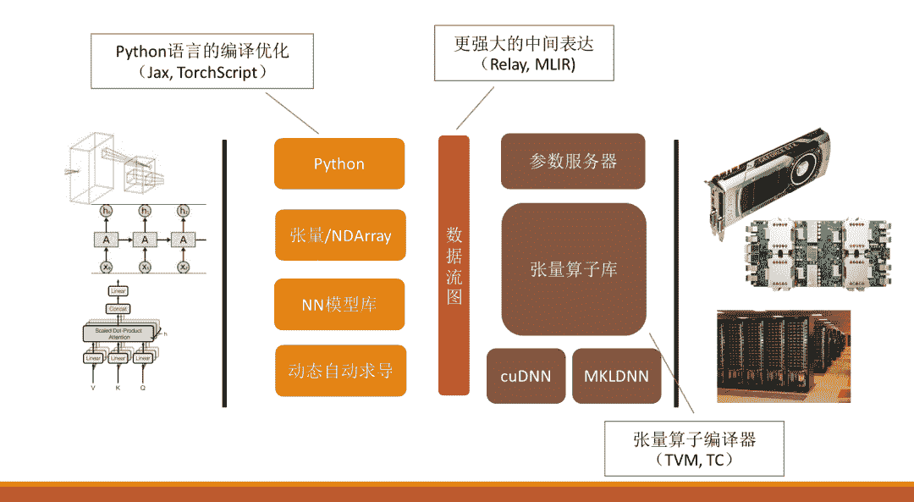

**深度学习框架这十年**

**王敏捷**  ACM'07

纽约大学博士，亚马逊上海研究院应用科学家

**内容概览 **介绍了深度学习框架发展的三个时期：工具包时代（2014年前）、数据流时期（2014-2018）、新时代（2019年后）。强调了深度学习框架的重要性与推动因素，介绍了3位ACM人李沐、陈天奇和他一起将各自的技术Parameter Server、CXXNet、Minerva融合并创造了新的深度学习框架MXNet。敏捷学长也指出了在深度学习新时代，随着可微分编程、图神经网络等新领域的出现以及专用芯片的发展，深度学习框架会迎来更多机遇与挑战。

**完整版演讲视频：**

深度学习的浪潮其实到现在仅仅发展了十几年的时间。深度学习的火热到底是什么在驱动？

原因主要来自于三个方面：

（1）首先是规模很大的数据。俗话说巧妇难为无米之炊，大数据使得我们在训练神经网络的过程中有充分的资源可以利用；

（2）其次，算法也是非常非常重要的突破。比如说卷积神经网络、residual network、注意力机制这些算法的兴起，也是促成深度学习浪潮的重要因素。

（3）最后是算力。算力主要体现在两个方面：软件和硬件，其中软件对应的就是今天要讲的深度学习框架。

对于做人工智能方面的研究或者工业界的人士，或多或少都用过深度学习框架。在过去的几十年里，有很多深度学习框架被提出，被使用，但最后销声匿迹。我们需要去了解一代又一代的深度学习框架被提出的原因，框架之间的关系及其演变的历史，也就是今天的主题：深度学习框架这十年。

**深度学习框架**

讲深度学习框架之前，可以先了解一下什么是**Rube Goldberg’s Machine**。这是一个在美国高中的科创文化中非常流行的概念。它的目的是设计一个复杂、可能有很多机关技巧的机器，但完成的却是一个非常简单的工作。比如去年Rube Goldberg’s Machine比赛的题目是设计一个能把一枚硬币放到储蓄罐里的机器。另一个例子是self operating napkin,一个自动递纸巾的机器。这个机器的工作非常简单，但是流程却非常复杂，比如客人把手放下，就要触发各个机关，最后把纸巾递到面前。

要理解一个复杂的system，最简单的方式是看system的上游和下游，比如上述的机器，虽然流程很复杂，但触发条件就是客人放下手，下游就是把纸巾送嘴边。

深度学习系统也是类似的思维。对于深度学习框架来说，系统上游是各种神经网络模型，系统的下游是各类硬件，例如GPU、CPU等。理解了上下游后，深度学习系统的边界和目的就变得简单而清晰了。**深度学习框架就是使用最精简的设计，灵活地支持各类神经网络，并且不同硬件条件下，也能让神经网络高效执行**。

Rube Goldberg’s Machine和深度学习框架两者的区别在于：Rube Goldberg’s Machine将模型复杂化，而深度学习框架的目的是用最精简的方完成任务。**The simple is the better**。从这个角度上，我们可以把十几年间涌现的大量深度学习框架划分为三个时代，分别是：**工具包时代**、**数据流时代**和**新时代**。

**工具包时代**

工具包时代是接触神经网络较早的时期，一般指2014年前，代表性的框架有**Cuda-ConvNet2**和**Caffe**。

**特征**

这个时代的特点是**计算机视觉领域的井喷**。起源于07年的第一篇深度学习网络论文在mnist数据集上得到了很好的效果，12年AlexNet诞生也鼓励了深度学习的浪潮。在这个阶段，卷积神经网络是很多工具包关注的要点。Cuda-ConvNet2或Caffe定义模型的方式也因此是以写configuration为主，和现在的框架有很大的区别。例如用Caffe写AlexNet时，要定义 layer和它的name、type、input_param等参数。这样设计的原因就是卷积神经网络是深度学习系统上游的主流，那个时代对这方面的研究也非常火热。这些框架的interface是完全可以满足需求的，因为当时的研究只是把不同的卷积层拼接，从而了解不同的神经网络结构的效果。

**优势**

工具包时代的**系统设计非常简单**。

在用户层，它仅仅是**模型配置文件**，在硬件层，系统通过**手写GPU和CPU的神经网络算子来解决硬件问题**，例如Cuda能明显实现神经网络加速。

随着网络和硬件的发展，个人作为单独的团队来编写神经网络算子变得困难，所以大厂商，包括英伟达、英特尔，会开发专门针对神经网络的算子库，比如说CuDNN和MKLDNN,这些算子在现在的神经网络系统框架  中依然常用。

这就是工具包时代的Cuda-ConvNet2和Caffe成功的原因。

**劣势**

工具包时代的框架也存在一些缺点。

首先是**模型配置文件非常不灵活**，很难表达复杂的模型例如RNN，虽然对于计算机视觉的网络处理比较方便，但是对于变长的数据，例如文本的支持并不理想。

其次，它并不是非常灵活的编程语言，随着深度学习网络可学习参数的增多，它**难以利用多机和多GPU训练**，因为配置文件很难去表达如何在多机和多GPU的环境下训练，同时算子库也无法解决运行时的问题。

最后，随着模型复杂化，**工具包对新出现的算子的支持也非常有限**。 

在这个时代如何去解决框架的问题是值得思考的。

**数据流时代**

2014年在Denver,我、李沐和陈天奇三位ACM班的学生在OSDI开会。**李沐**实现的是 **parameter server**，他的专业领域在于多机分布式训练。**陈天奇**的项目是**CXXNet**,包含了高效而丰富的算子库。我的项目是**Minerva**，**核心思想是****使用数据流的引擎，令多GPU的训练加速**。我们共同的思想是如何设计更好的深度学习系统，同时我们的项目和专业领域正好互补。于是我们的MXNet应运而生。

接下来的一段时间（2014-2018年），就是数据流时期框架的爆发。主流的框架有MXNet、TensorFlow、PyTorch、Chainer、Caffe2。

**主导因素**

随着深度学习的领域的不断发展，NLP也进入井喷阶段，这是这些框架出现的一大诱因。同时随着数据的增加，对并行的需求也随之上升，因此在数据流时期，很多模型如ResNet在ImageNet上训练只需要一小时,通过在大量机器上并行，甚至在分钟、秒的量级上可以完成。这都得益于数据流的概念和数据流天然具有的并行性。

**时代特点**

数据流时代的模型和工具包时代的区别就是在用户层和硬件层中间加了一层中间表达：**数据流图**。系统分为前端和后端，前端只关注用户使用方面的问题，而后端负责系统优化。

第二个区别是，前端也放弃模型配置文件了，**Python**成为了整个深度学习框架的一个标杆，通过Python提供**张量运算的接口**。随着Pytorch为典型的用户友好的框架的出现，NN模型库,包括动态自动求导成为了整个深度学习框架的标配。后端也逐渐把专用的算子替代成更丰富的张量算子库，同时增加了参数服务器，使得整个系统能够在多机多GPU的环境下训练。

**新时代**

数据流时代其实就是新时代的开端。虽然通用深度学习框架的设计趋向于稳定，但是新的概念，新的模型不断涌现，让系统的设计也有新的一些挑战。

第一个概念是**可微分编程**。这是近两年提出的一个广大的思路概念。在编写模型时，程序本身是可微分编程的，很多系统设计的工作在往这个方向迈进。第二点是**新领域**的出现，例如图神经网络，图神经网络可以处理原本难以解决的数据，比如知识图谱，制药中分子的生物图，新领域出现，也对系统产生了新的挑战。第三个概念是**AI-chip**，神经网络专用芯片。这是深度学习发展的大趋势，也是系统无可避免的问题。

在2019年后，系统的趋势有了明显的变化。

首先是**前端垂直化**。开发过程中，不再以通用系统为目标，而是基于通用系统开发面向垂直领域的工具，包括计算机视觉，自然语言处理，图领域等领域，DGL、AutoGluon、Captum等垂直领域的工具包。

其次，新概念也在慢慢渗透到**系统设计**中。对于Python，很多人提出Python并不是很好的选择，也有很多的工作来优化对应的语言的编译。对于数据流图，它并不是一种非常强大的编程语言。而实现可微分编程需要更强大的中间表达比如Relay、MLIR。对于张量算子库，AI chip的出现让张量算子编译器应运而生，其代表作有TVM，TC等工作。

**总结**

深度学习框架虽然非常年轻，但已经经历了多轮的演变，而每一轮的演变都是由于算法和硬件的新趋势带来的新的挑战。

2019年之后，新挑战不断涌现，对于有志于投身这个领域的同学是非常好的时机。我们ACM班人在深度学习框架演变中也起到了非常重要的推动作用，很多的学长学姐在各个领域有非常好的成就，在研究过程中，如果能和同学或者学长产生一些思维的火花，不要犹豫，可能你们要做的工作也能在历史中留下印记。

*本文完整PPT 后台回复* ***深度学习框架** 下载*

“干货学习，**点****赞****三连**↓