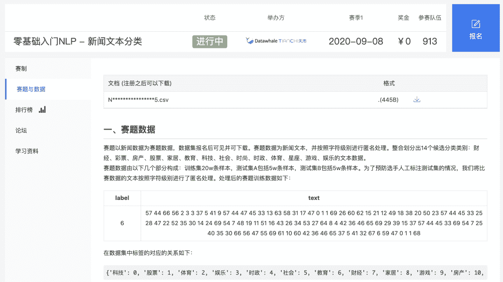
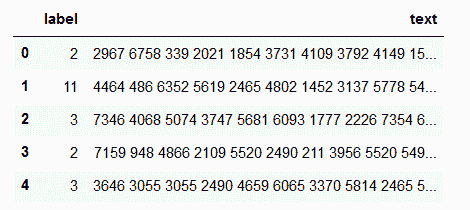
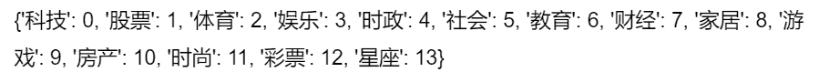
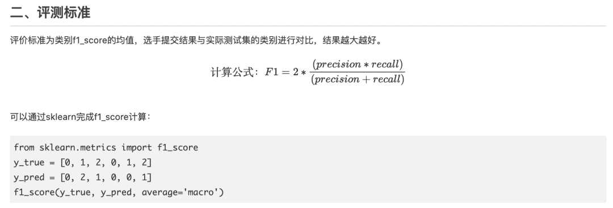
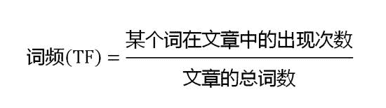
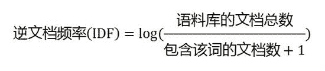
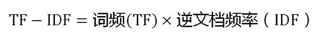
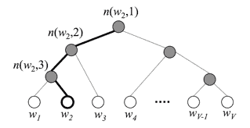

↑↑↑关注后"星标"Datawhale

每日干货 & [每月组队学习](https://mp.weixin.qq.com/mp/appmsgalbum?__biz=MzIyNjM2MzQyNg%3D%3D&action=getalbum&album_id=1338040906536108033#wechat_redirect)，不错过

 Datawhale干货 

**作者：陈琰钰****，清华大学，Datawhale成员**

越来越多的人选择参加算法赛事，为了提升项目实践能力，同时也希望能拿到好的成绩增加履历的丰富度。期望如此美好，现实却是：看完赛题，一点思路都木有。那么，当我们拿到一个算法赛题后，如何破题，如何找到可能的解题思路呢。

本文针对NLP项目给出了4种常见的解题思路，其中包含1种基于机器学习的思路和3种基于深度学习的思路。

**一、数据及背景**

https://tianchi.aliyun.com/competition/entrance/531810/information（阿里天池-零基础入门NLP赛事）

**二、数据下载及分析**

**2.1 获取数据**

我们直接打开数据下载地址，看到的是这样一个页面：

接着就三步走：注册报名下载数据，查看数据前五行可以看到我们获得的数据如下：

其中左边的label是数据集文本对应的标签，而右边的text则是编码后的文本，文本对应的标签列举如下：

根据官方描述：赛题以匿名处理后的新闻数据为赛题数据，数据集报名后可见并可下载。赛题数据为新闻文本，并按照字符级别进行匿名处理。整合划分出14个候选分类类别：财经、彩票、房产、股票、家居、教育、科技、社会、时尚、时政、体育、星座、游戏、娱乐的文本数据。

赛题数据由以下几个部分构成：训练集20w条样本，测试集A包括5w条样本，测试集B包括5w条样本。为了预防选手人工标注测试集的情况，我们将比赛数据的文本按照字符级别进行了匿名处理。

同时我们还应该注意到官网有给出结果评价指标，我们也需要根据这个评价指标衡量我们的验证集数据误差：

既然该拿到的我们都拿到了，我们接下来就开始构思我们都应该使用哪些思路来完成我们的预测。

**2.2 常见思路**

赛题本质是一个文本分类问题，需要根据每句的字符进行分类。但赛题给出的数据是匿名化的，不能直接使用中文分词等操作，这个是赛题的难点。

因此本次赛题的难点是需要对匿名字符进行建模，进而完成文本分类的过程。由于文本数据是一种典型的非结构化数据，因此可能涉及到**`特征提取`**和**`分类模型`**两个部分。为了减低参赛难度，我们提供了一些解题思路供大家参考：

*   **思路1**：TF-IDF + 机器学习分类器：直接使用TF-IDF对文本提取特征，并使用分类器进行分类。在分类器的选择上，可以使用SVM、LR、或者XGBoost。

*   **思路2**：FastText：FastText是入门款的词向量，利用Facebook提供的FastText工具，可以快速构建出分类器。

*   **思路3**：WordVec + 深度学习分类器：WordVec是进阶款的词向量，并通过构建深度学习分类完成分类。深度学习分类的网络结构可以选择TextCNN、TextRNN或者BiLSTM。

*   **思路4**：Bert词向量：Bert是高配款的词向量，具有强大的建模学习能力。

**三**、******基于机器学习的文本分类**

**3.1 TF-IDF+机器学习分类器(思路1)**

**3.1.1\. 什么是TF-IDF？**

TF-IDF(term frequency–inverse document frequency)是一种用于信息检索与数据挖掘的常用加权技术，常用于挖掘文章中的关键词，而且算法简单高效，常被工业用于最开始的文本数据清洗。

TF-IDF有两层意思，一层是"词频"（Term Frequency，缩写为TF），另一层是"逆文档频率"（Inverse Document Frequency，缩写为IDF）。

当有TF(词频)和IDF(逆文档频率)后，将这两个词相乘，就能得到一个词的TF-IDF的值。某个词在文章中的TF-IDF越大，那么一般而言这个词在这篇文章的重要性会越高，所以通过计算文章中各个词的TF-IDF，由大到小排序，排在最前面的几个词，就是该文章的关键词。

**3.2.2\. TF-IDF算法步骤**

**第一步**，计算词频：

考虑到文章有长短之分，为了便于不同文章的比较，进行"词频"标准化:

**第二步**，计算逆文档频率：

这时，需要一个语料库（corpus），用来模拟语言的使用环境。

如果一个词越常见，那么分母就越大，逆文档频率就越小越接近0。分母之所以要加1，是为了避免分母为0（即所有文档都不包含该词）。log表示对得到的值取对数。

**第三步**，计算TF-IDF：

可以看到，TF-IDF与一个词在文档中的出现次数成正比，与该词在整个语言中的出现次数成反比。所以，自动提取关键词的算法就很清楚了，就是计算出文档的每个词的TF-IDF值，然后按降序排列，取排在最前面的几个词。

**3.3.3\. 优缺点**

TF-IDF的优点是简单快速，而且容易理解。缺点是有时候用词频来衡量文章中的一个词的重要性不够全面，有时候重要的词出现的可能不够多，而且这种计算无法体现位置信息，无法体现词在上下文的重要性。如果要体现词的上下文结构，那么你可能需要使用word2vec算法来支持。

******四**、******基于深度学习的文本分类**

**4.1 FastText(思路2)**

**4.1.1  FastText的核心思想**

将整篇文档的词及n-gram向量叠加平均得到文档向量，然后使用文档向量做softmax多分类。这中间涉及到两个技巧：字符级N-gram特征的引入以及分层Softmax分类。

**4.1.2  字符级N-gram特征**

N-gram是基于语言模型的算法，基本思想是将文本内容按照子节顺序进行大小为N的窗口滑动操作，最终形成窗口为N的字节片段序列。举个例子：

我来到达观数据参观

相应的bigram特征为：我来 来到 到达 达观 观数 数据 据参 参观

相应的trigram特征为：我来到 来到达 到达观 达观数 观数据 数据参 据参观

注意一点：n-gram中的gram根据粒度不同，有不同的含义。它可以是字粒度，也可以是词粒度的。上面所举的例子属于字粒度的n-gram，词粒度的n-gram看下面例子：

我 来到 达观数据 参观

相应的bigram特征为：我/来到 来到/达观数据 达观数据/参观

相应的trigram特征为：我/来到/达观数据 来到/达观数据/参观

n-gram产生的特征只是作为文本特征的候选集，你后面可能会采用信息熵、卡方统计、IDF等文本特征选择方式筛选出比较重要特征。

**4.1.3  分层Softmax分类**

softmax函数常在神经网络输出层充当激活函数，目的就是将输出层的值归一化到0-1区间，将神经元输出构造成概率分布，主要就是起到将神经元输出值进行归一化的作用。

下图是一个分层Softmax示例：

通过分层的Softmax，计算复杂度一下从|K|降低到log|K|。

**4.2 Word2Vec+深度学习分类器(思路3)**

**4.2.1  Word2Vec**

Word2vec，是一群用来产生词向量的相关模型。这些模型为浅而双层的神经网络，用来训练以重新建构语言学之词文本。网络以词表现，并且需猜测相邻位置的输入词，在word2vec中词袋模型假设下，词的顺序是不重要的。训练完成之后，word2vec模型可用来映射每个词到一个向量，可用来表示词对词之间的关系，该向量为神经网络之隐藏层。【百度百科】

Word2vec 是 Word Embedding 的方法之一。他是 2013 年由谷歌的 Mikolov 提出了一套新的词嵌入方法。

**4.2.2  优化方法**

为了提高速度，Word2vec 经常采用 2 种加速方式：

1、Negative Sample（负采样）

2、Hierarchical Softmax

**4.2.3  优缺点**

**优点：**

*   由于 Word2vec 会考虑上下文，跟之前的 Embedding 方法相比，效果要更好（但不如 18 年之后的方法）

*   比之前的 Embedding方 法维度更少，所以速度更快

*   通用性很强，可以用在各种 NLP 任务中

**缺点：**

*   由于词和向量是一对一的关系，所以多义词的问题无法解决。

*   Word2vec 是一种静态的方式，虽然通用性强，但是无法针对特定任务做动态优化

**4.3 Bert词向量(思路4)**

BERT（Bidirectional Encoder Representations from Transformers）词向量模型，2018年10月在《BERT: Pre-training of Deep Bidirectional Transformers for Language Understanding》这篇论文中被Google提出，在11种不同nlp测试中创出最佳成绩，包括将glue基准推至80.4%（绝对改进7.6%），multinli准确度达到86.7% （绝对改进率5.6%）等。

**4.1.1  特征**

1、通过联合调节所有层中的左右上下文来预训练深度双向表示

2、the first fine-tuning based representation model that achieves state-of-the-art performance on a large suite of sentence-level and token-level tasks, outperforming many systems with task-specific architectures

3、所需计算量非常大。Jacob 说：「OpenAI 的 Transformer 有 12 层、768 个隐藏单元，他们使用 8 块 P100 在 8 亿词量的数据集上训练 40 个 Epoch 需要一个月，而 BERT-Large 模型有 24 层、2014 个隐藏单元，它们在有 33 亿词量的数据集上需要训练 40 个 Epoch，因此在 8 块 P100 上可能需要 1 年？16 Cloud TPU 已经是非常大的计算力了。

4、预训练的BERT表示可以通过一个额外的输出层进行微调，适用于广泛任务的state-of-the-art模型的构建，比如问答任务和语言推理，无需针对具体任务做大幅架构修改。

5、一词多义问题

*本文电子版 后台回复数字  ****4** 下载*

点击阅读原文，本文实践↓