↑↑↑关注后"星标"Datawhale

每日干货 & [每月组队学习](https://mp.weixin.qq.com/mp/appmsgalbum?__biz=MzIyNjM2MzQyNg%3D%3D&action=getalbum&album_id=1338040906536108033#wechat_redirect)，不错过

 Datawhale干货 

**作者：张永泰，北京工业大学，Datawhale优秀学习者**

**探索性数据分析**（Exploratory Data Analysis，EDA）是一种探索数据的结构和规律的一种数据分析方法。其主要的工作包含：对数据进行清洗，对数据进行描述（描述统计量，图表），查看数据的分布，比较数据之间的关系，培养对数据的直觉和对数据进行总结。

EDA可以帮助我们找到适合的数据模型，本文针对文本数据，将进行具体的数据探索性分析讲解。

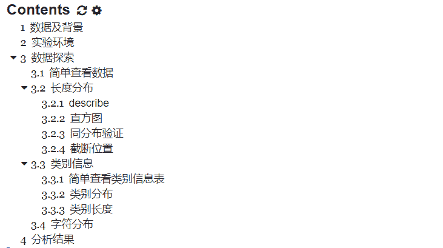

**一、**数据及背景****

https://tianchi.aliyun.com/competition/entrance/531810/information（阿里天池-零基础入门NLP赛事）

# **二、****实验环境**

导入需要使用的包

```
import numpy as np
import pandas as pd
import matplotlib.pyplot as plt
from sklearn.model_selection import train_test_split
import seaborn as sns
import scipy
from collections import Counter 
```

# **三、数据探索**

# 首先，利用Pandas对数据进行读取。

```
df_train = pd.read_csv(train_path, sep='\t')
df_test = pd.read_csv(test_path, sep='\t') 
```

## **3.1 简单查看数据**

```
df_train.head(), len(df_train) 
```

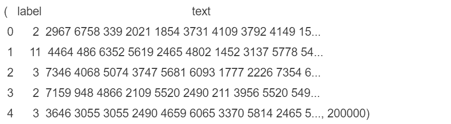

发现text域的数据是字符串。我们想要得到整数序列。可以用字符串分割split()。

```
print(len(df_train['text'][0]), type(df_train['text'][0]))
df_train.head() 
```

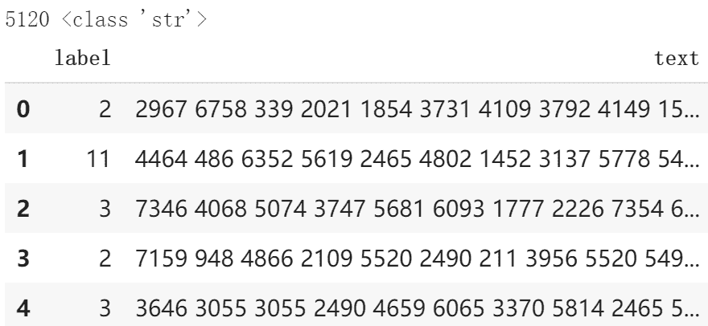

## **3.2 长度分布**

### **3.2.1 describe**

这里与教程中的方法有所不同。vectorize是numpy中很方便的函数，作用和pandas中apply差不多。用法：

```
np.vectorize(function)(array) 
```

输入待处理的array，以及逐元素处理函数function，返回经过处理后的ndarray。原来的array则不受影响。

当前我使用的函数split_df负责将一行数据按空格切分成整数列表，然后计算该列表的长度。

```
def split_df(df_row):
    return len(str(df_row).split())
len_dist = np.vectorize(split_df)(df_train['text'])
len_test_dist = np.vectorize(split_df)(df_test['text']) 
```

使用describe函数查看训练集和测试集中的数据长度分布

```
print(pd.Series(len_dist).describe()) 
```

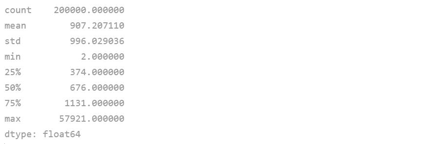

```
print(pd.Series(len_test_dist).describe()) 
```

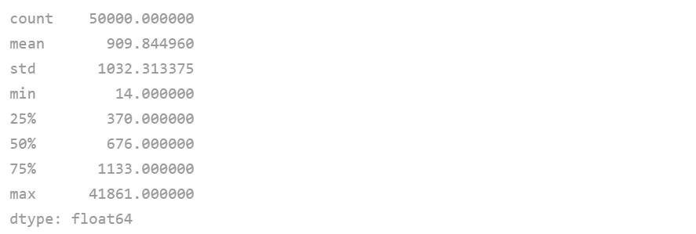

通过数据描述可以看到：

*   训练集共200,000条新闻，每条新闻平均907个字符，最短的句子长度为2，最长的句子长度为57921，其中75%以下的数据长度在1131以下。

*   测试集共50,000条新闻，每条新闻平均909个字符，最短句子长度为14，最长句子41861,75%以下的数据长度在1133以下。

*   训练集和测试集就长度来说似乎是同一分布。

### **3.2.2** **直方图**

绘制直方图查看训练集和测试集中的数据长度分布

```
fig, ax = plt.subplots(1,1,figsize=(12,6))

ax = plt.hist(x=len_dist, bins=100)
ax = plt.hist(x=len_test_dist, bins=100)

plt.xlim([0, max(max(len_dist), max(len_test_dist))])
plt.xlabel("length of sample")
plt.ylabel("number of sample")
plt.legend(['train_len','test_len'])

plt.show() 
```

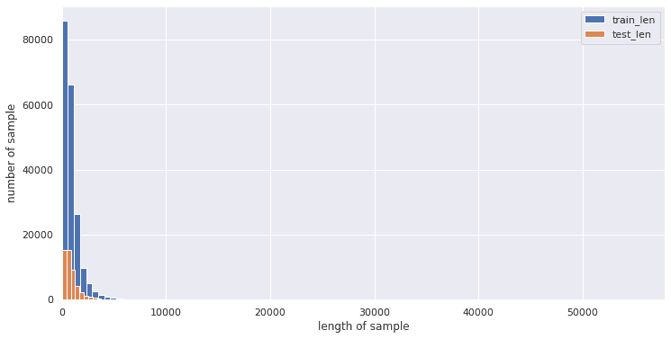

使用seaborn绘制更好的图。seaborn计算的纵坐标是频率，而不是出现次数。由于训练集和测试集的数据量不一样，因此用频率更加科学、更能看出是否符合同一分布。

```
plt.figure(figsize=(15,5))
ax = sns.distplot(len_dist, bins=100)
ax = sns.distplot(len_test_dist, bins=100)
plt.xlim([0, max(max(len_dist), max(len_test_dist))])
plt.xlabel("length of sample")
plt.ylabel("prob of sample")
plt.legend(['train_len','test_len']) 
```

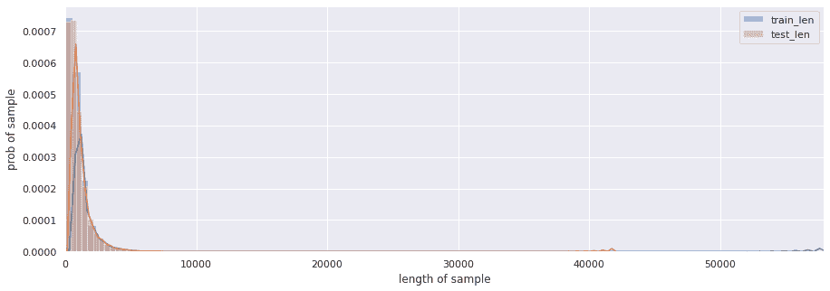

通过直方图，我们能直观感受到训练集和测试集的长度分布都属于右偏分布。按理说分析到这份儿上就该停了。

### **3.2.3 同分布验证**

```
import scipy
scipy.stats.ks_2samp(len_dist, len_test_dist)
Ks_2sampResult(statistic=0.004049999999999998, pvalue=0.5279614323123156) 
```

P值为0.52，比指定的显著水平（假设为5%）大，我们认为二者同分布。

### **3.2.4 截断位置**

在输入模型进行训练之前，我们要把所有的数据长度统一化，数据肯定要截断。但是在什么位置截断合适呢？

考虑到数据长度分布是长尾分布，log一下看看是不是正态分布，如果是正态分布，使用3sigma法则作为截断的参考。如果不是，则就只能瞎猜了

测量拟合分布的均值和方差sigma原则：

*   原则：数值分布在 中的概率为0.6526；

*   原则：数值分布在 中的概率为0.9544；

*   原则：数值分布在 中的概率为0.9974；

由于“小概率事件”和假设检验的基本思想 “小概率事件”通常指发生的概率小于5%的事件，认为在一次试验中该事件是几乎不可能发生的。由此可见X落在 以外的概率小于千分之三，在实际问题中常认为相应的事件是不会发生的，基本上可以把区间 看作是随机变量X实际可能的取值区间，这称之为正态分布的“ ”原则。

```
log_len_dist = np.log(1+len_dist)
log_len_test_dist = np.log(1+len_test_dist)
plt.figure(figsize=(15,5))
ax = sns.distplot(log_len_dist)
ax = sns.distplot(log_len_test_dist)
plt.xlabel("log length of sample")
plt.ylabel("prob of log")
plt.legend(['train_len','test_len']) 
```

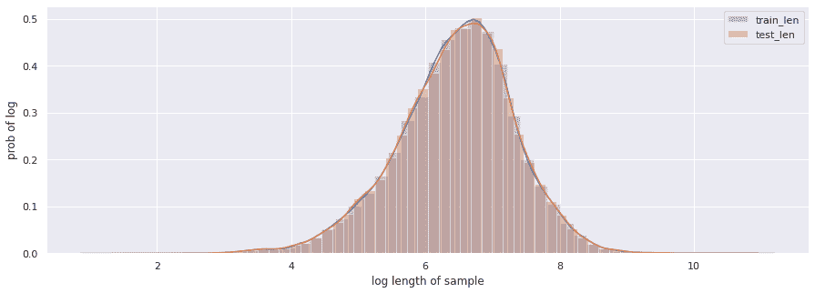

从log图上也能看出二者（很像）同分布。

下面我想验证一下我的猜想：该分布为正态分布，且训练集和测试集为同分布。

先验证训练集分布为正态分布：

```
_, lognormal_ks_pvalue = scipy.stats.kstest(rvs=log_len_dist, cdf='norm')
print('P value is ', lognormal_ks_pvalue)

P value is  0.0 
```

？0？？？拟合优度检验，p值为0，意思就是说这不是一个正态分布。

之前我们把数据log了一下，但是这里有更科学的变换方式。log只是box-cox变换的特殊形式。我们使用box-cox变换再次做一下验证，是否为正态分布：

```
trans_data, lam = scipy.stats.boxcox(len_dist+1)
scipy.stats.normaltest(trans_data)
NormaltestResult(statistic=1347.793358118494, pvalue=2.1398873511704724e-293) 
```

e后面跟了那么多负数，我佛了。这说明我们的假设不成立。

但总归是要猜一个截断值的。看log图上8.5的位置比较靠谱。np.exp(8.5)=4914约等于5000，因此我初步决定把截断长度定为5000。

## **3.3 类别信息**

### **3.3.1 简单查看类别信息表**

先改造一下df_train，多加几个字段，分别是：

*   text-split，将text字段分词

*   len，每条新闻长度

*   first_char，新闻第一个字符

*   last_char，新闻最后一个字符

*   most_freq，新闻最常出现的字符

```
df_train['text_split'] = df_train['text'].apply(lambda x:x.split())
df_train['len'] = df_train['text'].apply(lambda x:len(x.split()))
df_train['first_char'] = df_train['text_split'].apply(lambda x:x[0])
df_train['last_char'] = df_train['text_split'].apply(lambda x:x[-1])
df_train['most_freq'] = df_train['text_split'].apply(lambda x:np.argmax(np.bincount(x)))
df_train.head() 
```

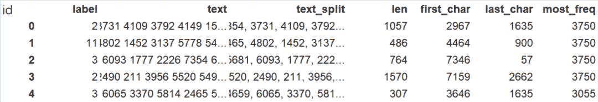

构建一个类别信息表。

*   count，该类别新闻个数

*   len_mean，该类别新闻平均长度

*   len_std，该类别新闻长度标准差

*   len_min，该类别新闻长度最小值

*   len_max，该类别新闻长度最大值

*   freq_fc，该类别新闻最常出现的第一个字符

*   freq_lc，该类别新闻最常出现的最后一个字符

*   freq_freq，该类别新闻最常出现的字符

```
df_train_info = pd.DataFrame(columns=['count','len_mean','len_std','len_min','len_max','freq_fc','freq_lc','freq_freq'])
for name, group in df_train.groupby('label'):
    count = len(group) # 该类别新闻数
    len_mean = np.mean(group['len']) # 该类别长度平均值
    len_std = np.std(group['len']) # 长度标准差
    len_min = np.min(group['len']) # 最短的新闻长度
    len_max = np.max(group['len']) # 最长的新闻长度
    freq_fc = np.argmax(np.bincount(group['first_char'])) # 最频繁出现的首词
    freq_lc = np.argmax(np.bincount(group['last_char'])) # 最频繁出现的末词
    freq_freq = np.argmax(np.bincount(group['most_freq'])) # 该类别最频繁出现的词
    df_train_info.loc[name] = [count,len_mean,len_std,len_min,len_max,freq_fc,freq_lc,freq_freq]
df_train_info 
```

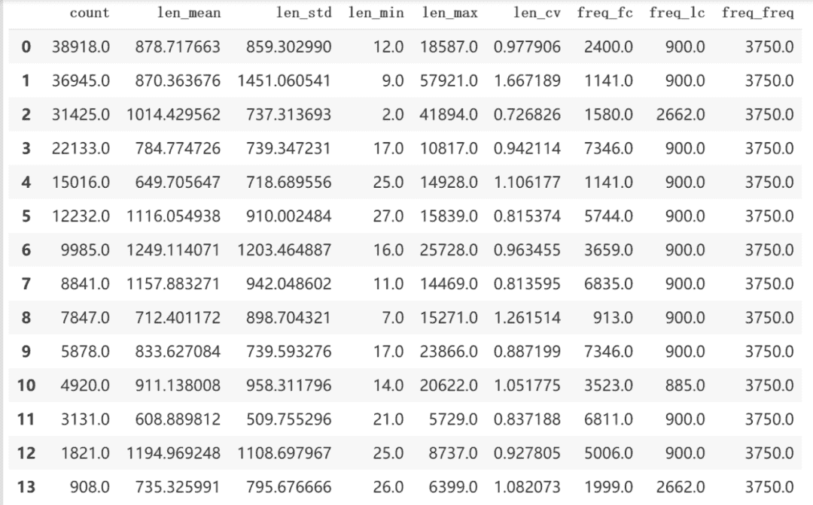

### **3.3.2 类别分布**

之前的讨论是从数据集总体验证同分布的，我们还需要验证训练集的类别足够均匀。

在数据集中标签的对应的关系如下

```
label_2_index_dict = {'科技': 0, '股票': 1, '体育': 2, '娱乐': 3, '时政': 4, '社会': 5, '教育': 6, '财经': 7, '家居': 8, '游戏': 9, '房产': 10, '时尚': 11, '彩票': 12, '星座': 13}
index_2_label_dict = {v:k for k,v in label_2_index_dict.items()}

plt.figure()
plt.bar(x=range(14), height=np.bincount(df_train['label']))
plt.xlabel("label")
plt.ylabel("number of sample")
plt.xticks(range(14), list(index_2_label_dict.values()), fontproperties=zhfont, rotation=60)
plt.show() 
```

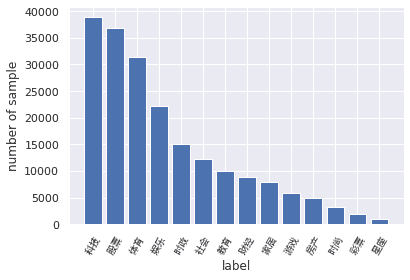

从统计结果可以看出

*   赛题的数据集类别分布存在较为不均匀的情况。在训练集中科技类新闻最多，其次是股票类新闻，最少的新闻是星座新闻。

*   科技类新闻最多，星座类新闻最少。这个国家的人大部分是唯物主义者哈，神秘学受众比较少（啊这，我在分析什么？）。

*   由于类别不均衡，会严重影响模型的精度。但是我们也是有办法应对的。

### **3.3.3 类别长度**

```
df_train['len'] = df_train['text'].apply(lambda x: len(x.split()))
plt.figure()
ax = sns.catplot(x='label', y='len', data=df_train, kind='strip')
plt.xticks(range(14), list(index_2_label_dict.values()), fontproperties=zhfont, rotation=60) 
```

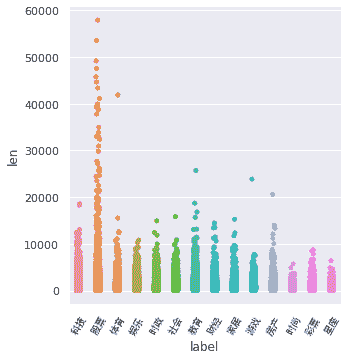

在散点图中，股票类新闻的长度都飘到天上去了，可以看出股票分析类文章真的很容易写得又臭又长啊（发现：不同类别的文章长度不同，可以把长度作为一个Feature，以供机器学习模型训练）！

## **3.4 字符分布**

训练集中总共包括6869个字，最大数字为7549，最小数字为0，其中编号3750的字出现的次数最多，编号3133的字出现的次数最少，仅出现一次。

```
# 内存警告！！！没有8G内存不要运行该代码
all_lines = ' '.join(list(df_train['text']))
word_count = Counter(all_lines.split(" "))
word_count = sorted(word_count.items(), key=lambda d:d[1], reverse=True)

print(len(word_count))
# 6869

print(word_count[0])
# ('3750', 7482224)

print(word_count[-1])
# ('3133', 1) 
```

下面代码统计了不同字符在多少个句子中出现过，其中字符3750、字符900和字符648在20w新闻的覆盖率接近99%，很有可能是标点符号。

```
%%time
df_train['text_unique'] = df_train['text'].apply(lambda x: ' '.join(list(set(x.split(' ')))))
all_lines = ' '.join(list(df_train['text_unique']))
word_count = Counter(all_lines.split(" "))
word_count = sorted(word_count.items(), key=lambda d:int(d[1]), reverse=True)
# 打印整个训练集中覆盖率前5的词
for i in range(5):
    print("{} occurs {} times, {}%".format(word_count[i][0], word_count[i][1], (word_count[i][1]/200000)*100)) 
```

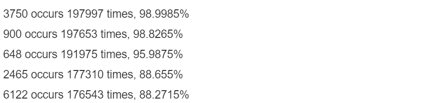

# **四、分析总结**

数据分析肯定要有结论，没有结论的数据分析是不完整的。

1.  训练集共200,000条新闻，每条新闻平均907个字符，最短的句子长度为2，最长的句子长度为57921，其中75%以下的数据长度在1131以下。测试集共50,000条新闻，每条新闻平均909个字符，最短句子长度为14，最长句子41861,75%以下的数据长度在1133以下。

2.  训练集和测试集就长度来说似乎是同一分布，但是不属于正态分布。

3.  赛题的数据集类别分布存在较为不均匀的情况。在训练集中科技类新闻最多，其次是股票类新闻，最少的新闻是星座新闻。需要用采样方法解决。文章最长的是股票类新闻。不同类别的文章长度不同，可以把长度和句子个数作为一个Feature，以供机器学习模型训练。

4.  训练集中总共包括6869个字，最大数字为7549，最小数字为0，其中编号3750的字出现的次数最多，编号3133的字出现的次数最少，仅出现一次，其中字符3750、字符900和字符648在20w新闻的覆盖率接近99%，很有可能是标点符号。

5.  900很有可能是句号，2662和885则很有可能为感叹号和问号，3750出现频率很高但是基本不在新闻最后出现，因此初步判断为逗号。按照这种划分，训练集中每条新闻平均句子个数约为19。

6.  在训练集中，不同类别新闻出现词汇有特色。但是需要把共有的常用词停用。自然想到利用TF-IDF编码方式。

*本文电子版 后台回复* ***数据分析** 获取*


点击阅读原文，本文实践↓