↑↑↑关注后"星标"Datawhale

每日干货 & [每月组队学习](https://mp.weixin.qq.com/mp/appmsgalbum?__biz=MzIyNjM2MzQyNg%3D%3D&action=getalbum&album_id=1338040906536108033#wechat_redirect)，不错过

 Datawhale干货 

**作者：卢玉洁，辽宁大学硕士  ****张帆，天津大学硕士**

之前参加数据竞赛和做算法实践项目，让人苦恼的就是数据量比较大的时候，电脑配置往往跟不上。其实除了自己买内存、显卡（受到贫穷限制），也可以通过Goggle的Colab、以及阿里云，腾讯云的免费算力来跑代码（真香），因为这次参加了nlp入门赛事，被问到算力的问题比较多，今天就整理一下我是如何用阿里云的免费算力来参加数据竞赛的，其他平台流程类似，希望对大家有帮助。

**一、进入阿里云实验室**

我这次参加比赛用的是阿里云的DWS平台，和Google的Colab类似，不用配置深度学习环境，同时有免费GPU资源，比较适合打比赛。下面我尽量从小白的角度讲下我是如何用DWS来打比赛的。首先从网页进入DWS地址：

https://tianchi.aliyun.com/notebook-ai/?spm=5176.13048197.0.0.53167bbeyAh58A

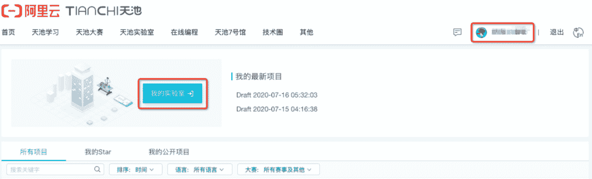

点击红框处按钮即可进入到PAI DSW 实验室了。

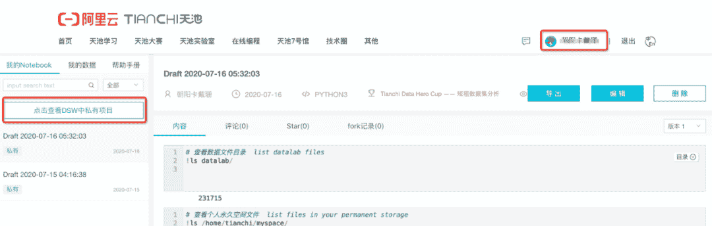

首次启动DSW 的过程中，由于安全性等因素可能需要用户稍微等一会儿。若长时间仍无法进入notebook 环境，可以刷新下网页尝试重新启动。

## **二、打开****DSW平台**

进入之后点击我的实验室，进入之后等待几秒后我们会看到如下页面：

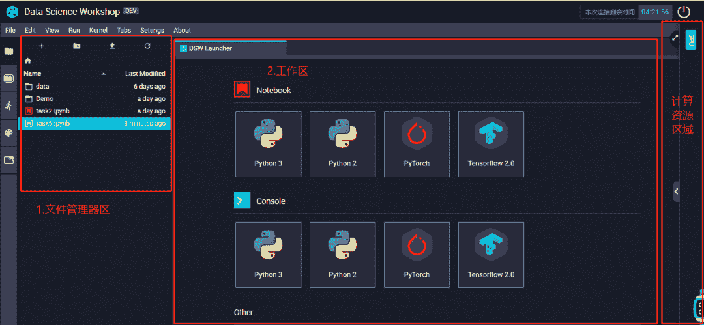如上图所示，左侧是DSW实验室的⽂件区，在这⾥你可以看到在你的实验室⾥的所有⽂件夹和⽂件。双击⽂件夹即可进入这个⽂件夹。中间是⼯作区，所有被打开的⽂件都会在⼯作区显示出来。右侧是计算资源区域，在这⾥你可以看到你当前使⽤的资源类型。点击右边计算资源区的箭头，即可弹出资源详情，点击切换按钮就可以进行CPU和GPU环境的切换，如下图所示：

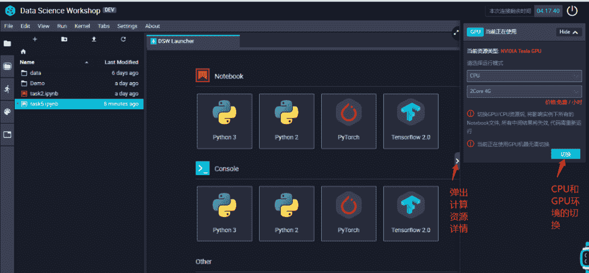

在⽂件资源管理区的顶部还有4个按钮，从左到右分别对应的是：打开DSW Launcher启动器，新建⽂件夹，上传⽂件以及刷新当前⽂件夹。

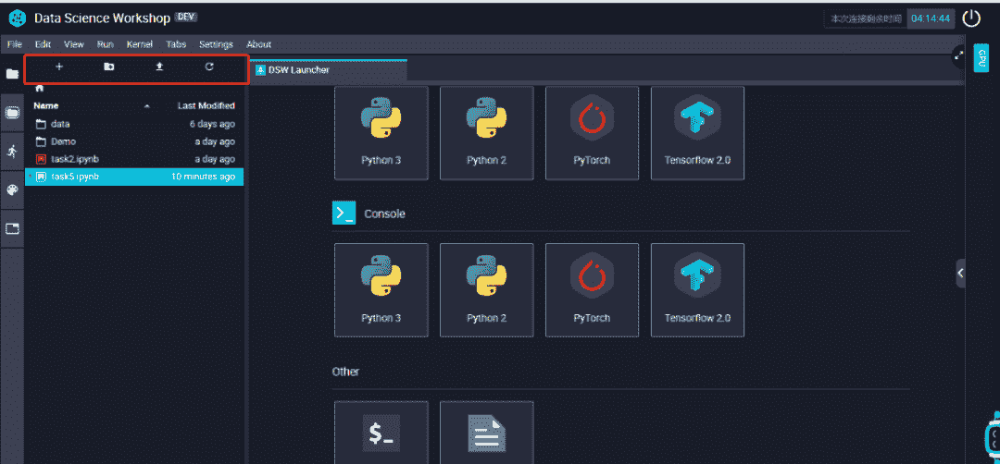

在⽂件夹左侧还有⼀栏Tab，每个图标从上到下分别代表了：⽂件资源管理器，案例代码，正在运⾏的Notebook，命令⾯板，在⼯作区打开的Tab。

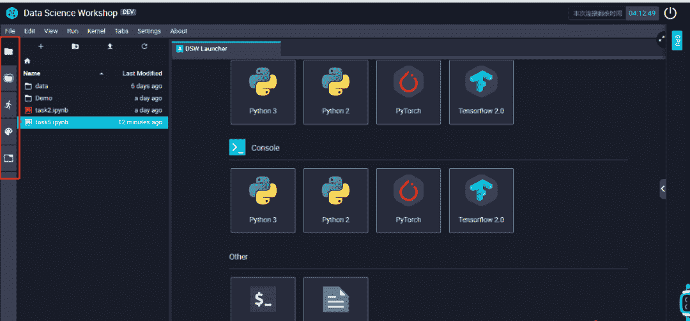

了解了DSW的环境以后，然后我们回到DSW Launcher启动器,也就是⼯作区默认打开的界⾯，我们可以看到cpu环境下和gpu环境下以及对应的kernel环境，可以根据自己的需求进行选择。

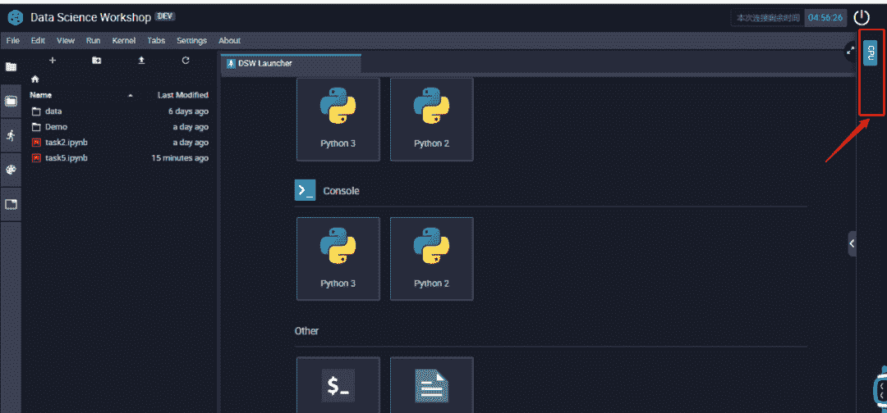

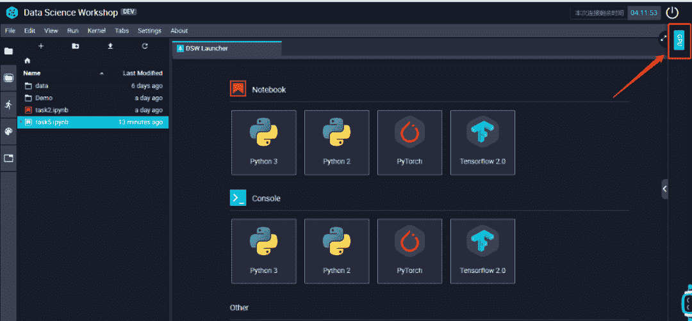

## **三、创建一个notebook实例**

以GPU环境下为例，在工作区默认打开的界面，然后点击Notebook区域中的PyTorch为例，如下所示：

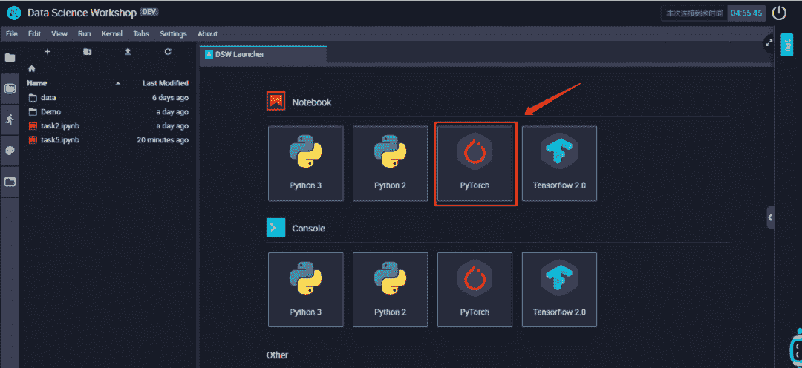

点击了PyTorch这个图标之后，DSW实验室就会⾃动为我们创建⼀个ipynb notebook⽂件。我们在左侧的资源管理器中也会看到。如下图所示：

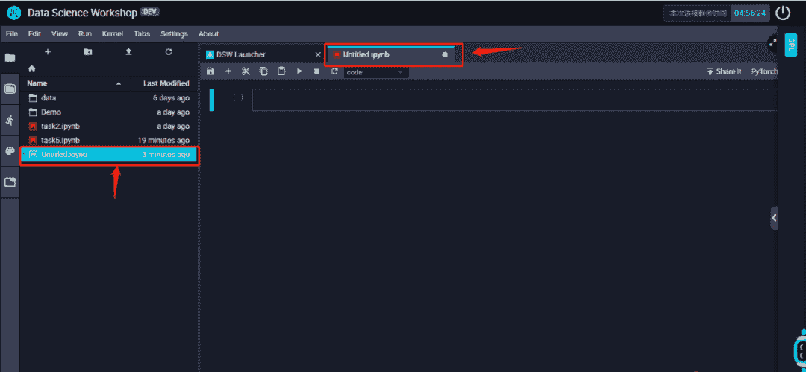

这样我们就成功的创建了⼀个Notebook了。

⽤⿏标点击第⼀个框框（我们下⾯以Cell称呼），我们就可以开始从只读模式进⼊编辑模式开始写代码了。

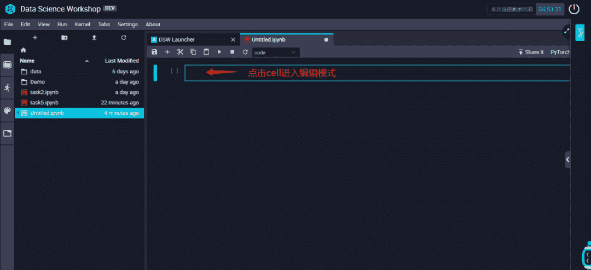

相信熟悉Notebook的你到这⼀步就很清楚之后怎么操作了～如果你以前没有⽤过也没关系，继续往下看。

## **四、数据获取（以NLP比赛为例）**

### **4.1 数据获取**

**步骤1：**首先需要在新闻文本分类挑战赛报名，在赛题与数据栏中，点击红框下载数据。

下载链接：https://tianchi.aliyun.com/competition/entrance/531810/information

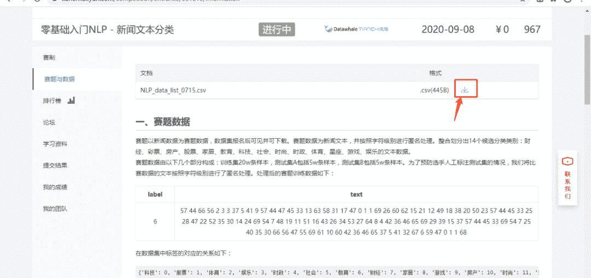

**步骤2：**打开所下载的文件，发现下载的并非是数据集本身，而是提供了训练集数据，测试集数据，sub提交样例的下载链接。

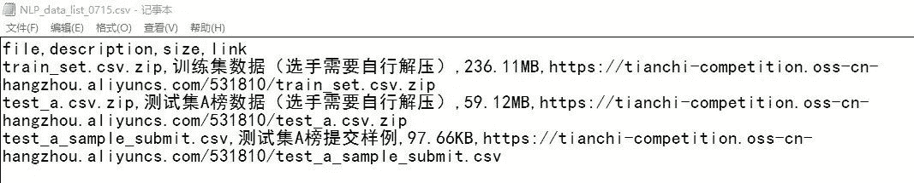

**步骤3：**基于DSW的NLP比赛数据获取方式：

*   **方式1：**直接将数据下载至本地，再通过本地进行数据上传

将步骤2获取的训练集和测试集链接复制到浏览器中，下载数据集。下载后，上传至文件区。

*   **方式2：**通过!wget xxxx(所需数据的链接)进行下载，但是注意只能在CPU环境下，GPU环境不支持联网。具体操作如下：

首先，创建一个CPU环境下kernel选择Python 3的notebook。

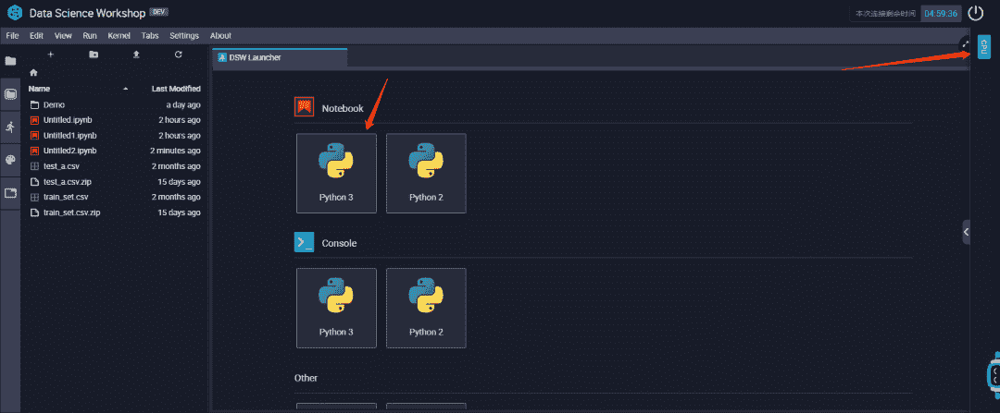运行以下代码块。

```
# 1.训练集数据下载
!wget https://tianchi-competition.oss-cn-hangzhou.aliyuncs.com/531810/train_set.csv.zip
# 2.解压缩包
!unzip train_set.csv.zip

# 1.训练集数据下载
!wget https://tianchi-competition.oss-cn-hangzhou.aliyuncs.com/531810/test_a.csv.zip
# 2.解压缩包
!unzip test_a.csv.zip 
```

拷贝上方的命令至cell后，我们按下 shift + enter回⻋ 这两个键,就可以看到我们的执⾏结果了，如下图所示:

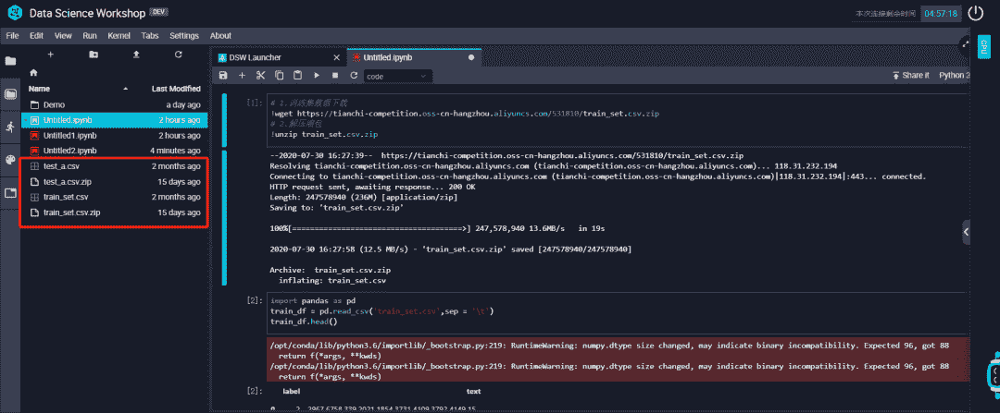

### **4.2 数据读取**

```
import pandas as pd
train_df = pd.read_csv('train_set.csv',sep = '\t')
train_df.head() 
```

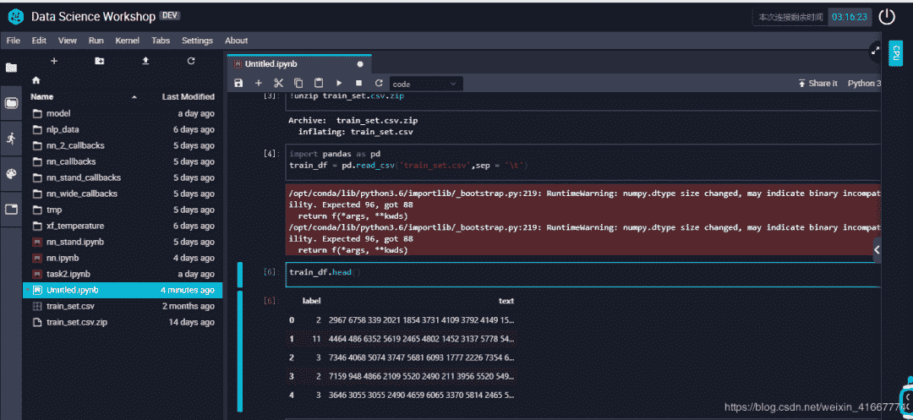

同样，训练集也已经可读取，这里不再做赘述。至此，我们接下来就可以愉快的进行模型训练啦~

### **五、训练模型**

选择以Count Vectors+RidgeClassfier模型为例，对nlp赛事进行实践。训练模型前可以根据自身需求进行CPU or GPU环境以及kernel配置的选择。

*   在这里，我们新建一个**GPU**环境下kernel选择PyTorch的文件。

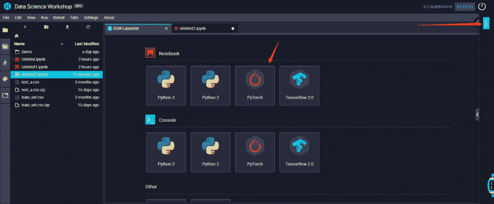

*   在创建好的notebook中，首先安装所需的库

```
#  Count Vectors+RidgeClassfier
import pandas as pd
from sklearn.linear_model import RidgeClassifier
from sklearn.feature_extraction.text import CountVectorizer
from sklearn.feature_extraction.text import TfidfVectorizer
from sklearn.metrics import f1_scor 
```

*   读取数训练集及测试集数据

```
train_df = pd.read_csv('train_set.csv',sep='\t')
test_df = pd.read_csv('test_a.csv') 
```

*   我们查看一下数据的大小

```
test_df.shape
#  (50000, 1) 
```

*   然后可以建模训练

```
#  建模训练
vectorizer = CountVectorizer(max_features=3500)
all_data_df = pd.concat([train_df,test_df],axis =0)
train_test = vectorizer.fit_transform(all_data_df['text'])
train_len = train_df.shape[0]
train_count = train_test[:train_len]
test_count = train_test[train_len:]
clf = RidgeClassifier()
num = int(train_len*0.9)
clf.fit(train_count[:num], train_df['label'].values[:num]) 
```

若页面如下图所示，并非报错，计算时间较长，请耐心等待即可。

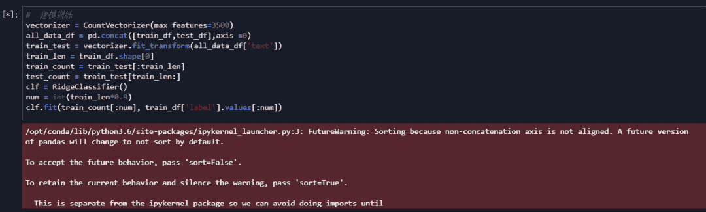

*   在测试集预测一下分数

```
#  最后在测试集预测一下分数
val_pred = clf.predict(train_count[num:])
print(f1_score(train_df['label'].values[num:], val_pred, average='macro')) 
```

0.8256729738074418

这样，就掌握了如何用阿里云DWS创建Notebook，便携代码和运⾏代码的整个流程。可以愉快地用数据进行模型的训练了~

*后台回复* ***DWS** 获取，可下载文中代码和进群交流*


“整理不易，**点****赞****三连**↓