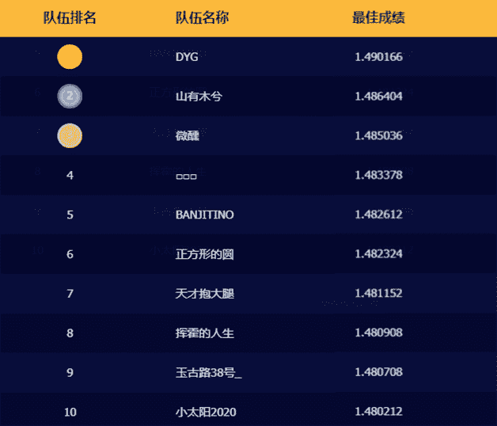
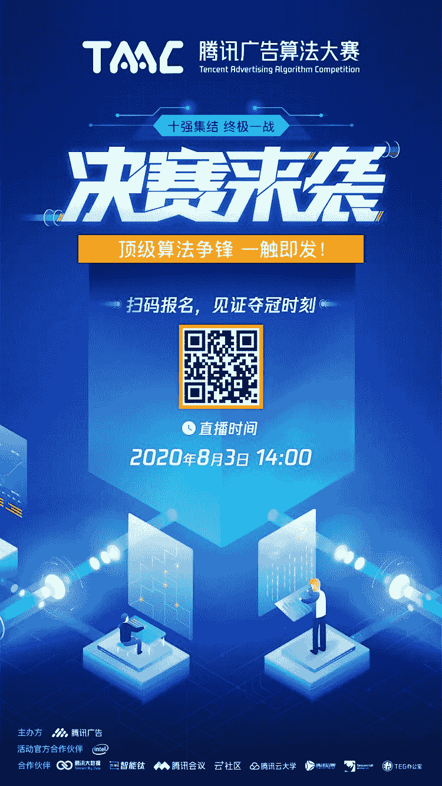

↑↑↑关注后"星标"Datawhale

每日干货 & [每月组队学习](https://mp.weixin.qq.com/mp/appmsgalbum?__biz=MzIyNjM2MzQyNg%3D%3D&action=getalbum&album_id=1338040906536108033#wechat_redirect)，不错过

 Datawhale推荐 

**2020年腾讯广告算法大赛 - 决赛答辩**

经过近3个月的激烈角逐，2020腾讯广告算法大赛也即将步入尾声。最终，这场算法竞技盛宴迎来了“终局一战”。究竟有哪些队伍成功跻身10强，拿下决赛入场券？让我们一睹为快！十强名单如下：

（特别关注：喊出“顺风碾压”口号的卫冕冠军队DYG，恭喜Datawhale组织成员鱼佬再次荣登榜首。）

决赛临近，十支最强战队即将前往深圳参与现场决赛答辩，各路大神选手将上台，亲身分享解题思路，权威评委现场给予专业点评，助力选手实力进阶。算法与算法的交锋，技术与实践的融合，8月3日决战一触即发！

为了让大家能够亲眼见证算法与技术的激烈碰撞，腾讯会议为大赛全程提供远程协同、线上会议及直播等服务。扫描下方二维码或点击【阅读原文】，即可预约线上直播观看比赛。

同时，本次大赛设有“人气战队”奖项评选，2020年8月2日下午6点前，大家可以[**Pick你心中的人气战队**](https://mp.weixin.qq.com/s?__biz=MzIzMzgzOTUxNA%3D%3D&idx=1&mid=2247484991&scene=21&sn=4cffe460f98efd8cd07d0d4bd085166f#wechat_redirect)，为你喜欢的队伍投出关键一票。

最后，大赛将于决赛后开启“专题直播”，倾情邀请算法大赛顶级评委开启线上直播分享，聚焦行业关键技术，分享算法前沿知识。专题直播期间参与有奖调研，也有机会获得专属纪念礼品，惊喜多多，等你发现。

各路算法大神的正面交锋对抗、十强战队“逆算”上分思路、算法竞技的无限魅力、与学者专家的思维碰撞。这场算法饕餮盛宴，点击 **阅读原文** 一键触达。

点击阅读原文，预约直播↓