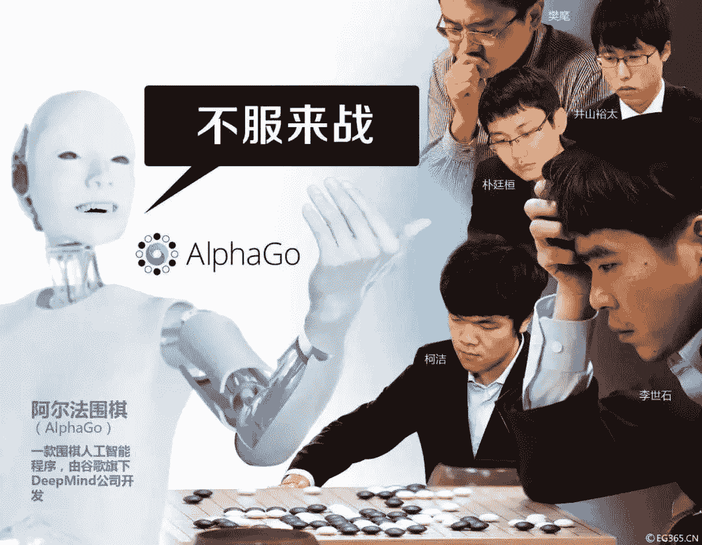

↑↑↑关注后"星标"Datawhale

每日干货 & [每月组队学习](https://mp.weixin.qq.com/mp/appmsgalbum?__biz=MzIyNjM2MzQyNg%3D%3D&action=getalbum&album_id=1338040906536108033#wechat_redirect)，不错过

 Datawhale干货 

**作者：莫凡&马晶敏，上海交通大学，Datawhale成员**

深度学习不够智能，强化学习又太抽象。深度强化学习是两套理论体系乘风破浪以后的成团产物，其骨架来自强化学习，而灵魂由深度学习赋予。深度强化学习是一个值得持续研究和关注的新方向。

# **一、******深度学习的反思****

现在深度学习大热，一点也不输给现在的室外气温，但大热背后也有隐忧，深度学习虽然表面光鲜，但细看就会发现：仍然充满了槽点。

其中一个可谓是直击灵魂。现在深度学习用得最多的就是有监督学习。有监督学习不妨理解成“有参考答案的学习”，它有一个特点，就是数据必须经过标识才能用于训练。但现在海量的数据是未标识数据，且标识成本很高。很多研究人员，甚至包括有不少的大牛都在反思，琢磨深度学习是不是“错了”。如果说人工智能发展的正道在于模拟人类智能，那深度学习的这套学习模式可能走了歪路。

举一个例子，就是人类的小婴儿学走路。小婴儿学走路肯定不是靠先看一大堆的《如何解锁行走姿势》或者《人类直立动作大全》之类的资料，用行话来说，就是不必依赖外部输入大量的训练数据。那小婴儿是怎么学的呢？靠不断尝试，也就是我们常说的跌倒了爬起来再走。简单来说，这一派研究人员认为：深度学习和人类的学习模式是截然不同的，别看现在大红大紫，早晚是要碰到天花板的。那应该怎么办呢？很多人都指了同一个地方，就是深度强化学习。

# **二、强化学习原理**

深度强化学习是两套理论体系乘风破浪以后的成团产物，这两套体系本来都是单飞型选手，分别是深度学习和强化学习，具体来说，深度强化学习的骨架来自强化学习，而灵魂则是由深度学习赋予。所以，要讲明白深度强化学习，首先来看下强化学习。

**2.1 AlphaGo进化史**

AlphaGo打败柯洁等一众国际顶尖棋手的事实让大家对人工智能技术信心倍增。当年AlphaGo一共迭代了三个版本，分别是战胜李世石的一代目AlphaGo Lee、战胜柯洁的二代目AlphaGo Master，以及吊打前两代的三代目AlphaGo Zero。这三代棋艺当然是逐代递增了，技术上也有一个明显的变化趋势，就是强化学习的比重越来越大。

最开始训练AlphaGo的模型，是需要用借助已有棋谱的，也就是需要参考答案，是有监督学习。而当进化到了AlphaGo Zero，这哥们儿开始“悟了”，对，是真正意义上的悟了，不再需要任何棋谱，完全自食其力，从零开始自学成才，所以名字叫Zero。亲爹DeepMind喜不自胜，跑到Nature发了一篇爆款论文，名字叫《Mastering the game of go without human knowledge》，我看中文不妨就翻译为《围棋灭霸》，反正意思就是“你们人类都是渣渣，我不需要人教也能称霸棋坛”。这次是真不用人教，那靠什么自学呢？就是强化学习。AlphaGo Zero的学习模式非常类似于人类，而且取得了无可非议的良好效果，确实让业内所有人都真真切切地感受到了强化学习的惊人潜力。

**2.2 强化学习基础概念**

说了这么多，那什么是强化学习呢？强化学习是机器学习中的一种。强化学习和有监督学习、无监督学习都不太一样，有一个智能体（Agent）的概念。什么是智能体呢？大家应该都玩过任天堂的一款经典FC横版通关游戏——马里奥兄弟。在游戏中，玩家通过控制马里奥顶蘑菇、踩乌龟来取得胜利，如果想用强化学习来通关，那这里的智能体指的就是马里奥。

智能体是强化学习的第一个重要概念，是主角，但强化学习作为一台好戏，自然不能光有主角，还得有舞台，这就是强化学习的第二个重要概念，环境（Environment）。

强化学习的学习过程，就是作为主角的智能体和作为舞台的环境不断交互的过程。这个过程又包括三个重要概念，分别是观察（Observation）、动作（Action）和奖励（Reward）。这五个概念可谓是强化学习的五线谱，能够演奏出无数美妙动人的旋律。

那么，对于刚刚提出的智能体、环境、观察、动作和奖励这这五个概念是怎么进行演奏呢？

**2.3 深入浅出强化学习**

首先一条就是主线，前面已经介绍，强化学习的主线就是作为主角智能体，与作为舞台的环境所作的各种交互。交互过程衍生了三个概念，听起来复杂，其实玩马里奥兄弟游戏非常相像，完全可以一对一比照。

回想一下，游戏里的马里奥想要通关，第一步需要干什么呢？前进后退还是蹦蹦跳跳？都不对，首先需要观察。你得先看一下周围环境，看看前面到底蘑菇还是乌龟，才能决定接下来的行动。观察环境，获取当前的状态信息了，才决定下一步行动对不对？强化学习也一样，主角智能体通过前面介绍的第三个重要概念“观察”，来获得当前时刻的各种状态信息，一般记为s(t)。

掌握了状态信息，游戏里的马里奥开始跃跃欲试，准备做出反应了。强化学习也一样，我们将s(t)作为智能体的输入，智能体会略加思索，接着就能做出“动作”。这里的动作，就是前面介绍的第四个重要概念。智能体能做出哪些动作呢？这和具体的场景有关，譬如在马里奥游戏中，动作就是指“顶蘑菇”或者“踩乌龟”，一般记为a(t)。

最后一个重要概念是“奖励”。这个好理解，前面我们一再强调，强化学习的主线是智能体与环境的各种交互，那现在当智能体做出某个动作后，环境当然也得有所表示，得有个反馈信息，这就是奖励。譬如马里奥游戏中，马里奥“吃到金币”后，相应的游戏得分就会增加，这就是奖励。需要说明一点，强化学习的“奖励”和我们日常所习惯的用法略有不同，强调的是环境对智能体的反馈。上面说的得分增加，这是一种好的反馈，当然也有坏的反馈，譬如做了什么动作被扣分了，但无论是好的反馈，还是坏的反馈，在强化学习这里都统一称为“奖励”。

至此，智能体就完成了一轮强化学习。不断重复这轮流程，智能体就能顺利地与环境交互下去。听起来是不是很简单？不过，魔鬼都藏在细节里。

**2.4 强化学习方向分类**

不知道大家在阅读时，有没有注意到强化学习的一个非常重要的问题，上面却一笔带过？没错，就是从获取s(t)到做出a(t)之间的“略加思索”。作为输入的状态信息，和作为输出的待选动作，都是给定好的，但二者的映射关系如何，也就是输入什么样的状态信息该对应输出什么样的动作反应，也就是智能体应该如何进行思考。

这是强化学习最核心的问题。有了问题，自然就会产生各种脑洞。我们说强化学习的五个概念像是五线谱，演奏出无数美妙旋律，这绝对不是艺术化的比喻，而是实情。为了解决强化学习这个核心问题，研究人员是真真切切地开了无数的脑洞，总的来说，主要是朝着两大方向开脑洞。

第一个大方向叫基于价值（Value-Based）的强化学习。机器学习都有个目标函数的概念，而基于价值的强化学习，它的目标函数就是累计奖励最大化，也就是当前哪个动作能让得分更高就选择做哪个动作。这很符合我们的直觉认知，比较容易理解。那怎么达到这个目标呢？不同的算法各有不同，基于价值（Value-Based）的强化学习算法中，最有名气的算法应该数Q-Learning，也有人称为Q学习，通过不断计算和更新动作价值函数Q来实现奖励最大化。

第二个大方向叫基于策略（Policy-Based）的强化学习。基于价值虽然符合直觉，但这种走一步看一步，每次都要用价值函数量一下才能行动的做法，难免让人有种“无头苍蝇瞎转”的无力感，而基于策略的强化学习最大的特点就是果断抛弃了价值函数，尝试找到每个状态对应的最佳动作，从而形成一套动作策略，每走一步策略都能直接给出最佳的下一步动作。

当然，除了这两大方向，强化学习还有其它的脑洞方向，譬如基于模型（Model-Based）的强化学习，不过由于成本和难度较高，用得比较少。而这两大方向都各自包含了大量的具体实现算法，即使方向相同，各个算法在细节上仍然有很大差异。

## **三、深度学习与强化学习的结合**

最后一个问题是，深度学习是怎样和强化学习结合，成为深度强化学习的呢？

前面我们说，深度强化学习，强化学习是骨架，深度学习是灵魂，这是什么意思呢？深度强化学习的主要运行机制，其实与强化学习是基本一致的，也都是根据输入的s(t)，找到对应的输出a(t)，只不过使用了深度神经网络来完成这一过程。

更有甚者，有的深度强化学习算法，干脆直接在现成的强化学习算法上，通过添加深度神经网络来实现一套新的深度强化学习算法，非常有名的深度强化学习算法DQN就是典型的例子。

前面我们介绍基于价值的强化学习算法中介绍了Q-Learning算法，有一个重要的步骤是计算Q值，而传统的Q-Learning算法是通过Q表来完成计算的，但表格存在一个明显的局限性，状态-动作空间越大，Q表就越膨胀，而且是大一点就膨胀好几圈。这样下去不行的，早晚是要河边见的……

那怎么改善呢？研究人员一想，现在大热的深度神经网络不是最擅长干这事吗？于是一拍大腿，不再需要劳驾Q表您老人家来记录Q值了，统统改成了深度神经网络，这就是DQN。虽然听起来改动不大，但两者结合效果很好，能力提升明显，成就了广为使用的深度强化学习算法。

本文参考北京理工大学刘驰教授的《深度强化学习：学术前沿与实战应用》，本书详解了深度强化学习领域近年来重要进展及其典型应用场景，涵盖新的理论算法、工程实现和领域应用。紧跟学术前沿，联合工程实践，值得学习。

*本文电子版 后台回复* ***深度强化学习*** *获取*

“整理不易，**点****赞****三连**↓