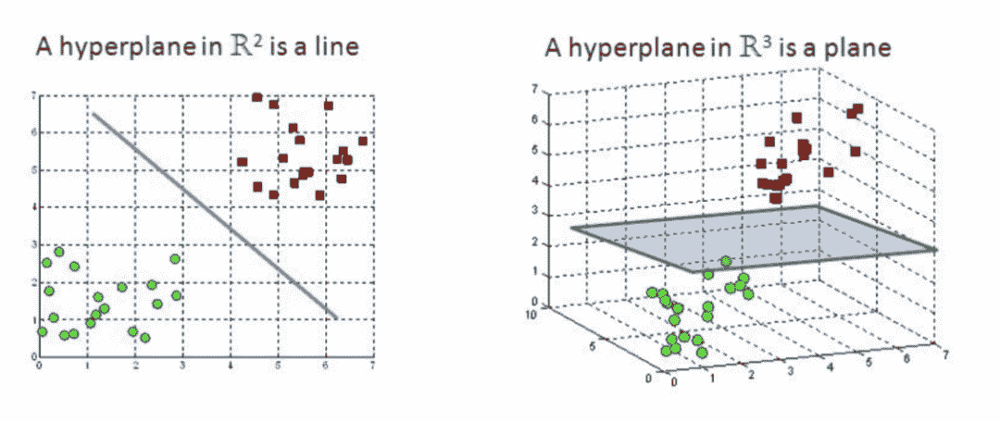
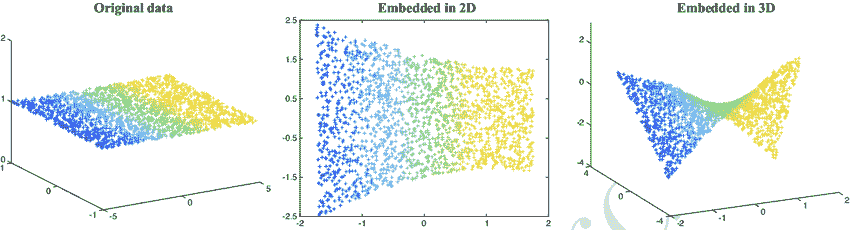

 Datawhale干货 

**译者：郑沛，****英国曼彻斯特大  来源：数据派THU**


支持向量机（SVM）是每位机器学习专家都应该在自己的知识库中储备的一种简单的算法。支持向量机（SVM）受到很多人的高度青睐，因为它需要较少的计算量，但数据准确度相当不错，并且可以用于回归和分类任务。

**目录**

*   支持向量机（SVM）介绍

*   支持向量机（SVM）是怎么工作的

*   处理异常值

*   PEGASOS法

*   非线性回归分类

*   支持向量机（SVM）的优劣

*   可视化支持向量机（SVM）

*   支持向量机（SVM）的应用

支持向量机（SVM）介绍支持向量机（SVM）是功能强大的分类器，可同时处理线性和非线性数据。如果是n维空间，则超平面的维数将为（n-1）。



（左图：在R2超平面的一根线；右图：在R3超平面的一个平面）

支持向量机（SVM）的目标是找到一个最佳的超平面来划分我们的数据，从而使一个空间最近点到它自己的距离最大。


（上图注释：最优超平面：Optimal hyperpline；最大间隔：Maximum margin）


简单说，考虑一条道路，它将左右两侧的汽车、建筑物和行人分开，并尽可能使车道最宽。那么，那些真正靠近道路的那些汽车、建筑物就是支持向量。

这解释了SVM是如何工作的。

**支持向量机（SVM）是如何工作的？**

*   **目标：找到最佳的超平面**


（上图注释：我们把数据分为两类（正类positive class和负类negative class），x为数据，y为数据的标签，和类别对应；由图中看很明显啦，是正的，反之是负的。由于我们需要找到所谓的“最近距离”的支持向量，那么肯定点越多越好了，因为这样提供距离的点越多，就越准确）


计算点与支持向量的距离


上图注释：距离怎么来的呢，高中立体几何学过点到直线距离（的自然高维推广），一种更常见的写法是：

我们想要一个超平面，它可以很高效地对点进行分类，也就是，很精确的赋予类别。

为了能够精确地执行这一操作，我们需要稍微变一下我们目标。

更改目标：

为了最大化与超平面的最小距离：


那我们先假设最小临界距离为Y


因为现在所有的点都满足下面的两个条件：


为了能够实现最小距离，根据最小距离的公式，因为最优超平面实际上已经存在（可以当成常数看），我们只需要最大化分母，即我们需要最大化“w”：


上述计算过程涉及到的数学有点繁琐和麻烦，因此，为了减少数学上的复杂性，我们将方程式重构（注意，y的取值范围是，为函数间隔，结合两者同号我们可以写成形式，最大化距离则意味着，因为我们的目标也是最大化r）。因此，我们将以支持向量必须位于超平面上的方式对数据重新正则化。


因此, 为了能够最大化“w”，我们需要最大化 “D”.

D = D1+D2；因此我们需要最大化D1和D2.（第一类为D1，第二类为D2，加到一起）


现在，为了增加“ D”，我们必须集中精力在最小距离必须为1（）的情况下减少“ || w ||”。


在我们的新目标中，我们需要降低||w|| ，但是需要注意的是||w|| 不是随意变化的，它取决于 γ。


因为“w“的大小取决于 γ，我们不能够得到全局极小值。

因此我们可以得出SVM是约束凸优化问题。

因为SVM依赖约束，其无法使用梯度下降法，我们需要采取其他的方法。

这一问题可以采用如下措施进行规避：

*   **二次方程求解器**

*   **拉格朗日量密度**

*   **PEGASOS算法**

**处理异常值**

有时对于某些示例(x(i), y(i))我们可能会遇到误差E（i）。


误差会破坏我们的目标，因为增加误差会增加损失成本，但是要开发可靠的模型，我们需要允许一些误差，否则将导致过拟合。为了使误差保持在最低水平，我们将引入惩罚（penalty），一旦我们的模型错误地对数据点进行分类，它将面临一定的惩罚（c），这将有助于我们提高准确性。


如果 E=0 ; 那么将不会引入惩罚。于是得到下式：


如果c很大，那么差额就会越小，分类就会越准确（更容易出现过拟合）。

如果c很小，那个差额就会越大，代价则是错误的分类（更好的分类器）。

**PEGASOS**

为了克服约束凸优化问题，我们采用PEGASOS方法。

我们重新制定方程式以实现约束独立性


现在，我们进行数学讨论，因为我们将其相加一次，又相减一次，方程中的1对整体没有影响。

为了简化我们的方程式，我们将代入t(i)。


上式表示，如果点远离超平面，则误差将为零，否则遇到的误差将为(1-t(i))。


公式函数在t≥1时仍然没有微分；因此我们将梯度分为子梯度1和子梯度2。

我们需要最小化的最终函数是：


现在，由于消除了约束，并且我们的函数与γ无关。我们可以采用梯度下降来最大程度地减少损失。


使用梯度下降将损失降至最低


计算损失


为SVM实施梯度下降

**非线性分类**

若使用支持向量机对非线性数据进行分类，我们需要将数据投影到更高的维度，即通过增加2D数据特征的功能将其转换为3D数据。



特征的增加将增加计算开销。为了转换数据的维度，我们将使用核（Kernel）。

*   **线性核**

*   **RBF（径向基）核**


*   **多项式核**


*   **Sigmoid核**


使用核技巧的障碍是为模型选择合适的核，因为我们永远不知道哪个核最适合我们的模型，以及代价有多大。

因此为了自动调节模型中超参数，我们将采用网格搜索（GridSearch）法。

我们将指定参数，参数在脚本里即为由字典组成的列表（举例如下），其中包含键（如内核和惩罚），我们将针对每个核运行模型来让模型准确率最高。

```
params= [{‘kernel’:[‘linear’, ‘rbf’, ‘poly’, ‘sigmoid’], ‘c’:[0.1, 0.2, 0.5, 1.0, 2.0, 5.0]} 
```

现在，对于每种类型的核和5种惩罚类型，我们将存储准确率，稍后将选择准确率最高的内核和惩罚（c）。


接受参数:

*   cv: 交叉验证（cross-validation）

*   n_jobs: 可用的CPU数量

**支持向量机的优劣**

**优势**

*   可以轻松处理大型特征空间

*   核技巧是支持向量机的真正优势，因为它有助于找到甚至更复杂问题的解决方案

*   适用于线性和非线性数据

*   不容易出现过拟合的现象

*   甚至适用于非结构化数据

**劣势**

*   对噪音敏感

*   选择最佳核比较困难

*   大型数据集的训练时间长

**可视化支持向量机**


**支持向量机的应用**


“干货学习，**点****赞****三连**↓