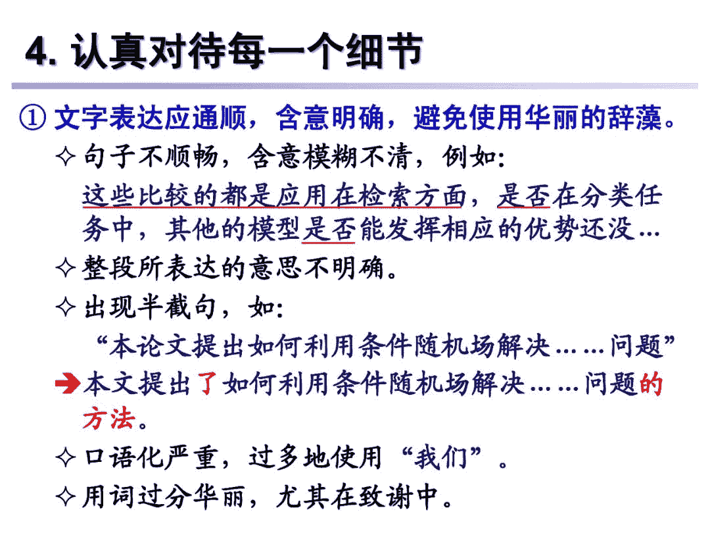

↑↑↑关注后"星标"Datawhale

每日干货 & [每月组队学习](https://mp.weixin.qq.com/mp/appmsgalbum?__biz=MzIyNjM2MzQyNg%3D%3D&action=getalbum&album_id=1338040906536108033#wechat_redirect)，不错过

 Datawhale推荐 

**作者：宗成庆，模式识别国家重点实验室**

【导读】今年特别不一样，尤其是对于毕业季的同学。最近这段时间应该各位要毕业同学提交毕业论文评审的时间。如何让自己的论文顺利过关？是大家共同关心的。这里专知小编推荐一篇来自中国科学院自动化研究所模式识别国家重点实验室宗成庆老师的报告《如何撰写毕业论文》，27页ppt，**讲述了毕业论文要注意的各种要点，非常值得我们学习，帮助大家写出更好的论文。**

**宗成庆 **

中国科学院自动化研究所研究员，CAAI Fellow，国际计算语言学委员会(ICCL) 委员，亚洲自然语言处理学会(AFNLP) 主席。主要从事自然语言处理、机器翻译等研究。主持国家项目10余项， 国家重点研发计划重点专项首席科学家，ACMTALLIP 和《自动化学报》副主编。曾任国际一流 学术会议ACL 2015 和 COLING 2020 程序委员会主席，多次担任IJCAI和AAAI领域主席。曾获国家科技进步奖二等奖、钱伟长中文信息处理科学技术奖一等奖等。荣获北京市优秀教师、宝钢优秀教师和中科院优秀导师等荣誉。

http://www.nlpr.ia.ac.cn/cip/english/zong.htm

本文来源：专知

**提纲：** 

**1\. 关于论文题目**

**2\. 论文的整体布局 **

**3\. 常见的主要问题 **

**4\. 认真对待每一个细节**

**5\. 结束语**

**要点：**

*   评价一篇论文优劣最重要的标准是看其解决的问题是否重要、创新点是否突出、实验是否充分可靠 

*   论文的结构是否清晰、逻辑是否清楚、表述是否流 畅、准确，具有非常重要的意义 我们提倡规范、严谨、朴实的写作风格，“标新立 异”应体现在创新思想上，而不是在写作形式上 

*   应遵循不同学科领域的论著写作规范 

*   上述观点和建议只代表我本人的体会，仅供参考， 不强求千篇一律。任何学生都应首先尊重自己导师 的意见。

*本文完整PPT 后台回复* ***毕业论文**下载*

