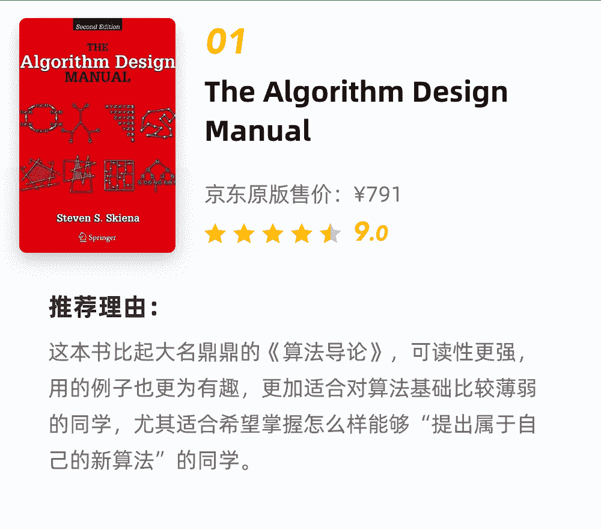
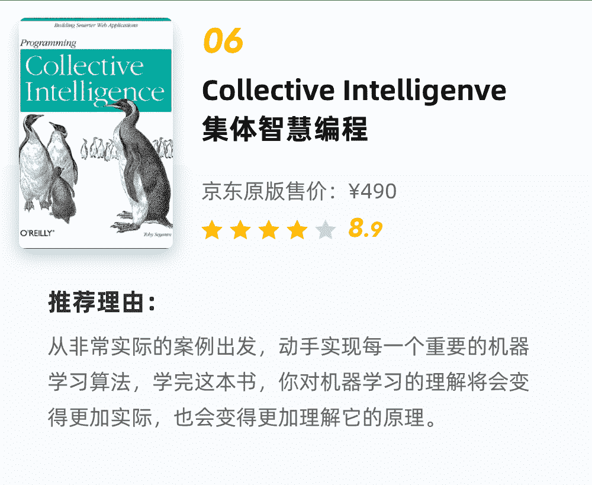

其实，机器学习包含多种交叉学科，同时也在很多方面得到应用，如**数据挖掘、图像处理**等。机器学习的知识体系包含数学、编程语言、监督学习、非监督学习、深度学习等，同时还包括多种工具和框架的应用。

由于人工智能的发展，机器学习越来越受到大家的追捧。很多新的计算机科学家和工程师开始跨入机器学习这个美好的世界。不幸的是，理论、算法、应用、论文、书籍、视频等的数量是如此之大，以至于无法清楚地了解，哪些才是需要学习提高的技能知识。

*   算法分析和设计能力；

*   工程实践能力；

*   模型优化能力。

这三方面已经成为先入行人工智能必须要掌握的技能。针对这些，特给粉丝一些福利大礼包，这**9本书**都是口碑良好的经典机器学习类书籍。在这里送给大家，希望能帮助到大家。

9本经典机器学习书籍（电子版）

这些书籍，在京东上原版数据合计起来售价都已经超过了**3000元**，今天我收集到了这些书籍的电子版本，全部给到大家，希望能够给你帮助。

 **长按扫码领取**

本号只有**2****00个名额**

↓ ↓ ↓ 

备注**【书籍】领取**????

另外，**前50名**的同学，还可获得**1份机器学习知识图谱、1份数据工程师知识图谱**。扫码上方二维码领取。

1

2

