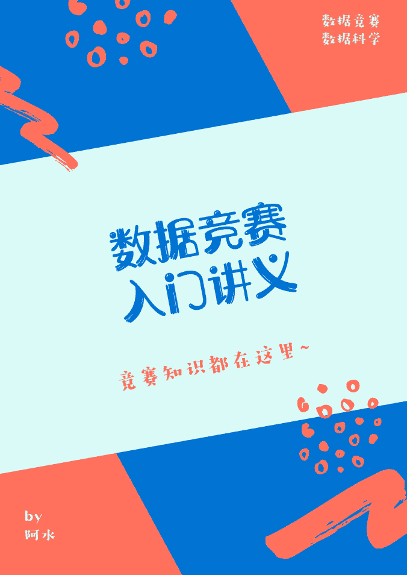
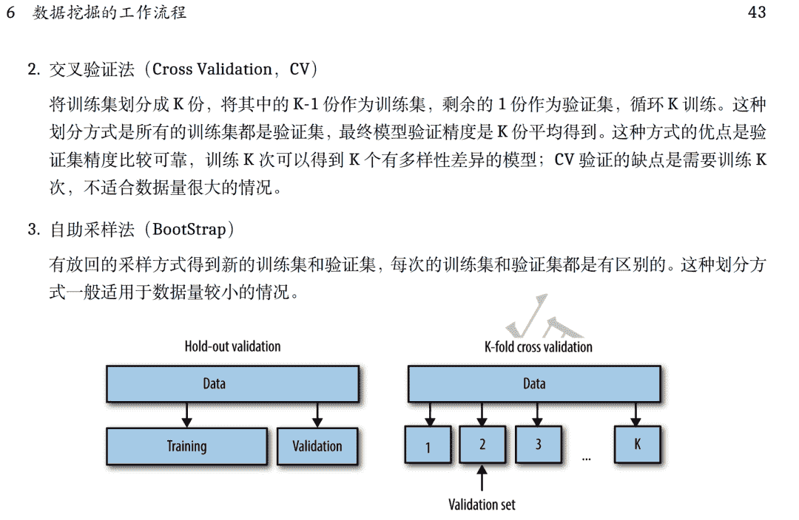
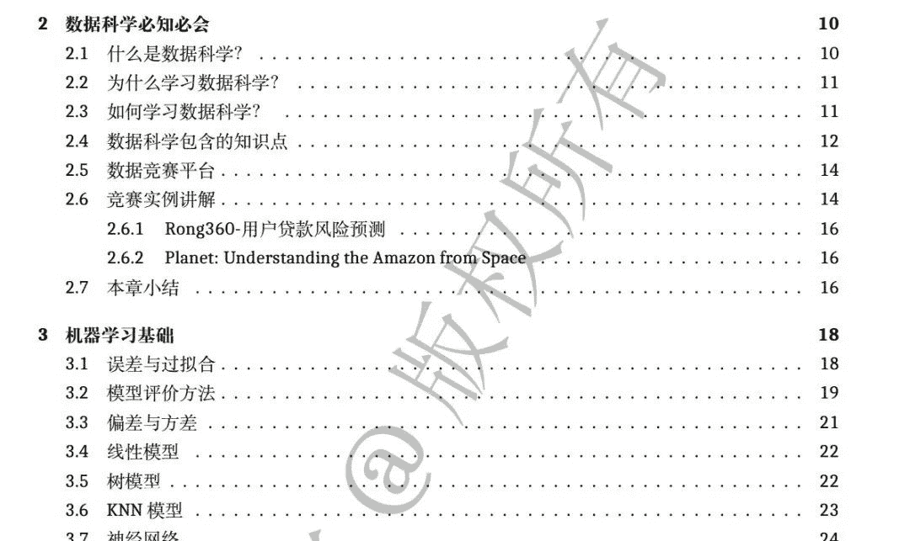
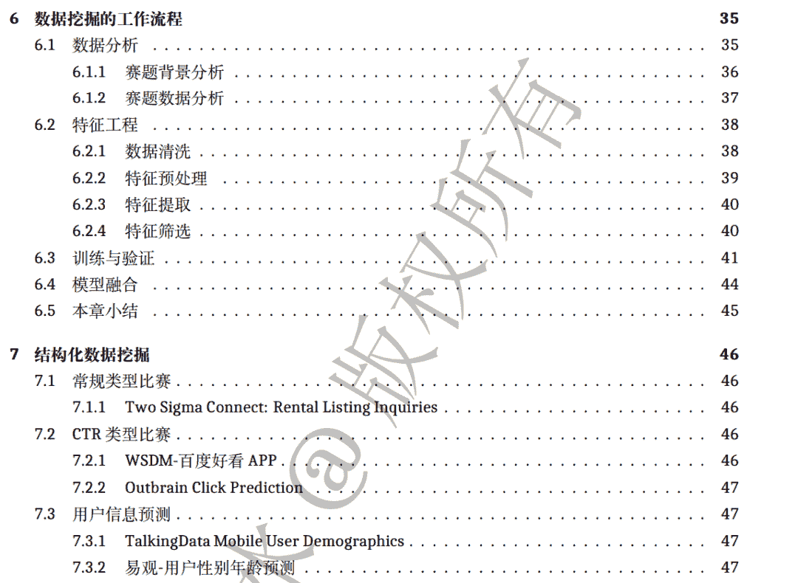
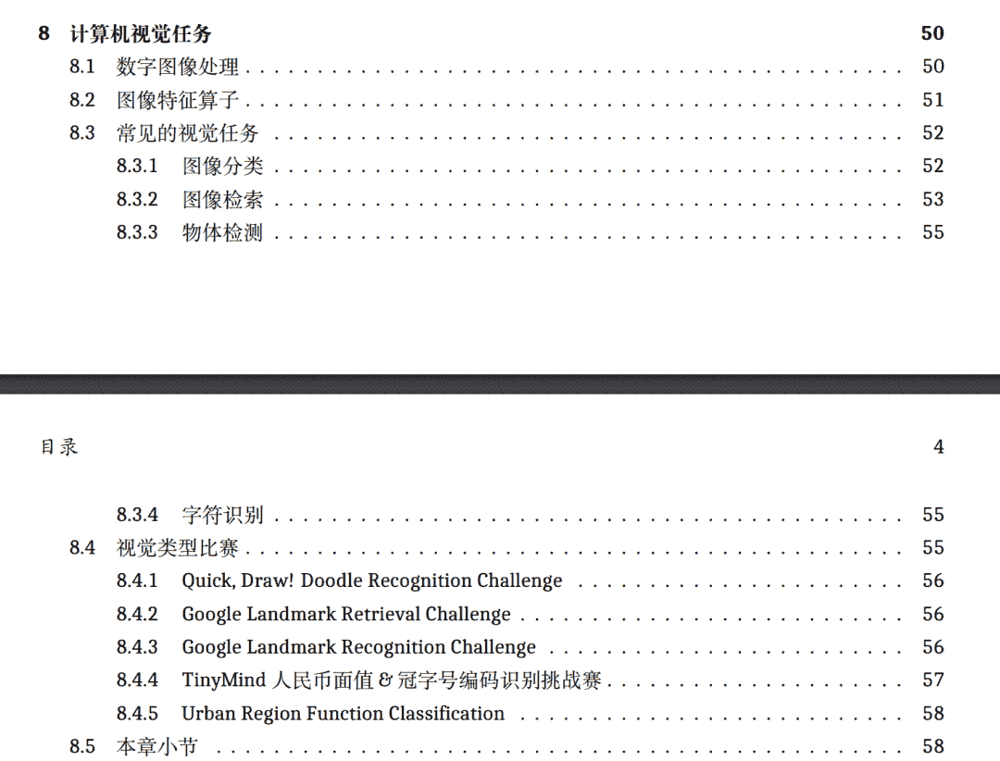

↑↑↑关注后"星标"Datawhale

每日干货 & [每月组队学习](https://mp.weixin.qq.com/mp/appmsgalbum?__biz=MzIyNjM2MzQyNg%3D%3D&action=getalbum&album_id=1338040906536108033#wechat_redirect)，不错过

 Datawhale干货 

**作者：阿水，北京航空航天大学，Datawhale成员**

数据竞赛近几年在国内发展迅速，参加数据竞赛对于参赛者来说可以锻炼数据分析，算法建模的能力，运气好的话还可以获得不菲的奖金；对于公司来说，也可以从众多优秀的方案中选取有价值的部分用于自己的生产，是一件互利共赢的事情。

但数据竞赛领域是一个相对较新的领域，没有太多系统的学习资料，很多刚接触的朋友都会感到迷茫无从下手。所以根据这两年的比赛经验我整理了这份数据竞赛入门讲义，供大家学习参考。

《竞赛入门讲义》由阿水编写，鱼佬审阅（2020腾讯广告算法大赛冠军选手），内容涵盖了数据竞赛的入门知识点，以及详细的案例讲解。

讲义内容涵盖了比赛类型介绍、比赛流程、常见机器学习模型和竞赛案例讲解。

入门讲义阿水已整理电子版，后台回复 **讲义** 获取

“整理不易，**点赞**三连↓