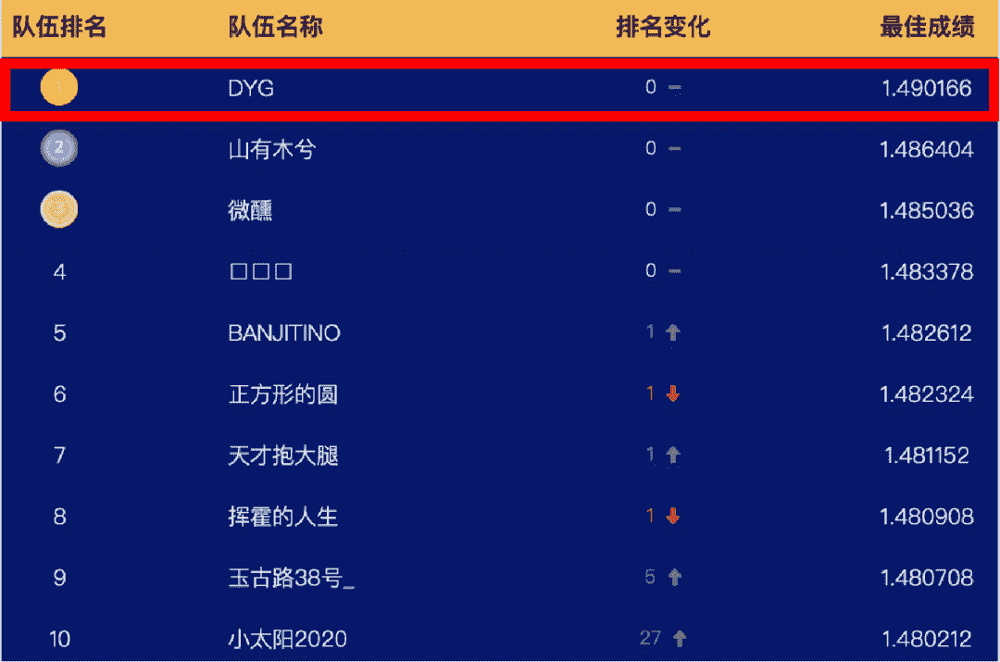

写在前面

**2019年冠军选手成功卫冕！**

**代码地址：https://github.com/guoday/Tencent2020_Rank1st**

从初赛冠军、复赛冠军，然后到最佳答辩，一路披荆斩棘，再次感谢队友（中山大学微软亚洲研究院联合培养博士生郭达雅、多次荣获国内NLP和数据挖掘比赛top名次选手梁少强，赛圈id“大白”）。

本文将给出冠军核心方案，全文内容架构将依托于答辩PPT，希望这篇分享能够给予你更多的启发。

下面就让跟随我一起探索这荣获最高嘉奖的方案 !

赛题介绍

本届算法大赛的题目来源于一个重要且有趣的问题。众所周知，像用户年龄和性别这样的人口统计学特征是各类推荐系统的重要输入特征，其中自然也包括了广告平台。这背后的假设是，用户对广告的偏好会随着其年龄和性别的不同而有所区别。许多行业的实践者已经多次验证了这一假设。然而，大多数验证所采用的方式都是以人口统计学属性作为输入来产生推荐结果，然后离线或者在线地对比用与不用这些输入的情况下的推荐性能。本届大赛的题目尝试从另一个方向来验证这个假设，即以用户在广告系统中的交互行为作为输入来预测用户的人口统计学属性。

我们认为这一赛题的“逆向思考”本身具有其研究价值和趣味性，此外也有实用价值和挑战性。例如，对于缺乏用户信息的实践者来说，基于其自有系统的数据来推断用户属性，可以帮助其在更广的人群上实现智能定向或者受众保护。与此同时，参赛者需要综合运用机器学习领域的各种技术来实现更准确的预估。

赛题理解

**1.数据**

在比赛期间，主办方将为参赛者提供一组用户在长度为 91 天（3 个月）的时间窗口内的广告点击历史记录作为训练数据集。每条记录中包含了日期（从 1 到 91）、用户信息（年龄，性别），被点击的广告的信息（素材 id、广告 id、产品 id、产品类目 id、广告主id、广告主行业 id 等），以及该用户当天点击该广告的次数。测试数据集将会是另一组用户的广告点击历史记录。

**2.目标**

提供给参赛者的测试数据集中不会包含这些用户的年龄和性别信息。本赛题要求参赛者预测测试数据集中出现的用户的年龄和性别，并以约定的格式提交预测结果。

**3.评价指标**

大赛会根据参赛者提交的结果计算预测的准确率（accuracy）。年龄预测和性别预测将分别评估准确率，两者之和将被用作参赛者的打分。

测试数据集会和训练数据集一起提供给参赛者。大赛会将测试数据集中出现的用户划分为两组，具体的划分方式对参赛者不可见。其中一组用户将被用于初赛和复赛阶段除最后一天之外的排行榜打分计算，另一组则用于初赛和复赛阶段最后一天的排行榜打分计算，以及最后的胜出队伍选择。

特征工程

**1.统计特征**

*   用户出现的总次数和天数

*   用户点击广告的总次数

*   用户点击不同广告、产品、类别、素材、广告主的总数

*   用户每天每条广告点击的平均次数，均值和方差

**2.概率分布特征**

简单的理解就是五折交叉的target encoding 得到每个该广告实体对应的性别年龄信息，按用户点击广告实体进行聚合统计。**在此次比赛中我们仅使用了这两组特征**，但在比赛过程中我们也进行了大量的特征工程尝试，比如tfidf+stacking、word2vec、deepwalk等特征，或者各类聚合统计。

模型介绍

先来看下模型框架部分，主要分为三个部分。

**BERT—Bidirectional Encoder Representation From Transformer**

首先是bert部分，假设每个广告为一个单词，将用户点击序列看作一句话，这样就将问题转为了NLP的文本分类问题。我们使用bert作为我们的encoder进行编码，这里我们使用了12层transformer。每层transoformer将上一层的隐变量作为输入，经过Multi-Head Self Attention和Layer Norm等，最后输出交互更高的隐变量。

我们知道bert在NLP取得巨大成功的原因主要是预训练，所以在比赛初期不断尝试将预训练运用到本赛题中。但与NLP不同，广告具有稀疏性，使其词表达到七八百万，**这里会造成两个问题**。第一个问题是这么大的词表很难放入GPU中，第二个问题是即使放到CPU，由于参数过大，也难于训练。针对这些问题，我们使用了两阶段的预训练方法对BERT进行训练。

**预训练—Word2Vector**

第一阶段是使用word2vec去预训练广告的embedding，目标是将类似的广告进行聚类，具体操作如下图所示，将用户点击广告序列输入到embedding层，然后预测广告id。但这里会存在两个问题，首先是我们只使用了一个广告去预测另一个广告，并没有使用更多的广告进行预测，因此缺失了更多的上下文信息。其次是没有利用广告本身的属性进行预测，比如类别信息，或者年龄性别信息。比如给定该广告是一个游戏类型的广告，那么就更容易预测出当前广告，同时也鼓励模型结合最近点击的广告和当前广告的属性进行预测，从而对齐广告id及其属性的embedding。

**预训练—Masked Language Modeling (MLM)**

鉴于以上问题，我们对Masked Language Modeling（MLM）进行改进，原始的MLM是直接mask掉整个广告包括属性，但我们只mask广告的一部分（广告id或者属性）。

具体地，我们随机mask掉20%的token，mask后的位置使用0向量来代替，或者采样一个属性id来替换。使用改进的MLM预测这些广告的时候，不仅可以使用最近点击的广告，也可以用它的属性去预测，使得不同属性的embedding能够在语义空间上对齐。同时，我们也采用了一个很关键的策略，我们把词表缩小到10万（提取top10w，其余为unk），这样使得bert能跑起来。对于原始的MLM，我们也尝试过，虽然有提高但提高不是很大。

最后预测这些id的时候，不仅可以使用之前之后点击的广告，也可以用它的属性去预测。

**融合层—Fusion Layer**

把点击广告的受众人群性别年龄分布融入到网络之中，具体的做法是把人群分为五个部分，假设用户点击n个广告并来自第一个人群，那么可以把剩下的作为种子人群，计算出每个广告的性别年龄概率分布，用四层的transformer进行融合。

**输出层**

结果与分析

**初赛阶段**

2020-5-21: 使用BERT

2020-5-27: 调整BERT的参数，锁定A榜冠军

2020-6-03: 调整学习策略，使用warmup调整学习率，学习率先增后减

2020-6-12: 模型融合

2020-6-22: 切换B榜

**复赛阶段**

2020-6-26: 复现初赛模型

2020-6-30: 引入Fusion Layer, 锁定A榜冠军

2020-7-21: 模型融合

2020-7-22: 切换B榜

思考与总结

主要创新

*   改进BERT并运用到人口属性预测场景

分阶段预训练，缓解广告稀疏性问题并加快预训练速度 （4*V100 预训练12个小时）

改进MLM预训练目标，并从多维度学习广告及其属性的语义表示

将BERT运用到人口属性预测的场景，从性能上验证了预训练在广告领域的潜力

*   提出融合后验概率分布的方法及模型

利用受众人群求出每个广告的概率分布

利用多层Transformer融合概率分布及BERT的语义表示，能有效提升性能

问题思考

*   预训练模型越大越好？

*   如何进一步改善预训练模型？

预训练目标

支持图输入的预训练模型

广告稀疏性问题，例如在未脱敏的情况下使用BPE算法

总结

历时两个半月的腾讯广告大赛，非常感谢工作人员辛苦的答疑。感谢主办方提供真实的业务场景与数据，让我们能在比赛中学习到更多知识，在广告业务中做更多尝试。

**竞赛、学习交流****群已成立**

一起进行广告算法、数据算法竞赛交流分享

如果加入了之前的社群不需要重复添加！

“干货学习，**点****赞****三连**↓