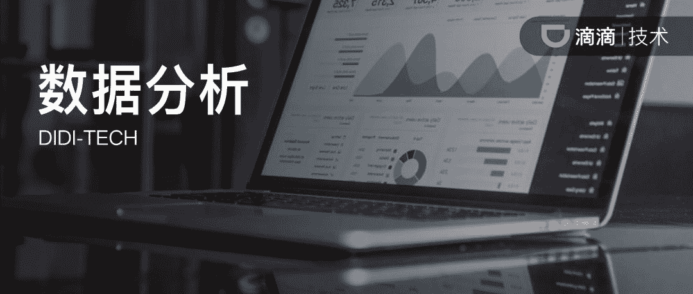

↑↑↑关注后"星标"Datawhale

每日干货 & [每月组队学习](https://mp.weixin.qq.com/mp/appmsgalbum?__biz=MzIyNjM2MzQyNg%3D%3D&action=getalbum&album_id=1338040906536108033#wechat_redirect)，不错过

 Datawhale推荐 

**作者：宋世君，滴滴数据科学部负责人  来源：滴滴技术**

**导读：**本文的作者是滴滴出行数据科学部负责人宋世君，曾在 Facebook 、Google 核心部门就职，是知名的华人数据分析总监。经世君老师授权在此分享给大家，希望让大家理解数据分析师的背后——数据对于一个产品的核心价值，无论把握数据的是数据分析，还是研发、产品同学。希望能够帮到你。

**—————**

数据分析在市场上是近些年出现的一个新的职能，比起研发、算法、产品、运营等等这些已经演进二三十年的职能，我们还是在非常年轻的阶段。

一方面，从市场上人才的供需关系可以看出来这个职能的发展和需求，但是另一方面，和任何新事物一样，这个新的职能也有很多挑战，今天我想谈谈我怎么看待数据分析这个职能，和我们的发展方向。

首先，我们要明确数据分析并不是一个公司的”必要”职能，但是在一个公司的发展壮大过程中又会有数据分析出现的必然性和存在的合理性。我们就像一把枪上的准星，没有准星也能开枪，但是准星能使这把枪更加有用。公司没有任何人做数据分析，短期也依然能运行，只是很多地方运行地会不太好；如果有一天公司里做数据分析的人都消失了，公司短时间内也不会垮掉，但是时间长一些肯定会有影响。

当我们不是”必要”职能的时候，我们就要问自己**“数据分析是谁”、“数据分析做什么”、“数据分析存在的价值是什么”、 “数据分析要往哪个方向发展”**?

▎**数据分析是谁**

用心理学的术语，这个其实是数据分析的“本我”。我们是一群在相关量化领域受过专业的训练，并且希望应用自己的量化能力，在数据中挖掘对业务有用的信息，并且通过这些信息为业务发展提供助力但是同时又保持数据的中立性的人。

一个职能(或者说公司里的一个岗位)是由他应该做什么决定的，而不是由他正在做什么决定的。所以，我们描述数据分析，更多的是从我们自己觉得我们应该做什么，而不是我们现状做什么。比如很多同学有这样的疑问” 数据分析做大量取数的事情”，甚至很多业务合作方”期待我们满足很多取数的需求”。这些都与数据分析是谁无关，这只能说明我们还没有做好我们的工作，还有很多地方需要努力 ( 后面会展开谈 )。

从个体的角度，这也意味着我们看待数据分析并不是看这个人的学术专业，而是看这个人的动机和意愿。公司里跟数据有关的职能是多样的，有些是把数据作为拿到业务结果的抓手。要对业务结果负责，这些是数据运营。有些是把数据作为研发的对象，对跟数据相关的这些产品负责，这些是工程研发。有些是基于数据做实时地在线实现，这些是算法工程师的工作。

这些都是我们的合作伙伴, 但是我们又有我们自己的定位, 跟这些都不同. 我们应该为我们工作的中立性和科学性负责. 我们需要有业务的思想, 但是我们并不是要做业务本身, 我们希望做业务发展的催化剂。

▎**数据分析做什么**

我总结我们做的事情，可以抽象成三类 (1) 描述现状 (2) 寻找规律 (3) 推动改进。这三类事是逐层推进地，但是都很重要。

数据分析首先要**描述现状**，也就是我们常说的 “数数”。

当我们连客观现状都描述不清楚的时候，是谈不上寻找规律和推动改进的。我们工作中大量的取数工，我们做指标，做数据报表看板等等都是在这一类之中。但是为什么很多同学对 “取数”工作有很大疑惑或者是觉得没有成就感呢？我觉得这是因为我们在被动地取数，或者说我们并没有把取数本身和自己业务的主线联系起来，而仅仅是在做填空题。

另外，我在数据分析十条中提到 “分析什么问题，往往比用什么方法更重要”，应用在取数上就是 “取什么数”、“为什么取”往往比 “怎么取”、“是多少”更重要。很多时候，从业务角度思考 “为什么取”就能给我们更强的价值感，如果能主动去思考 “为什么取”，则更加会有参与感。虽然这是第一步，但是价值是极大的，如果不能帮助公司描述现状，公司就是在盲目前进。这第一步就要求我们的每位同学有**独立思考尤其是批判性思考**的能力。

数据分析还要**寻找规律。**

数据分析的本质就是要寻找规律，寻找那些数据信息中隐含，但是别人还没发现的规律。我们常说的统计推断、因果关系、增长推动、预测建模、实验评估等等都是在寻找规律。这些规律就是我们常说的 “洞见”。

当然, 有含金量的规律是不容易发现的, 这也正是我们数据分析存在的价值. 如果我们能看到的规律大家都能看到，那么我们就没有提供价值；谁能挖掘的深, 谁能看到更本质的规律, 谁就提供了更大的价值，所以我们的学术训练、科学方法、实践经验、数据敏感度等等都是在帮我们发现别人看不到的价值。所以我鼓励大家在描述自己的工作的时候，出发点不应该是我用了什么方法，而是我发现了什么规律 ( 洞见 )。这要求我们的每位同学有很强的**好奇心和坚定的信念**。

我们描述现状和寻找规律，最终的目的都是为了**推动改进**，这也就是我们常说的影响。我总结过数据分析的影响可以分成四类：(1) 改善重要指标 (2) 影响产品决策 (3) 影响操作流程 (4) 创造可持续解决方案。

如果我们做了一些事，但是没有直接或间接地实现这四类里面的任何一类，那我们要反过来思考下我们是不是把时间花在了正确的地方。以及我们以后要怎么做，才能让我们的单位时间投入产出最大化？更理想的情况，是在做事之前，先想想 ( 如果是被动需求的话，问问需求方 ) 我们要做的事会在哪些方面产生影响。要实现这些影响，还要求我们的每位同学有**同理心和****业务** (**产品/运营/市场等**）思维，同时还要有精炼的能力，优秀的沟通技巧，说服的能力。理解了我们影响力可以发挥的四个维度，也就解释了“数据分析存在的价值是什么”。从心理学的概念，这相当于数据分析的 “超我”。

▎**数据分析要往哪个方向发展**

这相当于是数据分析 “自我”的问题。

我把这个问题总结成两个方面 “能力建设”和 “文化建设”。在**能力建设**方向，打铁还需自身硬。我们要有能力做更加深入的分析，应用更加科学的工具，让别人做不了的东西我们能做，别人看不到的规律我们能看到。这里要强调一点，就是能力不光是技术能力，还有业务思考的能力。我们组织 Delta 计划就是为了帮助同学们提高这种能力。我们也鼓励大家多通过行程学习小组、轮岗、和团队里的资深专家交流的方式。提高自己的能力。同时，我们也鼓励大家多站在业务的角度，思考数据能发挥什么作用,。多从各业务 leader 那里学习他们的思维方式和角度，然后结合我们的数据积累形成我们自己的东西。

跟能力建设同等重要甚至更重要的是**文化建设**。我们改变环境 ( 同事、公司、行业 ) 怎么看待数据分析 ，首先要坚定我们自己怎么看待自己。这里有自信的问题。我们的价值是由我们做的事情决定的 ( 自我 ) ，这个并不依赖于外界对我们的认知和肯定；我们要提高自己的价值，本质上也是如何让自己做的事情更有价值。有了自信，我们才能有方向去引导我们的合作同事怎么看待我们，怎么知道我们能做什么更有意义，别人怎么看待自己，本质上反应地是自己怎么看待自己。如果我们自己就觉得自己应该取数，那在别人眼里就是取数。如果我们告诉别人，我们的时间用在其他 ( 更有价值 ) 的地方对业务帮助更大，那么我们和对方都有意愿去这样做。而我们通过努力能够兑现这些，会让对方更加认定我们这个定位，形成正反馈。

大家在数据分析团队遇上的问题，我若干年前在 Google 和 Facebook 都遇上过，但是通过我们整体团队的努力，逐步证明自己，在市场上树立了数据分析的品牌和认知，并被市场上认定为这个职能的标杆。数据分析作为一个职能，也获得跟工程、产品相类似的地位，近期多次被评为最有前景的工作。这个过程是逐步的，是需要时间的，也需要我们一起努力。

我们在滴滴其实也是在做这么一件事，数据分析和数据驱动的理念在中国发展尚早，很多事情还停留在理论和感性层面，相当于硅谷若干年前的状态。这也是为什么我们这个部门的同学面临这么大的迷茫，而我们这些 leader 要帮助大家坚定方向，因为我们是市场上引领这个职能的一群人，在探索和拓展着这个职能的边界，而这个过程注定是有挑战的。和其他职能不同，我们的各位 leader 和基层同学, 在做具体事情的同时，还在创造着这个职能的历史。

▎**数据分析十条**

最后，我还想重新提一下我总结过的 “数据分析十条”，上面讲的很多方面都在这十条里面有反映：

1\. 分析师的核心能力是思辨 [数据分析做什么]

2\. 对讲真话负责，保持中立 [数据分析是谁]

3\. 论据充分，论证严谨，观点简明 [推动改进]

4\. 数据先于观点，而不是观点先于数据 [数据分析做什么]

5\. 不要把问题复杂化，也不要惧怕复杂度 [数据分析是谁, 数据分析做什么]

6\. 分析什么问题，往往比用什么方法更重要 [描述现状]

7\. 好的分析师给别人输入，而不只是帮别人输出 [文化建设]

8\. 分析没有什么价值，除非洞见改变了什么其他的东西 

9\. 如果可能应该基于问题收集数据，而不只是基于数据来问问题 

10\. 不是所有问题都可以分析出答案，以开放的心态采纳其他的观点

▍**END**

**宋世君**
滴滴 | 数据科学部

资深数据分析行业带头人，前 Facebook 数据分析总监，Instagram 数据分析负责人，Google长尾广告增长负责人，在 Google 和 Facebook 的客户端、广告、社交网络内容生产与消费等方面的数据应用有着广泛的经验。

同时，滴滴数据科学部正在热招数据科学家、数据分析师、数据开发架构师等职位，欢迎对数据科学有着浓厚兴趣和建树的同学投递。简历投递邮箱：yangliulynn@didiglobal.com，具体职位信息可参考：http://talent.didiglobal.com/。

“干货学习，**点****赞****三连**↓