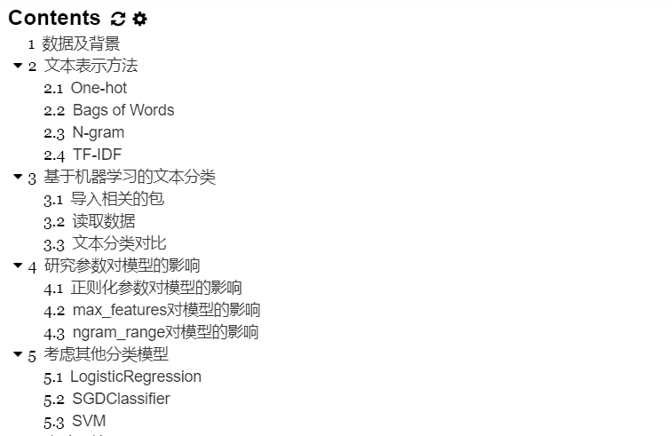
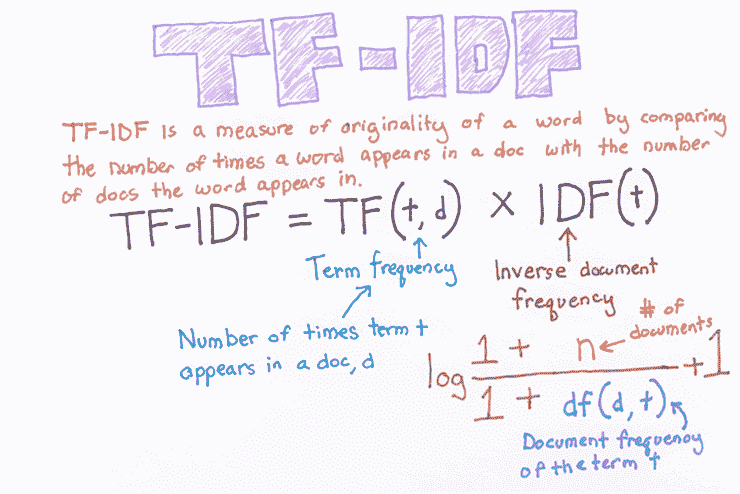
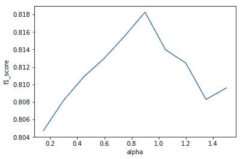
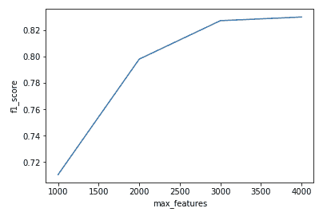
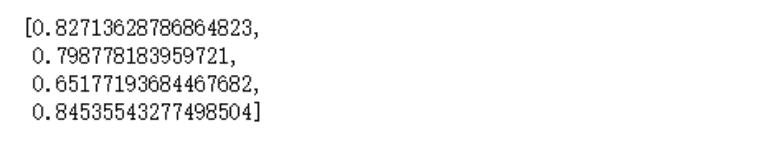

↑↑↑关注后"星标"Datawhale

每日干货 & [每月组队学习](https://mp.weixin.qq.com/mp/appmsgalbum?__biz=MzIyNjM2MzQyNg%3D%3D&action=getalbum&album_id=1338040906536108033#wechat_redirect)，不错过

 Datawhale干货 

**作者：李露，西北工业大学，Datawhale优秀学习者**

据不完全统计，网民们平均每人每周收到的垃圾邮件高达10封左右。垃圾邮件浪费网络资源的同时，还消耗了我们大量的时间。大家对此深恶痛绝，于是识别垃圾邮件并对其进行过滤成为各邮件服务商的重要工作之一。

垃圾邮件识别问题本质上是一个文本分类问题，给定文档p（可能含有标题t），将文档分类为n个类别中的一个或多个。文本分类一般有两种处理思路：基于机器学习的方法和基于深度学习的方法。

本文主要基于机器学习的方法，介绍了特征提取+分类模型在文本分类中的应用。具体目录如下：



**一、数据及背景**

https://tianchi.aliyun.com/competition/entrance/531810/information（阿里天池-零基础入门NLP赛事）

# **二、文本表示方法**

在机器学习算法的训练过程中，假设给定 个样本，每个样本有 个特征，这样就组成了 的样本矩阵。在计算机视觉中可以把图片的像素看作特征，每张图片都可以视为 的特征图，然后用一个三维矩阵带入计算。

但是在自然语言领域，上述方法却不可行，因为文本的长度是不固定的。文本分类的第一步就是将不定长的文本转换到定长的空间内，即词嵌入。

## **2.1 One-hot**

One-hot方法将每一个单词使用一个离散的向量表示，将每个字/词编码成一个索引，然后根据索引进行赋值。One-hot表示法的一个例子如下：

```
句子1：我 爱 北 京 天 安 门
句子2：我 喜 欢 上 海 
```

首先对句子中的所有字进行索引

```
{'我': 1, '爱': 2, '北': 3, '京': 4, '天': 5, '安': 6, '门': 7, '喜': 8, '欢': 9, '上': 10, '海': 11} 
```

一共11个字，因此每个字可以转换为一个11维的稀疏向量：

```
我：[1, 0, 0, 0, 0, 0, 0, 0, 0, 0, 0]
爱：[0, 1, 0, 0, 0, 0, 0, 0, 0, 0, 0]
...
海：[0, 0, 0, 0, 0, 0, 0, 0, 0, 0, 1] 
```

## **2.2 Bags of Words**

Bags of Words，也称为Count Vectors，每个文档的字/词可以使用其出现次数来进行表示。例如对于：

```
句子1：我 爱 北 京 天 安 门
句子2：我 喜 欢 上 海 
```

直接统计每个字出现的次数，并进行赋值：

```
句子1：我 爱 北 京 天 安 门
转换为 [1, 1, 1, 1, 1, 1, 1, 0, 0, 0, 0]
句子2：我 喜 欢 上 海
转换为 [1, 0, 0, 0, 0, 0, 0, 1, 1, 1, 1] 
```

可以利用sklearn的CountVectorizer来实现这一步骤。

```
from sklearn.feature_extraction.text import CountVectorizercorpus = ['This is the first document.','This document is the second document.','And this is the third one.','Is this the first document?',]vectorizer = CountVectorizer()vectorizer.fit_transform(corpus).toarray() 
```

输出为：

```
[[0, 1, 1, 1, 0, 0, 1, 0, 1],
[0, 2, 0, 1, 0, 1, 1, 0, 1],
[1, 0, 0, 1, 1, 0, 1, 1, 1],
[0, 1, 1, 1, 0, 0, 1, 0, 1]] 
```

## **2.3 N-gram**

N-gram与Count Vectors类似，不过加入了相邻单词组合为新的单词，并进行计数。如果N取值为2，则句子1和句子2就变为：

```
句子1：我爱 爱北 北京 京天 天安 安门
句子2：我喜 喜欢 欢上 上海 
```

## **2.4 TF-IDF**

TF-IDF分数由两部分组成：第一部分是词语频率(Term Frequency)，第二部分是逆文档频率(Inverse Document Frequency)




# **三、基于机器学习的文本分类**

接下来我们将研究文本表示对算法精度的影响，对比同一分类算法在不同文本表示下的算法精度，通过本地构建验证集计算F1得分。

## **3.1 导入相关的包**

```
import pandas as pdimport numpy as npfrom sklearn.feature_extraction.text import CountVectorizerfrom sklearn.feature_extraction.text import TfidfVectorizerfrom sklearn.linear_model import RidgeClassifierimport matplotlib.pyplot as pltfrom sklearn.metrics import f1_score 
```

## **3.2 读取数据**

```
train_df = pd.read_csv('./data/train_set.csv', sep='\t', nrows=15000) 
```

## **3.3 文本分类对比**

### **3.3.1 Count Vectors + RidgeClassifier**

```
vectorizer = CountVectorizer(max_features=3000)train_test = vectorizer.fit_transform(train_df['text'])
clf = RidgeClassifier()clf.fit(train_test[:10000], train_df['label'].values[:10000])
val_pred = clf.predict(train_test[10000:])print(f1_score(train_df['label'].values[10000:], val_pred, average='macro')) 
```

输出为 .

### **3.3.2 TF-IDF + RidgeClassifier**

```
tfidf = TfidfVectorizer(ngram_range=(1,3), max_features=3000)train_test = tfidf.fit_transform(train_df['text'])
clf = RidgeClassifier()clf.fit(train_test[:10000], train_df['label'].values[:10000])
val_pred = clf.predict(train_test[10000:])print(f1_score(train_df['label'].values[10000:], val_pred, average='macro')) 
```

输出为 .

# **四、研究参数对****模型的影响**

## **4.1 正则化参数对模型的影响**

取大小为5000的样本，保持其他参数不变，令 从0.15增加至1.5，画出关于 和 的图像

```
sample = train_df[0:5000]n = int(2*len(sample)/3)tfidf = TfidfVectorizer(ngram_range=(2,3), max_features=2500)train_test = tfidf.fit_transform(sample['text'])train_x = train_test[:n]train_y = sample['label'].values[:n]test_x = train_test[n:]test_y = sample['label'].values[n:]
f1 = []for i in range(10):  clf = RidgeClassifier(alpha = 0.15*(i+1), solver = 'sag')  clf.fit(train_x, train_y)  val_pred = clf.predict(test_x)  f1.append(f1_score(test_y, val_pred, average='macro'))
plt.plot([0.15*(i+1) for i in range(10)], f1)plt.xlabel('alpha')plt.ylabel('f1_score')plt.show() 
```

结果如下：



可以看出 不宜取的过大，也不宜过小。 越小模型的拟合能力越强，泛化能力越弱， 越大模型的拟合能力越差，泛化能力越强。

## **4.2 max_features对模型的影响**

分别取max_features的值为1000、2000、3000、4000，研究max_features对模型精度的影响

```
f1 = []features = [1000,2000,3000,4000]for i in range(4):  tfidf = TfidfVectorizer(ngram_range=(2,3), max_features=features[i])  train_test = tfidf.fit_transform(sample['text'])  train_x = train_test[:n]  train_y = sample['label'].values[:n]  test_x = train_test[n:]  test_y = sample['label'].values[n:]  clf = RidgeClassifier(alpha = 0.1*(i+1), solver = 'sag')  clf.fit(train_x, train_y)  val_pred = clf.predict(test_x)  f1.append(f1_score(test_y, val_pred, average='macro'))
plt.plot(features, f1)plt.xlabel('max_features')plt.ylabel('f1_score')plt.show() 
```

结果如下：



可以看出max_features越大模型的精度越高，但是当max_features超过某个数之后，再增加max_features的值对模型精度的影响就不是很显著了。

## **4.3 ngram_range对模型的影响**

n-gram提取词语字符数的下边界和上边界，考虑到中文的用词习惯，ngram_range可以在(1,4)之间选取

```
f1 = []tfidf = TfidfVectorizer(ngram_range=(1,1), max_features=2000)train_test = tfidf.fit_transform(sample['text'])train_x = train_test[:n]train_y = sample['label'].values[:n]test_x = train_test[n:]test_y = sample['label'].values[n:]clf = RidgeClassifier(alpha = 0.1*(i+1), solver = 'sag')clf.fit(train_x, train_y)val_pred = clf.predict(test_x)f1.append(f1_score(test_y, val_pred, average='macro'))
tfidf = TfidfVectorizer(ngram_range=(2,2), max_features=2000)train_test = tfidf.fit_transform(sample['text'])train_x = train_test[:n]train_y = sample['label'].values[:n]test_x = train_test[n:]test_y = sample['label'].values[n:]clf = RidgeClassifier(alpha = 0.1*(i+1), solver = 'sag')clf.fit(train_x, train_y)val_pred = clf.predict(test_x)f1.append(f1_score(test_y, val_pred, average='macro'))
tfidf = TfidfVectorizer(ngram_range=(3,3), max_features=2000)train_test = tfidf.fit_transform(sample['text'])train_x = train_test[:n]train_y = sample['label'].values[:n]test_x = train_test[n:]test_y = sample['label'].values[n:]clf = RidgeClassifier(alpha = 0.1*(i+1), solver = 'sag')clf.fit(train_x, train_y)val_pred = clf.predict(test_x)f1.append(f1_score(test_y, val_pred, average='macro'))
tfidf = TfidfVectorizer(ngram_range=(1,3), max_features=2000)train_test = tfidf.fit_transform(sample['text'])train_x = train_test[:n]train_y = sample['label'].values[:n]test_x = train_test[n:]test_y = sample['label'].values[n:]clf = RidgeClassifier(alpha = 0.1*(i+1), solver = 'sag')clf.fit(train_x, train_y)val_pred = clf.predict(test_x)f1.append(f1_score(test_y, val_pred, average='macro')) 
```

输出如下



ngram_range取(1,3)的效果较好。

# **五、考虑其他分类模型**

特征提取使用TF-IDF，与第三节中**TF-IDF + RidgeClassifier**的特征提取保持一致，再来看下其他几种分类算法的效果。

## **5.1 LogisticRegression**

LogisticRegression的目标函数为：

```
from sklearn import linear_model

tfidf = TfidfVectorizer(ngram_range=(1,3), max_features=5000)
train_test = tfidf.fit_transform(train_df['text']) # 词向量 15000*max_features

reg = linear_model.LogisticRegression(penalty='l2', C=1.0,solver='liblinear')
reg.fit(train_test[:10000], train_df['label'].values[:10000])

val_pred = reg.predict(train_test[10000:])
print('预测结果中各类新闻数目')
print(pd.Series(val_pred).value_counts())
print('\n F1 score为')
print(f1_score(train_df['label'].values[10000:], val_pred, average='macro')) 
```

输出为0.846470490043.

## **5.2 SGDClassifier**

SGDClassifier使用mini-batch来做梯度下降，在处理大数据的情况下收敛更快

```
tfidf = TfidfVectorizer(ngram_range=(1,3), max_features=5000)train_test = tfidf.fit_transform(train_df['text']) # 词向量 15000*max_features
reg = linear_model.SGDClassifier(loss="log", penalty='l2', alpha=0.0001,l1_ratio=0.15)reg.fit(train_test[:10000], train_df['label'].values[:10000])
val_pred = reg.predict(train_test[10000:])print('预测结果中各类新闻数目')print(pd.Series(val_pred).value_counts())print('\n F1 score为')print(f1_score(train_df['label'].values[10000:], val_pred, average='macro')) 
```

输出为0.847267047346

## **5.3 SVM**

```
from sklearn import svmtfidf = TfidfVectorizer(ngram_range=(1,3), max_features=5000)train_test = tfidf.fit_transform(train_df['text']) # 词向量 15000*max_features
reg = svm.SVC(C=1.0, kernel='linear', degree=3, gamma='auto',decision_function_shape='ovr')reg.fit(train_test[:10000], train_df['label'].values[:10000])
val_pred = reg.predict(train_test[10000:])print('预测结果中各类新闻数目')print(pd.Series(val_pred).value_counts())print('\n F1 score为')print(f1_score(train_df['label'].values[10000:], val_pred, average='macro')) 
```

输出为0.884240695943.

对比几种机器学习算法可以看出，在相同的TF-IDF特征提取方法基础上，用SVM得到的分类效果最好。

*本文电子版 后台回复* ***文本分类****获取*


“整理不易，**点****赞****三连**↓