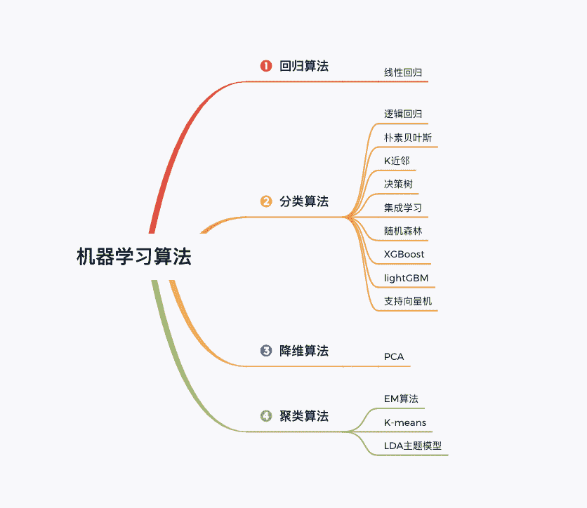

↑↑↑关注后"星标"Datawhale

每日干货 & [每月组队学习](https://mp.weixin.qq.com/mp/appmsgalbum?__biz=MzIyNjM2MzQyNg%3D%3D&action=getalbum&album_id=1338040906536108033#wechat_redirect)，不错过

 Datawhale专题 

**作者：王茂霖，华中科技大学，Datawhale成员**

## 机器学习算法

这一年多来，Datawhale已经分享了数百篇学习干货。根据大家反馈，学习的问题主要有，一是不清楚怎么入门，二是感觉不够成体系。 所以后面打算把开源的内容逐步体系化，形成数学基础，python基础，机器学习，深度学习，数据分析，数据挖掘等多个知识专题，再结合专题组织学习活动。其中机器学习见下图。

今天，我们从第一个算法开始：逻辑回归算法（可以说是最经典最常用的机器学习算法）

## 逻辑回归

逻辑回归（Logistic regression，简称LR）虽然其中带有"回归"两个字，但其实是一个分类模型。逻辑回归的模型极为简单，同时模型的可解释性也很强。可以广泛用于各个领域，包括大多数医学和社会科学等领域。逻辑回归还是很多分类算法的基础组件。

逻辑回归是机器学习最基础的算法之一，简单易学，实用有效。便于初学者也能很好地入门和实践。根据之前的学习经验，梳理的学习内容如下:

*   逻辑回归算法原理

*   逻辑回归算法实践

*   基于鸢尾花（iris）数据集的分类预测

## 学习实践

考虑到在Github的开源内容经常打不开，上述内容也开源在了国内阿里云社区。阿里云作为Datawhale开源支持方，将提供免配置运行环境和免费算力支持。点击**开始体验**，即可学习实践，还是比较方便的。

开源地址：https://developer.aliyun.com/ai/scenario/9ad3416619b1423180f656d1c9ae44f7（复制用电脑打开）

对于每月的[组队学习](https://mp.weixin.qq.com/mp/appmsgalbum?__biz=MzIyNjM2MzQyNg%3D%3D&action=getalbum&album_id=1338040906536108033#wechat_redirect)，很多初学者和在职同学反馈，学习难度和学习量还是有些大的。为了解决这个问题，我们打算组织一些轻量级的学习，比如机器学习算法学习，可以每周学习1个算法即可，多些实践和探讨交流。

后台回复 **机器学习** ，一起加入

“一起学习，**点赞**三连↓