↑↑↑关注后"星标"Datawhale

每日干货 & [每月组队学习](https://mp.weixin.qq.com/mp/appmsgalbum?__biz=MzIyNjM2MzQyNg%3D%3D&action=getalbum&album_id=1338040906536108033#wechat_redirect)，不错过

 Datawhale干货 

**作者：李祖贤，****Datawhale高校群成员****，深圳大学**

在机器学习中，有很多的问题并没有解析形式的解，或者有解析形式的解但是计算量很大（譬如，超定问题的最小二乘解），对于此类问题，通常我们会选择采用一种迭代的优化方式进行求解。

负梯度方法与Newton型方法在最优化方法中发挥着重要作用，也在现代金融科技，大规模的机器学习发挥不可或缺的作用。接下来，我们将针对这两种优化方法在机器学习中的应用进行讨论。

**一、****最速下降法**

**1.1 最速下降法的原理**

假定在第k步的迭代点，我们想求处使得  下降最快的方向。由上一章可知：这个方向应首先满足下降条件。虽然下降方向有无穷多个，但是根据Cauchy-Schwarz不等式：当且仅当时等式成立，达到最小。由于在方向上要考虑步长，故取为负梯度方向：。

特别的，我们称采用负梯度方向以及精确线搜索的方法称为最速下降法。

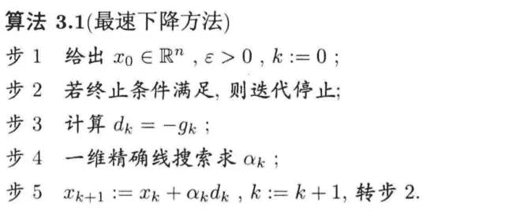

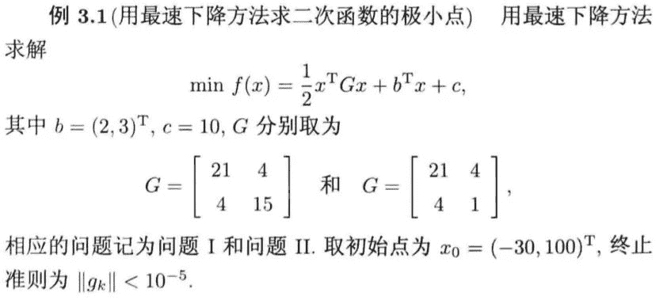 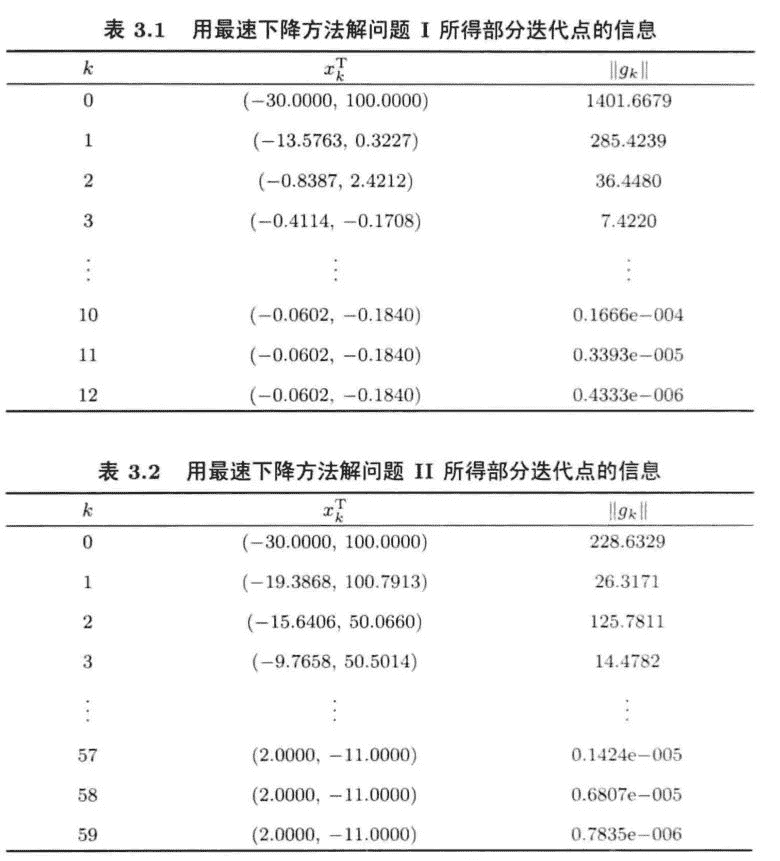

我们从上面可以看到，不同的G矩阵使用最速下降法的迭代速度有明显的差异，原因在后文给出。

## **1.2 最速下降法的收敛速度**

**1.2.1  收敛性**

最速下降法具有全局收敛性！

**1.2.2  预备知识**

*   向量u在矩阵G度量下的范数：

*   矩阵G度量下的Cauchy-Schwarz不等式：

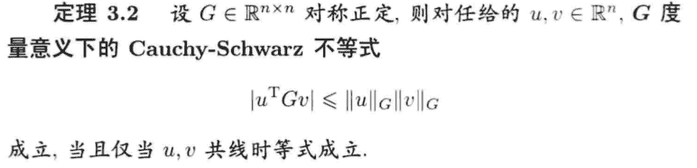

*   Kantorovich不等式：

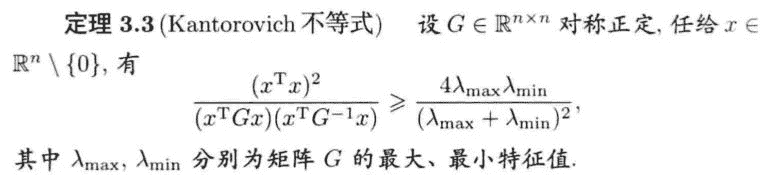

**1.2.3  收敛速度的上界**

正定二次函数： 

收敛速度的上界:


由此可知，最速下降法的收敛速度是线性的，这个速度依赖于G的最大最小特征值。

**1.2.4  收敛速度的差异性来源**

我们假设G和b产生了微小扰动变成了 ,正定二次函数： 的导函数方程相应变成了  ，方程的解记为 ,其中非奇异， 满足 非零。那么：


条件数与范数有关，因此是G的相对误差与b的相对误差之和的放大倍数。若矩阵G的条件数很大，扰动对解的影响很大，我们称这个问题是病态的，或G是病态的。若矩阵G的条件数不大，扰动对解的影响程度不大，我们就成这样的问题是良性的，或G是良性的。

因此：


这说明最速下降法的收敛速度依赖G的条件数，当G的条件数接近于1时，接近于0，最速下降法的收敛速度接近于超线性收敛；而当G的条件数很大时，接近于1，则收敛很慢。

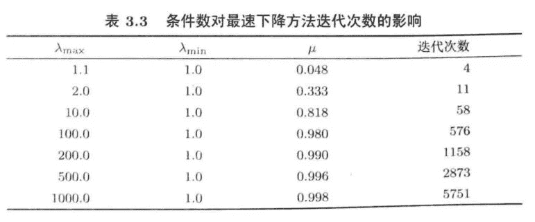 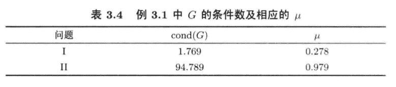

**1.2.5  最速下降法的优缺点**

**优点**：算法每次迭代的计算量少，储存量也少，从一个不太好的初始点出发也能靠近极小点。

**缺点**：

*   收敛慢：线性收敛。

*   Zigzag现象（收敛慢的原因）：若迭代步  是  的精确最小点，则，因此：  ，也就是上一步的方向与下一步的方向垂直。

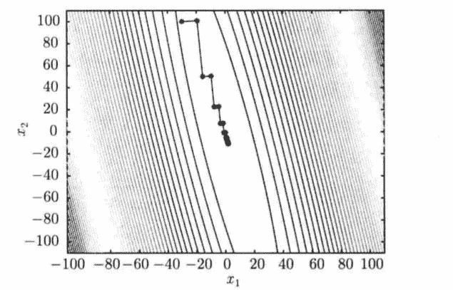

*   没有二次终止性：即不具备对于任意的正定二次函数，从任意点出发，都可以经过有限步迭代取得极小值的性质。

## **二、Newton方法**

**2.1 基本Newton方法**

设 具有连续二阶偏导数，当前迭代点是 。 在  的泰勒展开为：

  

其中。在点的邻域内，用二次函数去近似，求解问题 。

若正定，则迭代方向为问题的唯一解。我们称为Newton方向。(Hesse的逆矩阵度量下的最速下降法)

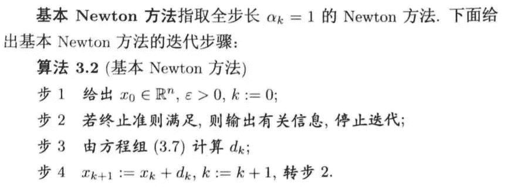

我们来看看牛顿迭代的方向和梯度下降的方向有什么不一样？（黑色为牛顿下降方向，红色为负梯度下降方向）

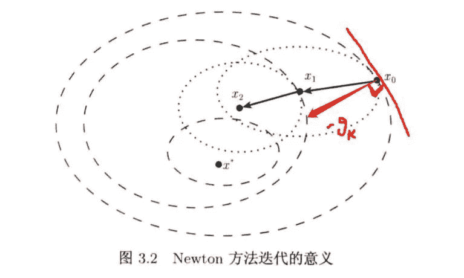

下面我们用一个具体的例子来看看牛顿迭代法的效果：

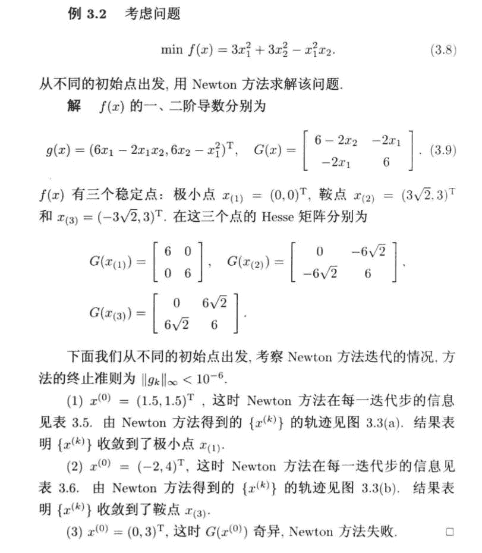 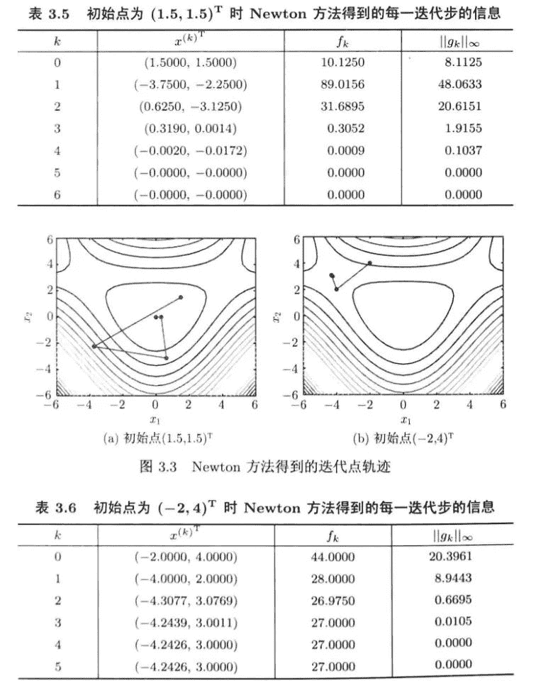

从上面的例子我们可以看到：

（1）当初始点接近极小点时，迭代序列收敛于极小点，并且收敛很快（二阶收敛）；

（2）当初始点不接近极小点时，迭代序列容易收敛到鞍点或者极大点（局部收敛性而不是全局收敛）。

（3）迭代过程可能会出现奇异矩阵或者病态，以至于求逆很困难，导致迭代失败。

*   当的特征值，求不出来。

*   当的特征值

     

    不一定小于0，牛顿方向未必是下降方向。

（4）每一步迭代需要计算Hesse矩阵，即计算n(n+1)/2个二阶偏导数，相当于求解一个线性方程组，计算量为O()

## **2.2 阻尼Newton方法**

为了改善基本Newton方法的局部收敛准则，我们采用带一维线搜索的的Newton方法，即


其中是一维搜索的结果，该方法叫做阻尼Newton方法。此方法能保证对正定矩阵， 单调下降；即使  离x稍远，由该方法产生的点列仍能收敛到。（对严格凸函数具有全局收敛性）

## **2.3 混合方法**

基本Newton方法在迭代过程中会出现Hesse矩阵奇异、不正定的情形，基本Newton方法还会出现与几乎正交的情形。为了解决这个问题，我们可以采用基本Newton方法与最速下降法相互混合的方式。

该方法采用Newton方法，但是在Hesse矩阵奇异或者与几乎正交时，采用负梯度方向；在负定，但是存在时，取 。

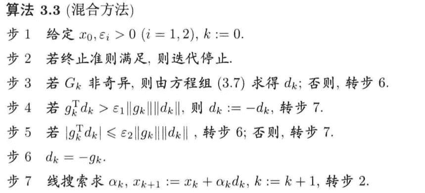

## **2.4 LM方法**

LM方法是处理奇异、不正定等情况的一个最简单有效的方法，它是指求解 来确定迭代方向的Newton型方法，这里的是单位阵。显然，若足够大，可以保证正定。

（1）  的大小对于方向的影响：

*   当  很小，求出的步长偏向于Newton方向。

*   当  很大，求出的步长则偏向于负梯度方向。

（2）当不正定时，可以简单取

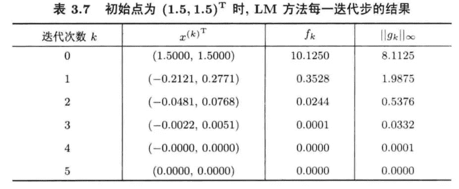 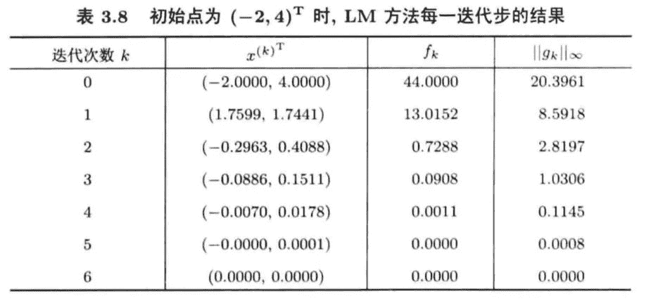 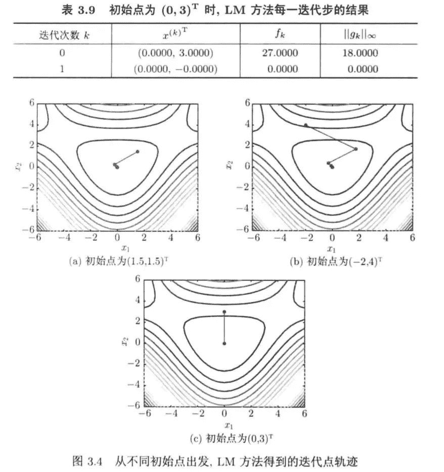 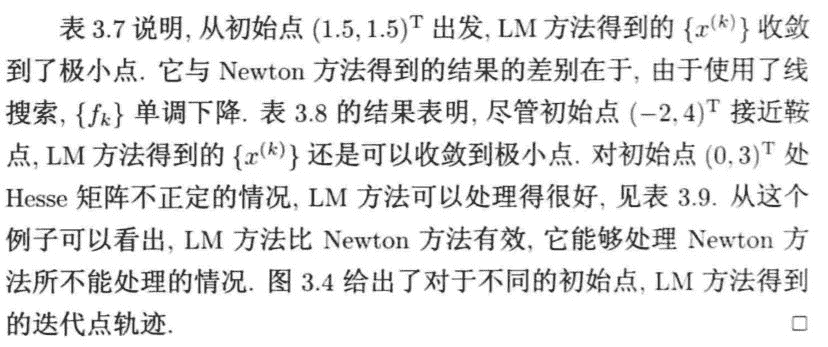

## **三、拟牛顿方法**

Newton方法的优缺点：

（1）当初始点接近极小点时，迭代序列收敛于极小点，并且收敛很快（二阶收敛）；

（2）当初始点不接近极小点时，迭代序列容易收敛到鞍点或者极大点（局部收敛性而不是全局收敛）。

（3）迭代过程可能会出现奇异矩阵或者病态，以至于求逆很困难，导致迭代失败。

*   当的特征值，求不出来。

*   当的特征值, 

    

    不一定小于0，牛顿方向未必是下降方向。

（4）每一步迭代需要计算Hesse矩阵，即计算n(n+1)/2个二阶偏导数，相当于求解一个线性方程组，计算量为O()

为此，我们考虑构造一种方法，她既不需要计算二阶偏导数，又有较快的收敛速度。

## **3.1 拟牛顿条件**

假定当前迭代点为，已知条件为，我们使用拉格朗日中值定理： 


我们可以使用矩阵似得到  n个方程，n(n+1)/2个变量。

令得到：

 

因此拟牛顿条件为：

  

满足这两个方程的矩阵有很多，因此拟牛顿方法是一类方法。

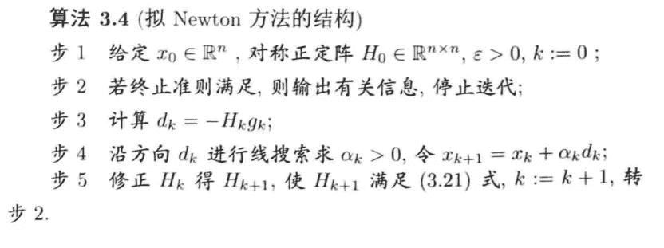

在上述算法中，初始矩阵一般取单位矩阵，第一步迭代方向取为负梯度方向。

那么，算法的核心就是怎么由去修正，即，而的取法是多种多样的，但是他应该具有简单、计算量小、有效的特点。

## **3.2 拟牛顿方法的修正公式**

## **3.2.1 对称秩1公式**

即取为对称秩1矩阵，即有

。

将代入拟牛顿方程  得到： 

 

即有： 。

由于是一个数，因此u与共线，从而存在使得： 。

将代入得到

  

因此,由此得到

 .

最终得到对称秩1公式：


如果我们想将换成等价的，则需要用到SMW公式：

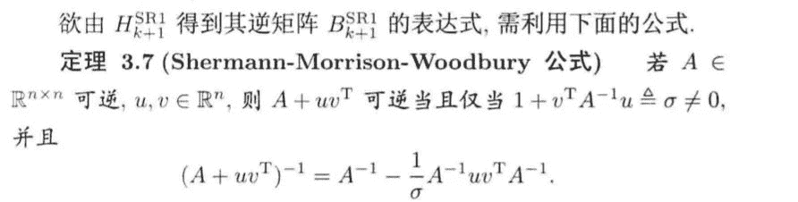

最终得到对称秩1公式：


## **3.2.2 对称秩2公式**

若为对称秩2矩阵，即，其中 待定。

将代入中，得到的修正公式。

## **（1）DFP方法**

在中，化简为

  

由于的选择不是唯一的，为了计算方便，我们选择:


代入公式中可得  ，得到DFP公式：


根据SMW公式：


## **（2）BFGS公式（对偶）**

考虑的修正公式： 用相同的推断实现：


根据SMW公式：


## **（3）Broyden族公式**

DFP方法与BFGS公式的线性组合：


## **3.3 三种拟牛顿方法的对比试验**

**（1）扩展Rosenbrock问题**

(BFGS与DFP差异不大，SR1差些)（迭代次数与函数调用次数）

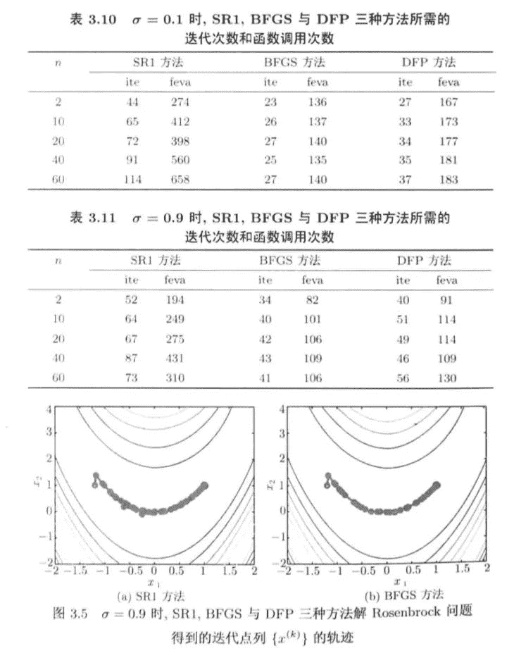 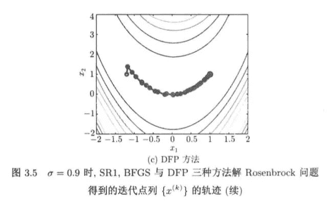

（2）由人工神经网络解微分方程的问题：

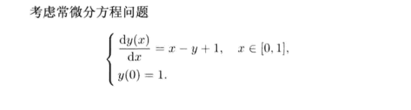 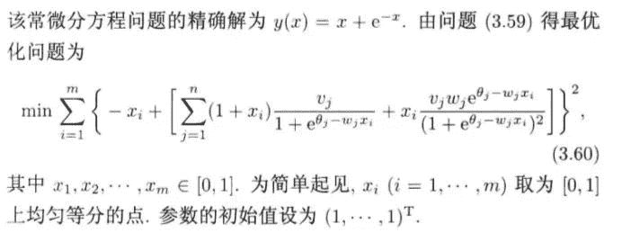 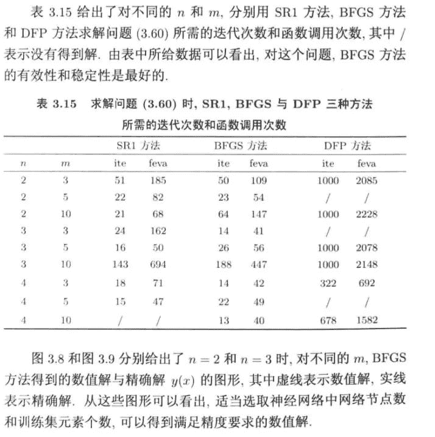

## **四、使用牛顿法优化Rosenbrock函数实例（基于python）**

Rosenbrock函数的数据探索：

 

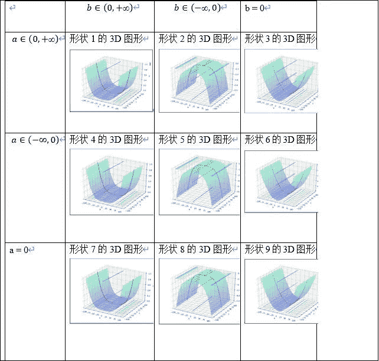

```
import numpy as np
import pandas as pd
import matplotlib.pyplot as plt
import time
%matplotlib inline
from mpl_toolkits.mplot3d import Axes3D
class Rosenbrock():
    def __init__(self):
        self.x1 = np.arange(-100, 100, 0.0001)
        self.x2 = np.arange(-100, 100, 0.0001)
        #self.x1, self.x2 = np.meshgrid(self.x1, self.x2)
        self.a = 1
        self.b = 1
        self.newton_times = 1000
        self.answers = []
        self.min_answer_z = []

    # 准备数据
    def data(self):
        z = np.square(self.a - self.x1) + self.b * np.square(self.x2 - np.square(self.x1))
        #print(z.shape)
        return z

    # 随机牛顿
    def snt(self,x1,x2,z,alpha):
        rand_init = np.random.randint(0,z.shape[0])
        x1_init,x2_init,z_init = x1[rand_init],x2[rand_init],z[rand_init]
        x_0 =np.array([x1_init,x2_init]).reshape((-1,1))
        #print(x_0)

        for i in range(self.newton_times):
            x_i = x_0 - np.matmul(np.linalg.inv(np.array([[12*x2_init**2-4*x2_init+2,-4*x1_init],[-4*x1_init,2]])),np.array([4*x1_init**3-4*x1_init*x2_init+2*x1_init-2,-2*x1_init**2+2*x2_init]).reshape((-1,1)))
            x_0 = x_i
            x1_init = x_0[0,0]
            x2_init = x_0[1,0]
        answer = x_0
        return answer

    # 绘图
    def plot_data(self,min_x1,min_x2,min_z):
        x1 = np.arange(-100, 100, 0.1)
        x2 = np.arange(-100, 100, 0.1)
        x1, x2 = np.meshgrid(x1, x2)
        a = 1
        b = 1
        z = np.square(a - x1) + b * np.square(x2 - np.square(x1))
        fig4 = plt.figure()
        ax4 = plt.axes(projection='3d')
        ax4.plot_surface(x1, x2, z, alpha=0.3, cmap='winter')  # 生成表面， alpha 用于控制透明度
        ax4.contour(x1, x2, z, zdir='z', offset=-3, cmap="rainbow")  # 生成z方向投影，投到x-y平面
        ax4.contour(x1, x2, z, zdir='x', offset=-6, cmap="rainbow")  # 生成x方向投影，投到y-z平面
        ax4.contour(x1, x2, z, zdir='y', offset=6, cmap="rainbow")  # 生成y方向投影，投到x-z平面
        ax4.contourf(x1, x2, z, zdir='y', offset=6, cmap="rainbow")  # 生成y方向投影填充，投到x-z平面，contourf()函数
        ax4.scatter(min_x1,min_x2,min_z,c='r')
        # 设定显示范围
        ax4.set_xlabel('X')
        ax4.set_ylabel('Y')
        ax4.set_zlabel('Z')
        plt.show()

    # 开始
    def start(self):
        times = int(input("请输入需要随机优化的次数："))
        alpha = float(input("请输入随机优化的步长"))
        z = self.data()
        start_time = time.time()
        for i in range(times):
            answer = self.snt(self.x1,self.x2,z,alpha)
            self.answers.append(answer)
        min_answer = np.array(self.answers)
        for i in range(times):
            self.min_answer_z.append((1-min_answer[i,0,0])**2+(min_answer[i,1,0]-min_answer[i,0,0]**2)**2)
        optimal_z = np.min(np.array(self.min_answer_z))
        optimal_z_index = np.argmin(np.array(self.min_answer_z))
        optimal_x1,optimal_x2 = min_answer[optimal_z_index,0,0],min_answer[optimal_z_index,1,0]
        end_time = time.time()
        running_time = end_time-start_time
        print("优化的时间:%.2f秒!" % running_time)
        self.plot_data(optimal_x1,optimal_x2,optimal_z)
if __name__ == '__main__':
    snt = Rosenbrock()
    snt.start() 
```

```
请输入需要随机优化的次数：100 
```

请输入随机优化的步长0.01

优化的时间:8.10秒!

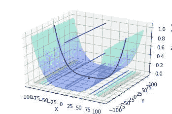

*本文电子版 后台回复 ****优化算法****获取*


“整理不易，**点****赞****三连**↓