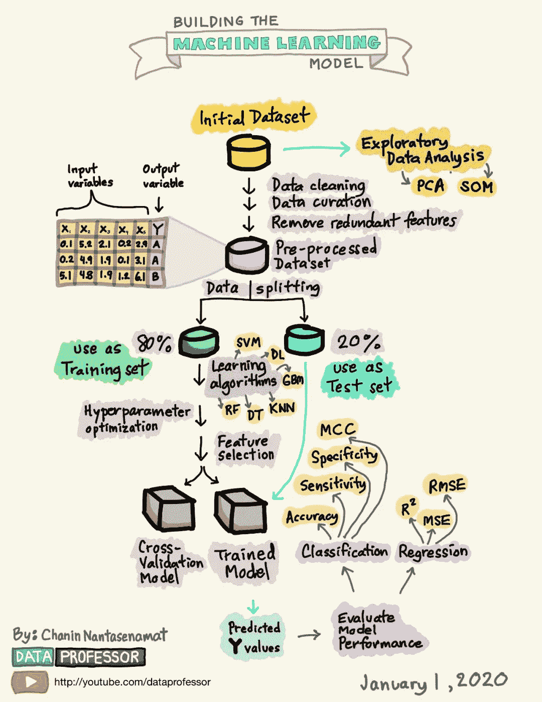
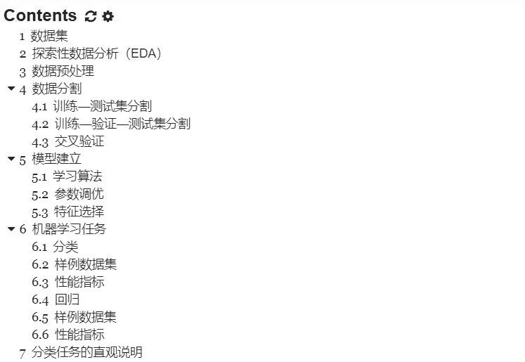
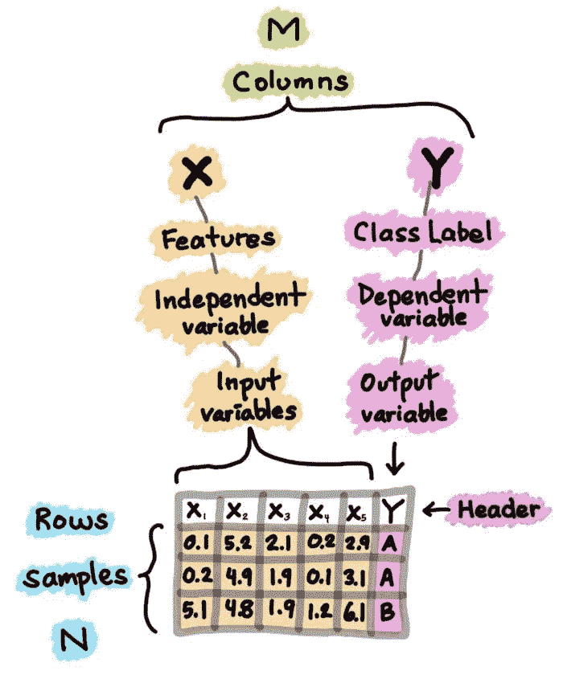
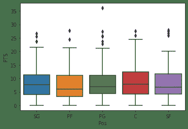
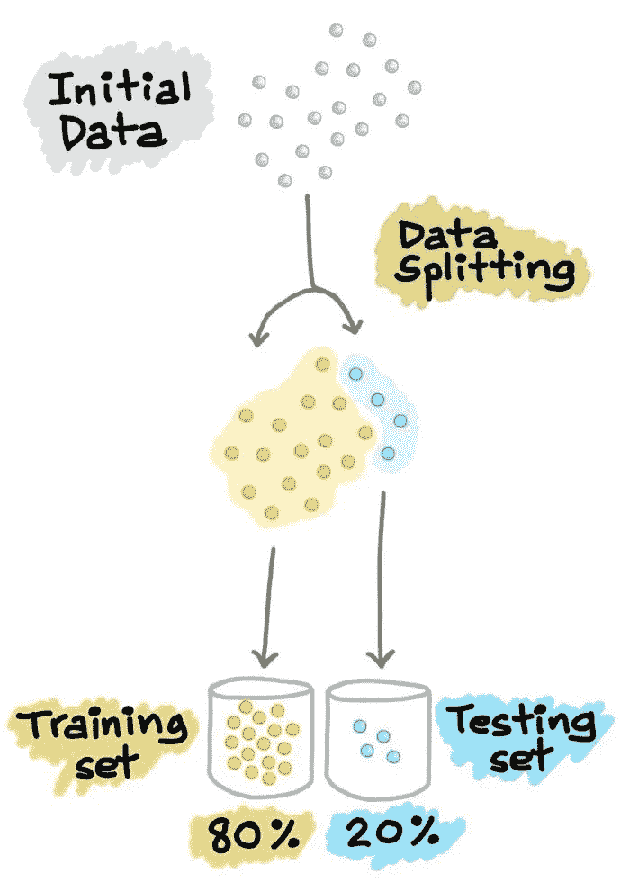
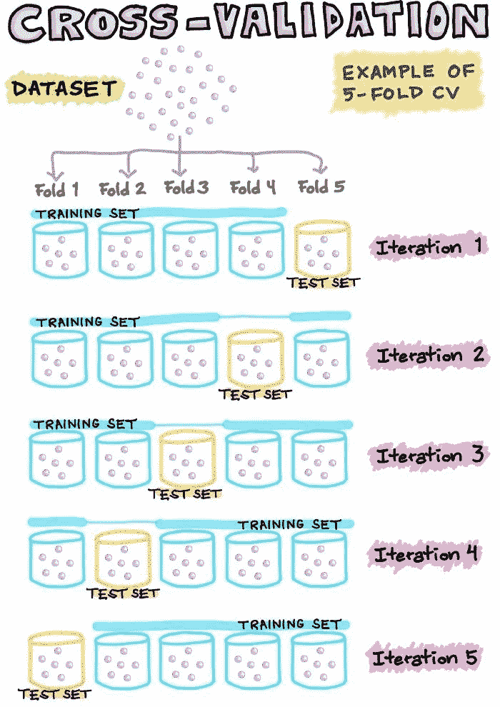
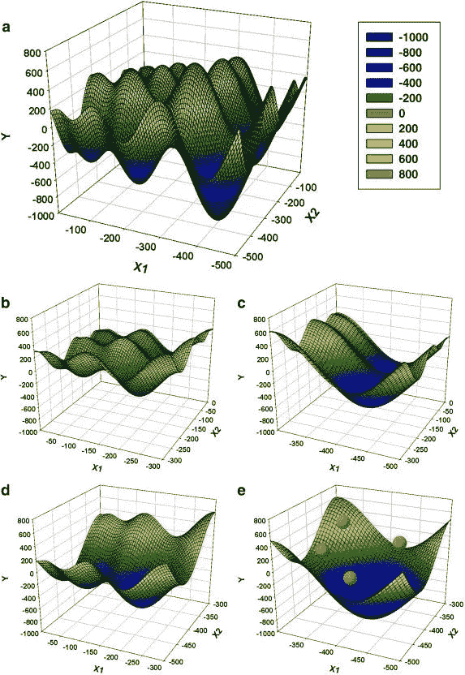
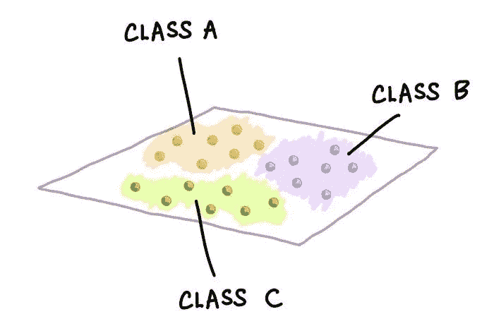
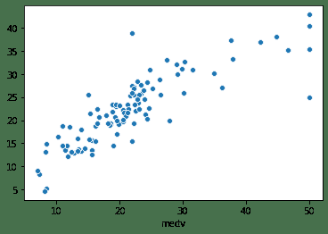

↑↑↑关注后"星标"Datawhale

每日干货 & [每月组队学习](https://mp.weixin.qq.com/mp/appmsgalbum?__biz=MzIyNjM2MzQyNg%3D%3D&action=getalbum&album_id=1338040906536108033#wechat_redirect)，不错过

 Datawhale干货 

**译者：张峰，安徽工业大学，Datawhale成员**

周末在家无聊闲逛github，发现一个很有趣的开源项目，作者用手绘图的方式讲解了机器学习模型构建的全流程，逻辑清晰、生动形象。同时，作者也对几张图进行了详细的讲解，学习之后，收获很多，于是将其翻译下来，和大家一起学习。

地址：https://github.com/dataprofessor/infographic

**全文如下：**

感觉学习数据科学枯燥无味，那如何能让学习数据科学变得有趣而简单呢？带着这个目标，我开始在iPad上涂鸦建立机器学习模型所需的流程。经过几天的努力，上图所示的信息图就是我的成果，内容已经被发布在GitHub上。

## 1\. 数据集

数据集是你构建机器学习模型历程中的起点。简单来说，数据集本质上是一个M×N矩阵，其中M代表列（特征），N代表行（样本）。

列可以分解为X和Y，首先，X是几个类似术语的同义词，如特征、独立变量和输入变量。其次，Y也是几个术语的同义词，即类别标签、因变量和输出变量。

图1\. 数据集的卡通插图

应该注意的是，一个可以用于监督学习的数据集（可以执行回归或分类）将同时包含X和Y，而一个可以用于无监督学习的数据集将只有X。

此外，如果Y包含定量值，那么数据集（由X和Y组成）可以用于回归任务，而如果Y包含定性值，那么数据集（由X和Y组成）可以用于分类任务。

## 2\. 探索性数据分析（EDA）

进行探索性数据分析（EDA）是为了获得对数据的初步了解。在一个典型的数据科学项目中，我会做的第一件事就是通过执行EDA来 "盯住数据"，以便更好地了解数据。

我通常使用的三大EDA方法包括：

*   描述性统计：平均数、中位数、模式、标准差。

*   数据可视化：热力图（辨别特征内部相关性）、箱形图（可视化群体差异）、散点图（可视化特征之间的相关性）、主成分分析（可视化数据集中呈现的聚类分布）等。

*   数据整形：对数据进行透视、分组、过滤等。

图2\. NBA球员统计数据的箱形图示例

图3\. NBA球员统计数据的相关热力图示例

图4\. NBA球员统计数据的直方图示例

图5\. NBA球员统计数据的散布图示例

## 3\. 数据预处理

## 数据预处理(又称数据清理、数据整理或数据处理)是指对数据进行各种检查和审查的过程，以纠正缺失值、拼写错误、使数值正常化/标准化以使其具有可比性、转换数据(如对数转换)等问题。

"Garbage in, Garbage out."

正如上面的引言所说，数据的质量将对生成模型的质量产生很大的影响。因此，为了达到最高的模型质量，应该在数据预处理阶段花费大量精力。一般来说，数据预处理可以轻松地占到数据科学项目所花费时间的80%，而实际的模型建立阶段和后续的模型分析仅占到剩余的20%。

## 4\. 数据分割

### 4.1 训练--测试集分割

在机器学习模型的开发过程中，希望训练好的模型能在新的、未见过的数据上表现良好。为了模拟新的、未见过的数据，对可用数据进行数据分割，从而将其分割成2部分（有时称为训练—测试分割）。特别是，第一部分是较大的数据子集，用作训练集（如占原始数据的80%），第二部分通常是较小的子集，用作测试集（其余20%的数据）。需要注意的是，这种数据拆分只进行一次。

接下来，利用训练集建立预测模型，然后将这种训练好的模型应用于测试集（即作为新的、未见过的数据）上进行预测。根据模型在测试集上的表现来选择最佳模型，为了获得最佳模型，还可以进行超参数优化。

图6\. 训练—测试集分割示意图

### 4.2 训练--验证--测试集分割

另一种常见的数据分割方法是将数据分割成3部分。(1) 训练集，(2) 验证集和(3) 测试集。与上面解释的类似，训练集用于建立预测模型，同时对验证集进行评估，据此进行预测，可以进行模型调优（如超参数优化），并根据验证集的结果选择性能最好的模型。正如我们所看到的，类似于上面对测试集进行的操作，这里我们在验证集上做同样的操作。请注意，测试集不参与任何模型的建立和准备。因此，测试集可以真正充当新的、未知的数据。Google的《机器学习速成班》对这个话题进行了更深入的处理。

图7\. 训练—验证—测试集分割示意图

### 4.3 交叉验证

为了最经济地利用现有数据，通常使用N倍交叉验证（CV），将数据集分割成N个折（即通常使用5倍或10倍CV）。在这样的N倍CV中，其中一个折被留作测试数据，而其余的折则被用作建立模型的训练数据。

例如，在5倍CV中，有1个折被省略，作为测试数据，而剩下的4个被集中起来，作为建立模型的训练数据。然后，将训练好的模型应用于上述遗漏的折（即测试数据）。这个过程反复进行，直到所有的折都有机会被留出作为测试数据。因此，我们将建立5个模型（即5个折中的每个折都被留出作为测试集），其中5个模型中的每个模型都包含相关的性能指标（我们将在接下来的部分讨论）。最后，度量（指标）值是基于5个模型计算出的平均性能。

图8\. 交叉验证示意图

在N等于数据样本数的情况下，我们称这种留一的交叉验证。在这种类型的CV中，每个数据样本代表一个折。例如，如果N等于30，那么就有30个折（每个折有1个样本）。在任何其他N折CV中，1个折点被留出作为测试集，而剩下的29个折点被用来建立模型。接下来，将建立的模型应用于对留出的折进行预测。与之前一样，这个过程反复进行，共30次；计算30个模型的平均性能，并将其作为CV性能指标。

## 5\. 模型建立

## 现在，有趣的部分来了，我们终于可以使用精心准备的数据来建立模型了。根据目标变量（通常称为Y变量）的数据类型（定性或定量），我们要建立一个分类（如果Y是定性的）或回归（如果Y是定量的）模型。

### 5.1 学习算法

### 机器学习算法可以大致分为以下三种类型之一：

*   监督学习：是一种机器学习任务，建立输入X和输出Y变量之间的数学（映射）关系。这样的X、Y对构成了用于建立模型的标签数据，以便学习如何从输入中预测输出。

*   无监督学习：是一种只利用输入X变量的机器学习任务。这种 X 变量是未标记的数据，学习算法在建模时使用的是数据的固有结构。

*   强化学习：是一种决定下一步行动方案的机器学习任务，它通过试错学习来实现这一目标，努力使回报最大化。

### 5.2 参数调优

### 超参数本质上是机器学习算法的参数，直接影响学习过程和预测性能。由于没有 "一刀切 "的超参数设置，可以普遍适用于所有数据集，因此需要进行超参数优化（也称为超参数调整或模型调整）。

我们以随机森林为例。在使用randomForest R包时，通常会对两个常见的超参数进行优化，其中包括mtry和ntree参数（这对应于scikit-learnPython库中RandomForestClassifier()和RandomForestRegressor()函数中的nestimators和maxfeatures）。mtry（maxfeatures）代表在每次分裂时作为候选变量随机采样的变量数量，而ntree（nestimators）代表要生长的树的数量。

另一种流行的机器学习算法是支持向量机。需要优化的超参数是径向基函数(RBF)内核的C参数和gamma参数(即线性内核只有C参数；多项式内核的C和指数)。C参数是一个限制过拟合的惩罚项，而gamma参数则控制RBF核的宽度。如上所述，调优通常是为了得出超参数的最佳值集，尽管如此，也有一些研究旨在为C参数和gamma参数找到良好的起始值（Alvarsson等人，2014）。

地址：https://pubs.acs.org/doi/10.1021/ci500344v

### 5.3 特征选择

### 顾名思义，特征选择从字面上看就是从最初的大量特征中选择一个特征子集的过程。除了实现高精度的模型外，机器学习模型构建最重要的一个方面是获得可操作的见解，为了实现这一目标，能够从大量的特征中选择出重要的特征子集非常重要。

特征选择的任务本身就可以构成一个全新的研究领域，在这个领域中，大量的努力都是为了设计新颖的算法和方法。从众多可用的特征选择算法中，一些经典的方法是基于模拟退火和遗传算法。除此之外，还有大量基于进化算法（如粒子群优化、蚁群优化等）和随机方法（如蒙特卡洛）的方法。

我们自己的研究小组也在对醛糖还原酶抑制剂的定量结构—活性关系建模的研究中，探索了利用蒙特卡洛模拟进行特征选择的方法（Nantasenamat等，2014）。

地址：https://doi.org/10.1016/j.ejmech.2014.02.043

在《遗传算法搜索空间拼接粒子群优化作为通用优化器》的工作中，我们还设计了一种基于结合两种流行的进化算法即遗传算法和粒子群算法的新型特征选择方法（Li等，2013）。

地址：https://doi.org/10.1016/j.chemolab.2013.08.009

图9\. 遗传算法搜索空间拼接粒子群优化(GA-SSS-PSO)方法的原理示意图，用Schwefel函数在2维度上进行说明

"原搜索空间（a）x∈[-500,0]在每个维度上以2的固定间隔拼接成子空间（图中一个维度等于一个横轴）。这样就得到了4个子空间(b-e)，其中x在每个维度上的范围是原始空间的一半。GA的每一个字符串都会编码一个子空间的索引。然后，GA启发式地选择一个子空间（e），并在那里启动PSO（粒子显示为红点）。PSO搜索子空间的全局最小值，最好的粒子适应性作为编码该子空间索引的GA字符串的适应性。最后，GA进行进化，选择一个新的子空间进行探索。整个过程重复进行，直到达到满意的误差水平。"

## 6\. 机器学习任务

在监督学习中，两个常见的机器学习任务包括分类和回归。

### 6.1 分类

 一个训练有素的分类模型将一组变量（定量或定性）作为输入，并预测输出的类标签（定性）。下图是由不同颜色和标签表示的三个类。每一个小的彩色球体代表一个数据样本。

图10\. 多类别分类问题的示意图

三类数据样本在二维中的显示。上图显示的是数据样本的假设分布。这种可视化图可以通过执行PCA分析并显示前两个主成分（PC）来创建；或者也可以选择两个变量的简单散点图可视化。

### 6.1.1 样例数据集

以企鹅数据集（Penguins Dataset）为例（最近提出作为大量使用的Iris数据集的替代数据集），我们将定量（喙长、喙深、鳍长和身体质量）和定性（性别和岛屿）特征作为输入，这些特征唯一地描述了企鹅的特征，并将其归入三个物种类别标签（Adelie、Chinstrap或Gentoo）之一。该数据集由344行和8列组成。之前的分析显示，该数据集包含333个完整的案例，其中11个不完整的案例中出现了19个缺失值。

图11\. 三个企鹅物种的类别标签（Chinstrap、Gentoo和Adelie）

### 6.1.2 性能指标

如何知道我们的模型表现好或坏？答案是使用性能指标，一些常见的评估分类性能的指标包括准确率（Ac）、灵敏度（Sn）、特异性（Sp）和马太相关系数（MCC）。

 其中TP、TN、FP和FN分别表示真阳性、真阴性、假阳性和假阴性的实例。应该注意的是，MCC的范围从-1到1，其中MCC为-1表示最坏的可能预测，而值为1表示最好的可能预测方案。此外，MCC为0表示随机预测。

### 6.2 回归

 简而言之，可以通过以下简单等式很好地总结训练有素的回归模型：Y = f(X)。其中，Y对应量化输出变量，X指输入变量，f指计算输出值作为输入特征的映射函数（从训练模型中得到）。上面的回归例子公式的实质是，如果X已知，就可以推导出Y。一旦Y被计算出来（我们也可以说是 "预测"），一个流行的可视化方式是将实际值与预测值做一个简单的散点图，如下图所示。

图12\. 实际值与预测值的简单散点图

### 6.2.1 样例数据集

波士顿住房数据集（Boston Housing Dataset）是数据科学教程中通常使用的一个热门示例数据集。该数据集由506行和14列组成。为了简洁起见，下面显示的是标题（显示变量名称）加上数据集的前4行。

 在14列中，前13个变量被用作输入变量，而房价中位数（medv）被用作输出变量。可以看出，所有14个变量都包含了量化的数值，因此适合进行回归分析。我还在YouTube上做了一个逐步演示如何用Python建立线性回归模型的视频。

地址：https://youtu.be/R15LjD8aCzc

在视频中，我首先向大家展示了如何读取波士顿房屋数据集，将数据分离为X和Y矩阵，进行80/20的数据拆分，利用80%的子集建立线性回归模型，并应用训练好的模型对20%的子集进行预测。最后显示了实际与预测medv值的性能指标和散点图。

图13\. 测试集的实际medv值与预测medv值（20％子集）的散点图。

### 6.2.2 性能指标 

对回归模型的性能进行评估，以评估拟合模型可以准确预测输入数据值的程度。

评估回归模型性能的常用指标是确定系数（R²）。

从公式中可以看出，R²实质上是1减去残差平方和（SSres）与总平方和（SStot）的比值。简单来说，可以说它代表了解释方差的相对量度。例如，如果R²=0.6，那么意味着该模型可以解释60%的方差（即60%的数据符合回归模型），而未解释的方差占剩余的40%。

此外，均方误差（MSE）以及均方根误差（RMSE）也是衡量残差或预测误差的常用指标。

      

从上面的公式可以看出，MSE顾名思义是很容易计算的，取平方误差的平均值。此外，MSE的简单平方根可以得到RMSE。

## 7\. 分类任务的直观说明

## 现在我们再来看看分类模型的整个过程。以企鹅数据集为例，我们可以看到，企鹅可以通过4个定量特征和2个定性特征来描述，然后将这些特征作为训练分类模型的输入。在训练模型的过程中，需要考虑的问题包括以下几点。

*   使用什么机器学习算法？

*   应该探索什么样的搜索空间进行超参数优化？

*   使用哪种数据分割方案？80/20分割还是60/20/20分割？还是10倍CV？

一旦模型被训练，得到的模型就可以用来对类别标签（即在我们的案例中企鹅种类）进行预测，可以是三种企鹅种类中的一种：Adelie、Chinstrap或Gentoo。

除了只进行分类建模，我们还可以进行主成分分析（PCA），这将只利用X（独立）变量来辨别数据的底层结构，并在这样做的过程中允许将固有的数据簇可视化（如下图所示为一个假设图，其中簇根据3种企鹅物种进行了颜色编码）。

图14\. 建立一个分类模型的过程示意图

*本文电子版 后台回复 ****ML****获取*

“干货学习，**点****赞****三连**↓