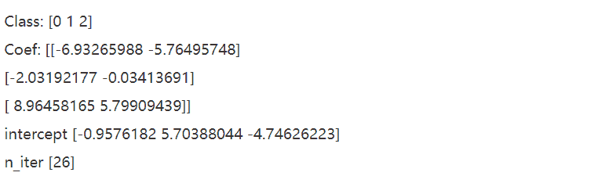

↑↑↑关注后"星标"Datawhale

每日干货 & [每月组队学习](https://mp.weixin.qq.com/mp/appmsgalbum?__biz=MzIyNjM2MzQyNg%3D%3D&action=getalbum&album_id=1338040906536108033#wechat_redirect)，不错过

 Datawhale干货 

**作者：李祖贤，深圳大学，Datawhale高校群成员**

本次分享是基于scikit-learn工具包的基本分类方法，包括常见的Logisitic Regression、支持向量机、决策树、随机森林以及K近邻方法KNN。本文在基于读者已经基本了解这些基本算法的原理以及推导的基础上，使用sklearn工具包进行算法实践，如果大家没有掌握基本算法原理，文中也会给出一些优秀的链接方便大家学习。如果大家对基本分类算法的基本原理有需求，可以在评论区写下自己的需求，我们会根据大家的意见推出相应的分享。

机器学习算法主要步骤有：

*   选择特征并且收集并训练样本

*   选择度量性能的指标

*   选择分类器并优化算法

*   评估模型性能

*   调整算法

本次分享主要把目光聚集在"选择分类器并优化算法"，我们将用学术界和工业界常用的机器学习库sklearn，对算法进行实践。

本文内容：

*   数据准备

*   逻辑回归

*   支持向量机

*   决策树

*   随机森林

*   KNN

## **1\. 数据准备**

我们使用鸢尾花数据集，进行分析考核可视化

```
# 引入数据
from sklearn import datasets
import numpy as np

iris = datasets.load_iris()
X = iris.data[:,[2,3]]
y = iris.target
print("Class labels:",np.unique(y))  #打印分类类别的种类 
```

Class labels: [0 1 2]

切分训练数据和测试数据

```
# 切分训练数据和测试数据
from sklearn.model_selection import train_test_split
## 30%测试数据，70%训练数据，stratify=y表示训练数据和测试数据具有相同的类别比例
X_train,X_test,y_train,y_test = train_test_split(X,y,test_size=0.3,random_state=1,stratify=y) 
```

数据标准化

```
from sklearn.preprocessing import StandardScaler

sc = StandardScaler()
## 估算训练数据中的mu和sigma
sc.fit(X_train)
## 使用训练数据中的mu和sigma对数据进行标准化
X_train_std = sc.transform(X_train)
X_test_std = sc.transform(X_test) 
```

定制可视化函数：画出决策边界图(只有在2个特征才能画出来)

```
## 画出决策边界图(只有在2个特征才能画出来)
import matplotlib.pyplot as plt
%matplotlib inline
from matplotlib.colors import ListedColormap

def plot_decision_region(X,y,classifier,resolution=0.02):
    markers = ('s','x','o','^','v')
    colors = ('red','blue','lightgreen','gray','cyan')
    cmap = ListedColormap(colors[:len(np.unique(y))])

    # plot the decision surface
    x1_min,x1_max = X[:,0].min()-1,X[:,0].max()+1
    x2_min,x2_max = X[:,1].min()-1,X[:,1].max()+1
    xx1,xx2 = np.meshgrid(np.arange(x1_min,x1_max,resolution),
                         np.arange(x2_min,x2_max,resolution))
    Z = classifier.predict(np.array([xx1.ravel(),xx2.ravel()]).T)
    Z = Z.reshape(xx1.shape)
    plt.contourf(xx1,xx2,Z,alpha=0.3,cmap=cmap)
    plt.xlim(xx1.min(),xx1.max())
    plt.ylim(xx2.min(),xx2.max())

    # plot class samples
    for idx,cl in enumerate(np.unique(y)):
        plt.scatter(x=X[y==cl,0],
                   y = X[y==cl,1],
                   alpha=0.8,
                   c=colors[idx],
                   marker = markers[idx],
                   label=cl,
                   edgecolors='black') 
```

## 2\. 基于逻辑回归的分类概率建模

### 2.1 原理介绍

可参考阅读：[一文详尽系列之逻辑回归](http://mp.weixin.qq.com/s?__biz=MzIyNjM2MzQyNg%3D%3D&chksm=e870c14bdf07485ded9589fc0f0533e4bb0cc66cb0ed849a51a3c78df7439be6acfb6397216d&idx=1&mid=2247487494&scene=21&sn=01cc822880d5ded2a3685bf88d9fe25a#wechat_redirect)

### 2.2 参考文档详细解释

class sklearn.linear_model.LogisticRegression(penalty='l2', *, dual=False, tol=0.0001, C=1.0, fit_intercept=True, intercept_scaling=1, class_weight=None, random_state=None, solver='lbfgs', max_iter=100, multi_class='auto', verbose=0, warm_start=False, n_jobs=None, l1_ratio=None)

### 2.2.1可选参数

*   **penalty:正则化方式，可选择‘l1’, ‘l2’, ‘elasticnet’, ‘none’，默认'l2'**

*   dual:是否选择对偶，当n_samples> n_features时，首选dual = False

*   tol：算法停止的误差条件，默认是0.0001

*   **C：正则强度的倒数；必须为正浮点数，较小的值指定更强的正则化，默认为1.0**

*   fit_intercept：是否应将常量（也称为偏差或截距）添加到决策函数。默认是True。

*   intercept_scaling：不常用

*   class_weight：对类别进行加权，可以使用字典形式加权，输入‘balanced’代表权重为类别频率，默认是"None"。

*   random_state:选择随机种子，打乱样本时候指定。

*   **solver：指定优化器类型，可选‘newton-cg’, ‘lbfgs’, ‘liblinear’, ‘sag’, ‘saga’**

    具体的优化方法参考：[机器学习中的优化算法！](http://mp.weixin.qq.com/s?__biz=MzIyNjM2MzQyNg%3D%3D&chksm=e873b571df043c67fbefc61ba1df6812ccc7ccdba123d43cba86be0305242a4c16ab39746030&idx=1&mid=2247525436&scene=21&sn=79e83f2d08c0ac60c0580ea268d31a13#wechat_redirect)

*   max_iter：算法收敛的最大迭代次数，默认100。

*   multi_class：不常用。

*   verbose：对于liblinear和lbfgs，求解器将verbose设置为任何正数以表示详细程度。

*   warm_start：不常用。

*   n_jobs：使用内核数。

*   l1_ratio：弹性网络参数，其中0 <= l1_ratio <=1。仅当penalty=“ elasticnet”时使用。

2.2.2 返回标签

*   classes_：返回的类别标签

*   coef_：系数

*   intercept_：截距项

*   n_iter_：所有类的迭代次数

```
from sklearn.linear_model import LogisticRegression

lr = LogisticRegression(C=100.0,random_state=1)
lr.fit(X_train_std,y_train)
print("Class:",lr.classes_)
print("Coef:",lr.coef_)
print("intercept",lr.intercept_)
print("n_iter",lr.n_iter_) 
```



```
plot_decision_region(X_train_std,y_train,classifier=lr,resolution=0.02)
plt.xlabel('petal length [standardized]')
plt.ylabel('petal width [standardized]')
plt.legend(loc='upper left')
plt.show() 
```


预测：

```
# 预测
## 预测前三样本在各个类别的概率
print("前三样本在各个类别的预测概率为：\n",lr.predict_proba(X_test_std[:3,:]))
print("\n============================")
## 获得前三个样本的分类标签
print("\n前三样本在各个类别的预测类别为：\n",lr.predict(X_test_std[:3,:]))
print("\n============================") 
```


我们可以看到逻辑回归的决策边界是一个线性边界，这也就是为什么逻辑回归作为线性分类模型的原因了。大家不要小瞧线性模型，线性模型在现实生产中还发挥的重要作用，在金融、经济中尤为明显，因为线性模型的模型复杂度较小，它的可解释性很好，能够给决策者决策提供更加强大的依据，而不是像类似于深度学习那些复杂的网络模型一样是个黑箱子。

## 3\. 基于支持向量机的分类模型

3.1 原理介绍

可参考阅读：[一文详尽之支持向量机算法！](http://mp.weixin.qq.com/s?__biz=MzIyNjM2MzQyNg%3D%3D&chksm=e870ce49df07475f88beb3c255191725fceead8d365721adef4dbfd029ab445e2e955ef6af84&idx=1&mid=2247491332&scene=21&sn=a725c3b08aa316edce4ebcc33b296703#wechat_redirect)

3.2 参考文档详细解释

class sklearn.svm.SVC(*, C=1.0, kernel='rbf', degree=3, gamma='scale', coef0=0.0, shrinking=True, probability=False, tol=0.001, cache_size=200, class_weight=None, verbose=False, max_iter=-1, decision_function_shape='ovr', break_ties=False, random_state=None)

3.2.1 可选参数

*   C：正则化参数。正则化的强度与C成反比。必须严格为正。惩罚是平方的l2惩罚。(默认1.0)

*   kernel：核函数类型，可选‘linear’, ‘poly’, ‘rbf’, ‘sigmoid’, ‘precomputed’；

*   degree：当选择核函数为poly多项式时，表示多项式的阶数

*   gamma：可选‘scale’和‘auto’，表示为“ rbf”，“ poly”和“ Sigmoid”的内核系数。

    ,默认是'scale',gamma取值为1 / (n_features * X.var())；当选‘auto’参数时gamma取值为1 / n_features。

*   coef0：当核函数选为“ poly”和“ sigmoid”有意义。

*   shrinking：是否使用缩小的启发式方法,默认是True。

*   probability：是否启用概率估计,默认是False。必须在调用fit之前启用此功能，因为该方法内部使用5倍交叉验证，因而会减慢该方法的速度，并且predict_proba可能与dict不一致。

*   tol：算法停止的条件，默认为0.001。cache_size：指定内核缓存的大小（以MB为单位），默认是200。

*   class_weight：每个类样本的权重，可以用字典形式给出，选择'balanced',权重为n_samples / (n_classes * np.bincount(y))；默认是None，表示每个样本权重一致。

*   verbose：是否使用详细输出，默认是False。

*   max_iter：算法迭代的最大步数，默认-1表示无限制

*   decision_function_shape：多分类的形式，1 vs 多(‘ovo’)还是1 vs 1(’ovr’)，默认’ovr’.

*   break_ties：如果为true，decision_function_shape ='ovr'，并且类别数> 2，则预测将根据Decision_function的置信度值打破平局；否则，将返回绑定类中的第一类。请注意，与简单预测相比，打破平局的计算成本较高。

*   random_state：随机种子，随机打乱样本。

3.2.2 可选标签

*   support_：

*   support_vectors_：支持向量

*   n_support_：每个类的支持向量数量

*   dual_coef_：对偶系数；

*   coef_：原始问题的系数

*   intercept_：决策函数中的常数

*   fit_status_：如果正确拟合，则为0，否则为1（将发出警告）

*   classes_：类别

*   class_weight_：类别的权重

*   shape_fit_：训练向量X的数组尺寸。

**线性支持向量机：**

```
## 线性支持向量机
from sklearn.svm import SVC
svm = SVC(kernel='linear',C=1.0,random_state=1)
svm.fit(X_train_std,y_train)
plot_decision_region(X_train_std,y_train,classifier=svm,resolution=0.02)
plt.xlabel('petal length [standardized]')
plt.ylabel('petal width [standardized]')
plt.legend(loc='upper left')
plt.show() 
```


**使用核函数对非线性分类问题建模(gamma=0.20)**

```
## 使用核函数对非线性分类问题建模(gamma=0.20)
svm = SVC(kernel='rbf',random_state=1,gamma=0.20,C=1.0)    ##较小的gamma有较松的决策边界
svm.fit(X_train_std,y_train)
plot_decision_region(X_train_std,y_train,classifier=svm,resolution=0.02)
plt.xlabel('petal length [standardized]')
plt.ylabel('petal width [standardized]')
plt.legend(loc='upper left')
plt.show() 
```


**使用核函数对非线性分类问题建模(gamma=100)**

```
## 使用核函数对非线性分类问题建模(gamma=100)
svm = SVC(kernel='rbf',random_state=1,gamma=100.0,C=1.0,verbose=1)   
svm.fit(X_train_std,y_train)
plot_decision_region(X_train_std,y_train,classifier=svm,resolution=0.02)
plt.xlabel('petal length [standardized]')
plt.ylabel('petal width [standardized]')
plt.legend(loc='upper left')
plt.show() 
```


从不同的gamma取值的图像来看：对于高斯核函数，增大gamma值，将增大训练样本的影响范围，导致决策边界紧缩和波动；较小的gamma值得到的决策边界相对宽松。**虽然较大的gamma值在训练样本中有很小的训练误差，但是很可能泛化能力较差，容易出现过拟合。**

## 4\. 构建决策树分类器

4.1 原理介绍

可参考阅读：[最常用的决策树算法！Random Forest、Adaboost、GBDT 算法](http://mp.weixin.qq.com/s?__biz=MzIyNjM2MzQyNg%3D%3D&chksm=e870df40df075656e0c214d573d58755a5a031d5ba6aa237fe27459a58639de0652c8dabde82&idx=1&mid=2247486989&scene=21&sn=65788f9172562ca3073f877c789a8785#wechat_redirect)

4.2 参考文档详细解释

class sklearn.tree.DecisionTreeClassifier(*, criterion='gini', splitter='best', max_depth=None, min_samples_split=2, min_samples_leaf=1, min_weight_fraction_leaf=0.0, max_features=None, random_state=None, max_leaf_nodes=None, min_impurity_decrease=0.0, min_impurity_split=None, class_weight=None, presort='deprecated', ccp_alpha=0.0)

4.2.1 可选参数

*   criterion：分裂节点所用的标准，可选“gini”, “entropy”，默认“gini”。

*   splitter：用于在每个节点上选择拆分的策略。可选“best”, “random”，默认“best”。

*   max_depth：树的最大深度。如果为None，则将节点展开，直到所有叶子都是纯净的(只有一个类)，或者直到所有叶子都包含少于min_samples_split个样本。默认是None。

*   min_samples_split：拆分内部节点所需的最少样本数：如果为int，则将min_samples_split视为最小值。如果为float，则min_samples_split是一个分数，而ceil（min_samples_split * n_samples）是每个拆分的最小样本数。默认是2。

*   min_samples_leaf：在叶节点处需要的最小样本数。仅在任何深度的分割点在左分支和右分支中的每个分支上至少留下min_samples_leaf个训练样本时，才考虑。这可能具有平滑模型的效果，尤其是在回归中。如果为int，则将min_samples_leaf视为最小值。如果为float，则min_samples_leaf是分数，而ceil（min_samples_leaf * n_samples）是每个节点的最小样本数。默认是1。

*   min_weight_fraction_leaf：在所有叶节点处（所有输入样本）的权重总和中的最小加权分数。如果未提供sample_weight，则样本的权重相等。

*   max_features：寻找最佳分割时要考虑的特征数量：如果为int，则在每个拆分中考虑max_features个特征。如果为float，则max_features是一个分数，并在每次拆分时考虑int（max_features * n_features）个特征。如果为“auto”，则max_features = sqrt（n_features）。如果为“ sqrt”，则max_features = sqrt（n_features）。如果为“ log2”，则max_features = log2（n_features）。如果为None，则max_features = n_features。注意：在找到至少一个有效的节点样本分区之前，分割的搜索不会停止，即使它需要有效检查多个max_features功能也是如此。

*   random_state：随机种子，负责控制分裂特征的随机性，为整数。默认是None。

*   max_leaf_nodes：最大叶子节点数，整数，默认为None

*   min_impurity_decrease：如果分裂指标的减少量大于该值，则进行分裂。

*   min_impurity_split：决策树生长的最小纯净度。默认是0。自版本0.19起不推荐使用：不推荐使用min_impurity_split，而建议使用0.19中的min_impurity_decrease。min_impurity_split的默认值在0.23中已从1e-7更改为0，并将在0.25中删除。

*   class_weight：每个类的权重，可以用字典的形式传入{class_label: weight}。如果选择了“balanced”，则输入的权重为n_samples / (n_classes * np.bincount(y))。

*   presort：此参数已弃用，并将在v0.24中删除。

*   ccp_alpha：将选择成本复杂度最大且小于ccp_alpha的子树。默认情况下，不执行修剪。

4.2.2 可选标签

*   classes_：类标签（单输出问题）或类标签数组的列表（多输出问题）。

*   feature_importances_：特征重要度。

*   max_features_：max_features的推断值。

*   n_classes_：类数（用于单输出问题），或包含每个输出的类数的列表（用于多输出问题）。

*   n_features_：执行拟合时的特征数量。

*   n_outputs_：执行拟合时的输出数量。

*   tree_：

**决策树分类器：**

```
## 决策树分类器
from sklearn.tree import DecisionTreeClassifier
tree = DecisionTreeClassifier(criterion='gini',max_depth=4,random_state=1)
tree.fit(X_train_std,y_train)
plot_decision_region(X_train_std,y_train,classifier=tree,resolution=0.02)
plt.xlabel('petal length [standardized]')
plt.ylabel('petal width [standardized]')
plt.legend(loc='upper left')
plt.show() 
```


**决策树可视化：**

可视化决策树需要安装基本的软件和python库：

1.  从http://www.graphviz.orz免费下载程序

2.  pip3 install pydotplus

3.  pip3 install graphviz

4.  pip3 install pyparsing

```
## 决策树可视化
from pydotplus import graph_from_dot_data
from sklearn.tree import export_graphviz
dot_data = export_graphviz(tree,filled=True,class_names=['Setosa','Versicolor','Virginica'],
                          feature_names=['petal_length','petal_width'],out_file=None)
graph = graph_from_dot_data(dot_data)
graph.write_png('/home/leo/文档/大四下学期/zhihu/sklearn的基本分类模型详解/tree.png') 
```


从树的边界来看，决策树在鸢尾花分类问题上表现不错，但是sklearn不提供手工决策树修剪功能。

## 5\. 通过随机森林组合多棵决策树

5.1 原理介绍

可参考阅读：[机器学习必知必会10大算法](http://mp.weixin.qq.com/s?__biz=MzIyNjM2MzQyNg%3D%3D&chksm=e870dd1ddf07540b45a1b03d0b04f547756eabe35e1055e816c84a8594e6f4b26e64a80f7148&idx=1&mid=2247486544&scene=21&sn=472bc456921c294fbb11e08803293a45#wechat_redirect)

5.2 参考文档详细解释

class sklearn.ensemble.RandomForestClassifier(n_estimators=100, *, criterion='gini', max_depth=None, min_samples_split=2, min_samples_leaf=1, min_weight_fraction_leaf=0.0, max_features='auto', max_leaf_nodes=None, min_impurity_decrease=0.0, min_impurity_split=None, bootstrap=True, oob_score=False, n_jobs=None, random_state=None, verbose=0, warm_start=False, class_weight=None, ccp_alpha=0.0, max_samples=None)

5.2.1 可选参数

*   n_estimators：森林中决策树的数量。默认100

*   criterion：分裂节点所用的标准，可选“gini”, “entropy”，默认“gini”。

*   max_depth：树的最大深度。如果为None，则将节点展开，直到所有叶子都是纯净的(只有一个类)，或者直到所有叶子都包含少于min_samples_split个样本。默认是None。

*   min_samples_split：拆分内部节点所需的最少样本数：如果为int，则将min_samples_split视为最小值。如果为float，则min_samples_split是一个分数，而ceil（min_samples_split * n_samples）是每个拆分的最小样本数。默认是2。

*   min_samples_leaf：在叶节点处需要的最小样本数。仅在任何深度的分割点在左分支和右分支中的每个分支上至少留下min_samples_leaf个训练样本时，才考虑。这可能具有平滑模型的效果，尤其是在回归中。如果为int，则将min_samples_leaf视为最小值。如果为float，则min_samples_leaf是分数，而ceil（min_samples_leaf * n_samples）是每个节点的最小样本数。默认是1。

*   min_weight_fraction_leaf：在所有叶节点处（所有输入样本）的权重总和中的最小加权分数。如果未提供sample_weight，则样本的权重相等。

*   max_features：寻找最佳分割时要考虑的特征数量：如果为int，则在每个拆分中考虑max_features个特征。如果为float，则max_features是一个分数，并在每次拆分时考虑int（max_features * n_features）个特征。如果为“auto”，则max_features = sqrt（n_features）。如果为“ sqrt”，则max_features = sqrt（n_features）。如果为“ log2”，则max_features = log2（n_features）。如果为None，则max_features = n_features。注意：在找到至少一个有效的节点样本分区之前，分割的搜索不会停止，即使它需要有效检查多个max_features功能也是如此。

*   max_leaf_nodes：最大叶子节点数，整数，默认为None

*   min_impurity_decrease：如果分裂指标的减少量大于该值，则进行分裂。

*   min_impurity_split：决策树生长的最小纯净度。默认是0。自版本0.19起不推荐使用：不推荐使用min_impurity_split，而建议使用0.19中的min_impurity_decrease。min_impurity_split的默认值在0.23中已从1e-7更改为0，并将在0.25中删除。

*   bootstrap：是否进行bootstrap操作，bool。默认True。

*   oob_score：是否使用袋外样本来估计泛化精度。默认False。

*   n_jobs：并行计算数。默认是None。

*   random_state：控制bootstrap的随机性以及选择样本的随机性。

*   verbose：在拟合和预测时控制详细程度。默认是0。

*   warm_start：不常用

*   class_weight：每个类的权重，可以用字典的形式传入{class_label: weight}。如果选择了“balanced”，则输入的权重为n_samples / (n_classes * np.bincount(y))。

*   ccp_alpha：将选择成本复杂度最大且小于ccp_alpha的子树。默认情况下，不执行修剪。

*   max_samples：如果bootstrap为True，则从X抽取以训练每个基本分类器的样本数。如果为None（默认），则抽取X.shape [0]样本。如果为int，则抽取max_samples样本。如果为float，则抽取max_samples * X.shape [0]个样本。因此，max_samples应该在（0，1）中。是0.22版中的新功能。

5.2.2 可选标签

*   base_estimator_：使用的基本分类器

*   estimators_：子分类器的集合。

*   classes_：类标签（单输出问题）或类标签数组的列表（多输出问题）。

*   n_classes_：类数（用于单输出问题），或包含每个输出的类数的列表（用于多输出问题）。

*   n_features_：执行拟合时的特征数量。

*   n_outputs_：执行拟合时的输出数量。

*   oob_score_：使用袋外估计获得的训练数据集的分数。仅当oob_score为True时，此属性才存在。

*   oob_decision_function_：使用训练集上的实际估计值计算的决策函数。如果n_estimators小，则有可能在引导过程中从未遗漏任何数据点。在这种情况下，oob_decision_function_可能包含NaN。仅当oob_score为True时，此属性才存在。

**使用随机森林分类器：**

```
## 使用随机森林分类器
from sklearn.ensemble import RandomForestClassifier

forest = RandomForestClassifier(criterion='gini',n_estimators=25,random_state=1,n_jobs=2,verbose=1)
forest.fit(X_train_std,y_train)
plot_decision_region(X_train_std,y_train,classifier=forest,resolution=0.02)
plt.xlabel('petal length [standardized]')
plt.ylabel('petal width [standardized]')
plt.legend(loc='upper left')
plt.show() 
```


## 6. K近邻（KNN）

### 6.1 原理介绍

可参考阅读：[机器学习必知必会10大算法](http://mp.weixin.qq.com/s?__biz=MzIyNjM2MzQyNg%3D%3D&chksm=e870dd1ddf07540b45a1b03d0b04f547756eabe35e1055e816c84a8594e6f4b26e64a80f7148&idx=1&mid=2247486544&scene=21&sn=472bc456921c294fbb11e08803293a45#wechat_redirect)

6.2 参考文档详细解释

class sklearn.neighbors.KNeighborsClassifier(n_neighbors=5, _, weights='uniform', algorithm='auto', leaf_size=30, p=2, metric='minkowski', metric_params=None, n_jobs=None, *_kwargs)

6.2.1 可选参数

*   n_neighbors：寻找的邻居数，默认是5。

*   weights：预测中使用的权重函数。可能的取值：‘uniform’：统一权重，即每个邻域中的所有点均被加权。‘distance’：权重点与其距离的倒数，在这种情况下，查询点的近邻比远处的近邻具有更大的影响力。[callable]：用户定义的函数，该函数接受距离数组，并返回包含权重的相同形状的数组。

*   algorithm：用于计算最近邻居的算法：“ ball_tree”将使用BallTree,“ kd_tree”将使用KDTree,“brute”将使用暴力搜索。“auto”将尝试根据传递给fit方法的值来决定最合适的算法。注意：在稀疏输入上进行拟合将使用蛮力覆盖此参数的设置。

*   leaf_size:叶大小传递给BallTree或KDTree。这会影响构造和查询的速度，以及存储树所需的内存。最佳值取决于问题的性质。默认30。

*   p：Minkowski距离的指标的功率参数。当p = 1时，等效于使用manhattan_distance（l1）和p=2时使用euclidean_distance（l2）。对于任意p，使用minkowski_distance（l_p）。默认是2。

*   metric：树使用的距离度量。默认度量标准为minkowski，p = 2等于标准欧几里德度量标准。

*   metric_params：度量函数的其他关键字参数。

*   n_jobs：并行计算数

6.2.2 可选标签

*   classes_：类别

*   effective_metric_：使用的距离度量。它将与度量参数相同或与其相同，例如如果metric参数设置为“ minkowski”，而p参数设置为2，则为“ euclidean”。

*   effective_metric_params_：度量功能的其他关键字参数。对于大多数指标而言，它与metric_params参数相同，但是，如果将valid_metric_属性设置为“ minkowski”，则也可能包含p参数值。

*   outputs_2d_：在拟合的时候，当y的形状为（n_samples，）或（n_samples，1）时为False，否则为True。

**使用KNN分类器：**

```
## 使用KNN分类器
from sklearn.neighbors import KNeighborsClassifier

knn = KNeighborsClassifier(n_neighbors=2,p=2,metric="minkowski")
knn.fit(X_train_std,y_train)
plot_decision_region(X_train_std,y_train,classifier=knn,resolution=0.02)
plt.xlabel('petal length [standardized]')
plt.ylabel('petal width [standardized]')
plt.legend(loc='upper left')
plt.show() 
```


值得注意的是：KNN容易过拟合，因为在高维空间上，随着维数越来越大，特征空间越来越稀疏,大家可以想象在一个球体里面，大部分的信息集中在球面，那KNN需要找最近的点就会十分困难，那么也就无法合适进行估计。

*本文电子版 后台回复****sklearn****获取*


“整理不易，**点****赞****三连**↓