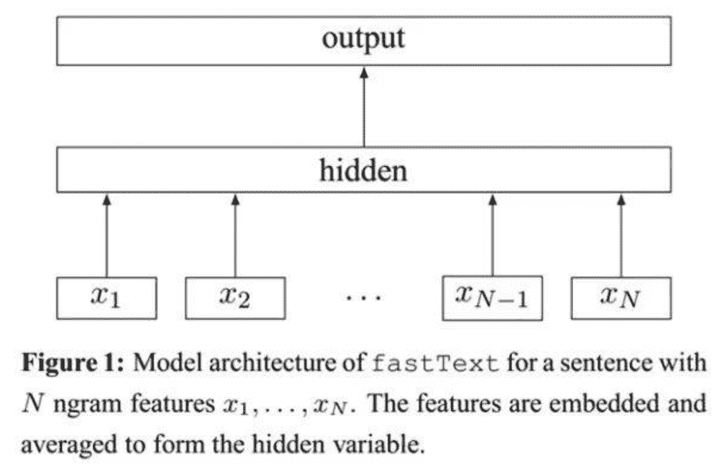
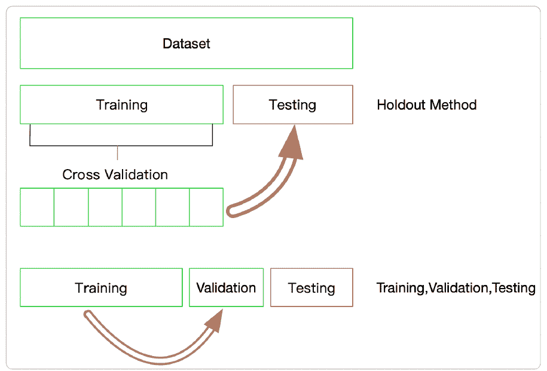

↑↑↑关注后"星标"Datawhale

每日干货 & [每月组队学习](https://mp.weixin.qq.com/mp/appmsgalbum?__biz=MzIyNjM2MzQyNg%3D%3D&action=getalbum&album_id=1338040906536108033#wechat_redirect)，不错过

 Datawhale干货 

**作者：罗美君，算法工程师，Datawhale优秀学习者**

在[基于机器学习的文本分类](http://mp.weixin.qq.com/s?__biz=MzIyNjM2MzQyNg%3D%3D&chksm=e8734978df04c06e1f6ff58f47e057273d60b94a2765095c6f299fc74e72c9d2e4072900ce96&idx=1&mid=2247522357&scene=21&sn=1ad874536eb9bbf9c7173336a3cf86e4#wechat_redirect)中，我们介绍了几种常见的文本表示方法：One-hot、Bags of Words、N-gram、TF-IDF。这些方法存在两个共同的问题：一是转换得到的向量维度很高，需要较长的训练实践；二是没有考虑到单词与单词之间的关系，只是进行了统计。

与上述表示方法不同，深度学习也可以用于文本表示，并可以将其映射到一个低维空间。fastText是Facebook2016年提出的文本分类工具，是一种高效的浅层网络。今天我们就尝试使用fastText模型进行文本分类。

## 1\. 数据及背景

https://tianchi.aliyun.com/competition/entrance/531810/information（阿里天池-零基础入门NLP赛事）

## 2\. fastText模型剖析

### 2.1 概念

FastText是一种典型的深度学习词向量的表示方法，它的核心思想是将整篇文档的词及n-gram向量叠加平均得到文档向量，然后使用文档向量做softmax多分类。这中间涉及到两个技巧：字符级n-gram特征的引入以及分层Softmax分类。

### 2.2 模型框架

fastText模型架构和word2vec的CBOW模型架构非常相似。下面是fastText模型架构图：



注意：此架构图没有展示词向量的训练过程。可以看到，和CBOW一样，fastText模型也只有三层：输入层、隐含层、输出层（Hierarchical Softmax），输入都是多个经向量表示的单词，输出都是一个特定的target，隐含层都是对多个词向量的叠加平均。

不同的是，CBOW的输入是目标单词的上下文，fastText的输入是多个单词及其n-gram特征，这些特征用来表示单个文档；CBOW的输入单词被onehot编码过，fastText的输入特征是被embedding过；CBOW的输出是目标词汇，fastText的输出是文档对应的类标。

值得注意的是，fastText在输入时，将单词的字符级别的n-gram向量作为额外的特征；在输出时，fastText采用了分层Softmax，大大降低了模型训练时间。

### 2.3 字符级别的n-gram

word2vec把语料库中的每个单词当成原子的，它会为每个单词生成一个向量。这忽略了单词内部的形态特征，比如："apple" 和"apples"，"达观数据"和"达观"，这两个例子中，两个单词都有较多公共字符，即它们的内部形态类似，但是在传统的word2vec中，这种单词内部形态信息因为它们被转换成不同的id丢失了。

为了克服这个问题，fastText使用了字符级别的n-grams来表示一个单词。对于单词"apple"，假设n的取值为3，则它的trigram有:

> "<ap",  "app",  "ppl",  "ple", "le>"

其中，<表示前缀，>表示后缀。于是，我们可以用这些trigram来表示"apple"这个单词，进一步，我们可以用这5个trigram的向量叠加来表示"apple"的词向量。

这带来两点好处：

*   对于低频词生成的词向量效果会更好。因为它们的n-gram可以和其它词共享。

*   对于训练词库之外的单词，仍然可以构建它们的词向量。我们可以叠加它们的字符级n-gram向量。

### 2.4 分层softmax

fastText的结构：

1.  文本分词后排成列做输入。

2.  lookup table变成想要的隐层维数。

3.  隐层后接huffman Tree。这个tree就是分层softmax减少计算量的精髓。

## 3\. 简单实现fastText

为了简化任务：

1.  训练词向量时，我们使用正常的word2vec方法，而真实的fastText还附加了字符级别的n-gram作为特征输入；

2.  我们的输出层使用简单的softmax分类，而真实的fastText使用的是Hierarchical Softmax。

首先定义几个常量：

*   VOCAB_SIZE = 2000

*   EMBEDDING_DIM =100

*   MAX_WORDS = 500

*   CLASS_NUM = 5

*   VOCAB_SIZE表示词汇表大小，这里简单设置为2000；

EMBEDDING_DIM表示经过embedding层输出，每个词被分布式表示的向量的维度，这里设置为100。比如对于“达观”这个词，会被一个长度为100的类似于[ 0.97860014, 5.93589592, 0.22342691, -3.83102846, -0.23053935, …]的实值向量来表示；

MAX_WORDS表示一篇文档最多使用的词个数，因为文档可能长短不一（即词数不同），为了能feed到一个固定维度的神经网络，我们需要设置一个最大词数，对于词数少于这个阈值的文档，我们需要用“未知词”去填充。比如可以设置词汇表中索引为0的词为“未知词”，用0去填充少于阈值的部分；

CLASS_NUM表示类别数，多分类问题，这里简单设置为5。

模型搭建遵循以下步骤：

1.  添加输入层（embedding层）。Embedding层的输入是一批文档，每个文档由一个词汇索引序列构成。例如：[10, 30, 80, 1000] 可能表示“我 昨天 来到 达观数据”这个短文本，其中“我”、“昨天”、“来到”、“达观数据”在词汇表中的索引分别是10、30、80、1000；Embedding层将每个单词映射成EMBEDDING_DIM维的向量。于是：input_shape=(BATCH_SIZE, MAX_WORDS), output_shape=(BATCH_SIZE,MAX_WORDS, EMBEDDING_DIM)；

2.  添加隐含层（投影层）。投影层对一个文档中所有单词的向量进行叠加平均。keras提供的GlobalAveragePooling1D类可以帮我们实现这个功能。这层的input_shape是Embedding层的output_shape，这层的output_shape=( BATCH_SIZE, EMBEDDING_DIM)；

3.  添加输出层（softmax层）。真实的fastText这层是Hierarchical Softmax，因为keras原生并没有支持Hierarchical Softmax，所以这里用Softmax代替。这层指定了CLASS_NUM，对于一篇文档，输出层会产生CLASS_NUM个概率值，分别表示此文档属于当前类的可能性。这层的output_shape=(BATCH_SIZE, CLASS_NUM)

4.  指定损失函数、优化器类型、评价指标，编译模型。损失函数我们设置为categorical_crossentropy，它就是我们上面所说的softmax回归的损失函数；优化器我们设置为SGD，表示随机梯度下降优化器；评价指标选择accuracy，表示精度。

用训练数据feed模型时，你需要：

1.  将文档分好词，构建词汇表。词汇表中每个词用一个整数（索引）来代替，并预留“未知词”索引，假设为0；

2.  对类标进行onehot化。假设我们文本数据总共有3个类别，对应的类标分别是1、2、3，那么这三个类标对应的onehot向量分别是[1, 0,0]、[0, 1, 0]、[0, 0, 1]；

3.  对一批文本，将每个文本转化为词索引序列，每个类标转化为onehot向量。就像之前的例子，“我 昨天 来到 达观数据”可能被转化为[10, 30, 80, 1000]；它属于类别1，它的类标就是[1, 0, 0]。由于我们设置了MAX_WORDS=500，这个短文本向量后面就需要补496个0，即[10, 30, 80, 1000, 0, 0, 0, …, 0]。因此，batch_xs的 维度为( BATCH_SIZE,MAX_WORDS)，batch_ys的维度为（BATCH_SIZE, CLASS_NUM）。

代码如下：

```
# coding: utf-8
from __future__ import unicode_literals

from keras.models import Sequential
from keras.layers import Embedding
from keras.layers import GlobalAveragePooling1D
from keras.layers import Dense

VOCAB_SIZE = 2000
EMBEDDING_DIM = 100
MAX_WORDS = 500
CLASS_NUM = 5

def build_fastText():
    model = Sequential()
    # 将词汇数VOCAB_SIZE映射为EMBEDDING_DIM维
    model.add(Embedding(VOCAB_SIZE, EMBEDDING_DIM, input_length=MAX_WORDS))
    # 平均文档中所有词的embedding
    model.add(GlobalAveragePooling1D())
    # softmax分类
    model.add(Dense(CLASS_NUM, activation='softmax'))
    # 定义损失函数、优化器、分类度量指标
    model.compile(loss='categorical_crossentropy', optimizer='SGD', metrics=['accuracy'])
    return model

if __name__ == '__main__':
    model = build_fastText()
    print(model.summary()) 
```

## 4\. 使用fastText文本分类

### 4.1 加载库

```
import time
import numpy as np
import fasttext
import pandas as pd

from sklearn.metrics import f1_score
from sklearn.utils import shuffle
from sklearn.model_selection import StratifiedKFold 
```

### 4.2 fastText分类

主要超参数：

*   lr: 学习率

*   dim: 词向量的维度

*   epoch: 每轮的个数

*   wordNgrams: 词的n-gram，一般设置为2或3

*   loss: 损失函数 ns(negative sampling, 负采样)、hs(hierarchical softmax, 分层softmax)、softmax、ova(One-VS-ALL)

```
def fasttext_model(nrows, train_num, lr=1.0, wordNgrams=2, minCount=1, epoch=25, loss='hs', dim=100):
    start_time = time.time()

    # 转换为FastText需要的格式
    train_df = pd.read_csv('../input/train_set.csv', sep='\t', nrows=nrows)

    # shuffle
    train_df = shuffle(train_df, random_state=666)

    train_df['label_ft'] = '__label__' + train_df['label'].astype('str')
    train_df[['text', 'label_ft']].iloc[:train_num].to_csv('../input/fastText_train.csv', index=None, header=None, sep='\t')

    model = fasttext.train_supervised('../input/fastText_train.csv', lr=lr, wordNgrams=wordNgrams, verbose=2, 
                                      minCount=minCount, epoch=epoch, loss=loss, dim=dim)

    train_pred = [model.predict(x)[0][0].split('__')[-1] for x in train_df.iloc[:train_num]['text']]
    print('Train f1_score:', f1_score(train_df['label'].values[:train_num].astype(str), train_pred, average='macro'))
    val_pred = [model.predict(x)[0][0].split('__')[-1] for x in train_df.iloc[train_num:]['text']]
    print('Val f1_score:', f1_score(train_df['label'].values[train_num:].astype(str), val_pred, average='macro'))
    train_time = time.time()
    print('Train time: {:.2f}s'.format(train_time - start_time))

     # 预测并保存
    test_df = pd.read_csv('../input/test_a.csv')

    test_pred = [model.predict(x)[0][0].split('__')[-1] for x in test_df['text']]
    test_pred = pd.DataFrame(test_pred, columns=['label'])
    test_pred.to_csv('../input/test_fastText_ridgeclassifier.csv', index=False)
    print('Test predict saved.')
    end_time = time.time()
    print('Predict time:{:.2f}s'.format(end_time - train_time))

if __name__ == '__main__':  
    nrows = 200000
    train_num = int(nrows * 0.7)
    lr=0.01
    wordNgrams=2
    minCount=1
    epoch=25
    loss='hs'

    fasttext_model(nrows, train_num) 
```

结果:

```
Train f1_score: 0.998663548149514
Val f1_score: 0.911468448971427
Train time: 257.32s
Test predict saved.
Predict time:13.40s 
```

### 4.3 K折交叉验证

### 在使用FastText中，有一些模型的参数需要选择，这些参数会在一定程度上影响模型的精度，那么如何选择这些参数呢？有两种方式：

*   通过阅读文档，要弄清楚这些参数的含义，哪些参数会增加模型的复杂度；

*   通过在验证集上进行验证模型精度，找到模型是否过拟合或欠拟合。



这里我们采用第二种方法，用K折交叉验证的思想进行参数调节。注意：每折的划分必须保证标签的分布与整个数据集的分布一致。

```
models = []
scores = []
pred_list = []

# K折交叉验证
skf = StratifiedKFold(n_splits=n_splits, shuffle=True, random_state=666)
for train_index, test_index in skf.split(train_df['text'], train_df['label_ft']):

    train_df[['text', 'label_ft']].iloc[train_index].to_csv('../input/fastText_train.csv', index=None, header=None, sep='\t')

    model = fasttext.train_supervised('../input/fastText_train.csv', lr=lr, wordNgrams=wordNgrams, verbose=2, 
                                          minCount=minCount, epoch=epoch, loss=loss)
    models.append(model)

    val_pred = [model.predict(x)[0][0].split('__')[-1] for x in train_df.iloc[test_index]['text']]
    score = f1_score(train_df['label'].values[test_index].astype(str), val_pred, average='macro')
    print('score', score)
    scores.append(score)

print('mean score: ', np.mean(scores))
train_time = time.time()
print('Train time: {:.2f}s'.format(train_time - start_time)) 
```

所有代码

```
def fasttext_kfold_model(nrows, train_num, n_splits, lr=1.0, wordNgrams=2, minCount=1, epoch=25, loss='hs', dim=100):
    start_time = time.time()

    # 转换为FastText需要的格式
    train_df = pd.read_csv('../input/train_set.csv', sep='\t', nrows=nrows)

    # shuffle
    train_df = shuffle(train_df, random_state=666)

    train_df['label_ft'] = '__label__' + train_df['label'].astype('str')

    models = []
    train_scores = []
    val_scores = []

    # K折交叉验证
    skf = StratifiedKFold(n_splits=n_splits, shuffle=True, random_state=666)
    for train_index, test_index in skf.split(train_df['text'], train_df['label_ft']):
        train_df[['text', 'label_ft']].iloc[train_index].to_csv('../input/fastText_train.csv', index=None, header=None, sep='\t')

        model = fasttext.train_supervised('../input/fastText_train.csv', lr=lr, wordNgrams=wordNgrams, verbose=2, 
                                          minCount=minCount, epoch=epoch, loss=loss)
        models.append(model)

        train_pred = [model.predict(x)[0][0].split('__')[-1] for x in train_df.iloc[train_index]['text']]
        train_score = f1_score(train_df['label'].values[train_index].astype(str), train_pred, average='macro')
        # print('Train length: ', len(train_pred))
        print('Train score: ', train_score)
        train_scores.append(train_score)

        val_pred = [model.predict(x)[0][0].split('__')[-1] for x in train_df.iloc[test_index]['text']]
        val_score = f1_score(train_df['label'].values[test_index].astype(str), val_pred, average='macro')
        # print('Val length: ', len(val_pred))
        print('Val score', val_score)
        val_scores.append(val_score)

    print('mean train score: ', np.mean(train_scores))
    print('mean val score: ', np.mean(val_scores))
    train_time = time.time()
    print('Train time: {:.2f}s'.format(train_time - start_time))

    return models

def fasttext_kfold_predict(models, n_splits):

    pred_list = []

    start_time = time.time()
    # 预测并保存
    test_df = pd.read_csv('../input/test_a.csv')

    # 消耗时间较长
    for model in models:
        test_pred = [model.predict(x)[0][0].split('__')[-1] for x in test_df['text']]
        pred_list.append(test_pred)

    test_pred_label = pd.DataFrame(pred_list).T.apply(lambda row: np.argmax(np.bincount([row[i] for i in range(n_splits)])), axis=1)
    test_pred_label.columns='label'

    test_pred_label.to_csv('../input/test_fastText_ridgeclassifier.csv', index=False)
    print('Test predict saved.')
    end_time = time.time()
    print('Predict time:{:.2f}s'.format(end_time - start_time))

if __name__ == '__main__':
  nrows = 200000
  train_num = int(nrows * 0.7)
  n_splits = 3
  lr=0.1
  wordNgrams=2
  minCount=1
  epoch=25
  loss='hs'
  dim=200

    """
    Train score:  0.9635013320936988
    Val score 0.9086640111428032
    Train score:  0.9623510782430645
    Val score 0.9094998879044359
    Train score:  0.9628121318772955
    Val score 0.9096191534698315
    mean train score:  0.9628881807380196
    mean val score:  0.9092610175056901
    Train time: 740.60s
    """   

    models = fasttext_kfold_model(nrows, train_num, n_splits, lr=lr, wordNgrams=wordNgrams, minCount=minCount, epoch=epoch, loss=loss, dim=dim)
    fasttext_kfold_predict(models, n_splits=n_splits) 
```

K折交叉验证能增加模型的稳定性，尤其时间有限，验证的结果仅达0.909，有时间的朋友可以调整超参数，获得更高的准确率。

*本文电子版 后台回复 **文本分类****获取*


“干货学习，**点****赞****三连**↓