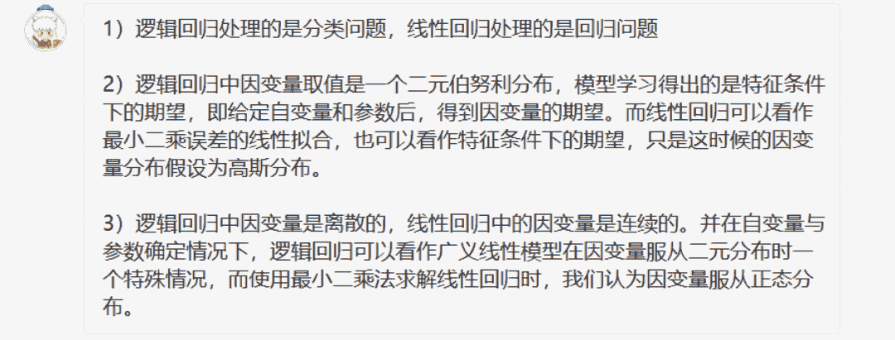
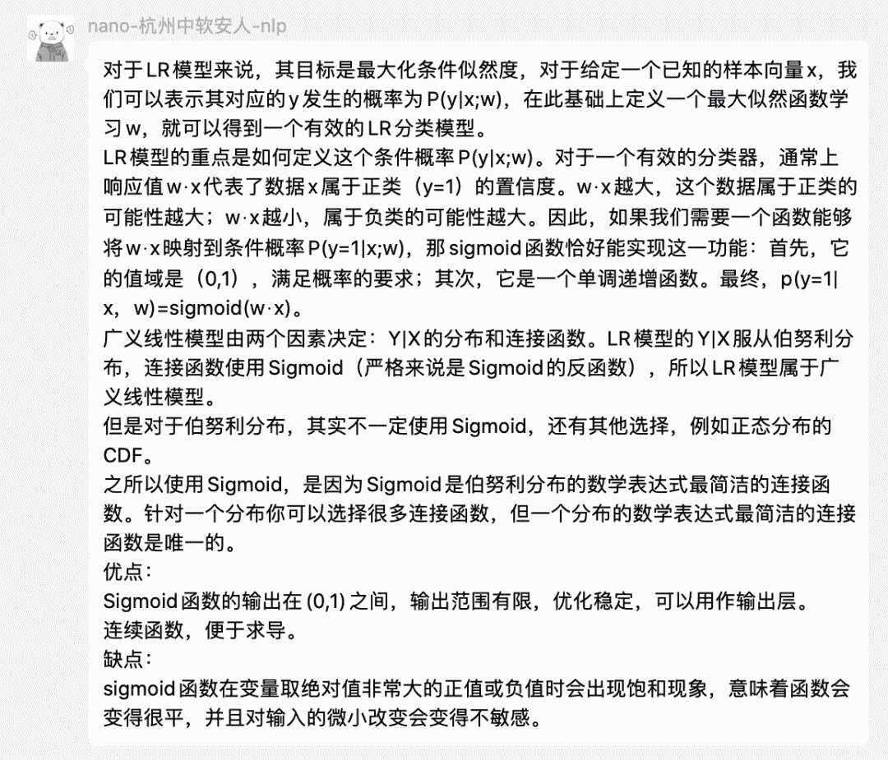

↑↑↑关注后"星标"Datawhale

每日干货 & [每月组队学习](https://mp.weixin.qq.com/mp/appmsgalbum?__biz=MzIyNjM2MzQyNg%3D%3D&action=getalbum&album_id=1338040906536108033#wechat_redirect)，不错过

 Datawhale干货 

**来源：Datawhale优秀回答者**

## 将在留言区，Datawhale高校群和Datawhale在职群评选优秀回答者，同时会邀请加入Datawhale优秀回答者群，认识更多优秀伙伴。

## 每日一问（决策树算法）

1\. 用自己的理解讲讲决策树算法？（必知必会）

2.决策树如何防止过拟合？（面试真题）

## 优秀汇总（逻辑回归算法）

1\. 逻辑回归和线性回归的区别是什么？

优秀回答者：

@王茂霖  @橡魚  @jukky   @胡洋  @傅科摆

最优秀回答者：@王茂霖  

2\. 逻辑回归算法为什么用sigmoid函数？这个函数有什么优点和缺点？

优秀回答者：

@nano  @成哥仔  @胡洋  @赵世博  @丁洋

最优秀回答者：

@nano-杭州中软安人  Datawhale在职群9

后台回复 **在校** 或 **在职**，一起学习

“留言学习，点赞三连↓