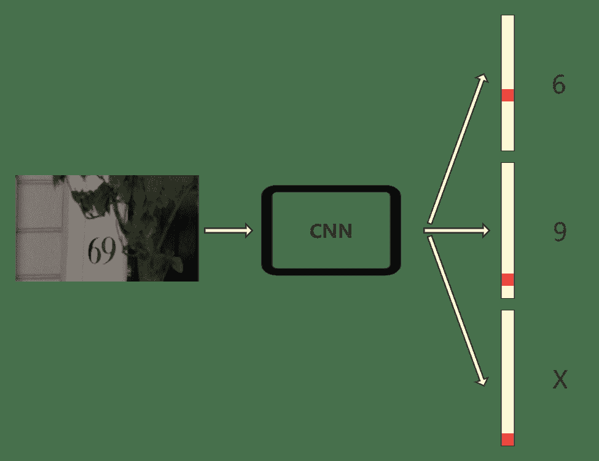
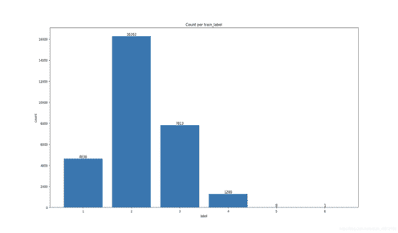
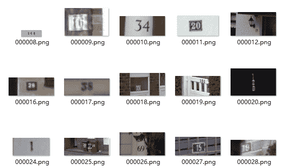
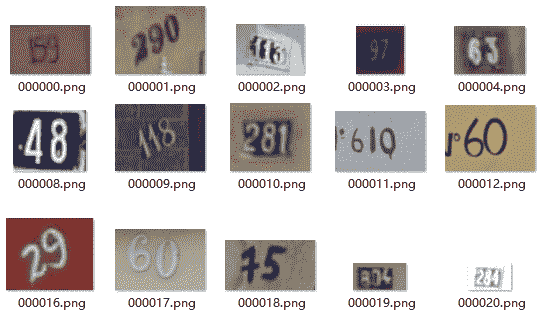

↑↑↑关注后"星标"Datawhale

每日干货 & [每月组队学习](https://mp.weixin.qq.com/mp/appmsgalbum?__biz=MzIyNjM2MzQyNg%3D%3D&action=getalbum&album_id=1338040906536108033#wechat_redirect)，不错过

 Datawhale干货 

**作者：安晟，算法工程师，Datawhale成员**

赛题数据及背景

https://tianchi.aliyun.com/competition/entrance/531795/introduction（阿里天池-零基础入门CV赛事）

本文分为以下几部分：

*   如何优化官方baseline的效果？

*   其它解题思路的整理和分析

*   字符级目标检测的优化技巧整理

在这里要特别感谢多位前排选手对于比赛技巧的无私分享，那么不多bb，下面直接进入正题

## 一、如何优化官方baseline的效果？

本次入门赛的官方baseline入门材料，已经提供了完整的实践思路:Task1 赛题理解<sup>[1]</sup>、Task2 数据读取与数据扩增<sup>[2]</sup>、Task3 字符识别模型<sup>[3]</sup>、Task4 模型训练与验证<sup>[4]</sup>、Task5 模型集成<sup>[5]</sup>，本质上，baseline的思路就是将赛题转换为了一个定长的字符识别问题，用包含多个输出的分类问题来进行求解。



### 1.1 改进版baseline

那么如何进行进一步优化呢？在比赛进行的过程中，我在天池进行了一次如何调参上分<sup>[6]</sup>的直播分享。

直播对应的代码可以在我们的《动手学CV项目》<sup>[7]</sup>的2.5节找到。

这份代码相当于一个加强版的baseline，简短来说，介绍了以下几点：

*   重新回顾baseline的代码

*   阶段性下降的学习率调整策略

*   分析了很多人提交出0.3-0.4分成绩的原因和解决方案

*   加入数据增强策略

这份代码我相信是帮到了一些刚入门的同学的，提交的成绩大概在0.75分左右。

那么在这样一个baseline的基础上，如何进一步的优化呢？

### 1.2 改进backbone

baseline中我们的网络结构是这样定义的：

```
class SVHN_Model1(nn.Module):
    def __init__(self):
        super(SVHN_Model1, self).__init__()

        model_conv = models.resnet18(pretrained=True)
        model_conv.avgpool = nn.AdaptiveAvgPool2d(1)
        model_conv = nn.Sequential(*list(model_conv.children())[:-1])  # 去除最后一个fc layer
        self.cnn = model_conv

        self.fc1 = nn.Linear(512, 11)
        self.fc2 = nn.Linear(512, 11)
        self.fc3 = nn.Linear(512, 11)
        self.fc4 = nn.Linear(512, 11)
        self.fc5 = nn.Linear(512, 11)

    def forward(self, img):        
        feat = self.cnn(img)
        #print(feat.shape)
        feat = feat.view(feat.shape[0], -1)
        c1 = self.fc1(feat)
        c2 = self.fc2(feat)
        c3 = self.fc3(feat)
        c4 = self.fc4(feat)
        c5 = self.fc5(feat)
        return c1, c2, c3, c4, c5 
```

我们可以对使用的backbone网络进行一系列的改进：

*   由resnet18换为更大的resnet50

*   为每一个分类模块加上一层全连接隐藏层

*   为隐含层添加dropout

由resnet18换为resnet50，更深的模型就拥有更好的表达能力，添加一层隐含层同样起到了增加模型拟合能力的作用，与此同时为隐含层添加dropout来进行一个balance，一定程度上防止过拟合。（这只是我个人对于baseline的改进方案，不一定是最优的）

改进后的模型定义代码如下：

```
class SVHN_Model2(nn.Module):
    def __init__(self):
        super(SVHN_Model2, self).__init__()

        # resnet18
        model_conv = models.resnet18(pretrained=True)
        model_conv.avgpool = nn.AdaptiveAvgPool2d(1)
        model_conv = nn.Sequential(*list(model_conv.children())[:-1])  # 去除最后一个fc layer
        self.cnn = model_conv

        self.hd_fc1 = nn.Linear(512, 128)
        self.hd_fc2 = nn.Linear(512, 128)
        self.hd_fc3 = nn.Linear(512, 128)
        self.hd_fc4 = nn.Linear(512, 128)
        self.hd_fc5 = nn.Linear(512, 128)
        self.dropout_1 = nn.Dropout(0.25)
        self.dropout_2 = nn.Dropout(0.25)
        self.dropout_3 = nn.Dropout(0.25)
        self.dropout_4 = nn.Dropout(0.25)
        self.dropout_5 = nn.Dropout(0.25)
        self.fc1 = nn.Linear(128, 11)
        self.fc2 = nn.Linear(128, 11)
        self.fc3 = nn.Linear(128, 11)
        self.fc4 = nn.Linear(128, 11)
        self.fc5 = nn.Linear(128, 11)

    def forward(self, img):
        feat = self.cnn(img)
        feat = feat.view(feat.shape[0], -1)

        feat1 = self.hd_fc1(feat)
        feat2 = self.hd_fc2(feat)
        feat3 = self.hd_fc3(feat)
        feat4 = self.hd_fc4(feat)
        feat5 = self.hd_fc5(feat)
        feat1 = self.dropout_1(feat1)
        feat2 = self.dropout_2(feat2)
        feat3 = self.dropout_3(feat3)
        feat4 = self.dropout_4(feat4)
        feat5 = self.dropout_5(feat5)

        c1 = self.fc1(feat1)
        c2 = self.fc2(feat2)
        c3 = self.fc3(feat3)
        c4 = self.fc4(feat4)
        c5 = self.fc5(feat5)

        return c1, c2, c3, c4, c5 
```

改进后的模型训起来会慢很多，不过增加了模型的表达力，自然效果也会好一些。此外，你也可以尝试一些更"state-of-the-arts"的模型，比如SENet，EfficientNet等。

### 1.3 数据增强优化

关于数据增强，我们在直播中已经探讨过了，从原理上分析我们更应该用一些基于空间、位置相关的数据增强，比如Randomcrop，平移，旋转等。而颜色空间相关的变换，也可以尝试，但很可能会起到副作用。

数据增强是非常普遍的训练技巧了，肯定要用，但对这个赛题的结果提升不会很显著。关于这部分，这位小伙伴写的比赛实验记录<sup>[8]</sup>对相关的实验进行了很详细的记录，大家感兴趣可以阅读一下~

### 1.4 和文本长度相关的探索

baseline方案将识别问题转化为了定长识别问题，那么定多长合适？就是个值得思考的问题，有的小伙伴通过一个小脚本进行了统计，训练集中的样本的字符长度分别为1,2,3,4,5,6的样本数量分别为4636,16262,7813,1280,8,1。



可以看到，数据集中长度为5和6的图片都是可以忽略不计的，因此主动放弃这部分极少数情况的case可以很好的为模型“减负”，从而获得更好的效果。

baseline模型设定定长len=5，不妨尝试下len=4，会带来进一步的提升。

我们的这个方案需要CNN自己找到文字在图中的位置，还要自己判断出字符的个数并完成正确的识别，感觉上是相当难的任务，之所以能够work是因为场景相对来说比较简单。

如果你做了一些更进一步得分析工作你会发现，模型对于长度不同的图片的效果是不一样的。更详细来说，根据我的训练日志的记录，训练时第3个字符的loss是相对比较小的，而预测时长度为3的图片出现的预测错误是比较多的，主要是漏检。

我分析这是因为（个人观点可能存在误导）：对于输出第一个字符结果的fc layer来说，所有图片它都会参于训练，而输出第二个字符结果的fc layer，只有当图片字符数>=2，它才会参于“有效”训练，以此类推。所以越是对应靠后的fc layer，训练的越不充分，越容易过拟合导致实际效果越差。

因此可以围绕不同长度的图片效果不同来做些文章，依然是这篇比赛实验记录<sup>[9]</sup>

他尝试了两个方案，可供大家参考，提供些思路：

*   损失加权

*   样本加权

其中第二个方案，样本加权看起来是更合理来解决这个问题的，我们可以通过重复采样，提高较长的字符数量的图片出现的比例，来让对应第3个字符和第4个字符对应的输出层训练的更充分。

这是个蛮有新意的角度，你是否还可以碰撞出其它的idea来解决这个问题呢~

### 1.5 集成学习

对于这个比赛来说，比较适合baseline的集成方案是：

首先将单模型尽可能训到最高，然后单模型的输出使用TTA(test time augmentation)，可以大幅提升单模型的预测效果。

然后训练多个有差异化的模型，将多个单模型的预测结果进行投票，得到最终的预测结果。单模型间的差异化可以从数据的角度通过重新划分训练集和验证集来达到，也可以从模型的角度，使用不同的backbone来达到。从原理上讲，单模型间越是独立和具有差异化，融合的效果就越好。

### 1.6 让baseline进入Top 2%的6行代码

最后再偷偷告诉你一个，只需修改6行代码，就能让目前的优化后baseline单模型进入Top 2%的方法。

不知大家有没有发现，测试集相比于训练数据，要更简单。

具体地，体现在测试集最终的分数反而要比验证集高一些，如果你直接观察数据，也可以看出来，测试集的图片中字符在图片中的占比更大，而训练集中图片的字符占比更小。直观感受就是训练数据和测试集对应的场景不一致，训练集的字符感觉更“远”，预处难度也更高。

提示到这里，你可以先停下来思考下，如果是你，会如何来针对这个问题进行优化呢？

验证集图片示例：



测试集图片示例：



对于这个问题，很多人很自然的想到了进行目标检测，这也是几乎所有前排选手的一致选择。但是，我们的baseline就没有一战之力了吗？当然不是，我个人用resnet50作为backbone将单模型的分数训到了0.91，相当于正式赛Top2%的分数，而且因为我没有时间做太多的超参数调整实验，这个成绩也并没有达到baseline的上限。

那么baseline要如何相应的进行改造来解决这个问题呢？

文字描述出来就是：训练时把场景拉近，测试基本保持不变，这样一定程度上让训练和测试的数据的场景更加一致，从而让模型学到的预测能力完全发挥出来。

可以有很多方案来达到这个目的，最简单有效的方法仅仅需要修改数据增强相关的6行代码，我用`TODO`作为后缀标注出来，代码如下：

```
train_loader = torch.utils.data.DataLoader(
    SVHNDataset(train_path, train_label,
                transforms.Compose([
                    transforms.Resize((80, 160)),         # TODO
                    transforms.RandomCrop((64, 128)),     # TODO
                    transforms.ColorJitter(0.3, 0.3, 0.2),
                    transforms.RandomRotation(5),
                    transforms.ToTensor(),
                    transforms.Normalize([0.485, 0.456, 0.406], [0.229, 0.224, 0.225])
    ])),
    batch_size=40,
    shuffle=True,
    num_workers=2,
)
val_loader = torch.utils.data.DataLoader(
    SVHNDataset(val_path, val_label,
                transforms.Compose([
                    transforms.Resize((80, 160)),        # TODO
                    transforms.CenterCrop((64, 128)),    # TODO
                    transforms.ToTensor(),
                    transforms.Normalize([0.485, 0.456, 0.406], [0.229, 0.224, 0.225])
    ])),
    batch_size=40,
    shuffle=False,
    num_workers=2,
)
test_loader = torch.utils.data.DataLoader(
    SVHNDataset(test_path, test_label,
                transforms.Compose([
                    transforms.Resize((68, 136)),        # TODO
                    transforms.RandomCrop((64, 128)),    # TODO
                    transforms.ToTensor(),
                    transforms.Normalize([0.485, 0.456, 0.406], [0.229, 0.224, 0.225])
    ])),
    batch_size=40,
    shuffle=False,
    num_workers=2,
) 
```

这个优化虽然很trick，但是效果显著，大家可以思考下这6行代码的修改是如何带来成绩的巨大提升的。

## 二、不同解题思路的整理与分析

除了baseline的思路以外，还有多种不同的解题思路，这里简单进行总结。

### 2.1 CRNN

纯识别的思路，除了baseline的定长字符识别方案外，还可以用CRNN来做，属于一种端到端的不定长字符识别的解决方案。

关于CRNN，赛事组织者 阿水 已经为我们提供了一个CRNN baseline<sup>[10]</sup>，感谢去可以学习一下~

### 2.2 检测+识别

除了两种端到端的识别方案，还可以引入目标检测来解题，根据具体使用中检测框粒度的不同，还可以细分为三种不同的方案：

方案一：文本行检测+文本行识别

方案二：字符级目标检测+字符识别模型

方案三：纯目标检测方案

根据我最近两周持续对前排选手进行的骚扰+在线乞讨收集到的情报来看，前排选手使用的普遍是方案三，但是方案一、方案二也有人用，而且成绩不差。也就是说，对于这个赛题，从实际结果上看这三个方案上限差不多。

方案一是更标准的字符识别类问题的解决方案，如果我们的问题不是数字之间无关联的门牌号识别，而是比如场景文字识别，那么方案一由于可以对不同字符间的关联进行建模，效果将会显著优于其它方案，但是本赛题这种优势无法发挥出来。

而方案三作为一种端到端的解决方案，思路更直接，整个训练流程更简单，更容易在有限的比赛时间内优化出好的效果，再加上有众多简单好用的开源库，因此也是绝大多数前排选手选择的原因。

## 三、字符级目标检测的优化技巧整理

本文的最后一部分，再针对大家使用最多的字符级目标检测的方案，进行一些简单的整理。

网络框架选择方面，前排普遍采用的是YOLOv3-v5的版本，还有一位选手使用的CenterNet获得了非常好的效果。

除了模型训练的各种小的trick以外，如何对模型结果进行后处理，以及如何融合多个模型的结果，会对最终结果有很大影响。关于这部分，众多选手都在天池的论坛热心分享了自己的经验，细节太多很难一一列举，我也有很多要学习的地方，这里就不班门弄斧了，感兴趣的小伙伴赶快去学习吧~ 分别包括：

天池街景字符识别总结<sup>[11]</sup>、第五名 yolov4 加 投票法方案<sup>[12]</sup>、街景字符编码识别-第6名 线上0.938 方案分享<sup>[13]</sup>、yolov5加全局nms 第八名方案分享<sup>[14]</sup>、零基础入门CV赛事-分享一些适合新手的0.92+的上分技巧吧<sup>[15]</sup>、真正零基础，单模型非融合，上93的最简单技巧<sup>[16]</sup>、参赛历程以及方案分享<sup>[17]</sup>、零基础CV赛--街景字符识别，小小白分享，从0.002~0.926<sup>[18]</sup>

* * *

写在最后

如果觉得有收获，可否给我们的《动手学CV项目》<sup>[7]</sup>项目点个star呢，我的老火鸡~

（小声叨叨，目前项目只更新了两章，但大家天天私信催我的目标检测的入门教程已经在做了）

**本文PDF*后台回复 ******上分 ******下载*


### 参考资料

[1]

赛题理解: *https://tianchi.aliyun.com/notebook-ai/detail?spm=5176.12586969.1002.21.2ce879dekK1l1d&postId=108659*

[2]

数据读取与数据扩增: *https://tianchi.aliyun.com/notebook-ai/detail?spm=5176.12586969.1002.6.2ce879dekK1l1d&postId=108150*

[3]

字符识别模型: *https://tianchi.aliyun.com/notebook-ai/detail?spm=5176.12586969.1002.3.2ce879dekK1l1d&postId=108711*

[4]

模型训练与验证: *https://tianchi.aliyun.com/notebook-ai/detail?spm=5176.12586969.1002.18.2ce879dekK1l1d&postId=108780*

[5]

模型集成: *https://tianchi.aliyun.com/notebook-ai/detail?spm=5176.12586969.1002.24.2ce879dekK1l1d&postId=108656*

[6]

如何调参上分: *https://tianchi.aliyun.com/course/video?spm=5176.12586971.1001.1.11be79delsbf6G&liveId=41169*

[7]

动手学CV项目: *https://github.com/datawhalechina/dive-into-cv-pytorch*

[8]

比赛实验记录之数据增强: *https://github.com/tiantianheheaa1995/tianchi_CV_SVHN?spm=5176.12282029.0.0.45b24adcxaghR6*

[9]

比赛实验记录之定长识别问题: *https://github.com/tiantianheheaa1995/tianchi_CV_SVHN?spm=5176.12282029.0.0.45b24adcxaghR6*

[10]

CRNN-baseline: *https://tianchi.aliyun.com/notebook-ai/detail?spm=5176.12586969.1002.12.2ce879deix0lKP&postId=111274*

[11]

天池街景字符识别总结: *https://tianchi.aliyun.com/forum/postDetail?spm=5176.12586969.1002.36.2ce879deix0lKP&postId=118992*

[12]

第五名 yolov4 加 投票法方案: *https://tianchi.aliyun.com/notebook-ai/detail?spm=5176.12586969.1002.30.2ce879deix0lKP&postId=118791*

[13]

街景字符编码识别-第6名 线上0.938 方案分享: *https://tianchi.aliyun.com/notebook-ai/detail?spm=5176.12586969.1002.42.2ce879deix0lKP&postId=118810*

[14]

yolov5加全局nms 第八名方案分享: *https://tianchi.aliyun.com/notebook-ai/detail?spm=5176.12586969.1002.27.2ce879deiwn8Cw&postId=116822*

[15]

零基础入门CV赛事-分享一些适合新手的0.92+的上分技巧吧: *https://tianchi.aliyun.com/notebook-ai/detail?spm=5176.12586969.1002.36.2ce879deiwn8Cw&postId=116724*

[16]

真正零基础，单模型非融合，上93的最简单技巧: *https://tianchi.aliyun.com/notebook-ai/detail?spm=5176.12586969.1002.27.2ce879deix0lKP&postId=118780*

[17]

参赛历程以及方案分享: *https://tianchi.aliyun.com/notebook-ai/detail?spm=5176.12586969.1002.33.2ce879deix0lKP&postId=118799*

[18]

零基础CV赛--街景字符识别，小小白分享，从0.002~0.926: *https://tianchi.aliyun.com/notebook-ai/detail?spm=5176.12586969.1002.48.2ce879deix0lKP&postId=118789*

“整理不易，**点****赞**三连↓