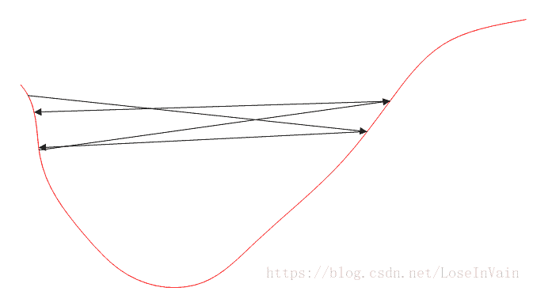
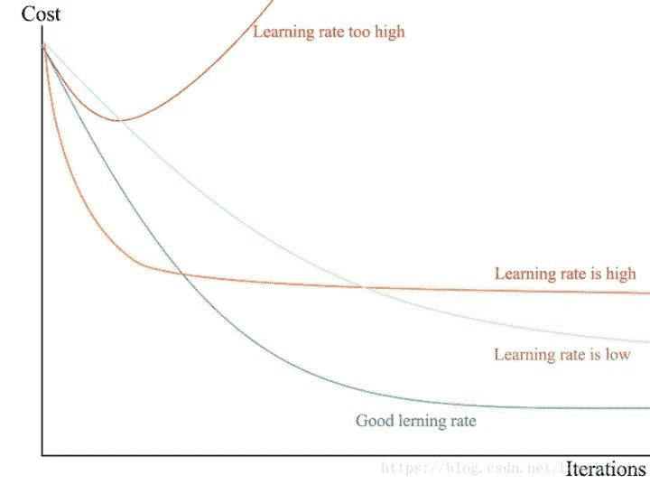
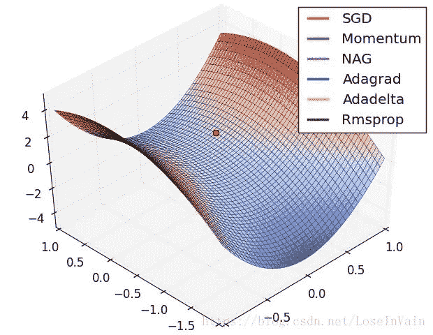
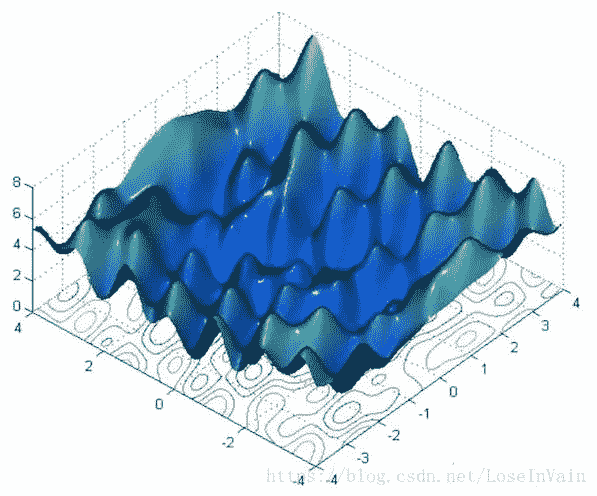
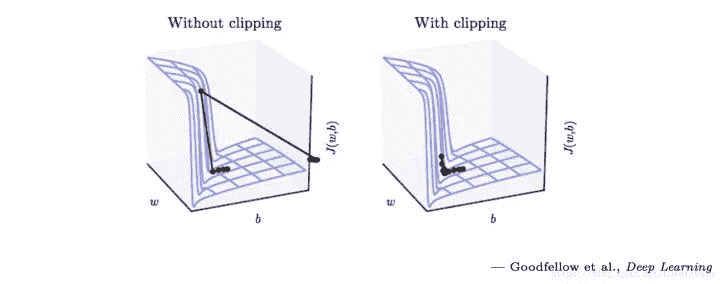
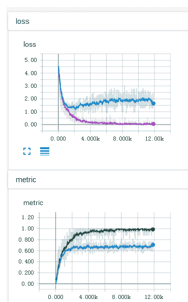
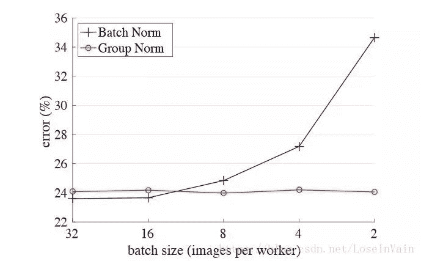
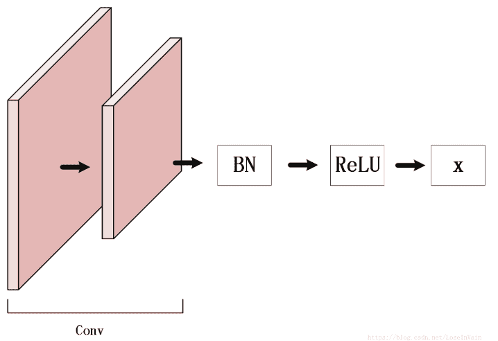
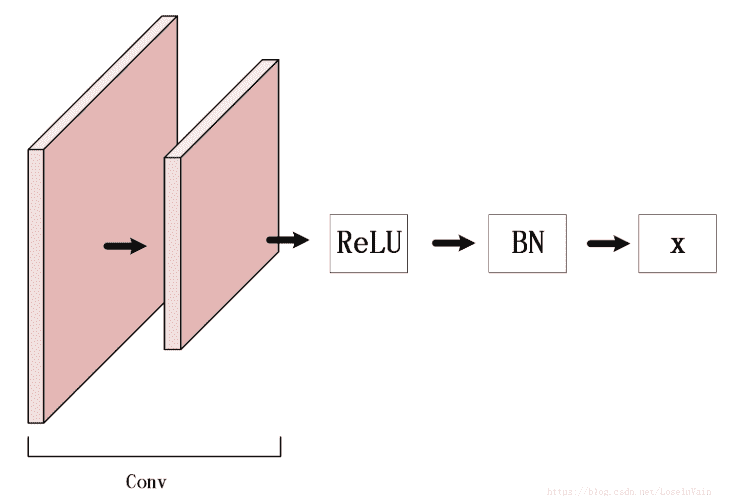

↑↑↑关注后"星标"Datawhale

每日干货 & [每月组队学习](https://mp.weixin.qq.com/mp/appmsgalbum?__biz=MzIyNjM2MzQyNg%3D%3D&action=getalbum&album_id=1338040906536108033#wechat_redirect)，不错过

 Datawhale干货 

作者：土豆@知乎，来源：极市平台

* * *

原文丨https://zhuanlan.zhihu.com/p/158739701

## **前言**

接触深度学习也有一两年了，一直没有将一些实战经验整理一下形成文字。本文打算用来记录一些**在深度学习实践中的调试过程**，记录一些经验之谈。因为目前深度学习业界的理论基础尚且薄弱，很多工程实践中的问题没法用理论解释得很好，这里的只是实践中的一些经验之谈，以供参考以及排错。本文将持续更新。

需要强调的是，本文的很多单纯只是经验，在尽可能列出参考文献的同时却并无严格理论验证，希望大家见谅。欢迎大家集思广益，共同维护这个经验集，为整个社区贡献微弱力量。

## **1、在分类问题中，损失函数及其快速得下降为0.0000**

在分类问题中，我们一般采用的是交叉熵[1]作为损失函数，如式(1.1)所示

其中 和 是预测结果，以概率分布的形式表达，如 等，一般是通过softmax层实现， 和 是样本真实标签，在单分类问题中，采用的是独热编码[2]，只有一个分量是为1的，如 。（公式第二行是向量化表达）

**我们发现，交叉熵损失的下确界是0，但是永远都不可能达到0**，因为要达到0，那么所有的预测向量分布就必须完全和真实标签一致，退化为独热编码。但是实际上在神经网络中，经过了softmax层之后，是不可能使得除了目标分量的其他所有分量为0的（这个这里只是抛出了结论，讨论需要比较长的篇幅。），因此永远不可能达到0的，正是因为如此，交叉熵损失可以一直优化，这也是其比MSE损失优的一个点之一。

既然注意到了不可能为0，我们就可以分析，这肯定是自己程序问题，我们将经过softmax之前的logit打印出，如：

发现了没有，这些值都很大，而softmax函数为:

我们会发现，过大或者过小的指数项，比如1023，会涉及到计算 ，这个数值在TensorFlow或者大部分框架中是溢出的，显示为inf，因此就会把该分量拉成1，而其他变成了0。这种操作是会导致严重的过拟合的。因此，一般来说，logit值不能太大，否则将会出现数值计算问题。

**那么如何解决？** 出现这种问题的情况很多时候是因为**参数初始化**导致的数值计算问题，比如都采用了方差过小的高斯分布进行初始化，那么就会把网络的输出的范围拉的特别大，导致以上的问题。因此在参数初始化中，确保每一层的初始化都是在一定范围内的，可以考虑采用Xavier初始化，Kaiming初始化等。（这个初始化的影响我们将会以后讨论，这是一个新的话题。）

## **2、在正则化的过程中对神经网络的偏置也进行了正则**

一般来说，我们常用的是二范数正则，也即是岭回归，如式子(2.1)

一般来说，我们只会对神经网络的**权值**进行正则操作，使得权值具有一定的稀疏性[21]或者控制其尺寸，使得其不至于幅度太大[3]，减少模型的容量以减少过拟合的风险。同时，我们注意到神经网络中每一层的权值的作用是**调节每一层超平面的方向**（因为 就是其法向量），因此只要比例一致，不会影响超平面的形状的。但是，我们必须注意到，每一层中的偏置是**调节每一层超平面的平移长度的**，如果你对偏置进行了正则，那么我们的 可能就会变得很小，或者很稀疏，这样就导致你的每一层的超平面只能局限于很小的一个范围内，使得模型的容量大大减少，一般会导致欠拟合[7]的现象。

**因此，一般我们不会对偏置进行正则的，注意了。**

## **3、学习率太大导致不收敛**

不收敛是个范围很大的问题，有很多可能性，其中有一种是和网络结构无关的原因，就是学习率设置的太大了，如下图所示，太大的学习率将会导致严重的抖动，使得无法收敛，**甚至在某些情况下可能使得损失变得越来越大直到无穷**。这个时候请调整你的学习率，尝试是否可以收敛。当然，这里的“太大”目前没有理论可以衡量，不过我喜欢从 的Adam优化器[4]开始进行尝试优化。



下图展示了过大过小的学习率对模型性能的影响曲线图：



## **4、别在softmax层前面的输入施加了激活函数**

softmax函数如式(4.1)所示：

假设我们的网络提取出来的最后的特征向量是 ，如果我们最后的分类的类别有 类，那么我们会用一个全连接层将其映射到对应维度的空间里面，如式(4.2)。

那么，这个全连接层虽然说可以看成是分类器，但是我们最好把它看成是上一层的“近线性可分特征”的一个维度转换（有点绕，意思是我们这里只是一个维度的转换，而不涉及到kernel），不管怎么说，这个时候，我们的输出是不能有激活函数的，如下式是**不可以的**：

<svg xmlns="http://www.w3.org/2000/svg" style="-webkit-overflow-scrolling: touch;vertical-align: -0.566ex;min-width: 47.09ex;width: 100%;height: 2.262ex;max-width: 200% !important;"><g stroke="currentColor" fill="currentColor" stroke-width="0" transform="matrix(1 0 0 -1 0 0) scale(0.019532) translate(0, -750)"><g><g transform="translate(2856, 0) translate(-2856, 0)"><g transform="translate(0, 750) matrix(1 0 0 -1 0 0) scale(51.2)"><svg viewBox="-2856 -750 20813.8 1000" style="-webkit-overflow-scrolling: touch;max-width: 200% !important;"><g transform="matrix(1 0 0 -1 0 0)"><g><g><g transform="translate(7693.9, 0)">为激活函数</g></g></g></g></svg></g></g></g></g></svg>

这时候的输出，具有和分类类别相同的维度，在很多框架中被称之为**logits**值，这个值一般是在实数范围内的，一般不会太大，参考笔记第一点的情况。

## **5、检查原数据输入的值范围**

原始数据输入可能千奇百怪，每个特征维的值范围可能有着数量级上的差别，这个时候如果我们不对数据进行预处理，将会大大增大设计网络的负担。一般来说我们希望输入的数据是中心对齐的，也即是**0均值**的[5]，可以加速网络收敛的速度。同时，我们希望不同维度上的数值范围是一致的，可以采用一些归一化[6]的手段进行处理（这个时候假设每个维度重要性是一样的，比如我们图片的三个通道等）。

## **6、别忘了对你的训练数据进行打乱**

经常，你的训练过程非常完美，能够很好地拟合训练数据，但是在测试过程中确实一塌糊涂，是的，你的模型这个时候过拟合[7]了。这个时候你会检查模型的有效性，不过在进行这一步之前，不妨先检查下你的**数据加载器**(Data Loader)是否是正常设计的。

一般来说，我们的训练数据在训练过程中，每一个epoch[8]中，都是需要进行**打乱**(shuffle)的，很多框架的数据加载器参数列表中都会有这项选项，比如pytorch的DataLoader类[9]。为什么需要打乱呢？那是因为如果不打乱我们的训练数据，我们的模型就有可能学习到训练数据的个体与个体之间特定的排列顺序，而这种排列顺序，在很多情况下是无用的，会导致过拟合的糟糕现象。因此，我们在训练过程中，在每一个epoch训练中都对训练集进行打乱，以确保模型不能“记忆”样本之间的特定排序。这其实也是**正则**的一种手段。

在训练中，大概如：

## **7、一个batch中，label不要全部相同**

这个情况有点类似与笔记的第六点，我们需要尽量给训练过程中人为引入不确定性，这是很多正则手段，包括dropout，stochastic depth等的思路，这样能够有效地减少过拟合的风险。因此，一个batch中，尽量确保你的样本是来自于各个类的（针对分类问题而言），这样你的模型会减少执着与某个类别的概率，减少过拟合风险，同时也会加快收敛速度。

## **8、少用vanilla SGD优化器**

在高维度情况下的优化，其优化平面会出现很多鞍点（既是梯度为0，但却不是极点），通常，鞍点会比局部极值更容易出现（直观感受就是，因为高维度情况下，一个点周围有很多维度，如果是极值点，那么就需要其他所有维度都是朝向同一个方向“弯曲”的，而这个要比鞍点的各个方向“弯曲”的情况可能要小），因此这个时候我们更担心陷于鞍点，而不是局部极小值点（当然局部极小值点也是一个大麻烦，不过鞍点更麻烦）。如果采用普通的SGD优化器，那么就会陷于任何一个梯度为0的点，也就是说，极有可能会陷于鞍点。如果要使用SGD方法，建议使用带有momentum的SGD方法，可以有效避免陷入鞍点的风险。



下图是某个函数的三维曲线图和等高线图，我们可以看到有若干个局部最优点和鞍点，这些点对于vanilla SGD来说是不容易处理的。



## **9、检查各层梯度，对梯度爆炸进行截断**

有些时候，你会发现在训练过程中，你的损失突然变得特别大，或者特别小，这个时候不妨检查下每一层的梯度（用tensorboard的distribution可以很好地检查），很可能是发生了**梯度爆炸**(gradient explosion)的情况，特别是在存在LSTM等时序的网络中，很容易出现这种情况。因此，这个时候我们会用梯度截断进行处理，操作很简单粗暴，就是设置一个阈值，把超过这个阈值的梯度全部拉到这个阈值，如下图所示：



在tensorflow中也提供了相应的API供梯度截断使用[10]，如：

```
tf.clip_by_value(    t,    clip_value_min, # 指定截断最小值    clip_value_max, # 指定截断最大值    name=None) 
```

具体使用见[11]，在应用梯度之前，对梯度截断进行处理。

## **10、检查你的样本label**

有些时候，你的训练过程可以很好地收敛，当使用MSE损失[12]的时候甚至可能达到0.0000的情况。但是，当你把模型拿到测试集中评估的时候，却发现性能极差，仿佛没有训练一样。这是过拟合吗？显然是的，但是这可能并不是你的模型的问题，请检查你的数据加载中训练集的样本标签是否正确对应。

这个问题很白痴，但是却真的很容易在数据加载过程中因为种种原因把label信息和对应样本给混掉。根据文献[13]中的实验，用MSE损失的情况下，就算是你的label完全随机的，和样本一点关系都没有，也可以通过基于SGD的优化算法达到0.0000损失的。**因此，请务必确保你的样本label是正确的。**

## **11、分类问题中的分类置信度问题**

在分类问题中我们一般都是采用的是交叉熵损失，如式子(1.1)所示，在一些实验中，如果我们绘制出训练损失和分类准确度的曲线图，我们可能会有下图这种情况[14]：



其中上图为分类损失，紫色为训练损失，蓝色为测试损失，下图为分类准确度，绿色为训练准确度，蓝色为测试准确度。**我们不难发现一个比较有意思的现象，就是当测试损失开始到最低点，开始向上反弹的时候，其测试准确度却还是上升的，而不是下降。** 这是为什么呢？为什么分类准确度不会顺着分类损失的增大而减少呢？

这个涉及到了分类过程中对某个类的“置信程度”的多少，比如：

模型是对第一类相当确信的，但是在第二种情况：

这对第一类的置信程度就很低了，虽然按照贝叶斯决策，还是会选择第一类作为决策结果。因此这就是导致以上现象的原因，**在那个拐点后面，这个模型对于分类的置信程度其实已经变得很差了，虽然对于准确度而言，其还能分类正确。** 但是这其实正是过拟合的一种表现，模型已经对自己的分类结果不确信了。

## **12、少在太小的批次中使用BatchNorm层**

Batch Normalization[15]，中文译作**批规范化**，在深度学习中是一种加快收敛速度，提高性能的一个利器，其本质和我们对输入的原数据进行0均值单位方差规范化差不多，是以batch为单位，对中间层的输出进行规范化，可以缓和**内部协方差偏移**(Internal Covariate Shift)的现象。其基本公式很简单，如下：

不过这里并不打算对BN进行详细讲解，只是想告诉大家，因为BN操作在训练过程中是对每个batch进行处理的，从每个batch中求得均值和方差才能进行操作。如果你的batch特别小（比如是受限于硬件条件或者网络要求小batch），那么BN层的batch均值和方差可能就会不能很好符合整个训练集的统计特征，导致差的性能。实际上，实验[16]说明了这个关系，当batch小于16时，性能大幅度下降。



**因此，少在太小的batch中使用BN层，如果实在要使用，在发生性能问题时优先检查BN层。**

## **13、数值计算问题，出现Nan**

Nan(Not An Number)是一个在数值计算中容易出现的问题，在深度学习中因为涉及到很多损失函数，有些损失函数的定义域并不是整个实数，比如常用的对数，因此一不小心就会出现Nan。在深度学习中，如果某一层出现了Nan，那么是具有传递性的，后面的层也会出现Nan，因此可以通过**二分法**对此进行排错。

一般来说，在深度学习中出现Nan是由于除0异常或者是因为损失函数中的（比如交叉熵，KL散度）对数操作中，输入小于或者等于0了，一般等于0的情况比较多，因此通常会：

这里的 是个很小的值，一般取 即可，可以防止因为对数操作中输入0导致的Nan异常。

**需要注意的是，有些时候因为参数初始化或者学习率太大也会导致数值计算溢出，这也是会出现Nan的，一般这样会出现在较前面的层里面。**

## **14、BN层放置的位置问题**

BN层有两种常见的放置位置，如下图所示：**第一个是放在激活函数之前：**



**第二个是放在激活函数之后：**



在原始BN的论文[15]中，Batch Norm(BN)层是位于激活层之前的，因为是对原始的，未经过激活的logit数据进行数据分布的重整。然而，不少实验证实似乎BN层放在**激活层之后效果会更好**，这个原因目前不明。**Update 2020/5/18**: 在新的文献[28]中，作者尝试解释了以下BN用法的原因，有兴趣的读者可以移步去细读下。

**传统用法:**

```
graph LR   weights --> BatchNorm   BatchNorm --> ReLU 
```

**[28]的作者提出的用法：**

```
graph LR   ReLU --> BatchNorm+dropout 	BatchNorm+dropout --> weights 
```

## **15、dropout层应用在卷积层中可能导致更差的性能**

dropout[19]是hinton大神与2012年提出的一种神经网络正则手段，其可以简单解释为**在训练过程中，按一定概率让神经网络中的某些神经元输出为0**，其原因可以有几个解释，一个是作为一种集成模型进行解释，另一个可以看成是在特征提取学习过程中给数据加入噪声，可以看成是一种数据增强的正则手段。

在原始论文中，dropout被应用于全连接层中，而没有应用在卷积层中，Hinton的解释是因为卷积层参数并不多，过拟合风险较小不适合采用dropout这种大杀器的正则手段。有人也认为因为卷积网络是局部感知的，用dropout正则对于其在后层中对于全局信息的获取可能具有负作用[20]。

不过在一些工作中，也有人将dropout层应用在卷积层中的[17-18]，其层次安排为: ，不过其丢弃率 都是选择的较小数如 ， 等，个人觉得这里的作用大概是对**中间数据进行加入噪声，以便于数据增强的正则手段。**

**个人建议是可以尝试在卷积层中使用少量的dropout，用较小的丢弃率，但是最后别忘了扔掉这些dropout再进行一些探索，也许可以具有更好的效果。**

## **16、较小的batch size可以提供较好的泛化**

现代的深度学习优化器基本上都是基于SGD算法进行修改而成的，在每一次训练中都是以一个batch size为单位进行训练的，在这个过程中相当于在统计这个batch中样本的一些统计特性，因此batch size是会影响模型的超曲线形状的。

一般来说较大的batch size比如128，256会和整个训练集的统计性质更相近，从而使得具有较少的多样性，而较小的batch size 比如16，32，因为batch size较小，不同batch之间的差异性较大，这种差异性可以看成是正则手段，有机会提高模型的泛化性能。（不过有些文章似乎不同意这个观点，认为较大batch size有较好性能，**个人建议是大batch size和小batch size都可以跑跑，有可能能提升性能。**）

## **17、初始化权值不能初始化为全0**

这个应该是老生常谈了，但是初学者经常会出现这种错误，在初始化权值的时候将权值全部初始化为了0，在反向传播的过程中，对于某个权值 的更新公式为[22]：

这个公式推导具体参见[22]，这里不累述了，我们可以发现，当初始化权值参数全部为0的时候，我们的 将全部为0，这个时候对于某个权值的梯度也就变为了0，**因此整个网络的任何参数都得不到更新，将会导致训练无法进行。**

而**对于偏置的初始化不同**，对于偏置的更新公式如[22]：

我们可以发现，对于偏置的更新而言，不依赖与初始值，因此**偏置的初始化可以初始化为全0**。

## **18、别忘了你的偏置**

这个也是初学者很容易犯的错误，就是忘记给每一层添加偏置。我们在笔记第二点中提到了神经网络中偏置的作用，总的来说就是对超平面进行平移的，因此一般来说，我们的神经网络都是需要添加偏置的，不然你的超平面就只能是通过原点的了，这样大大减少了模型的容量，经常会使得模型欠拟合。

## **19、验证准确率远大于测试准确率**

有些时候，你发现你的验证集准确率远大于测试集的准确率，在排除了代码问题和操作问题之后，其实也可能是因为训练集和测试集划分的问题。一般来说，你的验证集是从训练集中划分出来的[23]，因此你的验证集和训练集可以视为是同分布的，但是并不能确保你的训练集和测试集是同分布的，如果训练集和测试集的分布差的比较大，就可能出现这种情况。这个时候，可以考虑迁移学习中的一些方法。

## **20、KL散度出现负数**

Kullback–Leibler散度，简称KL散度[24]，也称为相对熵，是一种用于度量两个分布之间相似性的常用手段，公式如(20.1)，其中第二行形式的变形描述了相对熵的特性。

我们注意到KL散度是不可能为负数的，其中 是定义在同一个概率空间[25]里面的同型的分布，维度相同。从相对熵的定义来看，这个公式描述了用分布 去近似 所造成的不一致性的程度。在深度学习和机器学习中，一般是用来描述两个维度相同的**概率分布**之间的相似度。注意到，这里的 都是概率分布，因此是需要经过`softmax`层的，才能保证概率和为1，不然可能会出现KL散度为负数的笑话。

而且，在一些框架如Pytorch中，其输入值需要是`log_softmax`而目标值需要是`softmax`值，也就说输入值需要进行对数操作后再转变为概率分布[27]。

**参考资料**

[1] Janocha K, Czarnecki W M. On loss functions for deep neural networks in classification[J]. arXiv preprint arXiv:1702.05659, 2017.(Overview about loss function used in DNN)

[2] tf.one_hot()进行独热编码

[3] 曲线拟合问题与L2正则

[4] Kinga D, Adam J B. A method for stochastic optimization[C]//International Conference on Learning Representations (ICLR). 2015, 5.

[5] 深度学习系列：深度学习中激活函数的选择

[6] 机器学习之特征归一化（normalization）

[7] 机器学习模型的容量，过拟合与欠拟合

[8] 在机器学习中epoch, iteration, batch_size的区别

[9] Pytorch Dataloader doc

[10] tf.clip_by_value

[11] 梯度截断的tensorflow实现

[12] 均方误差(MSE)和均方根误差(RMSE)和平均绝对误差(MAE)

*本文PDF电子版  后台回复"****debug****"获取*


“整理不易，点赞三连↓