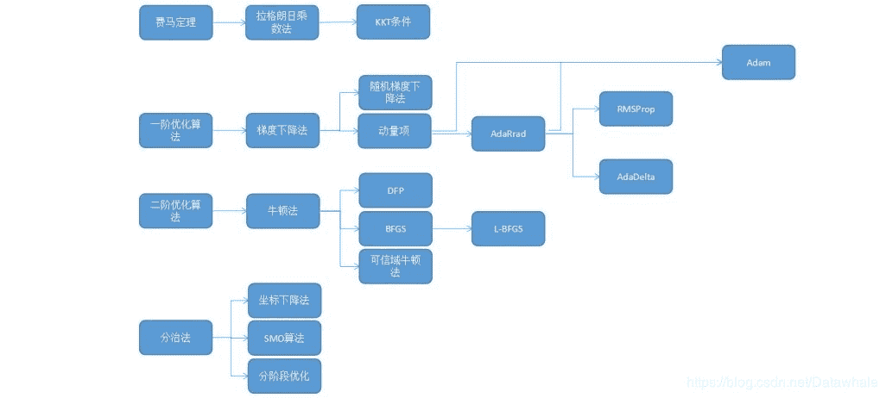

↑↑↑关注后"星标"Datawhale

每日干货 & [每月组队学习](https://mp.weixin.qq.com/mp/appmsgalbum?__biz=MzIyNjM2MzQyNg%3D%3D&action=getalbum&album_id=1338040906536108033#wechat_redirect)，不错过

 Datawhale干货 

**作者：Datawhale优秀回答者**

目录

1.  有哪些好的秋招经验分享？

2.  机器学习中常用的最优化方法有哪些？

3.  想通过数据竞赛来提升实践能力，作为小白有什么入门经验？（今日问题）

## **有哪些好的秋招经验分享？**

1

李玲 - 携程算法工程师

（1）首先是笔试，刷leetcode就够了，主要刷中等难度的，如果一开始比较难进入状态可以先试试简单难度的找找信心，Hard的题目很少被问到。尽量多刷，先保证能通过笔试（当然面试也很有可能会问到） 

（2）如果有可以跳过笔试直通面试的内推那就更好啦，没事多看看牛客网，有各种内推信息和面试经验 

（3）如果对自己的能力不够自信的话，前几次面试尽量不要面大公司，先找几家小公司积累面试经验，补足短板。心仪的公司可以放靠后，但也不要放很后面，因为面试多了之后很容易疲惫。 

（4）基础要扎实，常见的算法的原理要能够说清楚。项目经历的表述先打个草稿，想好怎么说，引导面试官问自己擅长的方面。一定要对项目有足够的了解，面试官问到什么都能有回应。 

（5）平时可以多关注一下行业前沿，自己的研究领域的最新发展，最新的模型，表现最好的模型，最好有一定程度的了解。暂时想到这些，加油！

2

李碧涵 - 微软工程师

简历→邀面→自我介绍→聊项目→面试官出算法题题/应用场景题 

（1）简历只是敲门砖，敲完后就看个人表现了

（2）有些公司很看重做题（外企和字节等），有些公司很看重项目。所以作为面试者，想要通过面试，要么在自己的项目上，要么在题目上做的很出色。这样才能吸引面试官。详细有三点原则：

        ① 无论项目还是做题都需要你：头脑清晰，逻辑棒（自己私下多练习几遍项目介绍或题目讲解） 

        ② 项目出色：项目肯定要有，不然会出现尬聊没话题的情况另外要会包装项目。或者自我介绍中多为项目知识点挖坑，引导面试官来问你 

        ③ 刷题出色：连续1个月每天都刷题✓

3

郭修均 - 字节跳动

（1）技术面一定要刷题，leetcode 200道走遍天下都不怕；

（2）有机会的话做些落地场景，会发现很多坑都是在纯净的题库里看不到的，而且很多经验要碰到过才能答出来；

（3）算法求解一定要能说清背后的数理逻辑。还有口才，清晰的说明你的答案，而不要东一榔头西一棒槌。 

4

阿水 - 京东算法工程师

资料推荐：《百面机器学习》、《百面深度学习》、西瓜书《机器学习》、花书《深度学习》、Leetcode 200题。

5

肖然 - 百度算法工程师

据自己当年经历，leetcode：200起步。然后才是其他，面试过程两道题压压惊，压住了基本可以谈笑风生。以后就是项目经验和基础支持，研发或者算法的基础知识，多看看相关的书，就可以了。建议简历上的任何一点都要会，不要写上自己不会的坑自己。 

6

李严 - 白骑士数据分析

在简历无法更上一层的前提下，大量面试，大量试错，总结技术经验，边面试边学习，顶尖的不好说，但总能找到。

## **机器学习中常用的最优化方法有哪些？**

Datawhale优秀回答者：五花肉，郭佳林

常见的最优化方法有最速下降法（梯度下降法），牛顿法，共轭梯度法，拟牛顿法等等。目的都是求解某个函数的极小值。

1

最速下降法

使用条件是函数具有一阶连续偏导数。

步骤：首先通过求函数的一阶偏倒数得出函数的最速下降方向（负梯度方向），然后给任意一个点作为初始点进行迭代，令每次迭代后新的点坐标为上一个迭代点坐标减去上一个点处的梯度值乘步长（步长可以根据每个点的坐标值进行求解）。若迭代到某个点后，该点梯度值小于某个预设的很小的阈值，则说明不需要继续迭代。该点即为极小值点。

2

牛顿法

基本思想是用一个二次函数近似逼近目标函数，然后直接求解出二次函数的极小值点。首先令原函数在某点做二阶泰勒展开，进行变换后可以得到原函数在某邻域内的近似二次函数。为求该二次函数极小值，令其一阶偏导数为零，可以直接得到函数在该邻域的极小值（为原始点坐标减去该点的海森矩阵乘梯度）。

3

总结

可以看出，最速下降法是通过一步步迭代，每次迭代都要计算梯度和步长，最终得到最优解；牛顿法是函数先在某个邻域内进行变形，再在这个邻域内直接一步求出最优解，不进行多轮迭代，所以对初始点的选择要求较高。拟牛顿法和共轭梯度法在这两种迭代思想上继续加以改进。

**每日一问**：想通过数据竞赛来提升实践能力，作为小白有什么入门经验？

欢迎在留言区分享你的入门经验。

“想一起交流的问题或困惑，**阅读原文**可填写↓