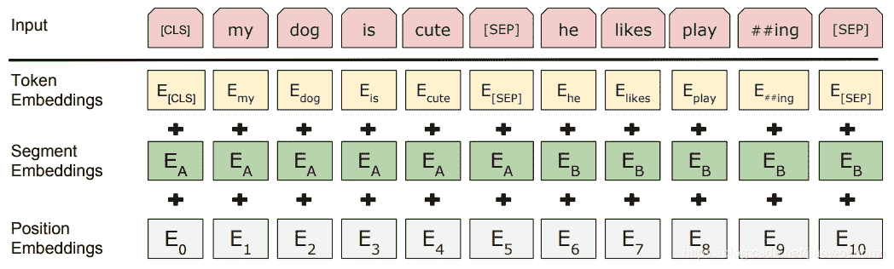

↑↑↑关注后"星标"Datawhale

每日干货 & [每月组队学习](https://mp.weixin.qq.com/mp/appmsgalbum?__biz=MzIyNjM2MzQyNg%3D%3D&action=getalbum&album_id=1338040906536108033#wechat_redirect)，不错过

 Datawhale干货 

**作者：**陈锴，中山大学  **张泽，华东师范大学  **

# 近两年来，Bert模型非常受欢迎，大部分人都知道Bert，但却不明白具体是什么。一句话概括来讲：BERT的出现，彻底改变了预训练产生词向量和下游具体NLP任务的关系，提出龙骨级的训练词向量概念。

# 想要了解Bert，那么可能你需要先从tranformer框架了解清楚。今天我们就从Transformer到Bert进行详细地讲解。

# 1\. Attention

在学会 Transformer 和 Bert 之前，我们需要理解Attention和Self-Attention机制。Attention的本质是要找到**输入的feature的权重分布**，这个feature在某一个维度有一个长度的概念，如果我们输入一个长为 n 的 feature，那么 Attention 就要学习一个长为 n 的分布权重，这个权重是由相似度计算出来的，最后返回的得分就将会是权重与feature的加权和。

## 1.1 Attention的计算过程

Attention的输入是Q,K,V，返回的是一个socre，计算公式如下：

需要注意的是上述公式的下标位置，显然我们需要学习的权重分布是  ，而 和 相关， 就是我们希望去被找到权重的feature。

### 1.1.1 QKV 英文名字的含义

*   Q 即为英文中 Query 是指：被查询的序列，可以看到在每次计算相似度的过程中，Q在计算中是一直保持着整体的状态。

*   K 即为英文中 Key 是指：被查询的索引，我们学习到的权重分布A 长度为n，那么A中每一个下标的大小，就代表了对应索引被分配到的权重。所以这个K，控制的是索引。

*   V 即为英文中的 Value 是指：值，也就是我们feature 本身的值，他要去和权重分布做加权和来得到最终的分布。

### 1.1.2 相似度的计算方式

这里相似度的计算方式有很多种:

| 相似度名 | 计算方式 |
| --- | --- |
| 点乘 | 
 |
| 矩阵乘积 | ， 为参数 |
| 余弦相似度 | $s(q,k)=\frac{q^Tk}{ |
| concat | ， 为参数 |
| mlp | ， 为参数 |

## 1.2 HAN中的Attention

我们首先看一下 HAN 的 Attention 中的QKV分别是如何体现的。

在 HAN 中，我们只有一个输入  ，输出为  和  的加权平均，所以 即为 Attention 机制中的 **Value**。我们把  做了一个线性变换变成了  ，然后又随机生成了一个 向量  , 一起计算  。公式为：

可以看到在公式中 一直处于被查询的状态，即一直保持着一个整体的状态，所以我们生成的随机向量即为 Attention 机制中的Query 。而我们做完线性变换生成的U 给 A 生成不同索引的权重值，他即代表我们 Attention 机制中的 **Key**。这里用的相似度公式显然是点积，而在我自己实现的时候遇到了点困难，改成了MLP实现法。

## 1.3 seq2seq中的Attention

我们来看 seq2seq 中的 Attention 机制，在这个任务中我们需要一步一步的生成 <svg xmlns="http://www.w3.org/2000/svg" viewBox="0 -750 5673.2 950" style="vertical-align: -0.452ex;width: 12.835ex;height: 2.149ex;"><g stroke="currentColor" fill="currentColor" stroke-width="0" transform="matrix(1 0 0 -1 0 0)"><g><g transform="translate(1540.8, 0)">，</g></g></g></svg> ，我们会根据每一步生成的 （实际是一个分布），找到对应的单词。

我们的生成公式为:

可以看出，每一次生成的时候 都要被更新，而在这个模型中 就是 Attention 模型最终被返回的得分。

在 seq2seq模型中，我们把 输入Encoder 生成的值记为  ，我们需要学习关于  的权重分布，所以  即为这里 Value，而这里的 Key 也是  他自己，他没有像 HAN 中一样做变换，我们每一次要查询的 Query 是已经生成的序列  <svg xmlns="http://www.w3.org/2000/svg" viewBox="0 -750 10061.7 1000" style="vertical-align: -0.566ex;width: 22.764ex;height: 2.262ex;"><g stroke="currentColor" fill="currentColor" stroke-width="0" transform="matrix(1 0 0 -1 0 0)"><g><g transform="translate(9177.7, 0)">，</g></g></g></svg> 也即为 Decoder 中生成的值 ，显然随着每次生成的变化这个被查询的  会变长。这样，由我们的  就能生成出最后的 。

# 2\. Transformer

Transformer改进了RNN最被人诟病的训练慢的缺点，**利用self-attention机制实现快速并行**。

## 2.1 Self-Attention

在 Transformer 中我们要用到的 Attention 方式是 Self-Attention，它与之前的 Attention 有些许的不同。简单的来说，它通过学习三个参数 ，来对同一个embedding之后的feature 进行转换，将他线性转换成*Q、K、V *之后计算出这句话的 Attention 得分。名字中的Self 体现的是所有的*Q、K、V *都是由输入自己生成出来的。

**归一化**：权重分布 在归一化前，要除以输入矩阵的第一维开根号，这会让梯度更稳定。这里也可以使用其它值，8只是默认值，再进行softmax。

**返回**：这里返回的值和输入的长度维度是一样的，每一个单词对应的输出是所有单词对于当前单词的权重分布与Value得分的加权和。所以他有多少个单词，就做了多少次Attention 得分，这就是self-Attention 。

## 2.2 模型结构

*   Transformer：Input(Embedding)→Encoder ×6 → Decoder×6 → output

*   Encoder：Multi-headed attention → Add&Norm → Feed Forward → Add&Norm

*   Decoder：Multi-headed attention → Add&Norm → Encoder-Decoder-Attention → Add&Norm → Feed Forward → Add&Norm

*   Multi-headed attention：Self-Attention×8

其中Encoder-Decoder-Attention即为seq2seq 中的Attention 结构，K和V 为Encoder顶层的output。

## 2.3 Multi-headed attention（多头怪）

Self-Attention 生成了一组 ，而多头怪生成了 8组  ，在实际的过程中，最后需要把这8组进行concat（拼接）。

需要注意的是 Decoder 端的多头 self-attention 需要做mask，因为它在预测时，是“看不到未来的序列的”，所以要将当前预测的单词(token)及其之后的单词(token)全部mask掉。使用多头机制可以理解为CNN中同时使用多个卷积核。

代码实现在pytorch中很简单，直接调包即可： 第0维是长度，第一维是batchsize。

```
## nn.MultiheadAttention 输入第0维为lengthquery = torch.rand(12,64,300)key = torch.rand(10,64,300)value= torch.rand(10,64,300)multihead_attn = nn.MultiheadAttention(embed_dim, num_heads)multihead_attn(query, key, value)[0].shape# output: torch.Size([12, 64, 300]) 
```

可以考虑实现一个第0维是 batchsize 的 MultiheadAttention：

```
class MultiheadAttention(nn.Module):    def __init__(self, hid_dim, n_heads, dropout):        super(MultiheadAttention,self).__init__()        self.hid_dim = hid_dim        self.n_heads = n_heads
        assert hid_dim % n_heads == 0 # d_model // h 是要能整除        self.w_q = nn.Linear(hid_dim, hid_dim)        self.w_k = nn.Linear(hid_dim, hid_dim)        self.w_v = nn.Linear(hid_dim, hid_dim)        self.fc = nn.Linear(hid_dim, hid_dim)        self.do = nn.Dropout(dropout)        self.scale = torch.sqrt(torch.FloatTensor([hid_dim // n_heads]))
    def forward(self, query, key, value, mask=None):        bsz = query.shape[0]        Q = self.w_q(query)        K = self.w_k(key)        V = self.w_v(value)        Q = Q.view(bsz, -1, self.n_heads, self.hid_dim //                   self.n_heads).permute(0, 2, 1, 3)        K = K.view(bsz, -1, self.n_heads, self.hid_dim //                   self.n_heads).permute(0, 2, 1, 3)        V = V.view(bsz, -1, self.n_heads, self.hid_dim //                   self.n_heads).permute(0, 2, 1, 3)
        # Q, K相乘除以scale，这是计算scaled dot product attention的第一步        energy = torch.matmul(Q, K.permute(0, 1, 3, 2)) / self.scale
        # 如果没有mask，就生成一个        if mask is not None:            energy = energy.masked_fill(mask == 0, -1e10)
        # 然后对Q,K相乘的结果计算softmax加上dropout，这是计算scaled dot product attention的第二步：        attention = self.do(torch.softmax(energy, dim=-1))
        # 第三步，attention结果与V相乘        x = torch.matmul(attention, V)
        # 最后将多头排列好，就是multi-head attention的结果了        x = x.permute(0, 2, 1, 3).contiguous()        x = x.view(bsz, -1, self.n_heads * (self.hid_dim // self.n_heads))        x = self.fc(x)        return x 
```

测试结果符合预期：

```
## 构造的 输入第0维为batchquery = torch.rand(64,12,300)key = torch.rand(64,10,300)value= torch.rand(64,10,300)tran=MultiheadAttention(hid_dim=300, n_heads=6, dropout=0.1)tran(query, key, value).shape## output: torch.Size([64, 12, 300]) 
```

## 2.4 使用位置编码表示序列的顺序

将位置向量添加到词嵌入中使得它们在接下来的运算中，能够更好地表达的词与词之间的距离（因为 Self-Attention 本身是并行的，没有学习位置信息）。原始论文里描述了位置编码的公式，使用了使用不同频率的正弦和余弦，因为三角公式不受序列长度的限制，也就是可以对比之前遇到序列的更长的序列进行表示。

## 2.5 Add&Norm（残差模型）

残差模块就是一个残差连接，并且都跟随着一个“层归一化”步骤。其中Norm 指的是 Layer Normalization，在 torch 中也很方便调用。

# 3\. Bert

Bert模型的定位是一个预训练模型，同等级的应该是NNLM，Word2vec，Glove，GPT，还有ELMO。模型具体的解释不是本文关注重点，这里同样采用简单概述。

## 3.1 预训练模型分类

*   非语言模型：Word2vec，Glove

*   语言模型：GPT，NNLM，ELMO，Bert。

    其中NNLM是不考虑上下文（单向）的，而ELMO和Bert是考虑上下文（双向）的模型。

## 3.2 不同模型的建模

### 3.2.1 NNLM

其全称为Nerual Network Language Model

目标函数为用前t-1个单词，预测第t个单词，即最大化：

### 3.2.2 ELMO

Elmo的全称为Embedding from Language Models，ELMO是根据上下文单词的语义去动态调整单词的Word Embedding表示，解决了多义词的问题，采用的机制为双层双向LSTM。

#### 目标函数

ELMo是分别以

和

作为目标函数，独立训练处两个representation然后进行拼接。

#### 词的表示

由于采用了双层双向LSTM，所以网络中有三层Word Embedding，给予这三个Embedding中的每一个Embedding一个权重 ，这个权重可以学习得来，根据各自权重累加求和，将三个Embedding整合成一个Embedding。

**理解**：第一层LSTM学习到了句法信息，所以可以用这种方式解决一词多义。

#### ELMO两阶段过程

*   第一个阶段是语言模型进行预训练；

*   第二个阶段是在做下游任务时，从预训练网络中提取对应单词的网络各层的Word Embedding作为新特征补充到下游任务中。

### 3.2.3 GPT

GPT全称为Generative Pre-Training，它和ELMO类似都使用了Transformer，但与ELMO不同的是采用了单向的语言模型，也即只采用单词的上文来进行预测。其余与ELMO几乎一样这里就不展开介绍了。

### 3.2.4 BERT

BERT 在 GPT 的基础上使用了双向的Transformer block连接，为了适配多任务下的迁移学习，BERT设计了更通用的输入层和输出层。

#### BERT两阶段过程

第一阶段双向语言模型预训练，第二阶段采用具体任务Fine-tuning。

#### 目标函数

BERT预训练模型分为以下三个步骤：Embedding、Masked LM、Next Sentence Prediction

#### Embedding

这里的Embedding由三种Embedding求和而成：



*   Token Embeddings：是词向量，第一个单词是CLS标志，可以用于之后的分类任务

*   Segment Embeddings：将句子分为两段，用来区别两种句子，因为预训练不光做LM还要做以两个句子为输入的分类任务

*   Position Embeddings：和之前文章中的Transformer不一样，不是三角函数而是学习出来的

#### Masked LM

随机mask每一个句子中15%的词，用其上下文来做预测。采用非监督学习的方法预测mask位置的词。在这15%中，80%是采用[mask]，10%是随机取一个词来代替mask的词，10%保持不变。

#### Next Sentence Prediction

用A+B/C来作为样本：选择一些句子对A与B，其中50%的数据B是A的下一条句子，剩余50%的数据B是语料库中随机选择的，学习其中的相关性，添加这样的预训练的目的是目前很多NLP的任务比如QA和NLI都需要理解两个句子之间的关系，从而能让预训练的模型更好的适应这样的任务。

#### Bert的优缺点

*   Bert 对硬件资源的消耗巨大，大模型需要16个tpu，历时四天；更大的模型需要64个tpu，历时四天。

*   Bert 最大的亮点在于效果好及普适性强，几乎所有NLP任务都可以套用Bert这种两阶段解决思路，而且效果应该会有明显提升。

*本文PDF电子版，后台回复 ****Bert ****获取*


“干货学习，**点****赞****三连**↓