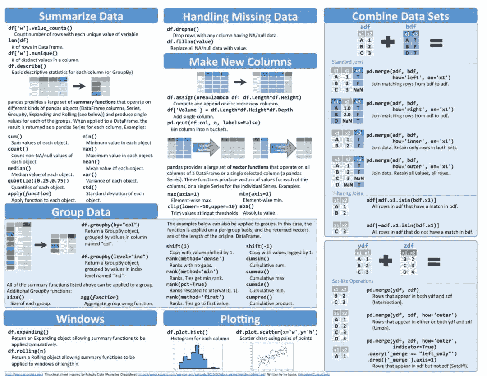

↑↑↑关注后"星标"Datawhale

每日干货 & [每月组队学习](https://mp.weixin.qq.com/mp/appmsgalbum?__biz=MzIyNjM2MzQyNg%3D%3D&action=getalbum&album_id=1338040906536108033#wechat_redirect)，不错过

 Datawhale干货 

**作者：****马卡斯·扬******，来源：极市平台****

* * *

作者丨马卡斯·扬@知乎

来源丨https://zhuanlan.zhihu.com/p/61013882

随着深度学习的蓬勃发展，越来越多的小伙伴们开始使用python作为主打代码，python有着种类繁多的第三方库，这里为大家从网络上收集了一些代码速查表，希望可以帮你在码代码时提速。

## 基础

### 神经网络

### 线性代数

### python基础

### scipy科学计算

### spark

## 数据保存及可视化

### numpy

### pandas

### bokeh

## 画图

### matplotlib

### ggplot

## 机器学习

### sklearn

### keras

### tensorflow

## 算法

### 数据结构

### 复杂度

### 排序算法

在 **Datawhale **公众号回复 **速查表**，即可获取上述图片打包下载链接。

